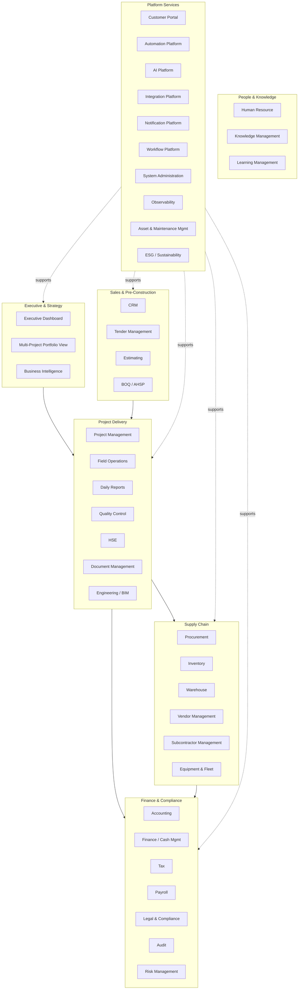
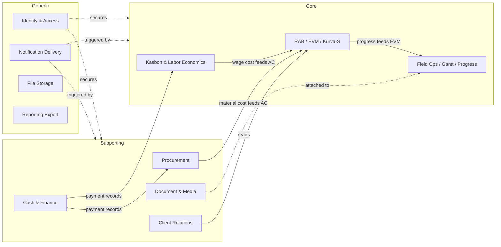
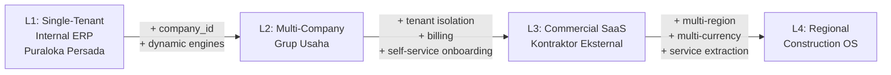

# 00 — Vision & Business Architecture

**Repository:** Puraloka Suite Architecture Repository
**Dokumen:** 1 dari 7 (lihat [01](01-application-and-data-architecture.md), [02](02-security-and-compliance-architecture.md), [03](03-platform-and-intelligence-architecture.md), [04](04-roadmap-governance-and-delivery.md), [05](05-design-system-and-ui-ux-architecture.md), [06](06-agentic-ai-and-automation-architecture.md))
**Status:** Living document — direvisi seiring evolusi produk, bukan snapshot statis
**Tanggal disusun:** 18 Juli 2026
**Audiens:** Founder, future engineering hires, technical co-founder/CTO candidates, investor/partner due diligence, enterprise procurement evaluation

---

## Cara Membaca Dokumen Ini

Setiap rekomendasi besar di seluruh 5 dokumen ini diklasifikasikan dalam dua sumbu:

**Sumbu waktu (state):**
- **Current State** — sudah berjalan di production hari ini, terverifikasi langsung dari source code
- **Transitional State** — target L2, dibangun dalam 2-3 tahun ke depan
- **Target State** — target L3/L4, horizon 5-10 tahun

**Sumbu prioritas (initiative):**
- **Now** — dikerjakan dalam siklus pengembangan berjalan saat ini
- **Next** — kandidat kuat untuk 1-2 fase implementasi ke depan
- **Later** — valid secara arsitektur, tapi menunggu sinyal permintaan nyata (multi-company, SaaS pilot, dll)
- **Optional** — bagus untuk dimiliki, tidak esensial untuk mencapai target state manapun; boleh tidak pernah dikerjakan

Semua fakta "current state" di dokumen ini diverifikasi langsung dari codebase per 18 Juli 2026 (bukan asumsi dari CLAUDE.md semata) — lihat [Current State Assessment](#current-state-assessment) untuk metodologi.

---

## Assumptions

1. Puraloka Persada tetap menjadi prioritas operasional utama sepanjang seluruh horizon L1-L4. Tidak ada fase yang boleh mengorbankan stabilitas operasional perusahaan demi kecepatan menuju SaaS.
2. Tim engineering tetap kecil (diasumsikan 1-3 engineer) sepanjang L1-L2. Skala tim yang lebih besar adalah prasyarat implisit untuk memulai L3, bukan sesuatu yang dirancang untuk terjadi otomatis.
3. Tidak ada tenggat waktu eksternal (investor, regulator) yang memaksa akselerasi horizon ini. Jika muncul, roadmap di [04](04-roadmap-governance-and-delivery.md) perlu ditinjau ulang.
4. "SaaS untuk kontraktor Indonesia lain" adalah tujuan bisnis nyata (bukan hipotesis), tapi belum ada pelanggan pilot yang dikonfirmasi. Keputusan desain L3 dibuat untuk *tidak menutup opsi ini*, bukan untuk mengasumsikan sudah ada permintaan pasar yang tervalidasi.
5. Semua estimasi tenaga kerja/waktu di dokumen ini adalah estimasi arsitektural kasar, bukan komitmen delivery. Estimasi presisi adalah tanggung jawab dokumen perencanaan sprint/fase, bukan architecture repository ini.

## Non-Goals

Hal-hal berikut secara eksplisit **bukan** tujuan dari transformasi ini (detail lengkap "Never Build" list ada di [04](04-roadmap-governance-and-delivery.md)):

- Menjadi platform multi-industri generik (manufacturing, retail, dll) di luar konstruksi dan sektor yang sangat berdekatan (EPC, infrastruktur)
- Migrasi ke microservices sebagai tujuan itu sendiri — service boundary hanya diekstrak ketika ada driver operasional nyata (lihat [01](01-application-and-data-architecture.md))
- Membangun ulang (rewrite) sistem yang berjalan — semua evolusi bersifat incremental di atas codebase yang ada
- Mengejar kelengkapan modul demi kelengkapan — Tier 3/4 di [Module Catalog](#module-catalog--tiering) sengaja dibiarkan tidak diimplementasikan sampai ada sinyal permintaan
- Menjadi HRIS/payroll/legal-case-management penuh — area ini didukung secara ringan (integrasi) bukan dibangun native, kecuali validasi pasar mengubah keputusan ini

## Glossary

| Istilah | Arti dalam konteks dokumen ini |
|---|---|
| **L1/L2/L3/L4** | Empat horizon evolusi arsitektur — lihat [Long-Term SaaS Vision](#long-term-saas-vision-l1--l4-evolution-model) |
| **Tenant** | Satu entitas pelanggan independen (perusahaan) dalam sistem multi-tenant; di L1 hanya ada 1 tenant implisit (Puraloka Persada) |
| **Bounded Context** | Batas konseptual DDD di mana sebuah model domain (istilah, aturan, entitas) berlaku konsisten — lihat [Domain Map](#domain-map--bounded-contexts) |
| **Core Domain** | Domain yang menjadi keunggulan kompetitif inti — layak investasi rekayasa terbaik |
| **Supporting Domain** | Domain yang perlu ada dan disesuaikan dengan bisnis, tapi bukan diferensiator |
| **Generic Domain** | Domain yang solusinya sudah "solved problem" di industri — beli/pakai library, jangan bangun sendiri |
| **Config-driven** | Perilaku sistem ditentukan oleh data di database/tabel konfigurasi, bukan oleh cabang `if/else` di source code |
| **Policy Engine** | Komponen yang mengevaluasi aturan otorisasi/bisnis berdasarkan data konfigurasi, bukan logika hardcoded |

---

## Executive Summary

Puraloka Suite hari ini adalah **modular monolith single-tenant** yang benar-benar dipakai untuk mengoperasikan satu perusahaan konstruksi (PT Puraloka Persada): 67 tabel database, 159 endpoint API, 25 route file backend, 14 halaman dashboard web, dibangun secara solo oleh satu engineer melalui 57 migration file selama kurang lebih 6 bulan. Ini bukan prototipe — modul RAB/EVM, Gantt chart WBS, e-procurement dengan FIFO stock allocation, dan sistem kasbon dua-lapis (mandor + tukang) sudah menjalankan operasional nyata proyek konstruksi di lapangan.

Dokumen ini memetakan jalur evolusi dari kenyataan itu (**L1**) menuju sebuah **Construction Operating System** yang pada akhirnya bisa (**L3**) dijual sebagai produk SaaS ke kontraktor lain di Indonesia, dan (**L4**) berkembang menjadi platform regional. Jalur ini melewati satu batu loncatan penting yang sering dilewatkan tim kecil: **L2 — multi-company tanpa multi-tenant**, yaitu membuat Puraloka Suite bisa mengelola beberapa badan usaha/anak perusahaan sekaligus, TANPA harus membangun kompleksitas SaaS (billing per-tenant, tenant provisioning, data residency per pelanggan) yang belum ada gunanya selama pelanggannya masih satu grup usaha sendiri.

Prinsip yang mengikat seluruh roadmap ini: **arsitektur harus mendukung opsi masa depan tanpa membayar biaya masa depan hari ini.** Setiap keputusan L1→L2 (menambah kolom `company_id`, menjadikan role sebagai data, dst.) dipilih karena juga meningkatkan kualitas sistem untuk Puraloka Persada sendirian — bukan semata investasi spekulatif untuk pelanggan yang belum ada.

---

## Product Vision

> **Puraloka Suite adalah Construction Operating System yang membuat kontraktor Indonesia — dari yang mengelola satu proyek hingga yang mengelola puluhan proyek lintas anak perusahaan — punya satu sumber kebenaran untuk keuangan, progres lapangan, dan pengambilan keputusan, tanpa harus menyewa lisensi enterprise seharga miliaran rupiah per tahun seperti Primavera atau SAP.**

Tiga keyakinan yang mendasari visi ini:

1. **Kontraktor menengah Indonesia dilayani buruk oleh dua ekstrem yang ada** — Excel/WhatsApp (murah tapi tidak terstruktur dan rawan kehilangan data) di satu sisi, dan software enterprise asing (Procore, Primavera, SAP) yang mahal, generik secara global, dan tidak dirancang untuk pola bisnis lokal (kasbon mandor, PPh final pasal 4(2), termin vs. komisi) di sisi lain. Puraloka Suite mengisi celah ini.
2. **Domain expertise adalah keunggulan kompetitif nyata**, bukan sekadar fitur. Pola seperti kasbon dua-lapis (mandor vs. tukang individual), payment_system fleksibel per work scope (harian/borongan/progress_pct), dan skema pajak PPh final vs PPN untuk klien perorangan vs B2B — ini adalah hasil pemahaman mendalam operasional konstruksi Indonesia yang tidak dimiliki produk asing manapun.
3. **Config-driven bukan pilihan estetika, tapi prasyarat untuk skala** — begitu Puraloka Suite melayani lebih dari satu perusahaan dengan aturan approval, struktur pajak, atau alur kerja yang berbeda, setiap logika yang hardcoded per role/status menjadi hutang teknis yang mengunci pertumbuhan.

## Product Positioning

| Dimensi | Posisi Puraloka Suite |
|---|---|
| **Target primer (L1-L2)** | Kontraktor menengah Indonesia (1-50 proyek aktif), termasuk grup usaha dengan beberapa anak perusahaan konstruksi |
| **Target sekunder (L3-L4)** | Kontraktor kecil-menengah lain (SaaS), berkembang ke EPC/developer/infrastruktur jika model bisnis cocok |
| **Bukan target** | Manufacturing generik, retail, atau industri non-konstruksi — lihat [Non-Goals](#non-goals) |
| **Diferensiator vs. Excel/WhatsApp** | Struktur data, audit trail, notifikasi real-time, satu sumber kebenaran finansial |
| **Diferensiator vs. Procore/Primavera/SAP** | Harga terjangkau, domain fit Indonesia (pajak, kasbon, termin), tanpa overhead implementasi enterprise berbulan-bulan |
| **Diferensiator vs. kompetitor lokal (jika ada)** | Kedalaman modul EVM/Kurva-S + Gantt WBS yang biasanya hanya ada di tier enterprise, dibangun native bukan tempelan |

---

## Business Capability Map

Capability map memetakan **apa yang bisa dilakukan bisnis**, independen dari implementasi teknis. Setiap capability diberi status sesuai kenyataan hari ini.

### Status Capability per Area (ringkas — detail modul di [Module Catalog](#module-catalog--tiering))

| Area | Status Hari Ini |
|---|---|
| Executive & Strategy | Dashboard KPI dasar ada; portfolio multi-proyek ada; BI/analytics lanjutan belum |
| Sales & Pre-Construction | **Tidak ada sama sekali.** Proyek masuk sistem sudah dalam status "kontrak deal" |
| Project Delivery | **Paling matang** — RAB, Kurva-S/EVM, Gantt WBS, progress log dual-mode, dokumen, foto, milestone semua sudah jalan |
| Supply Chain | Procurement matang (8 tab UI, FIFO stock); Equipment/Fleet belum ada |
| Finance & Compliance | Cash mgmt, invoice, kasbon, pajak dasar (PPh final/PPN) ada; Payroll, Legal, GL/Accounting penuh belum |
| People & Knowledge | Worker registry sederhana ada; HR/LMS penuh belum ada |
| Platform Services | Notification + Audit + Portal + Search sudah matang; Automation/AI/Workflow Engine belum ada sebagai platform (logic tersebar hardcoded) |

---

## Domain Map & Bounded Contexts

Klasifikasi domain menggunakan prinsip DDD: **Core** (keunggulan kompetitif, investasi rekayasa terbaik), **Supporting** (perlu ada, disesuaikan bisnis), **Generic** (solved problem, beli/pakai library).

### Core Domains

Domain di mana Puraloka Suite harus unggul dibanding kompetitor mana pun — di sinilah rekayasa terbaik dan iterasi tercepat harus terjadi.

| Domain | Bounded Context | Rationale |
|---|---|---|
| **Project Financial Control** | RAB, Kurva-S, EVM, Change Order | Kombinasi RAB berbobot + dual-mode progress + EVM lengkap (CPI/SPI/EAC/TCPI) adalah kedalaman yang biasanya hanya ada di Primavera-tier — ini diferensiator nyata |
| **Mandor & Labor Economics** | Kasbon (2 lapis), Payment System fleksibel (harian/borongan/progress_pct), Wage Reports | Pola bisnis ini spesifik-Indonesia dan tidak ada di produk asing manapun; kompleksitasnya nyata dan bernilai tinggi jika dimodelkan benar |
| **Construction-Specific Field Ops** | Progress Log dual-mode, Gantt WBS soft-dependency, RAB Schedule + Absorption Log | Threshold-based dependency dan dual-bar Gantt custom adalah investasi rekayasa yang unik untuk use case lapangan Indonesia |

### Supporting Domains

Perlu ada dan disesuaikan dengan konteks bisnis, tapi bukan tempat kompetisi dimenangkan.

| Domain | Bounded Context | Rationale |
|---|---|---|
| **Procurement & Supply Chain** | Material, Supplier, MR/PO/GR, Stock | Penting secara operasional, tapi pola MR→PO→GR relatif generik lintas industri |
| **Cash & Finance Operations** | Cash Accounts, Transfers, Invoices, Payments, Termin | Perlu presisi tinggi, tapi konsepnya (double-entry-adjacent, transfer, invoice) bukan hal baru |
| **Document & Media Management** | Documents, Photos, Contracts | Perlu integrasi baik dengan domain lain, tapi penyimpanan/kategorisasi dokumen adalah solved problem |
| **Client & Stakeholder Relations** | Clients, Client Portal | Penting untuk transparansi, tapi portal read-only bukan area diferensiasi teknis |

### Generic Domains

Solved problems — pakai library/pattern standar, jangan investasi rekayasa custom.

| Domain | Bounded Context | Rationale |
|---|---|---|
| **Identity & Access** | Auth, Users, Sessions | Supabase Auth sudah cukup; jangan bangun ulang authentication |
| **Notification Delivery** | Push, Email, In-app | Mekanisme pengiriman adalah generic; yang core adalah *routing rules*-nya (lihat [Dynamic Notification Engine](01-application-and-data-architecture.md)) |
| **File Storage** | Supabase Storage | Jangan bangun object storage sendiri |
| **Reporting Export** | Excel/PDF generation | Library standar (XLSX, PDFKit) sudah cukup |

### Bounded Context Map

**Catatan ownership boundary:** Hari ini semua context ini hidup dalam satu Fastify process dan satu skema Postgres — batas di atas adalah batas *konseptual* (untuk kejelasan kode dan kandidat ekstraksi masa depan), bukan batas *deployment*. Lihat [Modular Monolith Strategy](01-application-and-data-architecture.md#modular-monolith-strategy) untuk kapan (jika pernah) batas ini menjadi batas service sungguhan.

---

## Module Catalog & Tiering

### Kelengkapan Cakupan — Jawaban Langsung

**Tidak.** Versi awal katalog ini (module-level saja, tanpa submodule/dependency) tidak lengkap dibanding cakupan kapabilitas komersial Procore, Autodesk Construction Cloud (ACC), Oracle Primavera P6/Unifier, dan SAP untuk konstruksi. Revisi ini (18 Juli 2026) hasil gap analysis eksplisit terhadap keempat platform tersebut, terstruktur ulang dengan **Domain → Module → Submodule → Tier → Build Priority → Dependency**.

**Ringkasan gap yang ditemukan (detail per kategori di bawah tabel):**

1. **Capability domain yang hilang sama sekali** — Capital Planning & Program Management (kekuatan inti Primavera Unifier: portofolio proyek, bukan satu proyek), Facilities Management/O&M Handover (arah ekspansi Procore & ACC pasca-konstruksi), Insurance & Surety/Bonding, Marketplace/Ecosystem (kapabilitas SaaS murni).
2. **Modul yang hilang di dalam domain existing** — RFI (Request for Information), Submittals, Punch List/Snagging, Meeting Minutes/Transmittals di Project Delivery; General Ledger/COA, Retention/Retainage, Budget vs Actual Cost Control terpisah dari EVM di Finance; Time & Attendance terpisah dari wage report di Field Ops; Drawing/Model Versioning & Clash Detection terpisah dari "BIM" generik di Engineering.
3. **Platform capability yang hilang** — Multi-language i18n framework (bukan cuma multi-tax), Data Import/Export & Migration Toolkit, Public API rate-limiting/versioning formal.
4. **SaaS capability yang hilang sama sekali** — Tenant Provisioning & Lifecycle, Usage Metering & Billing, Plan/Entitlement Management, Marketplace/App Ecosystem, Multi-region Data Residency.
5. **AI capability yang belum eksplisit** — AI Document Intelligence (ekstraksi otomatis dari gambar kerja/kontrak discan, beda dari "AI Contract Analyst" yang fokus klausul), AI Anomaly Detection untuk procurement (selain finansial), Predictive Delay Risk (beda dari AI Scheduler yang reaktif).
6. **Administration capability yang hilang** — Tenant Admin Console (beda dari System Administration internal), Feature Flag Management, Data Residency & Compliance Console, White-labeling/Branding per tenant.

Tabel di bawah menggabungkan katalog original dengan seluruh temuan gap ini dalam satu struktur konsisten.

### Skema Klasifikasi

- **Tier 1** — Dibutuhkan untuk operasional Puraloka Persada dalam 24 bulan ke depan
- **Tier 2** — Kemungkinan besar berguna jika Puraloka Suite berkembang jadi ERP kontraktor yang lebih besar (L2)
- **Tier 3** — Ditujukan untuk ekspansi SaaS / pelanggan enterprise (L3-L4)
- **Tier 4** — Eksplisit di luar cakupan kecuali ada permintaan pasar kuat (banyak beririsan dengan [Never Build List](04-roadmap-governance-and-delivery.md#never-build-list))
- **Build Priority** — `Now` / `Next` / `Later` / `Optional`, selaras dengan [Foundational Engines Prioritization](04-roadmap-governance-and-delivery.md#foundational-engines-prioritization) dan [Phase 0-9](04-roadmap-governance-and-delivery.md#phase-0-9-transformation-program); modul Tier 3/4 nyaris selalu `Later`/`Optional` kecuali ada dependency struktural yang memaksa lebih awal
- **Dependency** — Modul/engine lain yang harus ada lebih dulu; `—` berarti tidak ada dependency keras

### Domain: Project Delivery (Core)

| Module | Submodule | Tier | Build Priority | Dependency |
|---|---|---|---|---|
| Project Management | RAB (Rencana Anggaran Biaya) | 1 | Now (matang) | — |
| Project Management | Kurva-S & EVM | 1 | Now (matang) | RAB |
| Project Management | Milestone Tracking | 1 | Now (matang) | — |
| Project Management | Change Order | 1 | Now (matang) | RAB |
| Project Management | Gantt / WBS Scheduling | 1 | Now (matang) | RAB |
| Field Operations | Daily/Progress Reports (dual-mode) | 1 | Now (matang) | RAB |
| Field Operations | Photo Documentation | 1 | Now (matang) | Document Management |
| Field Operations | **RFI (Request for Information)** *(baru)* | 2 | Next | Workflow Engine |
| Field Operations | **Submittals** *(baru)* | 2 | Next | Document Management, Workflow Engine |
| Field Operations | **Punch List / Snagging** *(baru)* | 2 | Next | Field Ops core |
| Field Operations | **Meeting Minutes & Transmittals** *(baru)* | 2 | Later | Document Management |
| Quality Control | QC Checklist per item pekerjaan | 2 | Next | RAB item structure |
| Quality Control | **Inspection & Test Plan (ITP)** *(baru)* | 2 | Later | QC Checklist |
| HSE | Incident Report | 2 | Next | — |
| HSE | Safety Checklist | 2 | Next | — |
| HSE | **Toolbox Talks / Safety Briefing Log** *(baru)* | 2 | Later | HSE core |
| HSE | **Permit-to-Work** *(baru)* | 3 | Later | Workflow Engine |
| Document Management | Kategori, visibility, access log | 1 | Now (matang) | — |
| Document Management | **Drawing/Model Versioning** *(baru, dipisah dari BIM generik)* | 2 | Later | Document Management core |
| Engineering / BIM | 3D Model Viewer | 4 | **Never Build (native)** | Lihat [Never Build List](04-roadmap-governance-and-delivery.md#never-build-list) — integrasi dengan tool BIM eksisting (Autodesk, dll.) lebih masuk akal daripada rendering engine sendiri |
| Engineering / BIM | Clash Detection | 4 | **Never Build (native)** | Sama seperti di atas — turunan langsung dari keputusan tidak membangun viewer sendiri |
| Customer Portal | 4 halaman client portal | 1 | Now (matang) | — |

### Domain: Sales & Pre-Construction (Supporting — belum ada sama sekali)

| Module | Submodule | Tier | Build Priority | Dependency |
|---|---|---|---|---|
| CRM | Lead → Prospek → Deal | 2 | Later | — |
| Tender Management | Proses lelang/tender pra-kontrak | 2 | Later | CRM |
| Tender Management | **Bid Comparison / Bid Leveling** *(baru)* | 2 | Later | Tender core |
| Estimating | Cikal-bakal RAB dari estimasi awal | 2 | Later | RAB |
| BOQ / AHSP | Bill of Quantity & Analisa Harga Satuan | 2 | Next | Estimating |
| Sales (quote-to-cash formal) | Di luar CRM dasar | 3 | Optional | CRM |

**Catatan urutan:** BOQ/AHSP dinaikkan ke `Next` (dari sekadar Tier 2 tanpa prioritas eksplisit) karena ini standar baku konstruksi Indonesia dan secara alami menjadi *input* ke RAB — nilai tambahnya lebih tinggi dari modul Tier 2 lain yang murni ekspansi horizontal.

### Domain: Supply Chain (Supporting)

| Module | Submodule | Tier | Build Priority | Dependency |
|---|---|---|---|---|
| Procurement | MR / PO / GR, FIFO stock | 1 | Now (matang) | — |
| Inventory / Warehouse | Stock usage/opname | 1 | Now (sebagian) | Procurement |
| Inventory / Warehouse | **Multi-warehouse** *(gap eksplisit)* | 2 | Later | Inventory core |
| Vendor Management | Supplier CRUD | 1 | Now (sebagian) | — |
| Vendor Management | **Vendor Scoring & Evaluation** *(baru)* | 2 | Later | Vendor core, riwayat PO |
| Subcontractor Management | Mandor assignment | 1 | Now (sebagian) | — |
| Subcontractor Management | **Formal Subkontrak (non-mandor)** *(baru — beda entitas dari mandor tradisional)* | 2 | Later | Subcontractor core, Legal |
| Equipment Management | Alat berat non-kendaraan | 2 | Later | Asset Management |
| Fleet Management | Kendaraan, GPS tracking | 2 | Later | Asset Management |
| Maintenance Management | Terkait Equipment/Fleet | 2 | Later | Equipment Management |
| Asset Management | Aset kantor/proyek (non-equipment) | 2 | Later | — |

### Domain: Finance & Compliance (Supporting)

| Module | Submodule | Tier | Build Priority | Dependency |
|---|---|---|---|---|
| Finance / Cash Management | Cash accounts, transfer, invoice, payment | 1 | Now (matang) | — |
| Accounting | **General Ledger / Chart of Accounts** *(baru, dipisah dari "Finance" generik)* | 2 | Later | Finance core |
| Accounting | **Retention / Retainage Tracking** *(baru — standar kontrak konstruksi)* | 2 | Next | Invoice/Payment |
| Accounting | **Budget vs Actual Cost Control** *(baru, dipisah dari EVM — EVM untuk progress, ini untuk cost governance)* | 2 | Next | RAB, Finance core |
| Tax | PPh final & PPN dasar | 1 | Now (sebagian) | — |
| Tax | **Pelaporan SPT** *(gap eksplisit)* | 2 | Later | Tax core |
| Payroll | Wage report manual (belum payroll penuh) | 2 | Optional | Integrasi pihak ketiga direkomendasikan — lihat [Never Build List](04-roadmap-governance-and-delivery.md#never-build-list) |
| Legal & Compliance | Kontrak generation (PDF) | 1 | Now (sebagian) | — |
| Legal & Compliance | **Case Management** *(gap eksplisit)* | 3 | Optional | Legal core |
| Insurance & Surety | **Bonding & Insurance Certificate Tracking** *(domain baru — hilang sepenuhnya)* | 3 | Later | Vendor Management, Legal |
| Risk Management | Risk Register formal | 2 | Next | — |
| Audit Platform | `/audit`, diff view, filter | 1 | Now (matang) | — |

### Domain: People & Knowledge (Supporting/Generic)

| Module | Submodule | Tier | Build Priority | Dependency |
|---|---|---|---|---|
| Human Resource | Employee record di luar mandor/worker | 2 | Later | — |
| Field Operations | **Time & Attendance** *(baru, dipisah dari wage report — presensi harian vs laporan upah mingguan adalah dua hal berbeda)* | 2 | Next | HR core |
| Knowledge Management | Wiki internal, best practices | 3 | Later | AI Assistant (untuk jadi berguna, lihat [03](03-platform-and-intelligence-architecture.md#knowledge-platform-disebut-di-brief-awal-sebagai-knowledge-management)) |
| Learning Management | — | 4 | Optional | Tidak ada sinyal permintaan |

### Domain: Capital Planning & Program Management (Core untuk Unifier-class — domain baru, hilang sepenuhnya)

| Module | Submodule | Tier | Build Priority | Dependency |
|---|---|---|---|---|
| Portfolio Management | **Multi-project program rollup** *(baru — beda dari dashboard multi-proyek yang sudah ada; ini agregasi capital budget lintas program, bukan sekadar list proyek)* | 3 | Later | company_id migration (L2), BI lanjutan |
| Capital Planning | **Long-range capital budget planning** *(baru)* | 3 | Optional | Portfolio Management |

**Rationale domain baru ini:** Primavera Unifier secara spesifik unggul di sini — mengelola *program* proyek (bukan satu proyek), dengan capital planning jangka panjang lintas tahun anggaran. Puraloka Suite hari ini kuat di level proyek tunggal (RAB/EVM/Gantt) tapi tidak punya lapisan program di atasnya. Ini **valid sebagai domain Tier 3** — hanya bernilai nyata begitu ada banyak proyek/company untuk digabungkan (butuh L2 `company_id` dulu sebagai prasyarat struktural).

### Domain: Facilities Management & O&M Handover (domain baru — hilang sepenuhnya)

| Module | Submodule | Tier | Build Priority | Dependency |
|---|---|---|---|---|
| O&M Handover | **Digital handover package (as-built, warranty, O&M manual)** *(baru)* | 3 | Optional | Document Management |
| Facilities Management | **Post-construction asset lifecycle** *(baru)* | 4 | **Never Build** kecuali model bisnis berubah | O&M Handover |

**Rationale:** Ini arah ekspansi nyata di Procore/ACC (dari "bangun" ke "kelola aset setelah selesai dibangun"), tapi merupakan lini bisnis yang **berbeda** dari core kontraktor Puraloka Persada hari ini. Digital handover package (Tier 3/Optional) masih masuk akal sebagai *deliverable* proyek konstruksi biasa — tapi Facilities Management penuh (mengelola aset bertahun-tahun setelah serah terima) eksplisit **Never Build** kecuali Puraloka benar-benar berubah menjadi pemain O&M, bukan hanya kontraktor. Lihat entri sejenis di [Never Build List](04-roadmap-governance-and-delivery.md#never-build-list).

### Domain: Platform Services (Generic/Supporting)

| Module | Submodule | Tier | Build Priority | Dependency |
|---|---|---|---|---|
| Notification Platform | Delivery mechanism | 1 | Now (matang) | — |
| Notification Platform | Routing rules (dynamic) | 1 | Next | [Dynamic Notification Engine](01-application-and-data-architecture.md#dynamic-notification-routing-engine) |
| System Administration | Company profile, roles viewer | 1 | Now (sebagian) | — |
| Automation Platform | Trigger/Event Engine | 2 | Next | [03](03-platform-and-intelligence-architecture.md#automation-platform--event-platform) |
| Workflow Platform | Approval chain generik | 2 | Next | [Dynamic Workflow Engine](01-application-and-data-architecture.md#dynamic-workflow--approval-engine) |
| API Platform | Public API untuk integrasi eksternal | 2 | Later | Butuh pelanggan eksternal (L3 gate) |
| API Platform | **Rate Limiting & Versioning formal** *(baru — gap platform capability)* | 3 | Later | API Platform core |
| Integration Platform | Marketplace pihak ketiga | 3 | Optional | API Platform, **Marketplace/Ecosystem** (lihat SaaS Platform di bawah) |
| Developer Platform | Public API docs, SDK, sandbox | 3 | Optional | API Platform |
| Observability Platform (produk) | Untuk pelanggan multi-tenant | 3 | Later | Observability internal ([03](03-platform-and-intelligence-architecture.md#observability-architecture)) sudah Tier 1 |
| Backup Platform (self-service) | Self-service per tenant | 3 | Later | Backup internal ([02](02-security-and-compliance-architecture.md)) sudah prasyarat lebih awal |
| **Data Import/Export & Migration Toolkit** *(baru — gap platform capability)* | Onboarding data pelanggan baru dari Excel/sistem lama | 3 | Later | — |
| **Internationalization (i18n) Framework** *(baru — gap platform capability, beda dari multi-tax)* | Multi-bahasa UI, bukan sekadar multi-mata-uang/pajak | 4 | Optional | Hanya jika ekspansi regional (L4) nyata |
| Executive Management | Dashboard KPI dasar | 1 | Now (sebagian) | — |
| Business Intelligence | Drilldown, custom report builder | 2 | Later | Dashboard core |

### Domain: SaaS Operations Platform (domain baru — hilang sepenuhnya, spesifik untuk L3)

Domain ini secara struktural **tidak relevan sebelum Phase 8** ([04](04-roadmap-governance-and-delivery.md#phase-8--multi-tenant-saas-platform)) — dicantumkan di sini untuk kelengkapan katalog, bukan sebagai pekerjaan yang didekati lebih awal.

| Module | Submodule | Tier | Build Priority | Dependency |
|---|---|---|---|---|
| Tenant Lifecycle | **Self-service Provisioning & Onboarding** *(baru)* | 3 | Optional (gate: Phase 8) | `company_id`/tenant_id migration (L2/L3, [01](01-application-and-data-architecture.md#entity-strategy)) |
| Tenant Lifecycle | **Tenant Suspension/Offboarding & Data Export** *(baru)* | 3 | Optional (gate: Phase 8) | Tenant Provisioning |
| Billing & Metering | **Usage Metering** *(baru)* | 3 | Optional (gate: Phase 8) | Tenant Lifecycle |
| Billing & Metering | **Plan/Entitlement Management** *(baru — menentukan modul apa aktif per tenant, terhubung ke Module Catalog tiering ini sendiri)* | 3 | Optional (gate: Phase 8) | Billing core |
| Billing & Metering | **Invoicing & Payment Gateway (untuk pelanggan SaaS, beda dari invoice ke klien proyek)** *(baru)* | 3 | Optional (gate: Phase 8) | Billing core |
| Marketplace / Ecosystem | **Third-party App Directory** *(baru)* | 4 | Optional | Integration Platform, Developer Platform |
| Tenant Admin Console | **Admin panel lintas-tenant untuk operator Puraloka Suite (bukan admin per company)** *(baru — beda dari System Administration internal)* | 3 | Optional (gate: Phase 8) | Tenant Lifecycle |
| Data Residency & Compliance | **Multi-region Data Residency** *(baru)* | 4 | Optional | Hanya jika ekspansi regional (L4) atau persyaratan kontraktual pelanggan enterprise |
| White-labeling | **Branding per tenant (logo, warna, domain kustom)** *(baru)* | 3 | Optional (gate: Phase 8) | Tenant Lifecycle |

**Kenapa seluruh domain ini `Optional` dan bukan `Next`/`Later` seperti domain lain:** [04 — Phase 8 gate](04-roadmap-governance-and-delivery.md#phase-8--multi-tenant-saas-platform) eksplisit menyatakan fase ini **tidak dimulai** tanpa komitmen pelanggan eksternal nyata. Membangun *satu pun* submodule di domain ini sebelum itu adalah *enterprise theater* — dilarang eksplisit di [Non-Goals](#non-goals).

### Domain: AI Platform (Tier 3 — pelengkap 8 agent di [03](03-platform-and-intelligence-architecture.md#ai-architecture))

Delapan agent (CFO, PM, Scheduler, Procurement Officer, Contract Analyst, Estimator, Auditor, Assistant) sudah dispesifikasi penuh di [03](03-platform-and-intelligence-architecture.md#ai-architecture) dengan tools/memory/permission/guardrail masing-masing. Gap analysis menemukan **3 kapabilitas AI tambahan** yang secara konsep berbeda dari kedelapan agent tersebut (bukan duplikat):

| Module | Submodule | Tier | Build Priority | Dependency |
|---|---|---|---|---|
| AI Document Intelligence | **Ekstraksi otomatis dari gambar kerja/kontrak hasil scan (OCR + structured extraction)** *(baru — beda dari AI Contract Analyst yang menganalisis klausul teks, ini menangani dokumen non-terstruktur/gambar)* | 3 | Optional | AI Agent Registry, Document Management |
| AI Anomaly Detection | **Deteksi pola tidak wajar di procurement (harga supplier, volume order)** *(baru — beda dari AI Auditor yang fokus approval/kasbon finansial)* | 3 | Optional | AI Agent Registry, Procurement historical data |
| AI Predictive Delay Risk | **Prediksi risiko keterlambatan proyek dari pola historis (proaktif, beda dari AI Scheduler yang reaktif terhadap dependency conflict yang sudah terjadi)** *(baru)* | 3 | Optional | AI Agent Registry, volume data historis multi-proyek cukup besar |

Ketiganya mengikuti prinsip guardrail yang sama dengan 8 agent existing ([03](03-platform-and-intelligence-architecture.md#prinsip-guardrail-lintas-agent)) — least privilege, no silent write, audit setiap panggilan. Build priority `Optional` karena bergantung pada volume data historis yang baru cukup besar di L2/L3, konsisten dengan alasan AI Contract Analyst/Estimator juga `Optional` di [03](03-platform-and-intelligence-architecture.md#nownextlateroptional-untuk-ai-platform).

### Domain: Tetap Tier 4 / Never Build (tidak berubah dari analisis awal)

| Module | Tier | Alasan |
|---|---|---|
| ESG Reporting | 4 | Relevan hanya jika klien enterprise mewajibkan |
| Sustainability Reporting | 4 | Sama seperti ESG |
| Multi-currency | 4 | Tidak relevan untuk kontraktor domestik Indonesia |
| Multi-country tax | 4 | Tidak relevan kecuali ekspansi regional benar terjadi (L4) |
| Full HRIS/Payroll kompleks (BPJS, PPh 21 penuh) | 4 | Integrasi pihak ketiga lebih masuk akal — lihat [Never Build List](04-roadmap-governance-and-delivery.md#never-build-list) |
| Full i18n multi-bahasa | 4 | Hanya jika L4 regional benar terjadi |

**Prinsip tiering (tidak berubah):** modul Tier 3/4 bukan berarti "tidak penting" — melainkan "tidak layak investasi rekayasa sebelum ada sinyal permintaan yang jelas." Membangun BIM viewer, Facilities Management, atau SaaS Billing hari ini, saat Payroll dan Workflow Engine (Tier 1-2) belum matang, adalah kesalahan prioritas klasik. **Ini berlaku sama ketatnya untuk seluruh modul baru yang ditemukan gap analysis ini** — kelengkapan katalog bukan izin untuk membangun semuanya sekarang.

---

## Current State Assessment

Fakta berikut diverifikasi langsung dari source code per 18 Juli 2026 (bukan dari dokumentasi CLAUDE.md semata), melalui inspeksi langsung terhadap migration files, route handlers, dan konfigurasi package.

### Skala Sistem

| Metrik | Nilai Terverifikasi |
|---|---|
| Total tabel database | 67 (unique `CREATE TABLE` across 57 migration files) |
| Total migration file | 57 file, tertinggi `058_procurement_enhancements.sql` (penomoran tidak sepenuhnya kontinu — konsisten dengan migrasi aditif iteratif) |
| Total endpoint API | 159 (GET 81, POST 35, PATCH 29, DELETE 11, PUT 3) across 25 route file |
| Halaman web dashboard | 14 halaman utama di `(dashboard)` group |
| Model deployment | Satu proses Fastify (port 3001) + satu proses Next.js (port 3000), dijalankan manual via script lokal |
| Tenancy | **Genuinely single-tenant** — tidak ada kolom `tenant_id`/`org_id`/`company_id` di skema manapun; `company_profile` adalah tabel single-row |

### Arsitektur Auth & Otorisasi (bercampur, bukan murni satu pola)

Temuan penting: sistem otorisasi **sedang dalam transisi yang belum selesai** antara dua pola yang hidup berdampingan.

- **Jalur baru (data-driven):** `roles`, `permissions`, `role_permissions` adalah tabel nyata (migration 050) dengan CRUD API penuh di `roles.ts` — admin bisa membuat role kustom via `/api/v1/roles` dan menetapkan permission granular. Guard `requirePermission('module:action')` dipakai di mayoritas route (puluhan call site).
- **Jalur lama (hardcoded), masih hidup di 3 tempat:**
  1. `requireRole('admin')` — 4 call site hardcoded ke literal `'admin'` (audit.ts×2, reports.ts×2), secara eksplisit dikomentari sebagai *"legacy — dipertahankan untuk backward compat"* di kode itu sendiri.
  2. Pengecekan inline `user.role === 'admin' | 'pm' | 'mandor'` tersebar di logic bisnis (kasbons.ts, change-orders.ts) untuk hal-hal seperti auto-approve, project isolation, dan approval authority — ini **terpisah** dari guard permission dan tidak dikonsultasikan ke tabel `roles`.
  3. **RLS policy (migration 049) — seluruhnya ditulis terhadap 4 role literal** (`admin`/`pm`/`mandor`/`client`). Tabel `roles`/`permissions` dari migration 050 **tidak direferensikan sama sekali** di RLS. Konsekuensinya: role kustom yang dibuat via `/api/v1/roles` akan mendapat **cakupan RLS nol** — request langsung ke database (bypass API) untuk role kustom akan gagal karena tidak ada policy yang cocok.

**Implikasi:** RBAC dinamis "terlihat" berfungsi dari sisi UI/API (menu, tombol, permission check di route), tapi **tidak konsisten end-to-end**. ini adalah gap arsitektur nyata, bukan sekadar detail implementasi — dibahas mendalam di [01](01-application-and-data-architecture.md#dynamic-permission-engine) dan [02](02-security-and-compliance-architecture.md).

### Config-Driven vs Hardcoded — Audit per Engine

| Engine yang Diminta | Status Nyata |
|---|---|
| Permission Engine | ⚠️ **Sebagian** — data-driven untuk permission check, tapi tidak konsisten (lihat di atas) |
| Menu/Sidebar Registry | ❌ **Hardcoded** — struktur menu adalah JSX tetap di `sidebar.tsx`; hanya *visibility* per-item yang permission-driven, bukan struktur/urutan/isi menu |
| Workflow Engine | ❌ **Tidak ada** — approval chain (kasbon, change order, procurement MR/PO/GR) masing-masing punya logic transisi status hardcoded terpisah, diduplikasi per modul |
| Notification Routing Engine | ❌ **Hardcoded** — 19 `NotificationType` adalah union literal TypeScript; resolusi penerima (`getProjectAdminsAndPM`, dll.) adalah fungsi hardcoded per kasus, bukan tabel aturan |
| Dashboard/Widget Engine | ⚠️ **Sebagian** — `react-grid-layout` sudah terpasang penuh (drag/resize/hide berfungsi), tapi 7 widget yang tersedia adalah daftar tetap di kode, dan persistensi layout hanya di `localStorage` (tidak sinkron lintas device, tidak ada tabel `dashboard_layouts`) |
| Form Builder | ❌ **Tidak ada** — semua form adalah komponen React tetap |
| Approval Engine | ❌ **Tidak ada** — lihat Workflow Engine di atas |
| SLA Engine | ❌ **Tidak ada** |
| Rules Engine | ❌ **Tidak ada** |
| Document Template Engine | ⚠️ **Sebagian** — generate kontrak PDF ada, tapi template hardcoded per jenis dokumen, bukan template builder |
| AI Agent Registry | ❌ **Tidak ada** |
| KPI Engine | ⚠️ **Sebagian** — KPI dashboard dihitung dari agregasi hardcoded per endpoint, bukan didefinisikan sebagai data |
| Report Builder | ❌ **Tidak ada** — laporan adalah endpoint export tetap (Excel/PDF), bukan report builder generik |
| Field Registry / Entity Metadata | ❌ **Tidak ada** — skema tabel adalah sumber kebenaran tunggal, tidak ada metadata layer |
| Validation Engine | ❌ **Tidak ada** — validasi adalah kode inline per endpoint |

**Kesimpulan jujur:** Dari 17 "dynamic engine" yang diminta sebagai prasyarat non-negotiable, **0 yang sepenuhnya config-driven**, 4 sebagian (permission, dashboard, document template, KPI), dan 13 belum ada sama sekali atau sepenuhnya hardcoded. Ini bukan kegagalan — untuk single-tenant internal tool yang dibangun solo dalam 6 bulan, hardcoding adalah keputusan kecepatan yang rasional. Tapi ini berarti **klaim "semua config-driven" di brief awal tidak mencerminkan kenyataan hari ini**, dan gap ini adalah input utama untuk [Gap Analysis](04-roadmap-governance-and-delivery.md#gap-analysis) dan prioritas [Phase 1-2](04-roadmap-governance-and-delivery.md#phase-0-9-transformation-program).

### Kualitas Rekayasa — Fakta Terverifikasi

| Area | Status |
|---|---|
| Test suite | **Tidak ada** — tidak ditemukan `*.test.ts`, `*.spec.ts`, atau konfigurasi Jest/Vitest/Playwright di kode aplikasi |
| CI/CD | **Tidak ada** — tidak ada `.github/workflows`, Dockerfile, docker-compose, atau config platform cloud (Vercel/Railway/Fly) |
| Observability | Logging terstruktur via Pino (bawaan Fastify) + `pino-pretty` untuk dev; **tidak ada APM/tracing/metrics** (tidak ada Sentry, OpenTelemetry, Prometheus client) |
| Deployment | Manual, via script PowerShell lokal (`start-demo.ps1`) — belum ada environment produksi yang di-deploy secara formal |

Fakta-fakta ini bukan kritik — mereka adalah baseline jujur yang menentukan urutan prioritas roadmap: **fondasi rekayasa (testing, CI/CD, observability) harus masuk lebih awal dari modul-modul baru yang mewah**, karena tanpa itu setiap fase berikutnya membangun di atas pasir. Detail lengkap ada di [02](02-security-and-compliance-architecture.md) dan [03](03-platform-and-intelligence-architecture.md).

---

## Long-Term SaaS Vision (L1 → L4 Evolution Model)

Ringkasan tingkat-tinggi — desain teknis detail per layer ada di [01-application-and-data-architecture.md](01-application-and-data-architecture.md#l1--l4-evolution-model).

| Layer | Horizon | Definisi Bisnis | Prasyarat Teknis Utama |
|---|---|---|---|
| **L1** | Sekarang | Satu perusahaan (Puraloka Persada), pengguna internal saja | *(sudah terpenuhi — ini state hari ini)* |
| **L2** | 1-2 tahun | Grup usaha dengan beberapa anak perusahaan/badan usaha konstruksi memakai instance yang sama, data terisolasi per company | Kolom `company_id`, dynamic permission engine yang benar-benar konsisten, workflow engine dasar |
| **L3** | 3-5 tahun | Kontraktor eksternal (bukan grup usaha sendiri) mendaftar sebagai pelanggan berbayar | Tenant isolation penuh (RLS + `tenant_id`), billing, self-service onboarding, SLA, dedicated support model |
| **L4** | 5-10 tahun | Ekspansi regional (Asia Tenggara), mungkin multi-currency/multi-country tax jika model bisnis memvalidasi | Kandidat ekstraksi service, multi-region deployment, kepatuhan regulasi lintas negara |

**Batas tegas yang harus dijaga:** L2 secara sengaja **tidak** membangun kompleksitas tenant-SaaS (billing per pelanggan, provisioning mandiri, isolasi keamanan tingkat pelanggan-eksternal) karena selama pengguna masih grup usaha sendiri, ancaman "tenant lain mencuri data tenant ini" tidak relevan — cukup isolasi logis per `company_id` dengan RLS. Kompleksitas SaaS penuh baru dibenarkan ketika ada pelanggan eksternal pertama (masuk L3). Membangun infrastruktur billing/provisioning di L2 tanpa pelanggan adalah *enterprise theater* — persis yang harus dihindari.

---

*Dokumen berikutnya: [01 — Application & Data Architecture](01-application-and-data-architecture.md) — bagaimana L1→L4 di atas diwujudkan secara teknis, termasuk desain dynamic engines.*
