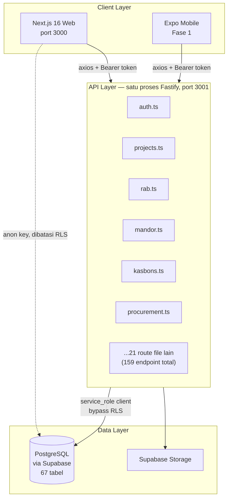
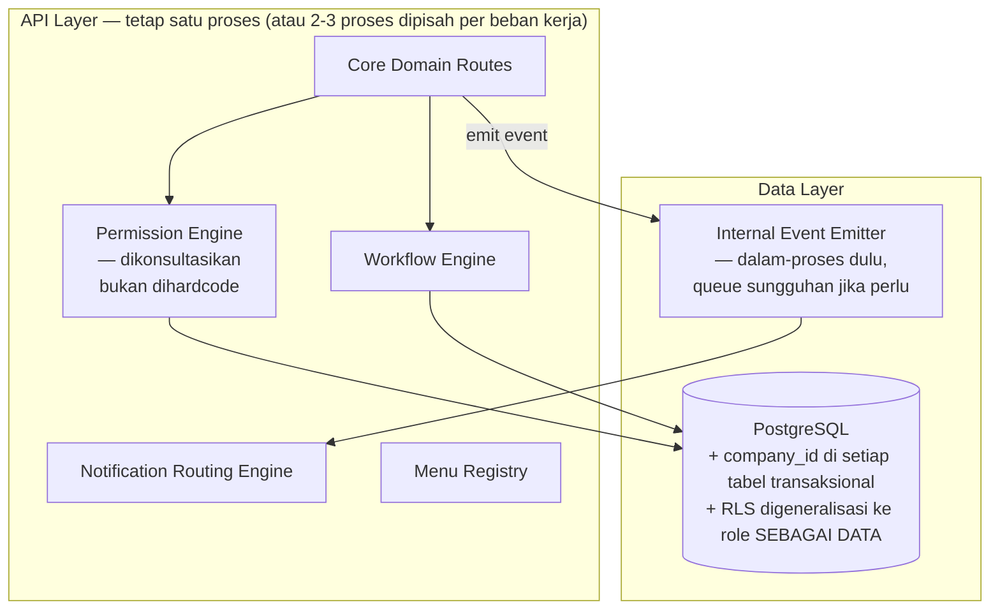
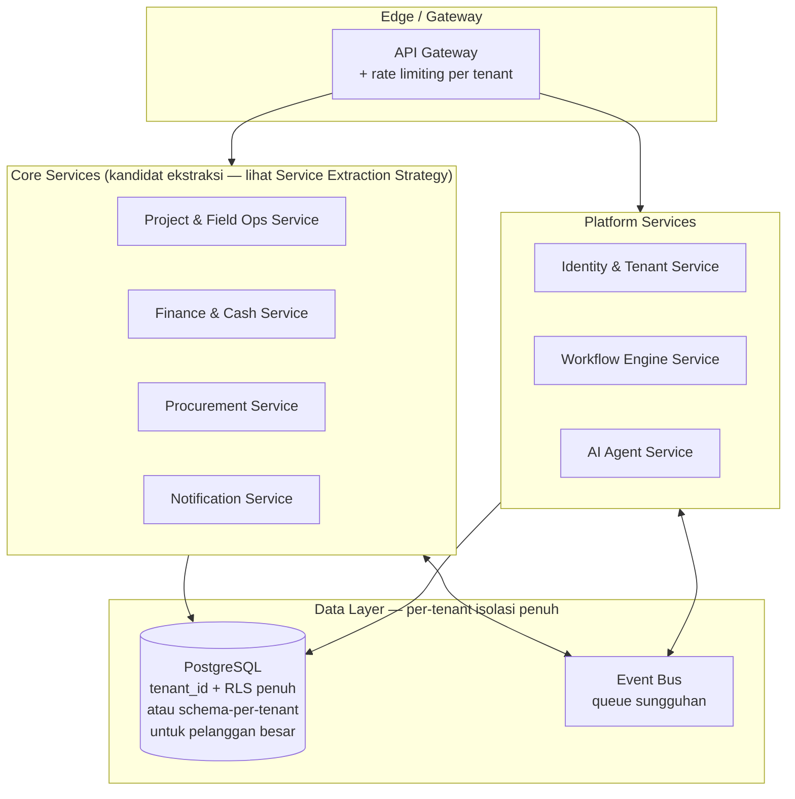

# 01 — Application & Data Architecture

**Repository:** Puraloka Suite Architecture Repository
**Dokumen:** 2 dari 6 (lihat [00](00-vision-and-business-architecture.md), [02](02-security-and-compliance-architecture.md), [03](03-platform-and-intelligence-architecture.md), [04](04-roadmap-governance-and-delivery.md), [05](05-design-system-and-ui-ux-architecture.md))
**Upstream dependency:** Dokumen ini mengasumsikan pembaca sudah familiar dengan [Domain Map](00-vision-and-business-architecture.md#domain-map--bounded-contexts) dan [Current State Assessment](00-vision-and-business-architecture.md#current-state-assessment) di dokumen 00.
**Status:** Living document

---

## Assumptions & Non-Goals

Assumptions dan non-goals global ada di [00](00-vision-and-business-architecture.md#assumptions). Tambahan khusus dokumen ini:

- Semua desain di dokumen ini mengasumsikan **modular monolith tetap menjadi arsitektur default** sampai ada driver operasional konkret untuk ekstraksi service (lihat [Service Extraction Strategy](#service-extraction-strategy)) — bukan asumsi "microservices adalah tujuan akhir yang tertunda."
- Non-goal eksplisit: dokumen ini **tidak** mendesain skema database final untuk L3/L4 — itu prematur. Yang didesain adalah *prinsip* dan *titik keputusan* (kapan kolom `tenant_id` ditambah, kapan RLS di-generalisasi), bukan DDL lengkap untuk horizon 5-10 tahun.

---

## Current Architecture (L1)

### Gaya Arsitektur

Puraloka Suite adalah **modular monolith** dengan pemisahan proses minimal:



**Karakteristik kunci yang diverifikasi:**

- **Satu deployable unit backend** — semua 25 route file berjalan dalam satu proses Fastify. Tidak ada pemisahan proses per domain.
- **Database sebagai titik integrasi** — modul-modul "berkomunikasi" lewat query langsung ke tabel bersama (misalnya `kurva-s.ts` membaca `kasbons`, `project_expenses`, `daily_wage_logs`, `progress_payments`, `borongan_settlements` langsung), bukan lewat event atau API internal.
- **API layer bypass RLS** — backend memakai Supabase `service_role` key, sehingga RLS (migration 049) hanya benar-benar menjaga akses langsung ke database (dashboard Supabase, anon-key client di web untuk read tertentu), bukan jalur utama aplikasi. Implikasi keamanan dibahas di [02](02-security-and-compliance-architecture.md).
- **Tidak ada message queue/event bus** — notifikasi "fire-and-forget" diimplementasikan sebagai `async` function call biasa dengan `.catch()` yang di-log, bukan lewat queue sungguhan.
- **Tidak ada API gateway** — Next.js melakukan proxy rewrite langsung ke Fastify.

### Mengapa Modular Monolith Adalah Keputusan yang Tepat Hari Ini

Ini bukan kompromi sementara yang harus buru-buru diperbaiki — untuk skala dan tim saat ini, ini adalah pilihan yang benar:

| Faktor | Realita |
|---|---|
| Ukuran tim | 1 engineer solo — koordinasi lintas service akan menjadi overhead murni |
| Traffic | Internal, puluhan pengguna (12 users di seed data) — jauh dari threshold yang membutuhkan scaling independen per service |
| Kompleksitas operasional | Deployment manual, belum ada CI/CD — menambah service berarti menambah *n* kali lipat kompleksitas operasional tanpa manfaat setara |
| Konsistensi data | Transaksi lintas domain (misal: approve kasbon → update project cashflow → kirim notifikasi) jauh lebih sederhana dalam satu database transaction daripada saga pattern lintas service |

**Rationale, tradeoff, biaya:** Modular monolith memberi 90% manfaat modularitas (pemisahan kode per domain, kemudahan reasoning) dengan 10% biaya operasional microservices. Trade-off yang diterima: semua modul deploy bersamaan (tidak ada deployment independen), dan satu bug bisa berpotensi memengaruhi seluruh proses (blast radius lebih besar dari service terisolasi). Untuk skala hari ini, trade-off ini jelas menguntungkan.

---

## Transitional Architecture (L2)

L2 menambahkan **multi-company** dan **dynamic engines** tanpa mengubah gaya arsitektur dasar (tetap modular monolith).



**Perubahan struktural utama dari L1:**

1. Kolom `company_id UUID` ditambahkan ke seluruh tabel transaksional inti (`projects`, `clients`, `cash_accounts`, dst.) — lihat [Entity Strategy](#entity-strategy).
2. RLS policy (saat ini hardcoded ke 4 role literal) digeneralisasi memakai tabel `roles`/`permissions` yang sudah ada (migration 050) sebagai sumber kebenaran tunggal — menutup gap yang ditemukan di [00](00-vision-and-business-architecture.md#arsitektur-auth--otorisasi-bercampur-bukan-murni-satu-pola).
3. Logic notifikasi, approval, dan menu yang saat ini hardcoded-per-modul dikonsolidasi ke engine bersama (detail di bawah).
4. **Belum** ada pemisahan proses/service — event emitter tetap dalam-proses (in-process pub/sub, misalnya via `EventEmitter` Node.js atau library ringan), bukan Kafka/RabbitMQ. Ini bukan cacat — ini disiplin menghindari overengineering per prinsip di [00](00-vision-and-business-architecture.md#non-goals).

---

## Target Architecture (L3-L4)



Target L3-L4 ini **sengaja digambar kasar** — detail servis mana yang benar-benar diekstrak, kapan, dan dengan pola apa (strangler fig, dsb.) adalah keputusan yang dibuat *saat* L3 dimulai dengan data nyata (jumlah tenant, pola beban), bukan diputuskan di muka hari ini. Mendesain topologi microservice detail sekarang adalah *fantasy architecture* yang secara eksplisit dilarang oleh prinsip di [00](00-vision-and-business-architecture.md).

---

## L1 → L4 Evolution Model

| Dimensi | L1 (Sekarang) | L2 (Transitional) | L3 (Target) | L4 (Regional) |
|---|---|---|---|---|
| Gaya arsitektur | Modular monolith | Modular monolith | Modular monolith + kandidat service diekstrak selektif | Multi-region, service terdistribusi |
| Tenancy | Implisit 1 (tidak ada kolom) | `company_id`, isolasi logis 1 database | `tenant_id` penuh, RLS enterprise-grade, opsi schema-per-tenant | Multi-region data residency |
| Auth/permission | Bercampur (hardcoded + data-driven, tidak konsisten) | Sepenuhnya data-driven, RLS konsisten | ABAC/PBAC penuh, per-tenant custom roles | Sama + compliance regional |
| Workflow/approval | Hardcoded per modul | Workflow Engine dasar (state machine generik) | Workflow Engine + SLA Engine | Sama + multi-jurisdiction rules |
| Deployment | Manual, lokal | CI/CD dasar, satu environment cloud | Multi-environment, blue-green, per-tenant scaling | Multi-region deployment |
| Observability | Pino log saja | + structured metrics, error tracking | + full OTel (trace/metrics/log terpadu) | + regional SLA dashboards |
| Tim | 1 engineer | 2-4 engineer | 5-15 engineer + dedicated platform team | Organisasi engineering penuh |

---

## Data Architecture

### Master Data, Reference Data, Transactional Data, Event Data — Klasifikasi Saat Ini

| Kategori | Contoh Tabel Nyata | Karakteristik |
|---|---|---|
| **Master Data** | `users`, `clients`, `workers`, `projects` | Berubah jarang, jadi rujukan entitas lain |
| **Reference Data** | `expense_category_templates`, `roles`, `permissions` | Nilai enumerasi/konfigurasi, seharusnya semi-statis |
| **Transactional Data** | `kasbons`, `invoices`, `payments`, `progress_logs`, `daily_wage_logs` | Volume tinggi, append-heavy, jadi sumber laporan |
| **Event/Audit Data** | `audit_logs`, `notifications`, `document_access_logs` | Immutable log kejadian, sudah punya `user_id ON DELETE SET NULL` untuk trail bertahan |

Klasifikasi ini sudah cukup baik secara implisit di skema hari ini — L2 tidak perlu merombak ini, hanya menambahkan `company_id` secara konsisten ke tiga kategori pertama.

### Entity Strategy

**Current State:** Aggregate root utama adalah `projects` — hampir semua domain (RAB, mandor, kasbon, dokumen, kurva-s) berelasi ke `project_id`. Ini pola yang sehat: proyek sudah menjadi *natural tenant boundary* dalam sistem hari ini, yang justru mempermudah transisi L2.

**Transitional State (L2):** Tambahkan `company_id UUID NOT NULL REFERENCES companies(id)` ke tabel-tabel yang saat ini tidak punya jalur ke `project_id` sama sekali (misalnya `cash_accounts`, `users` — user bisa lintas company dalam satu grup usaha) plus generalisasi RLS agar membaca `company_id` sebagai batas isolasi utama, dengan `project_id` sebagai sub-batas di dalamnya. Tabel `companies` baru dengan `parent_company_id` nullable self-reference untuk memodelkan struktur holding/anak perusahaan.

**Target State (L3):** `company_id` L2 menjadi setara `tenant_id` — perbedaan konsep antara "anak perusahaan dalam grup" (L2) dan "pelanggan independen" (L3) di level data sebenarnya identik (kolom isolasi + RLS); yang berbeda adalah *lapisan bisnis* di atasnya: billing per tenant, self-service onboarding, SLA per tenant. Ini keputusan desain penting — **L2 dan L3 berbagi mekanisme data yang sama**, sehingga investasi `company_id` di L2 bukan investasi yang dibuang saat naik ke L3.

**Now / Next / Later:**
- **Now:** Tidak ada — L1 tidak butuh perubahan skema untuk tenancy.
- **Next (L2):** Tabel `companies`, kolom `company_id` di tabel transaksional inti, migrasi backfill (1 row `companies` untuk Puraloka Persada, semua data existing di-assign ke situ).
- **Later (L3):** Rename konseptual `company_id` → perluasan model tenant dengan tabel `tenants` terpisah dari `companies` (tenant = pelanggan SaaS, company = badan usaha di dalam tenant — memungkinkan 1 tenant SaaS punya beberapa company/anak perusahaan, menyatukan L2 dan L3 secara elegan).
- **Optional:** Schema-per-tenant (alih-alih row-level isolation) untuk pelanggan enterprise besar yang mensyaratkan isolasi fisik — hanya jika ada pelanggan yang benar-benar mensyaratkan ini kontraktual.

### Metadata Strategy

**Current State:** Tidak ada metadata layer — skema tabel Postgres adalah satu-satunya sumber kebenaran struktur data. Field baru = migration baru = deploy baru.

**Transitional State (L2):** Perkenalkan **Dynamic Field Registry** terbatas untuk domain yang paling butuh fleksibilitas per company — kandidat utama adalah `expense_category_templates` (sudah semi-dinamis) dan `rab_items` spec/custom fields. Bukan metadata-driven penuh (jangan generalisasi semua 67 tabel), tapi titik-titik spesifik yang punya kebutuhan nyata (custom kategori pengeluaran per company, custom spec teknis per jenis pekerjaan mandor — pola `specs JSONB` yang sudah dipakai di scope items hari ini bisa diperluas).

**Target State (L3):** Entity Metadata System penuh untuk field-field yang benar-benar bervariasi antar tenant (custom fields di RAB item, custom status label per company) — tapi **entitas inti (projects, users, invoices) tetap berskema tetap**, tidak semuanya di-metadata-kan. Full EAV (entity-attribute-value) untuk seluruh sistem adalah anti-pattern performa yang harus dihindari.

**Now/Next/Later:** Now: tidak ada. Next: perluas pola `JSONB specs` yang sudah ada (bukan bikin sistem baru). Later: Field Registry formal untuk domain bervolume tinggi permintaan kustomisasi. Optional: full EAV — kemungkinan besar **tidak pernah dibangun** (lihat [Never Build List](04-roadmap-governance-and-delivery.md#never-build-list)).

### Naming Conventions & Migration Strategy

Sudah didefinisikan dan konsisten di CLAUDE.md project — **dipertahankan, bukan diubah**:

- Database: `snake_case`, plural
- TypeScript: `camelCase` variabel, `PascalCase` komponen/types
- Files: `kebab-case`
- Migration: file bernomor sekuensial di `db/migrations/`, disalin ke `supabase/migrations/` untuk `supabase db push`

**Rekomendasi tambahan untuk L2 (Now — bisa diterapkan segera, biaya rendah):**
- Setiap migration baru yang menyentuh tabel lintas-domain wajib mencantumkan komentar rationale di awal file (pola ini sudah mulai muncul di migration 049, tinggal dijadikan standar wajib).
- Migration harus idempotent-safe (`IF NOT EXISTS`, `IF EXISTS`) — sudah konsisten dipakai, pertahankan.

**Versioning strategy (Next — L2):** API belum punya strategi versioning eksplisit di luar prefix `/api/v1/`. Sebelum ada pelanggan eksternal (L3), ini tidak mendesak. Untuk L2, cukup disiplin *tidak melakukan breaking change* pada endpoint yang dipakai mobile app (yang release cycle-nya lebih lambat dari web) — bukan `/v2` formal dulu.

---

## Configuration Driven Architecture

Ini adalah inti dari gap yang ditemukan di [00 — Current State Assessment](00-vision-and-business-architecture.md#config-driven-vs-hardcoded--audit-per-engine). Bagian ini mendesain **bagaimana** setiap engine seharusnya bekerja di L2, dengan prioritas ROI berurutan (ranking lengkap dengan effort/impact di [04](04-roadmap-governance-and-delivery.md#foundational-engines-prioritization)).

### Dynamic Permission Engine

**Current State:** Tabel `roles`/`permissions`/`role_permissions` sudah ada dan berfungsi untuk permission check (`requirePermission`). Gap: (1) RLS tidak konsultasi tabel ini, (2) `requireRole('admin')` + inline `role === 'x'` checks bypass sistem ini sepenuhnya.

**Transitional State (L2) — desain target:**
1. Hapus seluruh `requireRole()` call site (4 lokasi) — ganti dengan `requirePermission()` yang setara (mis. `requireRole('admin')` di audit.ts menjadi `requirePermission('audit:view')`).
2. Audit semua inline `user.role === 'x'` di route handler (ditemukan di kasbons.ts, change-orders.ts, dan kemungkinan lain) — setiap satu adalah kandidat migrasi ke permission check atau, jika itu memang *business logic* (bukan authorization) seperti "mandor hanya lihat scope sendiri", biarkan tapi dokumentasikan sebagai *data scoping*, bukan *authorization gate* (dua konsep berbeda yang sering tercampur — lihat [02](02-security-and-compliance-architecture.md#authorization-strategy)).
3. Generalisasi RLS: alih-alih `WHERE role = 'admin'`, policy menjadi `WHERE auth_role() IN (SELECT role_name FROM role_permissions_view WHERE permission = 'x')` — RLS ikut membaca tabel `roles`/`permissions` yang sama dengan application layer, menghilangkan sumber-kebenaran ganda.

**Rationale & tradeoff:** Biaya: setiap RLS policy (961 baris di migration 049) perlu ditinjau ulang — pekerjaan mekanis tapi butuh ketelitian tinggi (kesalahan RLS = kebocoran data). Manfaat: role kustom yang dibuat lewat UI benar-benar berfungsi end-to-end, bukan cuma di permukaan. **Ini salah satu kandidat top di prioritas Fase 1** (lihat [04](04-roadmap-governance-and-delivery.md)).

### Dynamic Workflow & Approval Engine

**Current State:** Setiap modul (kasbon, change order, procurement MR/PO/GR) mengimplementasikan ulang logic status transition sendiri-sendiri sebagai inline `if (status === 'x')` checks.

**Transitional State (L2) — desain target:** Sebuah tabel `workflow_definitions` generik:

```
workflow_definitions (id, entity_type, name, is_active)
workflow_states (id, workflow_id, key, label, is_initial, is_terminal)
workflow_transitions (id, workflow_id, from_state, to_state, required_permission, label)
```

Entity (kasbon, change_order, purchase_order) menyimpan `current_state` yang divalidasi terhadap `workflow_transitions` sebelum update diizinkan — satu fungsi `canTransition(entityType, fromState, toState, userPermissions)` dipakai di seluruh modul, menggantikan duplikasi logic yang ada di 3+ file berbeda hari ini.

**Rationale & tradeoff:** Biaya rekayasa medium (perlu migrasi data status existing ke state machine baru, testing ekstensif karena approval chain adalah logic finansial-kritis). Manfaat besar: approval chain custom per company (Tier 2 kebutuhan nyata — grup usaha berbeda punya SOP approval berbeda) jadi mungkin tanpa ubah kode. **Implikasi skalabilitas:** ini adalah prasyarat keras untuk L2 multi-company — tanpa ini, setiap company baru butuh fork logic approval secara manual.

### Dynamic Notification Routing Engine

**Current State:** 19 `NotificationType` hardcoded, resolusi penerima via fungsi hardcoded (`getProjectAdminsAndPM`, dll).

**Transitional State (L2):** Tabel `notification_rules (event_type, recipient_query_type, recipient_role, template_id)` + template table untuk pesan. Fungsi generik `resolveRecipients(eventType, context)` menggantikan fungsi-fungsi khusus. **Penting:** pertahankan properti "fire-and-forget, tidak pernah throw" yang sudah menjadi prinsip desain kuat di sistem hari ini — engine baru tidak boleh melemahkan jaminan ini.

**Rationale:** ROI tinggi, biaya rendah-medium — struktur data notifikasi sudah bersih (tabel `notifications` sudah generik), yang perlu diubah hanya *sisi pemicu*, bukan penyimpanan.

### Dynamic Menu & Dashboard Registry

**Current State:** Menu adalah JSX tetap dengan visibility permission-driven; dashboard widget sudah punya layout engine (`react-grid-layout`) tapi widget set tetap dan persistensi hanya `localStorage`.

**Transitional State (L2):**
- Menu: tabel `menu_items (id, parent_id, label, href, icon, required_permission, sort_order, company_id nullable)` — memungkinkan company tertentu menyembunyikan/menambah menu tanpa deploy baru. **Prioritas lebih rendah** dari Permission/Workflow Engine karena dampaknya kosmetik, bukan struktural.
- Dashboard: tambahkan tabel `dashboard_layouts (user_id, layout_json, hidden_json)` — migrasi sederhana dari `localStorage` ke backend, plus (Next) `widget_definitions` table agar widget baru bisa didaftarkan tanpa mengubah `WIDGET_DEFS` hardcoded di `dashboard-grid.tsx`.

**Now/Next/Later:** Dashboard layout→backend adalah **Now** (biaya sangat rendah, langsung berguna untuk single-tenant sekalipun — user ganti device kehilangan layout hari ini). Menu registry adalah **Next** (butuh multi-company dulu baru terasa manfaatnya). Widget definition registry adalah **Later**.

### Engine yang Sengaja TIDAK Diprioritaskan di L2

Form Builder, SLA Engine, Rules Engine generik, Document Template Engine penuh, Report Builder generik — semua ini **valid secara konsep tapi Later/Optional**, bukan Now/Next. Rationale: mereka menyelesaikan masalah yang belum terasa sakit hari ini (satu company, form yang stabil). Membangun form builder generik sebelum ada 2 company dengan kebutuhan form berbeda adalah spekulasi, bukan respons terhadap kebutuhan nyata — persis pola *premature abstraction* yang harus dihindari.

---

## Dynamic Engines Architecture — Ringkasan Prioritas

| Engine | Current | Prioritas L2 | Alasan Urutan |
|---|---|---|---|
| Permission Engine (perbaikan konsistensi) | Sebagian | **Now** | Gap keamanan aktif (RLS tidak sinkron) — ini bukan fitur baru, ini menutup kerentanan |
| Dashboard Layout Persistence | Sebagian | **Now** | Biaya sangat rendah, manfaat langsung bahkan untuk single-tenant |
| Workflow/Approval Engine | Tidak ada | **Next** | Prasyarat keras sebelum company kedua bisa punya SOP approval berbeda |
| Notification Routing Engine | Hardcoded | **Next** | ROI tinggi, biaya rendah, bisa dikerjakan paralel dengan Workflow Engine |
| Menu Registry | Sebagian | **Later** | Kosmetik dibanding 3 di atas — tunggu sampai company kedua benar-benar butuh menu berbeda |
| Field Registry / Metadata System | Tidak ada | **Later** | Perluas pola JSONB existing dulu sebelum bikin sistem generik baru |
| Form Builder, SLA Engine, Rules Engine, Report Builder generik | Tidak ada | **Optional** | Selesaikan masalah yang belum terasa sakit — bangun saat ada 2+ company dengan kebutuhan nyata berbeda |

Detail effort estimation dan build order lengkap ada di [04 — Foundational Engines Prioritization](04-roadmap-governance-and-delivery.md#foundational-engines-prioritization).

---

## Modular Monolith Strategy

**Prinsip inti:** Modular monolith bukan "microservices yang ditunda" — ini gaya arsitektur yang valid secara permanen untuk sebagian besar horizon L1-L2, dan berpotensi tetap valid sebagian di L3.

**Struktur modul internal (Now — refactor ringan, bukan rewrite):** Route file hari ini (25 file di `apps/api/src/routes/v1/`) sudah cukup dipisah per domain secara konvensi penamaan file, tapi tidak ada *enforcement* batas — `kurva-s.ts` bebas query tabel `kasbons` langsung tanpa lewat "module interface" apapun. Untuk L2, perkenalkan **konvensi (bukan tooling berat)**: setiap domain punya folder `apps/api/src/modules/<domain>/` berisi `repository.ts` (akses data) + `service.ts` (business logic) + `routes.ts` (HTTP layer) — modul lain memanggil `service.ts`, tidak pernah query tabel domain lain langsung. Ini murni disiplin kode, nol infrastruktur baru, dan bisa dilakukan incremental per domain saat disentuh (tidak perlu migrasi big-bang seluruh 25 file sekaligus).

**Rationale:** Ini mempersiapkan batas ekstraksi service tanpa membayar biaya microservices — jika suatu saat `finance` module perlu diekstrak, batas kodenya sudah jelas karena selama ini hanya diakses lewat `service.ts`, bukan query SQL tersebar di 10 file berbeda.

---

## Service Extraction Strategy

**Prinsip:** Ekstraksi service **hanya** dilakukan ketika salah satu driver berikut benar-benar terjadi — bukan dijadwalkan di kalender:

1. **Beban kerja divergen secara nyata** — misalnya Notification Engine perlu scaling terpisah karena volume push notification 10x lipat dibanding modul lain (butuh proses worker independen).
2. **Tim terpisah secara organisasi** — jika suatu saat ada tim dedicated untuk AI Platform yang perlu iterasi cepat tanpa terikat siklus deploy modul lain.
3. **Isolasi kegagalan kritis** — modul yang kegagalannya tidak boleh menjatuhkan modul lain (kandidat: proses generate PDF/report yang berat, atau AI agent yang memanggil LLM eksternal dengan latency tidak terduga — kandidat ekstraksi paling awal justru karena alasan **resiliency**, bukan skala).

**Kandidat ekstraksi paling mungkin duluan (jika/ketika driver di atas muncul), urutan realistis:**
1. **Report/PDF generation** — sudah computationally heavy (Excel/PDFKit), isolasi mencegah proses berat memblokir request lain di event loop Node.js yang sama
2. **Notification delivery** (bukan routing/rules-nya) — cocok jadi worker/queue consumer terpisah begitu volume naik
3. **AI Agent Service** (lihat [03](03-platform-and-intelligence-architecture.md)) — karena secara alami memanggil layanan eksternal (LLM) dengan karakteristik latency/reliability berbeda dari CRUD API biasa

**Yang TIDAK diekstrak lebih dulu, dan kenapa:** Core domain (RAB, Kasbon, Field Ops) — karena mereka paling sering saling bertransaksi dalam satu unit kerja (approve kasbon → update project cashflow → recalculate EVM), memisahkan mereka lebih awal berarti mengimpor distributed transaction complexity (saga pattern) untuk masalah yang saat ini diselesaikan gratis oleh Postgres transaction tunggal.

---

## CQRS, Event Sourcing, Saga Readiness

Tiga pattern advanced ini diminta secara eksplisit — berikut posisi jujur masing-masing untuk Puraloka Suite:

| Pattern | Readiness Assessment | Rekomendasi |
|---|---|---|
| **CQRS** | Beberapa endpoint laporan (Kurva-S, dashboard, EVM) sudah secara *de facto* adalah read-model teragregasi terpisah dari write path — pola CQRS ringan sudah muncul organik. | **Optional, sudah sebagian terjadi secara alami.** Jangan formalkan jadi arsitektur CQRS penuh (command bus terpisah, dst.) kecuali read-load benar-benar jadi bottleneck terukur. |
| **Event Sourcing** | Tidak ada, dan `audit_logs` yang sudah ada (diff old→new per perubahan) memberikan sebagian besar manfaat event sourcing (riwayat perubahan) dengan biaya jauh lebih rendah. | **Later/Optional — kemungkinan besar tidak pernah penuh.** `audit_logs` yang sudah baik adalah "80% solution" yang cukup untuk kebutuhan audit trail konstruksi. Event sourcing penuh (rebuild state dari event log) menyelesaikan masalah yang belum ada di sini. |
| **Saga Pattern** | Tidak relevan selama modular monolith — transaksi lintas domain memakai Postgres transaction biasa. | **Later — hanya jika Service Extraction Strategy benar-benar memisahkan domain yang bertransaksi bersama.** Sampai saat itu, saga adalah kompleksitas tanpa manfaat. |

**Tradeoff eksplisit:** Menunda ketiga pattern ini bukan berarti mengabaikannya — ini keputusan sadar bahwa biaya kompleksitasnya (terutama saga: butuh compensating transaction, eventual consistency handling) tidak sepadan dengan manfaat pada skala dan bentuk arsitektur (single database, modular monolith) hari ini. Ini akan ditinjau ulang **saat** Service Extraction Strategy benar-benar mengekstrak domain pertama.

---

*Dokumen berikutnya: [02 — Security & Compliance Architecture](02-security-and-compliance-architecture.md) — pendalaman OWASP/ASVS/NIST, dan solusi untuk gap RLS/permission yang ditemukan di dokumen ini.*
