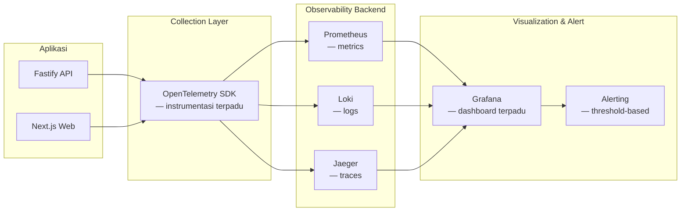

# 03 — Platform & Intelligence Architecture

**Repository:** Puraloka Suite Architecture Repository
**Dokumen:** 4 dari 6 (lihat [00](00-vision-and-business-architecture.md), [01](01-application-and-data-architecture.md), [02](02-security-and-compliance-architecture.md), [04](04-roadmap-governance-and-delivery.md), [05](05-design-system-and-ui-ux-architecture.md))
**Upstream dependency:** Mengasumsikan [Modular Monolith Strategy](01-application-and-data-architecture.md#modular-monolith-strategy) dan [Service Extraction Strategy](01-application-and-data-architecture.md#service-extraction-strategy) dari dokumen 01.
**Status:** Living document

---

## Assumptions & Non-Goals

- Target "100.000 concurrent users" dari brief awal diperlakukan sebagai **horizon L4 aspirational**, bukan target kapasitas yang harus dipenuhi arsitektur L1/L2. Mendesain untuk 100rb pengguna saat sistem punya belasan pengguna aktif adalah overengineering — bagian [Performance Architecture](#performance-architecture) mendesain *jalur* menuju skala itu, bukan infrastruktur penuh hari ini.
- Non-goal: memilih vendor final (Datadog vs. self-hosted Grafana, dst.) — dokumen ini menetapkan *arsitektur* observability (sinyal apa, kapan diperlukan), keputusan vendor adalah keputusan implementasi di fase terkait.
- AI Architecture di sini adalah desain *kapabilitas dan guardrail*, bukan pemilihan model/provider final — itu keputusan implementasi teknis saat Fase AI dimulai.

---

## Performance Architecture

### Current State

Tidak ada masalah performa yang dilaporkan hari ini — wajar, karena beban aktual (belasan pengguna internal) jauh di bawah titik di mana pola akses Postgres/Fastify standar mulai terasa. Tidak ditemukan indexing strategy eksplisit di luar primary key/foreign key default, tidak ada caching layer, tidak ada CDN untuk asset.

### Indexing Strategy

**Current State:** Migration files tidak secara konsisten mendefinisikan index eksplisit di luar constraint PK/FK/unique — perlu audit query pattern nyata (Kurva-S, dashboard aggregation yang JOIN banyak tabel) untuk index candidate yang sebenarnya berdampak.

**Now:** Audit `EXPLAIN ANALYZE` pada endpoint yang paling sering dipanggil dan paling berat (Kurva-S dengan agregasi 5 sumber AC, dashboard aggregation) — index composite pada kolom yang sering jadi filter bersama (`project_id + status`, `project_id + created_at`) adalah kandidat langsung, biaya rendah, dampak langsung terasa bahkan di L1.

**Next (L2):** Setiap tabel yang dapat `company_id` (lihat [01](01-application-and-data-architecture.md)) butuh index composite `(company_id, ...)` di kolom yang sering di-filter — tanpa ini, isolasi tenant secara sengaja memperlambat semua query begitu volume data bertambah per company.

**Later:** Partial index untuk status yang sering di-query dalam kondisi spesifik (mis. `WHERE status = 'pending'` untuk approval queue) jika volume kasbon/approval jadi besar secara nyata.

### Caching Strategy

**Current State:** Tidak ada caching layer — setiap request hit database langsung. `request._permissionCache` (in-memory, per-request) adalah satu-satunya bentuk caching yang ditemukan, dan itu scope-nya per-request saja (bukan lintas request).

**Now:** Tidak mendesak — beban belum membenarkan kompleksitas caching.

**Next (L2):** Cache read-heavy, rarely-changing data lintas request — kandidat jelas: hasil `get_role_permissions` RPC (dipanggil di setiap request via `requirePermission`), master data (`expense_category_templates`, `roles`, `permissions`). Redis atau in-memory LRU cache dengan TTL pendek (beberapa menit) cukup — jangan mulai dengan distributed cache kompleks.

**Later (L3):** Cache terdistribusi (Redis cluster) jika multi-instance API mulai berjalan (prasyarat: horizontal scaling, lihat di bawah).

### Queue Architecture

**Current State:** Tidak ada — notifikasi "fire-and-forget" adalah async function call langsung dalam request yang sama, bukan job di queue.

**Next (L2):** Perkenalkan queue ringan (mis. `pg-boss` — queue berbasis Postgres, tidak perlu infrastruktur baru — atau BullMQ dengan Redis jika Redis sudah masuk untuk caching) untuk pekerjaan yang: (a) tidak perlu selesai sebelum response dikirim (notifikasi, email), (b) berat secara komputasi (generate PDF/Excel besar), (c) memanggil layanan eksternal dengan latency tidak terduga (AI agent calls — lihat [AI Architecture](#ai-architecture)).

**Rationale memilih `pg-boss` sebagai kandidat Next, bukan Kafka/RabbitMQ langsung:** Menggunakan Postgres yang sudah ada sebagai backend queue menghindari menambah infrastruktur baru untuk kebutuhan volume yang masih kecil — konsisten dengan prinsip *avoid technology for technology's sake*. Kafka/RabbitMQ (lihat [Automation Platform](#automation-platform--event-platform)) baru masuk akal saat volume event dan kebutuhan fan-out/replay jauh lebih besar dari yang dibutuhkan queue sederhana.

### Horizontal Scaling Strategy

**Current State:** Satu proses Fastify, satu proses Next.js — tidak ada load balancer, tidak ada multi-instance.

**Next (L2):** Fastify API bersifat *stateless* by design hari ini (auth via JWT, tidak ada in-memory session store lintas request kecuali permission cache per-request) — ini artinya horizontal scaling (menjalankan 2+ instance di belakang load balancer) adalah perubahan infrastruktur murni, **bukan perubahan kode**, begitu deployment cloud mulai (Fase 1 di [04](04-roadmap-governance-and-delivery.md)). Ini kabar baik: kesiapan untuk scale-out sudah ada secara tidak sengaja karena desain stateless yang benar sejak awal.

**Later (L3):** Auto-scaling berbasis metrics (CPU/request queue depth) setelah observability (lihat di bawah) memberi data nyata untuk threshold yang tepat.

### CDN & Storage Architecture

**Current State:** Asset (foto, dokumen) disimpan di Supabase Storage — sudah merupakan object storage terkelola yang wajar. Tidak ada CDN eksplisit di depan Next.js static asset.

**Now:** Untuk deployment cloud pertama (Fase 1), pakai platform yang menyediakan CDN otomatis untuk Next.js static asset (Vercel menyediakan ini native) — pilihan vendor deployment sudah otomatis menyelesaikan ini, tidak perlu didesain terpisah.

**Next:** Image optimization untuk foto progress lapangan (`project_photos`) — Next.js Image component dengan resizing otomatis jika belum dipakai; foto dari kamera HP lapangan seringkali besar (beberapa MB), optimasi ini berdampak nyata pada UX mandor yang koneksinya sering terbatas di lokasi proyek.

---

## Observability Architecture

### Current State

Ini adalah salah satu gap paling signifikan yang ditemukan di [00 — Current State Assessment](00-vision-and-business-architecture.md#kualitas-rekayasa--fakta-terverifikasi): logging terstruktur via Pino (bawaan Fastify) aktif, tapi **tidak ada APM, tracing, atau metrics collection sama sekali.** Ini berarti hari ini, jika ada error di production (saat production benar-benar ada), satu-satunya cara mengetahuinya adalah laporan manual dari pengguna atau membaca log file secara manual.

### Target Architecture — Three Pillars



**Rationale untuk OpenTelemetry sebagai instrumentation layer:** OTel adalah standar vendor-neutral — instrumentasi yang ditulis sekali bisa diarahkan ke backend manapun (self-hosted Prometheus/Grafana/Loki/Jaeger di L2, atau vendor terkelola seperti Datadog/Honeycomb di L3 jika tim lebih memilih tidak mengoperasikan observability stack sendiri). Ini menghindari vendor lock-in di keputusan yang dibuat saat tim masih kecil.

### Metrics

**Now (prasyarat sebelum deployment publik pertama):**
- Request rate, error rate, latency (p50/p95/p99) per endpoint — the "RED metrics" — via `@fastify/otel` atau setara.
- Ini bukan opsional untuk fase deployment pertama — tanpa ini, tim tidak akan tahu sistem down sampai ada laporan manual.

**Next (L2):**
- Business metrics: jumlah kasbon pending per company, waktu rata-rata approval, volume progress log per hari — metrics yang bermakna secara bisnis, bukan hanya teknis.
- Database connection pool utilization, query duration per tabel besar.

**Later (L3):**
- Per-tenant metrics breakdown (SLA monitoring per pelanggan).

### Logs

**Current State:** Pino terstruktur (JSON) sudah aktif — fondasi yang baik, tinggal disalurkan ke agregator.

**Now:** Kirim log Pino ke Loki (atau setara) alih-alih hanya `pino-pretty` di stdout lokal — begitu deployment cloud terjadi, log yang hanya hidup di stdout container hilang saat container restart.

**Next:** Structured log correlation ID — setiap request dapat `request_id` yang konsisten muncul di log, metric, dan trace (OTel menyediakan ini secara native via trace context) — memungkinkan "dari alert metrics, langsung lompat ke log dan trace request yang sama."

### Traces

**Current State:** Tidak ada.

**Next (L2, terutama begitu Service Extraction dimulai):** Distributed tracing menjadi jauh lebih bernilai begitu ada lebih dari satu service saling memanggil (lihat [Service Extraction Strategy](01-application-and-data-architecture.md#service-extraction-strategy)) — untuk modular monolith murni (L1), tracing lintas-fungsi dalam satu proses kurang kritis dibanding metrics/logs. **Prioritas: metrics dan logs dulu (Now), tracing menyusul saat kompleksitas request lintas-layanan mulai muncul (Next/Later).**

### Alerting

**Now:** Alert dasar berbasis threshold sederhana (error rate > X%, endpoint down) — cukup notifikasi ke Slack/email/WhatsApp pribadi developer, tidak perlu on-call rotation formal untuk tim 1 orang.

**Next:** Alert berbasis SLA per business process kritis (mis. "kasbon pending > 48 jam tanpa approval" — ini sebenarnya juga tumpang tindih dengan [Dynamic SLA Engine](01-application-and-data-architecture.md), bukan murni observability).

### Dashboards

**Now:** Satu dashboard Grafana operasional dasar (uptime, error rate, latency) — cukup untuk mendeteksi "sistem sedang bermasalah."

**Later:** Dashboard per-domain (finance health, procurement health) untuk kebutuhan operasional yang lebih dalam.

---

## Automation Platform & Event Platform

### Current State

Tidak ada automation/event platform — setiap "automasi" (notifikasi, milestone check, deadline check) adalah endpoint yang dipanggil manual atau polling dari frontend (`GET /api/v1/notifications/check-milestones` dipanggil manual dari halaman `/sistem`, bukan cron job otomatis — ini tercatat eksplisit di CLAUDE.md sebagai gap: "panduan cron job otomasi" ada, tapi cron sungguhan belum berjalan).

### Target Architecture

**Trigger Engine (Next — L2):** Generalisasi pola yang sudah ada (`check-milestones`, `check-deadlines`) menjadi cron job yang benar-benar berjalan otomatis (bukan trigger manual) — ini adalah perbaikan berbiaya sangat rendah (job scheduler seperti `node-cron` atau cron di level platform hosting) dengan dampak operasional langsung.

**Event Engine (Next/Later — L2 menuju L3):** Perkenalkan event emitter internal (in-process dulu, sesuai [01](01-application-and-data-architecture.md#transitional-architecture-l2)) untuk momen bisnis kunci (`kasbon.approved`, `project.progress_updated`, `invoice.paid`) — Notification Routing Engine (lihat [01](01-application-and-data-architecture.md#dynamic-notification-routing-engine)) menjadi *consumer pertama* dari event ini, bukan dipanggil langsung dari business logic seperti hari ini. Ini men-decouple "sesuatu terjadi" dari "siapa yang perlu tahu" — prasyarat untuk automation yang lebih kompleks nanti (mis. webhook ke sistem eksternal).

**Webhook Architecture (Later — L3):** Begitu ada kebutuhan integrasi dengan sistem eksternal (software akuntansi, WhatsApp Business API resmi menggantikan wa.me link, dll.) — event engine di atas menjadi fondasi untuk memancarkan webhook keluar. **Tidak dibangun sebelum ada kebutuhan integrasi nyata.**

**Posisi n8n/Temporal/Kafka/RabbitMQ:**

| Tool | Kapan Relevan | Kenapa Tidak Sekarang |
|---|---|---|
| **n8n** (atau setara, low-code automation) | **Optional, kapan pun** — bisa dipakai lebih awal justru karena ia *eksternal* dari codebase (tidak menambah kompleksitas kode inti), cocok untuk automasi ad-hoc non-kritis (mis. sinkronisasi laporan ke Google Sheets) | Bukan "tidak sekarang" — ini justru kandidat *quick win* jika ada kebutuhan automasi ad-hoc yang tidak sepadan untuk dikodekan manual |
| **Temporal** (workflow orchestration durable) | **Later/Optional, L3+** — bernilai saat ada proses bisnis jangka panjang multi-step yang butuh durability (mis. proses onboarding tenant SaaS berhari-hari) | Untuk approval chain sederhana (kasbon, change order), [Dynamic Workflow Engine](01-application-and-data-architecture.md#dynamic-workflow--approval-engine) sudah cukup — Temporal menyelesaikan masalah orkestrasi yang belum ada di skala ini |
| **Kafka** | **Later, hanya jika Service Extraction benar-benar terjadi dan volume event tinggi** | Overkill untuk in-process event emitter yang cukup di L2; Kafka menambah operational burden (cluster management) yang tidak sepadan sebelum ada multi-service nyata |
| **RabbitMQ** | **Next/Later — kandidat lebih realistis dari Kafka untuk L2/L3 awal** jika `pg-boss` (queue berbasis Postgres) mulai tidak cukup skalanya | Operational overhead lebih rendah dari Kafka, cocok sebagai batu loncatan sebelum (jika pernah) benar-benar butuh Kafka |

**Prinsip governing:** Mulai dari primitif paling sederhana yang cukup (in-process event emitter → `pg-boss` queue → RabbitMQ → Kafka), naik tier **hanya** saat tier sebelumnya terbukti tidak cukup dengan data nyata (bukan asumsi).

---

## Integration Platform

**Current State:** Tidak ada — setiap "integrasi" hari ini adalah manual (WA deep-link untuk PO, generate PDF untuk dibagikan manual).

**Later (L3):** Public API + API key management untuk pelanggan SaaS yang ingin integrasi dengan sistem akuntansi mereka sendiri — ini eksplisit **Tier 3** di [Module Catalog](00-vision-and-business-architecture.md#module-catalog--tiering), tidak relevan sebelum ada pelanggan eksternal.

---

## AI Architecture

### Prinsip Desain

AI di Puraloka Suite **bukan chatbot tempelan** — setiap agent didesain sebagai *pengguna sistem dengan kredensial terbatas*, tunduk pada permission engine yang sama dengan pengguna manusia (lihat [Dynamic Permission Engine](01-application-and-data-architecture.md#dynamic-permission-engine)). Ini prinsip yang tidak bisa ditawar: **agent AI tidak boleh punya jalur akses data yang melewati RBAC/PBAC yang berlaku untuk manusia.**

### AI Agent Registry — Desain Setiap Agent

Setiap agent didefinisikan dengan 5 komponen wajib (skema `ai_agents` — kandidat tabel, bukan hardcoded per agent):

```
ai_agents (id, name, role_description, model_config, is_active)
ai_agent_tools (agent_id, tool_name, tool_config)       -- apa yang BOLEH dipanggil
ai_agent_permissions (agent_id, permission_key)          -- data apa yang BOLEH diakses (subset dari RBAC/PBAC yang sama)
ai_agent_memory (agent_id, scope, retention_policy)      -- apa yang diingat, berapa lama
ai_agent_audit_logs (agent_id, action, input, output, user_context, timestamp)  -- WAJIB, setiap aksi
```

### Delapan Agent — Spesifikasi Tools/Memory/Permission/Guardrail

| Agent | Tools | Memory | Permission Scope | Guardrail Kunci |
|---|---|---|---|---|
| **AI CFO** | Query Kurva-S/EVM, cash summary, invoice aging | Read-only historical trend (tidak menyimpan data mentah, hanya ringkasan analitik) | `finance:view`, `kurva-s:view` — **tidak pernah** `finance:approve` | Tidak boleh mengeksekusi transaksi finansial apa pun — hanya analisis dan rekomendasi ke manusia |
| **AI Project Manager** | Query progress, milestone, RAB status | Konteks per-proyek, retensi selama proyek aktif | `projects:view`, `milestones:view` per company_id user | Rekomendasi jadwal/risiko, tidak bisa mengubah `progress_logs` langsung — perubahan data tetap lewat manusia |
| **AI Scheduler** | Query Gantt, dependency, resource conflict | Konteks per-proyek | `projects:view`, akses baca `rab_items.gantt_*` | Bisa *usulkan* perubahan `planned_start/end`, tidak bisa commit tanpa approval PM (align dengan prinsip "semua dependency soft/advisory" yang sudah jadi keputusan desain Gantt di CLAUDE.md) |
| **AI Procurement Officer** | Query stock level, reorder alert, supplier lead time | Riwayat pola pembelian per material (agregat, bukan detail transaksi mentah) | `procurement:view` | Bisa *draft* MR otomatis saat stok di bawah `min_stock`, tidak bisa submit/approve — draft menunggu manusia |
| **AI Contract Analyst** | Baca dokumen kontrak (via Document Management), ekstraksi klausul | Tidak menyimpan isi kontrak di luar sesi analisis (untuk kontrak yang sensitif) | `documents:view` kategori kontrak | Tidak pernah generate kontrak final tanpa review manusia — hanya analisis/ekstraksi/perbandingan |
| **AI Estimator** | Query RAB historis lintas proyek serupa | Basis data RAB historis teragregasi (bukan per-klien identifiable) | `rab:view` lintas proyek (dalam company yang sama) | Estimasi adalah *starting point*, bukan RAB final — harus direview manusia sebelum jadi kontrak |
| **AI Auditor** | Query `audit_logs`, deteksi anomali (approval tidak wajar, pola kasbon mencurigakan) | Baseline pola normal per company, retensi jangka panjang (ini agent yang justru butuh memory terpanjang) | `audit:view` — permission paling luas dari semua agent, konsisten dengan perannya sebagai pengawas | Hanya *flag* anomali untuk review manusia — tidak pernah mengambil tindakan korektif otomatis |
| **AI Assistant** (general, chat-based) | Search global (reuse `/api/v1/search`), FAQ internal | Konteks percakapan per sesi, tidak persisten lintas sesi kecuali diminta user | Permission **inherited dari user yang bertanya** (bukan permission agent independen) — agent umum ini secara desain tidak boleh punya privilege lebih tinggi dari user yang memakainya | Guardrail terpenting: **tidak mewarisi permission lebih tinggi dari user aktif**, mencegah "privilege laundering" lewat asisten umum |

### Prinsip Guardrail Lintas-Agent

1. **Least privilege default** — setiap agent baru start dengan permission kosong, ditambah eksplisit per kebutuhan, bukan sebaliknya.
2. **No silent write** — pola yang konsisten di semua 8 agent di atas: agent boleh *membaca, menganalisis, mengusulkan draft* — tindakan yang mengubah data finansial/kontraktual selalu berhenti di titik approval manusia. Ini bukan keterbatasan teknis sementara, ini keputusan desain permanen sampai ada rekam jejak kepercayaan yang terbukti panjang.
3. **Audit setiap panggilan** — `ai_agent_audit_logs` mencatat *input, output, dan user context* setiap kali agent dipanggil — memakai infrastruktur `audit_logs` yang sudah matang di [02](02-security-and-compliance-architecture.md), bukan sistem log terpisah.
4. **Tenant/company isolation berlaku sama** — agent yang beroperasi untuk company A tidak pernah melihat data company B, mengikuti RLS/permission yang sama persis dengan pengguna manusia (lihat [02 — Row Level Security](02-security-and-compliance-architecture.md#row-level-security--tenant-isolation)).

### Now/Next/Later/Optional untuk AI Platform

- **Now:** Tidak ada — AI Platform eksplisit **Tier 3** di [Module Catalog](00-vision-and-business-architecture.md#module-catalog--tiering). Membangun ini sebelum Dynamic Permission Engine benar-benar konsisten ([02](02-security-and-compliance-architecture.md)) berarti membangun guardrail AI di atas fondasi otorisasi yang bocor — urutan yang salah.
- **Next (setelah L2 permission/workflow engine matang):** Mulai dari **AI Assistant** (agent paling rendah risiko — inherited permission, tidak ada write capability) sebagai pilot, memvalidasi pola `ai_agents` registry sebelum berinvestasi di 7 agent lain.
- **Later:** AI CFO dan AI Auditor — nilai tinggi tapi butuh basis data historis yang cukup matang dulu (butuh volume data multi-bulan/tahun untuk analisis tren bermakna).
- **Optional:** AI Contract Analyst, AI Estimator — bernilai tapi bergantung pada volume dokumen/RAB historis yang cukup besar untuk melatih pola yang berguna; masuk akal lebih realistis di L3 dengan multi-tenant data (lebih banyak variasi untuk belajar pola, dengan tetap menjaga isolasi data antar tenant).

---

## Knowledge Platform (disebut di brief awal sebagai Knowledge Management)

**Current State:** Tidak ada — dokumentasi hidup di CLAUDE.md dan percakapan.

**Posisi:** Tier 3 di [Module Catalog](00-vision-and-business-architecture.md#module-catalog--tiering). Begitu AI Assistant (di atas) mulai berjalan, ia butuh *sumber pengetahuan* untuk dijawab — pada titik itu, Knowledge Platform sederhana (dokumentasi internal terstruktur, bukan wiki penuh) menjadi prasyarat alami untuk AI Assistant yang berguna, bukan modul berdiri sendiri yang dibangun lebih dulu.

---

*Dokumen berikutnya: [04 — Roadmap, Governance & Delivery](04-roadmap-governance-and-delivery.md) — Phase 0-9 transformation program, gap analysis, prioritas engine, risk register, dan rekomendasi fase implementasi berikutnya.*
