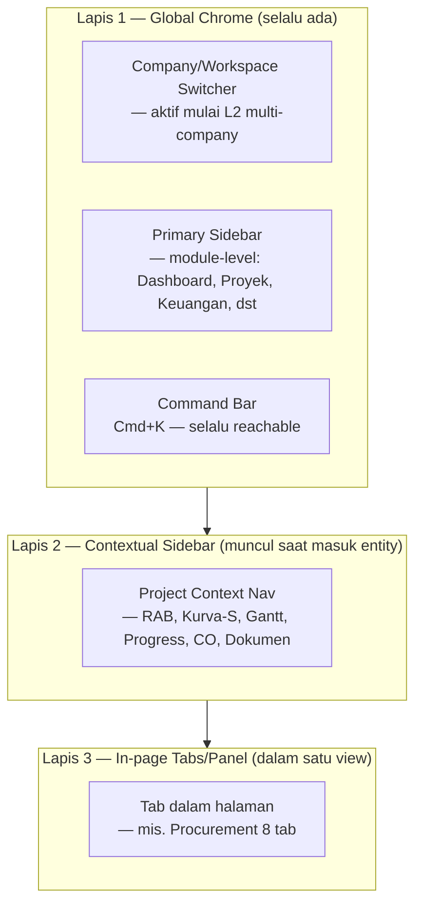

# 05 — Design System & UI/UX Architecture

**Repository:** Puraloka Suite Architecture Repository
**Dokumen:** 6 dari 7 (lihat [00](00-vision-and-business-architecture.md), [01](01-application-and-data-architecture.md), [02](02-security-and-compliance-architecture.md), [03](03-platform-and-intelligence-architecture.md), [04](04-roadmap-governance-and-delivery.md), [06](06-agentic-ai-and-automation-architecture.md))
**Upstream dependency:** Dokumen ini setara pentingnya dengan [02 — Security Architecture](02-security-and-compliance-architecture.md) dan [01 — Application Architecture](01-application-and-data-architecture.md) — bukan lampiran kosmetik. Mengasumsikan pembaca familiar dengan [Module Catalog](00-vision-and-business-architecture.md#module-catalog--tiering) dan [L1-L4 Evolution Model](01-application-and-data-architecture.md#l1--l4-evolution-model).
**Status:** Living document
**Relasi dengan dokumen desain existing:** Dokumen ini **tidak menggantikan** [Warm Clay Redesign Spec](../2026-07-15-warm-clay-redesign-design.md) (disetujui 2026-07-15, sedang rollout 8 fase). Warm Clay tetap **identitas visual** Puraloka Suite. Dokumen ini mendefinisikan **arsitektur interaksi, navigasi, dan pengalaman** yang beroperasi di atas token Warm Clay, ditarik dari pola SaaS modern (Linear, Stripe, Attio, Raycast, Cursor) — lihat [Hubungan dengan Warm Clay](#hubungan-dengan-warm-clay) untuk pembagian tanggung jawab yang eksplisit.

---

## Assumptions & Non-Goals

- Dokumen ini **tidak mendesain layar/halaman spesifik** — itu tugas implementasi per fitur, dipandu oleh arsitektur ini (mengikuti instruksi "the goal is not to design screens").
- Non-goal eksplisit: mengubah token warna/shadow/radius Warm Clay. Perubahan visual (jika dibutuhkan) tunduk pada proses [Design Governance](#design-governance) di dokumen ini, bukan diputuskan sepihak di sini.
- Assumptions umum ([00](00-vision-and-business-architecture.md#assumptions)) berlaku penuh — khususnya bahwa tim kecil dan horizon L1-L2 adalah realita operasional saat ini; rekomendasi Now/Next di dokumen ini dikalibrasi untuk itu, bukan untuk tim design system dedicated yang belum ada.
- Rekomendasi library (shadcn/ui, cmdk, TanStack Table, dst.) dievaluasi terhadap **stack yang benar-benar terpasang hari ini** (Next.js 16, React 19, Tailwind v4 — [Current State](#current-state-stack-audit)), bukan asumsi stack ideal.

## Glossary Tambahan

| Istilah | Arti dalam dokumen ini |
|---|---|
| **Interaction model** | Bagaimana pengguna *berpindah* dan *bertindak* dalam produk (navigasi, command palette, keyboard shortcut) — berbeda dari *visual identity* (warna, bentuk, bayangan) |
| **Density mode** | Preferensi kepadatan informasi yang bisa dipilih pengguna (Comfortable/Compact/Dense) — bukan breakpoint responsif |
| **Chrome** | Elemen struktural UI yang selalu ada (sidebar, topbar, command bar) — dibedakan dari *content* (data proyek, tabel, form) |
| **AI-native** | AI bukan fitur tempelan (chatbot di pojok) — AI adalah *mode interaksi* yang tersedia di titik kerja mana pun (lihat [AI Interaction Patterns](#ai-interaction-patterns)) |

---

## Hubungan dengan Warm Clay

Warm Clay dan dokumen ini menjawab pertanyaan yang **berbeda** — keduanya diperlukan bersama, bukan saling menggantikan:

| | Warm Clay ([spec](../2026-07-15-warm-clay-redesign-design.md)) | Dokumen 05 (ini) |
|---|---|---|
| **Menjawab pertanyaan** | "Seperti apa rupa Puraloka Suite?" | "Bagaimana cara pengguna bergerak dan bertindak di dalamnya?" |
| **Cakupan** | Warna, shadow, radius, tipografi, spesifikasi komponen visual | Navigasi, command palette, density, keyboard, AI interaction, tenant/permission UX |
| **Contoh keputusan** | Primary button: `--primary` bg, `--shadow-1`→`--shadow-2` on hover | Command palette: `Cmd+K`, fuzzy search lintas-entity, hasil grouped by type |
| **Status** | Disetujui, sedang rollout 8 fase | Baru (dokumen ini), belum ada implementasi |

**Prinsip integrasi konkret:** Ketika dokumen ini merujuk pola Linear/Stripe/Attio (mis. "command palette dengan hasil ter-grouping"), implementasinya **tetap memakai token Warm Clay** — radius `--radius-md`/`--radius-lg`, shadow `--shadow-1`/`--shadow-2`, warna `--primary` (navy) dan `--accent` (amber/terracotta), bukan re-skin ke estetika flat Linear yang literal. Referensi Linear dkk. di sini adalah untuk **arsitektur interaksi** (bagaimana command palette berperilaku), bukan **bahasa visual** (warna apa yang dipakai tombolnya).

**Evolusi yang dimaksud** ([00 — Executive Summary](00-vision-and-business-architecture.md#executive-summary) prinsipnya berlaku sama di sini): Warm Clay hari ini dioptimalkan untuk *"friendly internal ERP"* — cocok untuk admin, PM, dan terutama mandor lapangan yang kurang tech-savvy. Menuju L2-L3 (grup usaha, lalu pelanggan SaaS eksternal), audiens bertambah: procurement officer yang terbiasa Slack/Notion, direktur yang membandingkan dengan Procore, calon pelanggan enterprise yang melakukan due diligence UI sebelum membeli. Dokumen ini menambahkan **lapisan kecepatan dan densitas** (command-first, keyboard-first, adaptive density) ke atas kehangatan visual yang sudah ada — bukan membuang kehangatan itu demi terlihat seperti Linear.

---

## 1. Design Philosophy

**Current State:** Puraloka Suite hari ini adalah kumpulan halaman CRUD fungsional dengan token visual yang mulai konsisten (Warm Clay rollout berjalan), tapi **tanpa filosofi interaksi yang disengaja** — navigasi adalah sidebar+topbar standar, tidak ada command palette terpadu lintas-modul yang matang (`command-palette.tsx` ada tapi lingkupnya search, bukan aksi), tidak ada keyboard-first workflow, tidak ada konsep density mode.

**Filosofi yang diusulkan — tiga pilar, dalam urutan prioritas saat pilar-pilar itu berkonflik:**

1. **Trust before speed.** Ini software yang menangani uang klien dan data proyek fisik yang menentukan pembayaran mandor. Setiap keputusan interaksi (terutama di area finansial/approval) memprioritaskan kejelasan dan pencegahan kesalahan di atas kecepatan murni — beda dari Linear (isu tracking, low-stakes) atau Raycast (tool personal). Ini sebabnya [Warm Clay §2](../2026-07-15-warm-clay-redesign-design.md#2-prinsip-desain) menjaga navy sebagai identitas finansial, dan dokumen ini mewarisi prinsip yang sama: aksi destruktif/approval tidak pernah dipercepat sampai mengorbankan kejelasan.
2. **Density with intent, not density by default.** Attio dan Stripe Dashboard padat karena setiap piksel melayani keputusan pengguna berpengalaman — bukan padat karena "biar terlihat pro." Kepadatan Puraloka Suite mengikuti pola pengguna nyata (lihat [Information Density Strategy](#information-density-strategy)): admin/PM yang bekerja 8 jam sehari di sistem butuh densitas Attio-level; mandor yang buka sistem 10 menit di lapangan butuh Comfortable, bukan Dense.
3. **Command-first, mouse-optional — bukan mouse-hostile.** Keyboard-first ala Raycast/Linear adalah target untuk power user (admin, PM), bukan prasyarat untuk semua orang. Mandor lapangan dengan HP dan koneksi terbatas tidak pernah dipaksa menghafal shortcut. Sistem harus **sama-sama lengkap** lewat mouse/tap dan keyboard — keyboard adalah akselerator, bukan satu-satunya jalur.

**Kenapa bukan "tiru Linear/Stripe/Attio secara literal":** Keempat produk referensi itu melayani pengguna yang homogen secara teknis (developer, sales ops, finance ops yang semuanya desktop-first, high digital literacy). Puraloka Suite melayani rentang literasi digital yang jauh lebih lebar dalam satu produk yang sama (mandor lapangan sampai direktur/investor). Filosofi desain ini secara sadar mengambil *level kecepatan dan densitas* dari referensi tersebut, sambil mempertahankan *keramahan progresif* (progressive disclosure yang lebih murah hati) yang tidak selalu ada di produk-produk itu.

## 2. UX Principles

Prinsip operasional turunan dari filosofi di atas, dipakai sebagai checklist saat mendesain fitur baru:

| # | Prinsip | Penerapan Konkret |
|---|---|---|
| 1 | **Setiap aksi finansial/approval punya jejak yang terlihat sebelum dan sesudah** | Konfirmasi eksplisit untuk approve/reject kasbon, bukan swipe-to-approve ala aplikasi konsumer |
| 2 | **Kepadatan adalah pilihan pengguna, bukan keputusan desainer tunggal** | [Density Modes](#40-density-modes) tersedia sebagai toggle, bukan satu breakpoint tetap |
| 3 | **Setiap aksi mouse punya padanan keyboard, tidak sebaliknya** | Command palette menjangkau *seluruh* aksi (bukan cuma navigasi/search) — tapi setiap aksi command palette juga bisa dijangkau via klik biasa |
| 4 | **Konteks tidak pernah hilang saat berpindah** | Multi-pane/contextual sidebar ([Workspace Architecture](#workspace-architecture)) mempertahankan konteks proyek/entity aktif saat berpindah tab, mengikuti pola Linear (issue tetap "dalam konteks" project saat browsing) |
| 5 | **Status sistem selalu terlihat, tidak pernah diam-diam** | Loading/error/empty state eksplisit di setiap permukaan (lihat bagian terkait) — tidak ada blank screen tanpa penjelasan |
| 6 | **AI adalah co-pilot yang transparan, bukan black box** | Setiap saran AI menunjukkan *dasar* saran itu dan *tidak pernah* mengeksekusi aksi finansial tanpa persetujuan manusia — selaras dengan guardrail [03 — AI Architecture](03-platform-and-intelligence-architecture.md#ai-architecture) |

---

## Information Density Strategy

**Current State:** Kepadatan informasi hari ini mengikuti default Warm Clay §4.7 (kontainer luar tactile, isi tabel/chart di-tone-down) — sudah ada prinsip "makin padat datanya, makin dikurangi ornamennya," tapi **belum ada mekanisme pengguna memilih tingkat kepadatan sendiri.**

**Target State — Tiga tingkat densitas yang eksplisit, terinspirasi Linear/Attio's density toggle:**

| Mode | Row height | Padding | Font size tabel | Target Pengguna |
|---|---|---|---|---|
| **Comfortable** (default mandor/client portal) | 44-48px | Generous (`--space-4`) | 14px | Pengguna sesekali, mobile-first, HP di lapangan |
| **Compact** (default admin/PM desktop) | 36-40px | Medium (`--space-3`) | 13.5px | Pengguna harian, desktop, butuh melihat lebih banyak baris tanpa scroll |
| **Dense** (opsional, power user) | 28-32px | Tight (`--space-2`) | 13px | Admin/finance yang bekerja di tabel besar (procurement stock, audit log) sepanjang hari |

**Prinsip penerapan:** Density mode adalah **preferensi per-pengguna tersimpan**, bukan per-halaman hardcoded — satu toggle global (mirip Linear "Display density" di settings) memengaruhi seluruh tabel/list di aplikasi secara konsisten. Kontainer luar (card, panel) **tidak berubah bentuk** antar mode — hanya isi data-dense (baris tabel, item list) yang merespons, konsisten dengan prinsip Warm Clay §4.7 yang sudah menetapkan bahwa ornamen kontainer luar tetap, isi dalam yang adaptif.

**Now/Next/Later:**
- **Now:** Tidak ada — ini refinement UX, bukan blocker fungsional.
- **Next:** Terapkan Compact sebagai default admin/PM (mengikuti kebutuhan riil: dashboard, tabel kasbon, procurement sudah padat data) begitu Warm Clay Phase 1-3 ([spec §6](../2026-07-15-warm-clay-redesign-design.md#6-rencana-fase-implementasi-untuk-writing-plans)) selesai — density adalah lapisan di atas token yang sudah ada, tidak mendahului token itu sendiri.
- **Later:** Toggle 3-mode penuh + tersimpan di backend (`user_preferences` table, bukan localStorage — konsisten dengan keputusan [Dashboard Layout Persistence](01-application-and-data-architecture.md#dynamic-menu--dashboard-registry) di doc 01 yang juga memindahkan preferensi dari localStorage ke backend).
- **Optional:** Per-tabel override (pengguna set Dense khusus untuk tabel tertentu, Comfortable untuk sisanya) — kompleksitas ini hanya bernilai jika ada pengguna power-user nyata yang memintanya.

---

## Navigation Architecture

**Current State:** Sidebar tetap (14 item menu, terverifikasi di [00](00-vision-and-business-architecture.md#config-driven-vs-hardcoded--audit-per-engine) sebagai hardcoded JSX dengan visibility permission-driven) + topbar dengan search button dan notification panel. Single-level navigation — tidak ada hierarki workspace/project switching di level chrome.

**Gap dibanding referensi:** Linear/Attio punya **workspace switcher** di kiri-atas (ganti antar tim/workspace tanpa reload halaman) dan **contextual sub-navigation** (begitu masuk satu project/issue, sidebar berubah menampilkan navigasi khusus konteks itu). Puraloka Suite hari ini navigasinya flat — sidebar sama persis di halaman mana pun, detail proyek dibuka sebagai halaman penuh dengan tab internal, bukan sebagai "masuk ke dalam project workspace."

**Target Architecture — Tiga lapis navigasi:**



**Rationale 3-lapis ini (bukan sekadar menambah level untuk terlihat canggih):** Lapis 1 (sidebar module-level) **tetap seperti sekarang** — ini sudah bekerja baik dan familiar untuk pengguna existing, mengubahnya adalah risiko UX tanpa manfaat jelas untuk L1. Lapis 2 (contextual sidebar) baru **bernilai nyata begitu jumlah entity dalam satu module besar** — hari ini dengan ~5 proyek, tab horizontal di halaman detail proyek (pola existing) sudah cukup; begitu grup usaha (L2) punya puluhan proyek lintas company, contextual sidebar ala Linear (project switcher + sub-nav tetap terlihat) mengurangi navigasi bolak-balik yang mahal.

**Now/Next/Later:**
- **Now:** Tidak ada perubahan — pola tab-dalam-halaman existing tetap dipertahankan untuk L1.
- **Next:** Command Bar diperluas dari search-only (`command-palette.tsx` existing) menjadi true command palette (lihat [Command Palette Architecture](#command-palette-architecture) di bawah) — ini investasi dengan ROI tertinggi di seluruh dokumen ini karena tidak mengubah struktur navigasi existing, hanya menambah akselerator.
- **Later:** Contextual sidebar (Lapis 2) — dibangun saat volume proyek per company cukup besar untuk terasa nyata nilainya (estimasi: begitu satu company/PM mengelola >15-20 proyek aktif bersamaan).
- **Optional:** Workspace/Company Switcher — secara struktural terkunci ke [company_id migration](01-application-and-data-architecture.md#entity-strategy) (Phase 7), tidak bisa dibangun lebih awal karena belum ada lebih dari satu company untuk di-switch.

---

## Adaptive Sidebar Architecture

**Current State:** Sidebar statis lebar tetap, tidak collapsible, struktur hardcoded ([01](01-application-and-data-architecture.md#dynamic-menu--dashboard-registry) — sudah didesain jadi Menu Registry di doc 01, `Later` priority).

**Target — Tiga perilaku adaptif, terinspirasi Linear/Arc:**

1. **Collapsible ke icon-only rail** (seperti Linear/VSCode) — sidebar penuh (label+icon) untuk pengguna baru/jarang, collapse ke rail icon-only (48-56px) untuk power user yang sudah hafal ikon dan ingin ruang layar maksimal untuk data. Toggle tersimpan per-user.
2. **Responsif berdasarkan lebar viewport, bukan cuma breakpoint kasar** — di layar ultra-wide (>1920px, realistis untuk workstation admin finance), sidebar bisa auto-expand dengan preview tambahan (mis. mini-KPI di bawah menu item Keuangan); di laptop standar, sidebar tetap ringkas.
3. **Context-aware badge, bukan cuma notification count generik** — badge di menu "Mandor" menunjukkan jumlah kasbon pending approval spesifik, bukan angka notifikasi campur aduk — pola ini sudah *sebagian* ada (notification badge existing) tapi belum granular per-module.

**Rationale menahan diri dari full mega-sidebar ala Enterprise SaaS lama:** SAP/Oracle classic menumpuk submenu berlapis-lapis di sidebar sampai butuh scroll dan search internal untuk menu itu sendiri — ini persis yang harus dihindari (`Non-Goals`: jangan menyerupai legacy Oracle/SAP). Adaptive sidebar di sini tetap **flat, satu level submenu maksimal** — kedalaman navigasi tambahan diselesaikan lewat Command Bar (pencarian), bukan menumpuk sidebar.

**Now/Next/Later:** Collapsible rail = **Next** (biaya rendah, manfaat langsung terasa bahkan di L1 untuk pengguna desktop). Context-aware badge granular = **Next**, berjalan paralel dengan [Dynamic Notification Routing Engine](01-application-and-data-architecture.md#dynamic-notification-routing-engine) karena membutuhkan data yang sama. Viewport ultra-wide adaptif = **Later** (nice-to-have, bukan blocker).

---

## Command Palette Architecture

**Current State:** `command-palette.tsx` sudah ada — `Ctrl+K`, search lintas proyek/klien/invoice/kasbon/milestone/user, role-aware. Ini **fondasi yang solid**, tapi lingkupnya murni *search*, bukan *command* — tidak bisa menjalankan aksi ("buat kasbon baru", "approve invoice #123") dari palette, hanya navigasi ke hasil pencarian.

**Target Architecture — Perluasan dari Search Palette menjadi True Command Palette (pola cmdk/Linear/Raycast):**

```
Command Bar (Cmd+K / Ctrl+K)
├── Mode: Search (existing) — cari entity (proyek, invoice, kasbon, dst)
├── Mode: Action (baru) — jalankan aksi langsung ("Buat kasbon baru untuk [proyek]")
├── Mode: Navigate (baru) — lompat ke halaman/module ("Buka Procurement > PO")
└── Mode: AI (baru, Later) — pertanyaan bahasa natural diteruskan ke AI Assistant (lihat AI Interaction Patterns)
```

**Prinsip desain command palette:**
1. **Hasil di-grouping per tipe** (Proyek, Invoice, Kasbon, Aksi, Navigasi) dengan label section jelas — pola cmdk/Linear standar, mencegah hasil campur aduk yang membingungkan.
2. **Fuzzy match, bukan exact match** — mengetik "kbn appr" harus menemukan "Approve Kasbon". Library `cmdk` (dievaluasi di [Library Evaluation](#library-technology-evaluation)) menyediakan ini out-of-the-box.
3. **Recent & frequent di atas saat query kosong** — begitu `Cmd+K` ditekan tanpa mengetik apa pun, tampilkan aksi/entity yang baru diakses, bukan layar kosong menunggu input (pola Raycast).
4. **Setiap command punya keyboard shortcut sekunder yang ditampilkan** — mis. hover command "Buat Proyek Baru" menunjukkan `⌘⇧P` sebagai jalan pintas langsung, mengajarkan power user shortcut tanpa dokumentasi terpisah.
5. **Permission-aware secara default** — command yang muncul di palette **harus** difilter oleh permission engine yang sama dengan [Dynamic Permission Engine](01-application-and-data-architecture.md#dynamic-permission-engine), bukan daftar statis. Mandor tidak pernah melihat command "Approve Invoice" muncul di palette-nya sendiri walau ter-disable — command yang tidak berhak dijalankan tidak ditampilkan sama sekali (fail-closed, konsisten dengan prinsip [02 — Authorization Strategy](02-security-and-compliance-architecture.md#authorization-strategy)).

**Now/Next/Later:**
- **Now:** Tidak ada — command palette existing (search-only) tetap dipakai sampai [Dynamic Workflow Engine](01-application-and-data-architecture.md#dynamic-workflow--approval-engine) (Phase 2) tersedia sebagai fondasi command "Action" yang aman dieksekusi generik.
- **Next:** Migrasi `command-palette.tsx` existing ke library `cmdk` (bukan custom-built) sebagai fondasi teknis, tambahkan Mode Navigate (murni routing, tidak menyentuh data — risiko rendah) sebagai langkah pertama command sungguhan.
- **Later:** Mode Action (command yang mengeksekusi mutasi data) — butuh Dynamic Workflow Engine matang dulu supaya command bisa mengonfirmasi/mengeksekusi transisi status dengan aman dan konsisten lintas modul.
- **Optional:** Mode AI — bergantung penuh pada [AI Assistant](03-platform-and-intelligence-architecture.md#ai-architecture) yang statusnya `Later` di roadmap AI.

---

## Workspace Architecture

**Current State:** Tidak ada konsep "workspace" — pengguna login langsung ke dashboard tunggal, tidak ada pemisahan konteks kerja.

**Target State:** Workspace = kombinasi (Company × Role-scoped view). Di L1, ini trivial (1 company, sistem role-based existing sudah berfungsi sebagai workspace implisit). Di L2/L3, workspace menjadi eksplisit — pengguna yang punya akses ke beberapa company (mis. akuntan grup usaha yang mem-back-office beberapa anak perusahaan) butuh cara jelas mengetahui "saya sedang bekerja di konteks company mana," ditampilkan permanen di chrome (workspace switcher, [Navigation Architecture](#navigation-architecture)) — bukan tersembunyi di URL atau parameter yang mudah salah.

**Prinsip kritis:** Workspace switching **tidak pernah** silent — setiap perpindahan company harus mengubah visual chrome secara jelas (nama company terlihat, mungkin aksen warna tipis berbeda per company jika white-label aktif — lihat [White-labeling Strategy](#43-white-label-strategy)) untuk mencegah kesalahan fatal seperti membuat kasbon di company yang salah.

**Now/Next/Later:** Sepenuhnya terkunci ke [company_id migration](01-application-and-data-architecture.md#entity-strategy) — **Later**, tidak ada pekerjaan yang bisa dimulai lebih awal secara bermakna.

## Multi Pane Layout Strategy

**Current State:** Single-pane — satu halaman, satu fokus, navigasi antar halaman selalu full page transition. Modal dipakai untuk aksi cepat (tambah/edit), tapi bukan pola "pane" persisten.

**Target State — Two-pane pattern untuk kasus kerja tertentu (bukan default di semua halaman):**

Pola ala Linear (list kiri + detail kanan tanpa reload) bernilai nyata untuk **workflow triase cepat** — kandidat konkret di Puraloka Suite: daftar kasbon pending (list kiri) + detail kasbon terpilih dengan tombol approve/reject (pane kanan), tanpa berpindah halaman per item. Ini mengubah alur "buka item → approve → kembali ke list → buka item berikutnya" (3-4 klik + reload per item) menjadi "klik item di list → approve di pane kanan → list otomatis maju ke item berikutnya" (1-2 klik, tanpa reload).

**Kandidat penerapan (diprioritaskan berdasar frekuensi triase, bukan dipasang di semua tempat):**
1. Kasbon approval queue (admin/PM) — frekuensi tertinggi, dampak langsung ke kecepatan kerja finansial harian
2. Notification history dengan aksi inline (`notification-panel.tsx` sudah *sebagian* punya pola ini — perluas jadi pane penuh)
3. Change Order review queue

**Prinsip menahan diri:** Multi-pane **tidak** diterapkan ke tabel data referensi (daftar klien, daftar user) — di sana single-pane + modal tetap lebih sesuai karena bukan alur triase berurutan. Menerapkan pola pane di mana-mana tanpa pembeda adalah over-engineering interaksi.

**Now/Next/Later:** **Later** — bernilai tinggi tapi bukan blocker apa pun; realistis dikerjakan setelah [Dynamic Workflow Engine](01-application-and-data-architecture.md#dynamic-workflow--approval-engine) (Phase 2) matang, karena pane approval butuh state transition yang konsisten di baliknya.

## Dashboard Philosophy

**Current State:** Satu dashboard umum (`dashboard/page.tsx`) dengan 7 widget draggable (`react-grid-layout` sudah wired, persistensi `localStorage` — [00](00-vision-and-business-architecture.md#config-driven-vs-hardcoded--audit-per-engine)). Tidak ada dashboard per-role/per-domain terpisah (Executive, Project, Finance, Procurement semua bercampur di satu layar).

**Filosofi target — Dashboard sebagai "cockpit," bukan "brosur":** Setiap dashboard punya **satu pertanyaan utama** yang dijawabnya dalam 3 detik pertama melihat layar (pola Stripe Dashboard: "berapa revenue saya hari ini" langsung terlihat, bukan tersembunyi di tab ke-3). Detail per varian dashboard (Executive/Project/Finance/Procurement/AI-native) ada di [bagian 58-62](#58-executive-dashboard-ux) di bawah — bagian ini mendefinisikan **prinsip lintas-dashboard** yang berlaku ke semuanya:

1. **KPI utama selalu di baris pertama, tanpa scroll** — sudah diikuti dashboard existing (KPI cards di atas), pertahankan disiplin ini untuk semua dashboard varian baru.
2. **Drilldown, bukan duplikasi** — angka agregat di dashboard bisa diklik untuk masuk ke data detail (mis. klik "5 invoice overdue" langsung membuka list ter-filter), bukan dashboard yang mencoba menampilkan semua detail sekaligus.
3. **Personalisasi widget adalah hak pengguna, bukan hak desainer** — `react-grid-layout` yang sudah wired mendukung ini; perluasannya adalah soal *set widget yang tersedia per role* (lihat [Dynamic Menu & Dashboard Registry](01-application-and-data-architecture.md#dynamic-menu--dashboard-registry)), bukan mengubah mekanisme drag/resize yang sudah bekerja baik.

**Now/Next/Later:** Prinsip di atas **Now** (bisa jadi panduan review untuk pekerjaan dashboard yang sedang berjalan). Dashboard varian terpisah per role — lihat breakdown Now/Next/Later spesifik di [bagian 58-62](#58-executive-dashboard-ux).

## Data Visualization Standards

**Current State:** Recharts dipakai untuk seluruh chart (cashflow area chart, donut status proyek, Kurva-S 3-garis dengan EVM). Kualitas implementasi sudah cukup matang ([00](00-vision-and-business-architecture.md) mencatat Kurva-S/EVM sebagai salah satu area paling matang).

**Standar target (berlaku untuk chart baru, tidak memaksa refactor chart existing yang sudah bekerja baik):**

| Prinsip | Penerapan |
|---|---|
| **Warna chart selalu dari token semantik** | `--primary`, `--accent`, `--success/warning/danger` — never raw hex baru khusus chart (selaras [design-system skill](#31-design-token-architecture) three-layer principle) |
| **Setiap chart finansial/progress wajib punya tabel data sebagai alternatif** | Untuk aksesibilitas (WCAG — [Accessibility Standards](#accessibility-standards)) DAN karena admin finance sering butuh angka presisi yang sulit dibaca dari garis chart |
| **Sparkline untuk tren ringkas di dalam tabel/KPI card** | Pola Stripe Dashboard — angka KPI besar + sparkline kecil di bawahnya menunjukkan tren 30 hari terakhir tanpa perlu membuka chart terpisah |
| **Tooltip on-hover selalu menunjukkan nilai presisi + label waktu jelas** | Sudah sebagian diikuti Kurva-S existing — jadikan standar wajib untuk semua chart baru |
| **Warna tidak pernah satu-satunya pembeda kategori** | Line chart Kurva-S 3-garis: bedakan juga lewat dash-pattern (solid/dashed) — sudah diikuti existing, pertahankan sebagai standar |

**Kandidat baru — sparkline di KPI card (Next):** Dashboard existing (7 widget) bisa ditingkatkan dengan sparkline mini tanpa mengubah struktur widget — perubahan berbiaya rendah, dampak langsung terlihat premium (pola Stripe/Attio yang sangat dikenali).

**Now/Next/Later:** Prinsip tabel-alternatif = **Next** (terkait erat dengan Accessibility, lihat bagian itu). Sparkline KPI = **Next**. Refactor warna chart existing ke token = **Now** jika ditemukan raw hex saat menyentuh file terkait (opportunistic, bukan proyek dedicated).

## Table and Grid Standards

**Current State:** Tabel di seluruh aplikasi (procurement 8 tab, kasbon, invoice, RAB) tampaknya hand-rolled HTML table + Tailwind (tidak ada library table terdeteksi di `package.json` — [Current State Stack Audit](#current-state-stack-audit)). Untuk volume data saat ini (puluhan-ratusan baris), ini bekerja baik.

**Target Architecture — standar tabel data-dense mengikuti prinsip Warm Clay §4.7 + kapabilitas modern:**

1. **Sorting, filtering, column visibility toggle sebagai kapabilitas standar** — bukan per-tabel diimplementasi ulang. Tabel procurement/audit/kasbon yang sudah kompleks adalah kandidat pertama.
2. **Sticky header** — sudah menjadi standar Warm Clay §4.7, pertahankan.
3. **Row density mengikuti [Density Modes](#40-density-modes) global**, bukan hardcoded per tabel.
4. **Virtualisasi untuk tabel >200 baris** (audit log, stock movement) — render seluruh DOM row untuk data besar adalah penalti performa nyata yang belum terasa hari ini (volume kecil) tapi akan terasa begitu data historis menumpuk (audit log tumbuh terus, tidak pernah berkurang).
5. **Export selalu tersedia di tabel finansial/audit** (sudah ada sebagian — Excel export di Laporan) — jadikan pola konsisten, bukan ad-hoc per halaman.
6. **Bulk action via row selection** (checkbox kolom pertama) untuk aksi massal (approve banyak kasbon sekaligus) — belum ada hari ini, kandidat nyata untuk mempercepat kerja admin/PM dengan volume approval tinggi.

**Kenapa TanStack Table jadi kandidat kuat (bukan keputusan final — lihat [Library Evaluation](#library-technology-evaluation)):** Headless (tidak memaksa styling — kompatibel dengan token Warm Clay), menyediakan sorting/filtering/virtualization sebagai primitif teruji, menghindari membangun ulang logic ini secara manual di setiap tabel besar (procurement, audit, kasbon sudah 3 tabel kompleks yang masing-masing kemungkinan reimplementasi sorting/filtering secara terpisah hari ini — duplikasi yang bisa dikonsolidasi).

**Now/Next/Later:** Sorting/filtering dasar konsisten = **Next** (mulai dari tabel volume tertinggi: procurement, audit). Virtualisasi = **Next** untuk audit log spesifik (volume tumbuh tercepat), **Later** untuk tabel lain. Bulk action = **Later** (butuh Dynamic Workflow Engine untuk approval massal yang aman).

## Form Architecture

**Current State:** Form sebagai komponen React per-fitur (modal-based: `project-modal.tsx`, `milestone-modal.tsx`, `progress-log-modal.tsx`, dst) — tidak ada form builder generik ([00](00-vision-and-business-architecture.md#config-driven-vs-hardcoded--audit-per-engine) sudah mencatat Form Builder sebagai `Optional`, sengaja ditunda).

**Prinsip form yang berlaku terlepas dari form builder ada atau tidak (berlaku Now, untuk form yang ditulis manual hari ini):**

1. **Label selalu visible, tidak pernah placeholder-only** — standar dasar aksesibilitas.
2. **Progressive disclosure untuk form kompleks** — `progress-log-modal.tsx` (mode daily/detail) sudah menerapkan pola ini dengan baik (toggle mode menyembunyikan kompleksitas yang tidak relevan) — jadikan pola rujukan untuk form kompleks lain (mis. form RAB komponen biaya).
3. **Validasi inline on-blur, bukan on-keystroke** — mencegah pesan error muncul saat pengguna masih mengetik.
4. **Auto-save draft untuk form panjang** (RAB, Change Order multi-item) — mencegah kehilangan data jika modal tertutup tidak sengaja; belum ada hari ini, gap nyata untuk form dengan banyak field.
5. **Multi-step dengan progress indicator untuk alur >5 field yang berurutan secara logis** — kandidat: form buat proyek baru (yang menyentuh banyak domain: info dasar, RAB awal, PM assignment).

**Kenapa form builder generik tetap `Optional` (bukan diangkat prioritasnya oleh dokumen ini):** Prinsip di atas bisa diterapkan ke form yang ditulis manual tanpa butuh infrastruktur form builder — form builder generik baru bernilai saat ada kebutuhan *pengguna non-engineer* mendefinisikan form baru sendiri (mis. pelanggan SaaS L3 ingin custom field), yang belum jadi kebutuhan nyata hari ini. Konsisten dengan keputusan [01](01-application-and-data-architecture.md#engine-yang-sengaja-tidak-diprioritaskan-di-l2).

**Now/Next/Later:** Prinsip 1-3 = **Now** (checklist review untuk form yang sedang disentuh). Auto-save draft = **Next** untuk form RAB/CO (form terpanjang & paling berisiko kehilangan data). Multi-step = **Later**.

## Workflow UX Standards

**Current State:** Alur approval (kasbon, change order, procurement MR/PO/GR) masing-masing punya UI approve/reject terpisah, mengikuti logic backend hardcoded-per-modul yang sudah diidentifikasi di [01](01-application-and-data-architecture.md#dynamic-workflow--approval-engine).

**Prinsip UX yang berlaku independen dari kapan Workflow Engine backend selesai (bisa diterapkan di layer UI lebih dulu sebagai standar visual, walau backend-nya masih hardcoded per modul):**

1. **Status selalu digambarkan sebagai posisi dalam urutan, bukan label warna semata** — mis. bukan cuma badge "Pending" berwarna kuning, tapi indikator progress step (Draft → Submitted → Approved) yang sama bentuknya di kasbon, CO, dan procurement — walau di baliknya backend beda-beda implementasi, UI-nya terasa satu sistem.
2. **Aksi yang tersedia selalu eksplisit sesuai status saat ini** — tombol "Approve" tidak pernah muncul lalu gagal karena status sudah berubah (race condition); UI re-fetch status sebelum render tombol aksi.
3. **Konfirmasi destruktif dua-langkah untuk reject/cancel** — sudah prinsip umum, pertahankan konsisten di semua 3 modul approval.
4. **Riwayat transisi status terlihat di detail item** (siapa approve/reject, kapan, catatan) — audit trail yang sudah ada di backend ([Audit Platform](00-vision-and-business-architecture.md#module-catalog--tiering)) perlu **selalu** tersurface di UI item terkait, bukan hanya bisa dilihat lewat halaman `/audit` terpisah.

**Now/Next/Later:** Item 1 (visual status-as-step konsisten lintas modul) = **Next** — ini investasi UI murni yang bisa dikerjakan **sebelum** Workflow Engine backend selesai, dan justru mempersiapkan pengguna untuk transisi itu tanpa terasa berubah drastis. Item 4 (riwayat transisi inline) = **Next**, nilai tinggi & biaya rendah (data audit sudah ada, tinggal disurface di tempat baru).

## Mobile Strategy

**Current State:** Web app responsif dasar (belum diverifikasi mendalam); Mobile app native (Expo, Fase 1 selesai — auth, role nav, 7 screens) berjalan **terpisah** dari web, bukan PWA/responsive web wrapper.

**Prinsip strategi mobile — Native app dan Web tetap dua permukaan berbeda dengan tujuan berbeda (bukan "mobile-first" generik untuk semua halaman):**

| Permukaan | Untuk Siapa | Prioritas Fitur |
|---|---|---|
| **Mobile Native App (Expo)** | Mandor lapangan (device utama), PM saat di lapangan | Input progress + foto, kasbon, notifikasi approve/reject — alur *cepat, sekali sentuh, offline-tolerant* |
| **Web Responsive (browser HP)** | Admin/PM/client sesekali cek dari HP, bukan alur kerja utama | Baca-saja yang layak (dashboard ringkas, status proyek) — TIDAK perlu paritas fitur penuh dengan desktop |

**Rationale eksplisit menolak "responsive web = mobile strategy":** Membuat seluruh 14 halaman web (termasuk Gantt chart kompleks, procurement 8-tab, RAB komponen biaya) benar-benar dapat dipakai nyaman di layar HP adalah investasi besar untuk nilai kecil — pengguna yang benar-benar bekerja di lapangan sudah punya native app yang dirancang untuk itu. Web responsive cukup **tidak rusak** di HP (readable, tidak overflow), bukan **dioptimalkan** untuk HP.

**Kesenjangan nyata yang perlu ditutup (bukan filosofi, tapi gap konkret):** Mobile app native Fase 1 (7 screens) jauh dari paritas fitur web (159 endpoint, 14 halaman) — ini **disengaja** ([00](00-vision-and-business-architecture.md) mencatat status "Fase 1"), bukan kesalahan. Prioritas ekspansi mobile app mengikuti pola yang sama dengan filosofi tabel di atas: fitur yang paling sering dipakai *dari lapangan* (progress+foto, kasbon) dulu, bukan replikasi penuh web.

**Now/Next/Later:** Verifikasi web responsive "tidak rusak" di breakpoint HP standar = **Now** (murah, QA pass sederhana). Ekspansi mobile app native (fitur baru) = **Next**, mengikuti roadmap terpisah dari dokumen ini (domain product decision, bukan arsitektur).

## Responsive Strategy

**Current State:** Breakpoint Tailwind default kemungkinan dipakai (belum ada sistem breakpoint kustom terdokumentasi).

**Target — breakpoint sadar-konteks (bukan breakpoint device generik):**

| Breakpoint | Lebar | Konteks Nyata |
|---|---|---|
| `sm` | 640px | HP — hanya perlu "tidak rusak" (lihat Mobile Strategy) |
| `md` | 768px | Tablet — jarang dipakai untuk kerja produktif di Puraloka Suite, treatment sama seperti `sm` yang diperluas |
| `lg` | 1024px | Laptop kecil — batas bawah untuk pengalaman desktop penuh mulai berlaku |
| `xl` | 1280px | Laptop standar — target utama mayoritas pengguna admin/PM |
| `2xl` | 1536px+ | Monitor lebar/ultrawide — kandidat [Adaptive Sidebar](#adaptive-sidebar-architecture) auto-expand dan multi-pane yang lebih lega |

**Prinsip:** Puraloka Suite adalah **desktop-first untuk kerja produktif, mobile-tolerant untuk kerja lapangan** (via native app, bukan web responsive) — bukan mobile-first generik yang jadi default framework modern. Ini penyimpangan sadar dari konvensi umum ("mobile-first") karena profil penggunaan riil tidak mendukungnya: pekerjaan finansial/RAB/procurement kompleks secara struktural tidak masuk akal dikerjakan di layar HP, terlepas seberapa bagus responsive design-nya.

**Now/Next/Later:** Dokumentasi breakpoint formal + audit halaman existing terhadap breakpoint ini = **Next**, dikerjakan bersamaan dengan fase Warm Clay yang sedang berjalan (opportunistic, bukan proyek terpisah).

---

## Accessibility Standards

**Current State:** Tidak ada audit aksesibilitas formal terverifikasi. Skill `a11y-audit` tersedia di project tapi belum pernah dijalankan sistematis terhadap Puraloka Suite (tidak ditemukan bukti hasil audit di codebase).

**Target — WCAG 2.1 AA sebagai baseline wajib, AAA untuk elemen finansial-kritis:**

| Area | Standar | Prioritas |
|---|---|---|
| Kontras warna | 4.5:1 teks normal, 3:1 teks besar/large UI | Wajib — terutama karena Warm Clay dark mode punya warna hangat (amber/terracotta) yang butuh verifikasi kontras terpisah dari light mode ([spec §3.2](../2026-07-15-warm-clay-redesign-design.md#32-warna--dark-mode) sudah meredupkan warna untuk ini, perlu verifikasi terukur bukan cuma visual) |
| Focus ring keyboard | Selalu visible, tidak pernah `outline: none` tanpa pengganti | Wajib — prasyarat keras untuk [Keyboard Navigation Standards](#keyboard-navigation-standards) di bawah |
| Alt text & aria-label | Semua ikon aksi (approve/reject/delete) | Wajib — banyak aksi kritis di Puraloka Suite berbasis ikon (lucide-react) tanpa label visible |
| `prefers-reduced-motion` | Dihormati di semua animasi (Warm Clay motion + animasi baru dokumen ini) | Wajib, sudah disebutkan di [Warm Clay §3.6](../2026-07-15-warm-clay-redesign-design.md#36-motion) — pastikan diterapkan konsisten di implementasi |
| Screen reader untuk chart | Text summary/data table alternatif (lihat [Data Visualization Standards](#data-visualization-standards)) | Wajib untuk chart finansial (Kurva-S, EVM) |

**Kenapa AA baseline (bukan AAA universal):** AAA di semua tempat sering memaksa trade-off visual yang tidak realistis (kontras sangat tinggi mengorbankan warna hangat Warm Clay). AA adalah standar industri yang sudah cukup ketat; AAA diterapkan selektif hanya di titik risiko tertinggi (angka finansial, tombol approve/reject).

**Now/Next/Later:** Audit kontras Warm Clay dark mode = **Now** (murah — pakai skill `a11y-audit` yang sudah ada, terapkan ke token yang sudah didefinisikan sebelum rollout fase berikutnya berlanjut lebih jauh). Aria-label untuk ikon aksi = **Now**, checklist review untuk setiap komponen yang disentuh. Full audit otomatis terintegrasi CI = **Next** (butuh [CI/CD dasar](04-roadmap-governance-and-delivery.md#foundational-engines-prioritization) dari Phase 1 selesai dulu).

## Keyboard Navigation Standards

**Current State:** `Ctrl+K` untuk command palette sudah ada. Di luar itu, navigasi keyboard (Tab order, shortcut aksi) tidak terdokumentasi/terverifikasi sistematis.

**Target — Tiga tingkat keyboard support:**

1. **Level 1 (wajib, semua elemen interaktif):** Tab order mengikuti urutan visual, semua aksi bisa dijangkau tanpa mouse (form, modal, tabel row selection).
2. **Level 2 (power user, mengikuti pola Linear/Superhuman):** Shortcut huruf-tunggal untuk aksi kontekstual umum saat fokus di list/tabel — mis. `j`/`k` untuk navigasi baris (pola Gmail/Linear/Superhuman), `e` untuk edit, `a` untuk approve item terpilih. **Hanya aktif di area non-form** (mencegah konflik dengan input teks).
3. **Level 3 (global shortcut, selalu aktif):** `Cmd/Ctrl+K` (command palette, existing), `Cmd/Ctrl+/` (bantuan shortcut — pola universal), `g` lalu huruf untuk "go to" module (`g` `p` = go to Proyek, pola Linear/GitHub) — navigasi cepat lintas module tanpa mouse.

**Prinsip pencegahan konflik:** Shortcut huruf-tunggal (Level 2/3) **tidak pernah aktif** saat fokus berada di input teks/textarea — kesalahan umum yang membuat pengguna tidak sengaja memicu aksi saat mengetik. Ini prasyarat teknis wajib, bukan nice-to-have.

**Now/Next/Later:** Level 1 (tab order benar) = **Now**, bagian dari [Accessibility Standards](#accessibility-standards) di atas — tidak terpisahkan. Level 3 (global shortcut termasuk `g`+huruf) = **Next**, dikerjakan bersamaan dengan perluasan [Command Palette](#command-palette-architecture) karena berbagi infrastruktur command registry yang sama. Level 2 (`j`/`k` navigasi list) = **Later** — bernilai tinggi untuk power user tapi butuh volume data (list panjang) untuk terasa perlu; belum kritis di skala data hari ini.

## AI Interaction Patterns

**Current State:** Tidak ada AI di UI sama sekali hari ini — [AI Platform](03-platform-and-intelligence-architecture.md#ai-architecture) di doc 03 masih `Tier 3`/`Later`, agent belum dibangun.

**Prinsip pola interaksi AI (disiapkan sebagai arsitektur UX, mendahului implementasi backend AI — supaya saat AI Assistant pertama dibangun [03](03-platform-and-intelligence-architecture.md#nownextlateroptional-untuk-ai-platform), UX-nya sudah punya rumah yang jelas, bukan ditempel terburu-buru):**

1. **AI hadir di titik kerja, bukan di jendela chat terpisah yang harus dibuka manual** — pola Cursor (AI inline di editor) dan Linear (AI di dalam alur issue) lebih relevan daripada pola chatbot pojok-kanan-bawah generik. Contoh konkret: AI Estimator (doc 03) muncul sebagai saran *di dalam* form RAB, bukan di jendela chat terpisah yang perlu copy-paste hasil manual.
2. **AI selalu menunjukkan *sumber* sarannya** — "berdasarkan 5 proyek serupa" untuk AI Estimator, "berdasarkan pola approval 3 bulan terakhir" untuk AI Auditor — transparansi ini bukan pilihan UX, ini **turunan langsung** dari guardrail "no silent write, tunjukkan dasar keputusan" di [03 — Prinsip Guardrail Lintas-Agent](03-platform-and-intelligence-architecture.md#prinsip-guardrail-lintas-agent).
3. **Command Palette Mode AI (lihat [Command Palette Architecture](#command-palette-architecture))** sebagai satu pintu masuk universal untuk pertanyaan bahasa natural — "AI Assistant" (agent pertama di roadmap AI) hidup di sini, bukan halaman terpisah.
4. **Draft, never auto-commit** — visual pattern konsisten: saran AI selalu tampil dalam state "draft" yang jelas berbeda secara visual (mis. border dashed amber, badge "Saran AI") dari data yang sudah final, sampai pengguna eksplisit menerima.

**Now/Next/Later:** Seluruhnya **Later/Optional** — selaras penuh dengan [03 — AI Platform Now/Next/Later](03-platform-and-intelligence-architecture.md#nownextlateroptional-untuk-ai-platform) yang menyatakan AI Platform tidak dimulai sebelum Permission/Workflow Engine matang (Phase 1-2). Bagian ini didokumentasikan lebih awal justru supaya keputusan UX tidak dibuat terburu-buru saat Phase 6 (AI Native Platform) tiba.

## AI Assistant UX

**Detail spesifik untuk agent "AI Assistant"** ([03](03-platform-and-intelligence-architecture.md#ai-agent-registry--desain-setiap-agent) — agent pertama yang dibangun, permission *inherited* dari user aktif, bukan permission independen):

- **Entry point:** Command Palette Mode AI (bukan ikon chat mengambang) — konsisten dengan prinsip #1 di atas.
- **Response format:** Jawaban singkat dulu (mirip Perplexity — ringkasan di atas, detail/sumber di bawah bisa di-expand), bukan paragraf panjang default.
- **Batas kemampuan selalu terlihat:** Karena permission AI Assistant inherited dari user, UI **wajib** menunjukkan saat AI tidak bisa menjawab karena keterbatasan data yang terlihat oleh user tsb — bukan berpura-pura tahu lebih ("Saya tidak punya akses ke data proyek X" bukan jawaban mengarang).

**Now/Next/Later:** **Later/Optional**, sama seperti [AI Interaction Patterns](#ai-interaction-patterns) di atas — bagian ini adalah spesifikasi UX yang menunggu giliran implementasi backend.

## Notification UX

**Current State:** `notification-panel.tsx` sudah matang — dropdown via `createPortal`, tab, badge, approve/reject inline, polling 30 detik. Ini salah satu area paling matang di produk hari ini ([00](00-vision-and-business-architecture.md)).

**Perbaikan target (evolusi, bukan rombak — sistem yang sudah bekerja baik):**

1. **Grouping per konteks, bukan per waktu semata** — notifikasi terkait 1 proyek yang sama (3 update progress berturut-turut) dikelompokkan sebagai satu entry expandable, bukan 3 baris terpisah — mengurangi noise, pola yang dipakai Linear/GitHub notification.
2. **Prioritas visual mengikuti kolom `priority` yang sudah ada di backend** (`low/normal/high/urgent`, [notifications.ts](../../../../CLAUDE.md)) — pastikan `urgent` benar-benar terasa berbeda secara visual (bukan cuma warna badge beda tipis), karena ini datanya sudah ada di backend tapi mungkin belum dieksploitasi penuh di UI.
3. **Notifikasi sebagai entry point ke [Multi Pane approval](#multi-pane-layout-strategy)** — klik notifikasi kasbon pending langsung membuka pane approval, bukan navigasi berlapis ke halaman kasbon lalu cari item yang sama.

**Now/Next/Later:** Grouping per konteks = **Next**. Prioritas visual `urgent` diperkuat = **Now** (perubahan kecil, dampak langsung). Entry point ke multi-pane = **Later**, terkunci ke selesainya Multi Pane Layout itu sendiri.

## Search Experience & Global Search Architecture

**Current State:** `GET /api/v1/search` sudah ada — role-aware, lintas proyek/klien/invoice/kasbon/milestone/user, diakses via command palette existing. Ini fondasi solid.

**Target — perluasan cakupan dan kualitas hasil, bukan mengganti mekanisme:**

1. **Cakupan search diperluas seiring modul baru** — setiap modul baru dari [Module Catalog](00-vision-and-business-architecture.md#module-catalog--tiering) (RFI, Submittals, dst.) otomatis masuk index search — ini prasyarat arsitektural: search harus dirancang *extensible per-entity-type* dari awal, bukan hardcode 6 tipe entity selamanya.
2. **Ranking hasil mempertimbangkan recency + relevansi**, bukan hanya text match — proyek yang baru disentuh minggu ini harus lebih tinggi dari proyek serupa yang tidak disentuh 6 bulan.
3. **Preview hasil tanpa perlu membuka halaman penuh** — hover/expand pada hasil search menunjukkan cuplikan info kunci (status, angka utama) sebelum diklik, pola Spotlight/Raycast.

**Now/Next/Later:** Extensibility index (prasyarat arsitektur) = **Next**, harus diperhatikan **sebelum** modul baru ([BOQ/AHSP](00-vision-and-business-architecture.md), dll) ditambahkan agar tidak jadi hutang teknis berulang. Ranking recency = **Later**. Preview hasil = **Later**.

## Collaboration UX

**Current State:** Tidak ada fitur kolaborasi real-time (komentar, mention, presence) — setiap entity (proyek, RAB item) adalah objek yang diedit satu pengguna dalam satu waktu tanpa indikasi siapa lagi sedang melihat/mengedit.

**Assessment kejujuran:** Puraloka Suite hari ini **bukan produk kolaborasi real-time** seperti Notion/Linear yang menampilkan multi-cursor. Volume pengguna simultan per proyek (12 seed user, realistis puluhan di production) tidak membenarkan investasi di collaborative editing infrastructure (websocket presence, conflict resolution).

**Yang justru bernilai (kolaborasi asinkron, bukan real-time):**
1. **Komentar/catatan per entity** (proyek, kasbon, change order) — kandidat nyata, pola sederhana (thread komentar, bukan real-time), bernilai tinggi untuk koordinasi admin-PM-mandor yang tidak selalu online bersamaan.
2. **@mention di komentar → trigger notifikasi** — memanfaatkan [Notification Engine](01-application-and-data-architecture.md#dynamic-notification-routing-engine) yang sudah direncanakan, bukan infrastruktur baru.

**Now/Next/Later:** Real-time presence/multi-cursor = **Never Build** kandidat kuat — kompleksitas (websocket, conflict resolution, operational transform) tidak sepadan dengan pola penggunaan asinkron yang sudah cukup untuk konstruksi (update harian, bukan kolaborasi detik-ke-detik). Komentar asinkron per entity = **Later** — bernilai tapi bukan blocker apa pun.

## Activity Feed Design

**Current State:** `audit_logs` menyimpan histori lengkap tapi hanya bisa dilihat via halaman `/audit` terpisah (admin-only) — bukan activity feed yang terintegrasi di level entity.

**Target:** Setiap entity utama (proyek, kasbon) punya **tab/panel "Activity"** yang menampilkan riwayat kronologis (progress log masuk, kasbon diajukan, CO disetujui) sebagai satu linimasa naratif dalam bahasa manusia ("Budi mengajukan kasbon Rp2.000.000 — 2 jam lalu"), bukan raw diff JSON seperti `/audit`. Ini adalah **presentation layer berbeda** di atas `audit_logs` yang sama — bukan sistem data baru.

**Rationale posisi terhadap `/audit`:** `/audit` tetap ada sebagai alat forensik admin (diff lengkap, filter kompleks) — Activity Feed adalah **versi manusiawi** dari data yang sama, ditujukan untuk PM/mandor yang ingin tahu "apa yang terjadi di proyek ini" tanpa perlu memahami struktur audit log teknis.

**Now/Next/Later:** **Next** — nilai tinggi, biaya rendah (data sudah ada di `audit_logs`, murni pekerjaan presentation + query terarah per-entity).

## Timeline Design

**Current State:** `/kalender` sudah ada (grid bulanan, event pills milestone/termin/progress/start-end). Gantt chart WBS custom renderer juga sudah matang (dual-bar, dependency arrows).

**Perbedaan Timeline vs Kalender vs Gantt (penting didisiplinkan supaya tidak tumpang tindih membingungkan):**

| Tampilan | Pertanyaan yang Dijawab | Status |
|---|---|---|
| **Kalender** (`/kalender`) | "Apa yang terjadi pada tanggal X?" | ✅ Ada |
| **Gantt** (`gantt-section.tsx`) | "Bagaimana urutan & ketergantungan pekerjaan?" | ✅ Ada, matang |
| **Timeline/Activity** (baru, [di atas](#activity-feed-design)) | "Apa yang sudah terjadi, secara kronologis naratif?" | ❌ Belum ada |

**Prinsip:** Jangan membangun "Timeline" sebagai visualisasi keempat yang tumpang tindih dengan tiga yang sudah ada — istilah "Timeline" di dokumen ini **adalah** Activity Feed di atas, disajikan dalam bentuk vertikal kronologis. Tidak ada komponen baru terpisah yang perlu didesain di sini.

**Now/Next/Later:** Sama seperti Activity Feed — **Next**.

## Approval UX

Sudah dibahas mendalam di [Workflow UX Standards](#workflow-ux-standards) dan [Multi Pane Layout Strategy](#multi-pane-layout-strategy) — bagian ini merangkum sintesis keduanya khusus untuk approval sebagai pola:

**Prinsip approval universal (kasbon, CO, procurement — 3 modul yang backend-nya beda tapi UX-nya harus terasa satu sistem):**
1. Item pending selalu punya **satu tempat berkumpul** (approval queue/inbox) lintas jenis — bukan pengguna harus mengunjungi 3 halaman berbeda (kasbon, CO, procurement) untuk tahu semua yang menunggu approval mereka.
2. Approve/reject **selalu** minta konfirmasi eksplisit + opsional catatan (sudah pola existing untuk kasbon — jadikan standar wajib di 3 modul).
3. Setelah approve/reject, **umpan balik visual instan** + auto-advance ke item berikutnya jika dalam mode queue/pane ([Multi Pane](#multi-pane-layout-strategy)).

**Kandidat baru bernilai tinggi: Unified Approval Inbox** — satu halaman/pane yang mengagregasi seluruh item pending approval (kasbon + CO + procurement MR/PO) lintas modul, mengambil dari [Dynamic Workflow Engine](01-application-and-data-architecture.md#dynamic-workflow--approval-engine) begitu itu ada (state generik `pending` lintas entity type memudahkan agregasi ini). **Sebelum** Workflow Engine ada, inbox ini bisa dibangun sebagai agregasi query manual lintas 3 tabel (lebih murah, tidak menunggu Phase 2 selesai penuh).

**Now/Next/Later:** Unified Approval Inbox (versi query manual) = **Next** — nilai sangat tinggi untuk admin/PM yang approve harian, tidak perlu menunggu Workflow Engine backend selesai dulu untuk mendapat manfaat UX ini.

## Audit Trail UX

**Current State:** `/audit` sudah matang (filter, diff view, JSON raw toggle, pagination) — salah satu fitur paling lengkap di produk. Lihat juga [Activity Feed](#activity-feed-design) untuk versi manusiawi yang saling melengkapi, bukan menggantikan.

**Perbaikan target (kecil, karena baseline sudah kuat):**
1. **Link balik dari Activity Feed ke `/audit` untuk detail teknis** — "Lihat diff lengkap" di setiap entry Activity Feed membuka `/audit` ter-filter ke record spesifik itu.
2. **Anchor URL per record audit** — memungkinkan `/audit#log-id` dibagikan langsung (mis. dari notifikasi atau Activity Feed), bukan harus filter manual ulang.

**Now/Next/Later:** Keduanya **Later** — perbaikan kualitas-hidup, bukan gap fungsional.

## File Management UX, Document Viewer UX, Attachment UX

Ketiganya dibahas bersama karena berbagi infrastruktur yang sama (`document-section.tsx`, `photo-gallery.tsx`, Supabase Storage) — perbedaannya adalah *konteks pemakaian*, bukan sistem terpisah.

**Current State:** `document-section.tsx` (kategori, visibility toggle, access log) dan `photo-gallery.tsx` (lightbox, kategori, keyboard nav) sudah matang — salah satu area UX paling lengkap ([00](00-vision-and-business-architecture.md), Phase 5 ERP Upgrade selesai).

**File Management UX (target, evolusi kecil):**
- **Drag-and-drop upload** di seluruh titik upload (dokumen, foto, nota kasbon) — perlu diverifikasi konsisten ada di semua form upload, bukan hanya sebagian.
- **Preview inline sebelum upload selesai** (thumbnail lokal instan, bukan menunggu upload selesai baru terlihat) — mengurangi rasa "menunggu" saat upload foto besar dari HP lapangan (koneksi terbatas, [Mobile Strategy](#mobile-strategy)).

**Document Viewer UX (gap nyata):**
- **Preview PDF/gambar inline tanpa download** — hari ini kemungkinan dokumen di-download untuk dilihat (perlu verifikasi); pola modern (Notion, Google Drive) adalah preview inline via viewer bawaan browser atau lightweight PDF.js.
- **Perbandingan versi dokumen** — terkait [Drawing/Model Versioning](00-vision-and-business-architecture.md#domain-project-delivery-core) (modul baru dari gap analysis Module Catalog) — begitu versioning ada di backend, viewer perlu UI side-by-side compare.

**Attachment UX (pola kecil tapi sering diabaikan):**
- **Attachment sebagai first-class citizen di form, bukan field terpisah yang terasa tempelan** — nota kasbon, foto progress, bukti transfer semua sudah punya pola upload dalam form; pastikan pola ini seragam (drag-drop + preview) di semua titik, bukan berbeda implementasi per fitur.

**Now/Next/Later:** Verifikasi konsistensi drag-drop di semua upload point = **Now** (audit cepat, perbaikan lokal per temuan). Preview PDF inline = **Next**. Document version compare viewer = **Later**, terkunci ke [Drawing/Model Versioning](00-vision-and-business-architecture.md#domain-project-delivery-core) backend yang statusnya sendiri `Later`.

---

## 31. Design Token Architecture

**Current State:** `apps/web/app/globals.css` sudah memakai pola **dua-layer** (primitive-ish values langsung sebagai semantic token: `--bg`, `--surface`, `--primary`, dst — light/dark pair lengkap, transisi tema serentak 220ms). Ini **bukan** anti-pattern — untuk skala token yang ada (~30 token), dua layer sudah cukup jelas. Warm Clay spec ([§3](../2026-07-15-warm-clay-redesign-design.md#3-design-tokens)) memperluas token ini (menambah `--surface-2`, `--accent`, `--accent-2`, `--shadow-1/2/inset/press`, `--radius-sm/md/lg/xl/pill/dense`) dengan pola penamaan yang sama.

**Gap terhadap [design-system skill](#hubungan-dengan-warm-clay) three-layer principle:** Token hari ini melompati **Layer 1 (Primitive)** — `--primary: #003B5C` langsung berupa nilai semantik final, tidak ada `--color-navy-900: #003B5C` primitive di baliknya yang lalu di-alias. Untuk skala saat ini ini tidak menimbulkan masalah praktis. Gap ini baru bernilai diperbaiki ketika **Component Tokens** (Layer 3) mulai dibutuhkan — misalnya `--button-bg`, `--card-padding` sebagai token per-komponen yang mereferensikan semantic layer, bukan komponen membaca `--primary` langsung. Ini relevan begitu shadcn/ui-style component library ([Library Evaluation](#library-technology-evaluation)) mulai diadopsi, karena pola itu mengharapkan struktur 3-layer.

**Target State — Migrasi bertahap ke 3-layer, TANPA mengubah nilai token yang sudah ada:**

```
Layer 1 (Primitive) — baru ditambahkan, murni penamaan ulang nilai existing
  --color-navy-900: #003B5C;      /* nilai sama persis dengan --primary hari ini */
  --color-amber-500: #E08A3C;     /* nilai sama persis dengan --accent hari ini */
  --space-1 s/d --space-8;        /* skala 4px base, lihat Spacing System */

Layer 2 (Semantic) — SUDAH ADA, dipertahankan, sekarang alias ke Layer 1
  --primary: var(--color-navy-900);
  --accent: var(--color-amber-500);

Layer 3 (Component) — BARU, ditambahkan seiring komponen di-refactor ke shadcn pattern
  --button-bg: var(--primary);
  --card-padding: var(--space-4);
```

**Rationale migrasi ini "aman":** Karena Layer 2 (semantic) **tidak berubah nilai atau nama**, migrasi ke 3-layer adalah **penambahan murni** (nilai hex dipindah ke primitive, semantic jadi alias) — nol risiko regresi visual, bisa dikerjakan bertahap per token tanpa big-bang.

**Now/Next/Later:**
- **Now:** Tidak ada — token 2-layer existing tetap dipakai apa adanya sampai Warm Clay rollout ([spec §6](../2026-07-15-warm-clay-redesign-design.md#6-rencana-fase-implementasi-untuk-writing-plans)) selesai. Menyisipkan migrasi arsitektur token di tengah rollout visual yang sedang berjalan adalah risiko yang tidak perlu.
- **Next:** Tambahkan Layer 1 (primitive) sebagai lapisan murni-tambahan begitu Warm Clay rollout selesai, bersamaan dengan adopsi `cva`+`clsx`+`tailwind-merge` yang **sudah direncanakan** di [Warm Clay §2A](../2026-07-15-warm-clay-redesign-design.md#2a-konvensi-kode-komponen-arsitektur-bukan-cuma-visual) — momentum migrasi konvensi kode adalah waktu paling murah untuk sekalian menata ulang layer token.
- **Later:** Layer 3 (component tokens) — ditambahkan **seiring** (bukan mendahului) migrasi komponen ke pola shadcn/ui, per komponen yang disentuh.

## 32. Color System

**Current State:** Lihat [Warm Clay §3.1-3.2](../2026-07-15-warm-clay-redesign-design.md#31-warna--light-mode) — palet lengkap navy/amber/terracotta light+dark sudah didefinisikan dan sebagian sudah diimplementasikan.

**Dokumen ini tidak mendefinisikan ulang palet warna** — itu domain Warm Clay spec, sudah disetujui. Yang ditambahkan di sini adalah **prinsip penggunaan warna dalam konteks arsitektur interaksi baru** yang didefinisikan dokumen ini:

- **Command Palette, Multi-Pane, Adaptive Sidebar** — seluruhnya memakai token Warm Clay existing (`--surface`, `--border`, `--primary`, `--shadow-1/2`) tanpa token warna baru.
- **Satu tambahan token yang mungkin dibutuhkan:** warna indikator **AI-generated content** ([AI Interaction Patterns](#ai-interaction-patterns) — "draft, never auto-commit") — direkomendasikan memakai `--accent` (amber) yang sudah ada sebagai basis (bukan warna baru seperti ungu/pink yang menjadi anti-pattern AI generik menurut riset `ui-ux-pro-max` — lihat "Avoid: AI purple/pink gradients" di hasil query desain), dikombinasikan dengan border style `dashed` untuk membedakan dari status warna lain (success/warning/danger) tanpa menambah hue baru ke sistem.

**Now/Next/Later:** Token AI-indicator = **Later**, mengikuti jadwal AI Platform itu sendiri — dicatat di sini supaya saat waktunya tiba, keputusan warna sudah pasti (`--accent` + dashed border), bukan didesain dadakan.

## 33. Typography System

**Current State:** Bricolage Grotesque (display) + Plus Jakarta Sans (body) — dipertahankan penuh oleh Warm Clay ([spec §3.5](../2026-07-15-warm-clay-redesign-design.md#35-tipografi): "Tidak ada penggantian font family — perubahan hanya di scale & weight usage").

**Validasi independen:** Query [design-system search tool](#library-technology-evaluation) untuk positioning "B2B SaaS, enterprise, professional, approachable" secara independen merekomendasikan Plus Jakarta Sans sebagai body font — **mengonfirmasi** pilihan existing tanpa perlu diubah, bukan menyarankan alternatif.

**Kontribusi dokumen ini — skala tipografi untuk kebutuhan density baru:**

| Konteks | Font | Size | Weight |
|---|---|---|---|
| KPI angka besar (dashboard) | Bricolage Grotesque | 26-32px | 800 (existing, [Warm Clay §3.5](../2026-07-15-warm-clay-redesign-design.md#35-tipografi)) |
| Body/tabel — Comfortable density | Plus Jakarta Sans | 14px | 400/500 |
| Body/tabel — **Compact density (baru)** | Plus Jakarta Sans | 13.5px | 400/500 |
| Body/tabel — **Dense density (baru)** | Plus Jakarta Sans | 13px | 400/500 |
| Command palette item | Plus Jakarta Sans | 14px | 500 |
| Command palette shortcut hint | Plus Jakarta Sans (tabular/mono-like spacing) | 12px | 600 |
| **Data tabular (angka, harga, tanggal)** | Plus Jakarta Sans dengan `font-variant-numeric: tabular-nums` | Mengikuti konteks | Mengikuti konteks |

**Kenapa `tabular-nums` untuk data finansial (baru, gap nyata):** Tabel kasbon/invoice/RAB menampilkan kolom angka — tanpa tabular figures, digit dengan lebar berbeda (mis. "1" lebih sempit dari "8") membuat angka di kolom yang sama tidak sejajar vertikal, mengurangi scannability tabel finansial secara nyata. Ini perbaikan CSS satu baris dengan dampak keterbacaan tinggi.

**Now/Next/Later:** `tabular-nums` untuk semua kolom angka = **Now** — biaya nyaris nol, perbaikan langsung terasa di tabel finansial yang sudah ada. Skala Compact/Dense = **Next**, terikat ke [Density Modes](#40-density-modes).

## 34. Elevation System

**Current State:** [Warm Clay §3.3](../2026-07-15-warm-clay-redesign-design.md#33-shadow--depth-claymorphism-lite) sudah mendefinisikan 4 token shadow (`--shadow-1` resting, `--shadow-2` raised/hover, `--shadow-inset`, `--shadow-press`) — skala elevasi claymorphism-lite yang disengaja lebih lembut dari Material Design elevation klasik.

**Kontribusi dokumen ini — perluasan skala untuk lapisan UI baru yang belum ada saat Warm Clay spec ditulis:**

| Layer Baru | Kebutuhan Elevasi | Token yang Dipakai |
|---|---|---|
| Command Palette overlay | Harus terasa "melayang" jelas di atas seluruh UI | `--shadow-2` + backdrop blur (pola sudah ada di Modal, [Warm Clay §4.5](../2026-07-15-warm-clay-redesign-design.md#45-modal)) — **reuse, bukan token baru** |
| Multi-Pane divider | Pane kanan (detail) butuh sedikit pemisahan dari pane kiri (list) tanpa border tebal | `--shadow-1` inset tipis di sisi kiri pane kanan — variasi pemakaian, bukan token baru |
| Contextual Sidebar (Lapis 2) | Harus terasa "di dalam" konteks project, bukan level sama dengan sidebar utama | `--surface-2` (bg lebih redup, sudah ada) tanpa shadow tambahan — kedalaman lewat warna, bukan shadow baru |

**Prinsip penting:** Tidak satu pun kebutuhan UI baru di dokumen ini membutuhkan token elevasi baru — 4 token existing Warm Clay sudah cukup ekspresif. Ini validasi bahwa skala shadow Warm Clay dirancang dengan baik sejak awal, bukan kebetulan.

**Now/Next/Later:** Tidak ada pekerjaan token baru — murni panduan pemakaian saat komponen baru (Command Palette, Multi-Pane) diimplementasikan (**Next/Later** mengikuti jadwal komponen masing-masing).

## 35. Spacing System

**Current State:** Warm Clay tidak eksplisit mendefinisikan skala spacing sebagai token bernama (`--space-*`) — padding disebutkan sebagai nilai langsung per komponen (mis. "padding `12px 22px`" untuk button).

**Gap nyata yang diidentifikasi:** Tanpa token spacing formal, konsistensi padding/gap antar komponen bergantung pada disiplin manual, bukan sistem. Ini celah kecil tapi nyata dibanding [design-system skill](#hubungan-dengan-warm-clay) three-layer principle yang mengharapkan `--space-*` sebagai primitive.

**Target — skala 4px base, selaras dengan skala yang sudah implisit dipakai (12px, 22px, dst adalah kelipatan 2px/4px):**

```
--space-1: 4px    --space-5: 20px
--space-2: 8px    --space-6: 24px
--space-3: 12px   --space-8: 32px
--space-4: 16px   --space-10: 40px
```

Skala ini **tidak mengubah nilai visual apa pun** yang sudah diimplementasikan Warm Clay — ini murni memberi nama token pada nilai yang secara implisit sudah dipakai (12px, 22px dst sudah kelipatan skala 4px), sehingga [Density Modes](#40-density-modes) bisa didefinisikan sebagai *mapping berbeda* ke skala yang sama alih-alih nilai px hardcoded berulang di setiap komponen.

**Now/Next/Later:** **Next** — dikerjakan bersamaan dengan migrasi token 3-layer ([bagian 31](#31-design-token-architecture)), momentum yang sama.

## 36. Motion System & 37. Animation Guidelines

**Current State:** [Warm Clay §3.6](../2026-07-15-warm-clay-redesign-design.md#36-motion) sudah mendefinisikan motion dasar: hover lift (translateY -2/-3px, 150-200ms), active press (scale 0.98, 100ms), theme switch (220ms serentak), dan **sudah eksplisit menghormati `prefers-reduced-motion`**.

**Kontribusi dokumen ini — motion untuk pola interaksi baru (command palette, multi-pane, contextual sidebar) yang belum ada saat Warm Clay motion spec ditulis:**

| Interaksi Baru | Motion | Durasi | Easing |
|---|---|---|---|
| Command Palette buka/tutup | Scale (0.96→1) + fade, dari tengah layar | 150ms masuk, ~100ms keluar (exit lebih cepat dari enter — prinsip `ui-ux-pro-max` §7 `exit-faster-than-enter`) | ease-out masuk, ease-in keluar |
| Multi-Pane: pilih item di list kiri | Pane kanan crossfade konten baru (bukan slide) — konten berganti dalam kontainer yang sama | 150ms | ease-out |
| Sidebar collapse ↔ expand | Width transition + fade label | 200ms | ease-out |
| List item masuk (mis. hasil search bertahap) | Stagger 30-40ms per item (pola `ui-ux-pro-max` §7 `stagger-sequence`) | — | — |

**Prinsip yang diwarisi penuh dari Warm Clay (tidak diubah, hanya ditegaskan berlaku untuk komponen baru):** Semua motion baru di atas **tunduk pada `prefers-reduced-motion`** yang sama — saat aktif, translateY/scale/stagger dimatikan, hanya transisi warna/opacity yang tersisa, identik dengan aturan yang sudah ditetapkan Warm Clay untuk komponen existing.

**Now/Next/Later:** Motion untuk tiap interaksi baru = mengikuti jadwal komponennya masing-masing (Command Palette = **Next**, Multi-Pane = **Later**, Sidebar collapse = **Next**).

## 38. Iconography System

**Current State:** `lucide-react` sudah terpasang dan dipakai ([package.json](../../../../apps/web/package.json) terverifikasi) — pilihan yang **sudah selaras** dengan rekomendasi standar modern (SVG-based, konsisten stroke-width, dipakai luas di ekosistem shadcn/ui).

**Tidak ada perubahan direkomendasikan** — lucide-react dipertahankan. Kontribusi dokumen ini murni **disiplin pemakaian** untuk konteks baru:

- **Command Palette:** setiap command/hasil punya ikon konsisten per tipe (proyek = ikon folder, invoice = ikon dokumen, aksi = ikon sesuai konteks) — dari set lucide-react yang sama, tidak mencampur icon set lain.
- **Ukuran ikon sebagai token, bukan nilai bebas** — `--icon-sm: 16px`, `--icon-md: 20px`, `--icon-lg: 24px` (selaras `ui-ux-pro-max` §Icons "Consistent Icon Sizing") — gap kecil yang sama seperti spacing, belum formal ditetapkan sebagai token bernama.

**Now/Next/Later:** Token ukuran ikon = **Next**, momentum sama dengan spacing/token 3-layer.

## 39. Component Architecture

**Current State:** [Warm Clay §2A](../2026-07-15-warm-clay-redesign-design.md#2a-konvensi-kode-komponen-arsitektur-bukan-cuma-visual) **sudah** mendefinisikan arsitektur komponen target secara detail: primitive di `apps/web/components/ui/`, styling via Tailwind utility (bukan inline style), varian via `cva`, `cn()` helper, `data-slot` attribute — pola shadcn/ui standar. Ini keputusan arsitektur yang **sudah disetujui**, dokumen ini tidak mengubahnya.

**Kontribusi dokumen ini:** Konfirmasi bahwa seluruh komponen baru yang didefinisikan di dokumen ini (Command Palette, Multi-Pane container, Adaptive Sidebar, Contextual Sidebar, Approval Inbox) **mengikuti pola yang sama** — primitive di `components/ui/`, `cva` untuk varian, tidak ada pola arsitektur komponen kedua yang bersaing.

**Now/Next/Later:** Mengikuti jadwal [Warm Clay Phase 1](../2026-07-15-warm-clay-redesign-design.md#6-rencana-fase-implementasi-untuk-writing-plans) — **Now** untuk memastikan komponen baru yang mulai ditulis sejak hari ini sudah mengikuti pola ini sejak awal, bukan ditulis dulu lalu di-refactor.

## 40. Density Modes

Sudah dibahas mendalam di [Information Density Strategy](#information-density-strategy) — bagian ini adalah rujukan token/implementasi teknisnya:

```
--density-comfortable: { row-height: 44-48px, padding: var(--space-4), font: 14px }
--density-compact:     { row-height: 36-40px, padding: var(--space-3), font: 13.5px }
--density-dense:       { row-height: 28-32px, padding: var(--space-2), font: 13px }
```

Diterapkan via `data-density` attribute di root aplikasi (mirip pola `data-theme` yang sudah dipakai untuk dark/light mode — [globals.css](../../../../apps/web/app/globals.css) sudah punya preseden `.dark` class), bukan mekanisme baru yang asing dari pola existing.

## 41. Theme Architecture & 42. Dark Mode Strategy

**Current State:** Sudah **matang** — `next-themes` terpasang, light/dark token lengkap dengan transisi serentak 220ms, `.dark` class pattern. Ini salah satu bagian paling solid dari sistem token existing.

**Tidak ada perubahan direkomendasikan** untuk mekanisme dasar. Kontribusi dokumen ini:

- **Density mode (baru) harus independen dari theme mode** — pengguna bisa memilih Dark+Dense atau Light+Comfortable secara bebas, dua dimensi terpisah (`data-theme` dan `data-density`), tidak saling mengunci.
- **AI-indicator styling** ([bagian 32](#32-color-system)) harus diverifikasi terpisah di kedua tema — konsisten dengan prinsip Warm Clay §2 poin 5 ("dark mode adalah warga kelas satu, bukan invert otomatis").

**Now/Next/Later:** Tidak ada pekerjaan baru untuk mekanisme dasar. Verifikasi independensi density×theme = **Next**, saat Density Modes diimplementasikan.

## 43. White Label Strategy & 44. Branding Architecture

**Current State:** Tidak ada — single-tenant, satu brand (Puraloka Persada), warna navy hardcoded sebagai identitas tunggal.

**Target State — terkunci penuh ke [L3 SaaS Operations Platform](00-vision-and-business-architecture.md#domain-saas-operations-platform-domain-baru--hilang-sepenuhnya-spesifik-untuk-l3) di Module Catalog, khususnya submodule White-labeling yang sudah diklasifikasi `Optional (gate: Phase 8)`:**

Arsitektur token 3-layer ([bagian 31](#31-design-token-architecture)) yang dibangun untuk alasan lain (konsistensi, component tokens) **kebetulan juga menjadi prasyarat teknis white-labeling** — jika `--primary` adalah alias ke `--color-navy-900` (bukan hardcoded di setiap komponen), mengganti brand primary per-tenant secara teori menjadi soal override satu variabel Layer 2 per tenant, bukan rewrite komponen. **Ini bukan alasan untuk membangun white-labeling sekarang** — hanya observasi bahwa keputusan token 3-layer (yang sudah masuk `Next` untuk alasan lain) mengurangi biaya white-labeling *nanti*, sebuah manfaat sampingan yang sah dicatat, bukan dikejar sendiri.

**Branding Architecture (logo, nama perusahaan) — sudah SEBAGIAN ada:** `/pengaturan` sudah punya upload logo + company profile ([Module Catalog](00-vision-and-business-architecture.md), fitur #37 selesai). Ini adalah branding *single-tenant* (satu logo untuk seluruh sistem) — bukan multi-tenant white-label (logo berbeda per company/tenant), yang statusnya tetap `Optional`/Phase 8.

**Now/Next/Later:** Tidak ada pekerjaan white-label baru — status **Optional, gated Phase 8**, tidak berubah dari [00](00-vision-and-business-architecture.md#domain-saas-operations-platform-domain-baru--hilang-sepenuhnya-spesifik-untuk-l3).

## 45. Empty State Design, 46. Loading State Design, 47. Error State Design, 48. Skeleton Loading Strategy

Keempatnya dibahas bersama karena mengikuti satu prinsip yang sama: **status sistem selalu terlihat, tidak pernah diam-diam** ([UX Principles #5](#2-ux-principles)).

**Current State:** Bervariasi per halaman — beberapa tempat sudah punya empty state dengan copy jelas (pola disebutkan di [Warm Clay §4.9](../2026-07-15-warm-clay-redesign-design.md#49-empty-state)), sebagian lain kemungkinan masih blank/minimal. Tidak ada strategi skeleton loading terverifikasi (kemungkinan besar spinner generik).

**Target — standar per state:**

| State | Prinsip | Detail |
|---|---|---|
| **Empty** | Ilustrasi/ikon `--accent`/`--accent-2` (sudah pola Warm Clay), copy spesifik konteks + CTA jelas — **bukan** "Tidak ada data" generik. Contoh: kasbon kosong → "Belum ada kasbon diajukan" + tombol "Ajukan Kasbon Baru", bukan pesan pasif | Sudah prinsip Warm Clay, jadikan wajib konsisten di semua list/tabel |
| **Loading (skeleton)** | Skeleton shape **meniru bentuk konten final** (baris tabel skeleton punya lebar kolom mendekati asli), bukan spinner generik di tengah layar — untuk operasi >300ms (`ui-ux-pro-max` §3 `progressive-loading`) | **Gap nyata** — belum ada strategi skeleton terverifikasi, kandidat perbaikan bernilai tinggi untuk *perceived performance* |
| **Error** | Bahasa aktif, jelaskan apa yang terjadi + cara memperbaiki (bukan "Terjadi kesalahan") + selalu ada aksi retry/kontak — mengikuti prinsip menulis dari `frontend-design` skill: *"Errors don't apologize, and they are never vague about what happened"* | Perlu audit konsistensi pesan error lintas 159 endpoint — kemungkinan besar pesan error backend (Bahasa Indonesia, sudah lumayan deskriptif dari yang terlihat di kode kasbon/CO) sudah cukup baik, tinggal dipastikan selalu tersurface dengan jelas di UI, tidak tertelan generic catch |
| **Skeleton per density mode** | Skeleton row height mengikuti [Density Mode](#40-density-modes) aktif — skeleton Comfortable tidak boleh terlihat beda proporsi dari skeleton Compact | Terikat ke implementasi Density Modes |

**Now/Next/Later:** Audit konsistensi empty state copy = **Now** (murah, dampak langsung ke kesan produk). Skeleton loading strategi formal (component `<Skeleton />` reusable) = **Next** — nilai perceived-performance tinggi, biaya rendah (satu komponen dipakai lintas halaman). Error message audit lintas endpoint = **Next**.

---

## 49. Permission Aware UI

**Current State:** Sidebar sudah permission-aware (visibility per item dari `localStorage` permission cache, [00](00-vision-and-business-architecture.md#config-driven-vs-hardcoded--audit-per-engine)) — tapi ini **satu-satunya** permukaan yang konsisten. Tombol aksi di halaman detail (approve, edit, delete) kemungkinan besar memakai pengecekan `role === 'admin'` inline yang terpisah dari sistem permission dinamis, sesuai temuan [02 — Authorization Strategy](02-security-and-compliance-architecture.md#authorization-strategy).

**Prinsip UI wajib (turunan langsung dari keputusan keamanan [02](02-security-and-compliance-architecture.md), bukan preferensi estetika):**

1. **Sembunyikan, jangan disable, untuk aksi yang benar-benar tidak diizinkan** — tombol "Approve" yang di-disable (abu-abu, terlihat tapi tidak bisa diklik) membocorkan informasi ("aksi ini ada, saya cuma tidak boleh") yang kadang tidak seharusnya diketahui role tertentu. Untuk permission murni (bukan business-state seperti "sudah di-approve orang lain"), **sembunyikan total**.
2. **Disable + tooltip untuk state, bukan permission** — beda dari poin 1: tombol "Approve" yang disable karena item *sudah* di-approve (business state, semua role boleh tahu ini terjadi) boleh terlihat disable dengan alasan jelas ("Sudah disetujui oleh Budi, 2 jam lalu").
3. **Command Palette mewarisi aturan yang sama** — sudah ditegaskan di [Command Palette Architecture](#command-palette-architecture) poin 5, diulang di sini karena ini prinsip lintas-permukaan, bukan spesifik satu komponen.

**Kaitan langsung dengan gap keamanan yang ditemukan:** Bagian ini **tidak bisa diimplementasikan benar** sampai [Dynamic Permission Engine](01-application-and-data-architecture.md#dynamic-permission-engine) di backend benar-benar konsisten (Phase 1) — UI permission-aware yang baik tapi membaca dari sumber permission yang bocor (RLS tidak sinkron) hanya memindahkan masalah, bukan menyelesaikannya. **UI tidak boleh menjadi lapisan keamanan satu-satunya** — playbook browser dev tools tetap bisa memanggil API langsung; keamanan sesungguhnya ada di backend ([02](02-security-and-compliance-architecture.md)), UI permission-aware ini murni untuk *pengalaman* pengguna yang jujur, bukan pertahanan.

**Now/Next/Later:** Audit & standarisasi pola sembunyikan-vs-disable = **Next**, berjalan **bersamaan** dengan Phase 1 Permission Engine fix (bukan menunggunya selesai total) — banyak dari audit ini murni menemukan inconsistency UI yang independen dari backend.

## 50. Multi Company UX & 51. Multi Tenant UX

Dibahas bersama karena keduanya berbagi mekanisme dasar yang sama ([01 — Entity Strategy](01-application-and-data-architecture.md#entity-strategy): `company_id` di L2 secara struktural identik dengan `tenant_id` di L3).

**Target Multi Company UX (L2):**
- [Workspace Switcher](#workspace-architecture) sebagai satu-satunya penambahan chrome baru — sisanya UI tetap sama persis dengan L1.
- **Tidak ada indikasi visual "multi-tenant"** di L2 — dari sudut pandang pengguna grup usaha, ini terasa seperti "berpindah folder," bukan "masuk ke sistem pelanggan lain." Perbedaan L2 vs L3 di sini murni bahasa/framing, bukan komponen berbeda.

**Target Multi Tenant UX (L3, gated Phase 8):**
- Workspace Switcher yang sama, ditambah kemungkinan **white-label chrome** ([bagian 43](#43-white-label-strategy--44-branding-architecture)) — logo/warna berbeda per tenant jika white-labeling aktif untuk tenant tsb.
- **Tenant Admin Console** ([Module Catalog](00-vision-and-business-architecture.md#domain-saas-operations-platform-domain-baru--hilang-sepenuhnya-spesifik-untuk-l3)) adalah permukaan UI **terpisah** dari workspace pengguna biasa — dipakai operator Puraloka Suite (bukan pelanggan), tidak pernah terlihat oleh pengguna tenant.

**Now/Next/Later:** Keduanya **Later/Optional**, terkunci penuh ke [company_id migration](01-application-and-data-architecture.md#entity-strategy) (Phase 7) dan [Phase 8 gate](04-roadmap-governance-and-delivery.md#phase-8--multi-tenant-saas-platform). Tidak ada pekerjaan UI yang bisa dimulai lebih awal secara bermakna — Workspace Switcher ([bagian sebelumnya](#workspace-architecture)) adalah satu-satunya komponen yang perlu didesain sebelum data model-nya ada, dan itu sudah dicatat di bagian Navigation Architecture.

## 52. Internationalization Strategy & 53. Localization Strategy

**Current State:** Bahasa Indonesia hardcoded di seluruh UI (label, pesan error, copy) — tidak ada i18n framework (`next-intl`, `react-i18next`, dst.) terpasang.

**Posisi terhadap [Module Catalog](00-vision-and-business-architecture.md#domain-platform-services-genericsupporting):** i18n framework sudah diklasifikasi `Tier 4`/`Optional`, "hanya jika ekspansi regional (L4) benar terjadi." Dokumen ini **menegaskan ulang** posisi itu dari sisi UX, dengan satu catatan teknis:

**Catatan teknis untuk masa depan (bukan pekerjaan sekarang):** Jika suatu saat i18n benar-benar dibutuhkan (L4), **string yang sudah ditulis sebagai komponen React biasa** (bukan lewat i18n key dari awal) berarti migrasi retroaktif harus menyisir seluruh 14+ halaman untuk mengekstrak string ke translation file — pekerjaan besar. Ini **bukan alasan untuk membangun i18n framework sekarang** (`Tier 4` tetap valid, L4 sangat jauh) — hanya dicatat sebagai **technical debt yang diterima secara sadar** ([04 — Technical Debt Register](04-roadmap-governance-and-delivery.md#technical-debt-register) pola yang sama), bukan diabaikan tanpa sepengetahuan.

**Localization (format tanggal/angka/mata uang) — beda dari i18n bahasa:** Sudah **cukup baik** hari ini secara implisit (format Rupiah, format tanggal Indonesia) karena target tunggal adalah Indonesia. Tidak ada pekerjaan dibutuhkan sampai multi-country benar relevan (juga `Tier 4`).

**Now/Next/Later:** Tidak ada — **Optional**, dicatat sebagai technical debt sadar, bukan diangkat prioritasnya.

## 54. SaaS Onboarding UX, 55. Subscription UX, 56. Billing UX

Ketiganya terkunci penuh ke [SaaS Operations Platform](00-vision-and-business-architecture.md#domain-saas-operations-platform-domain-baru--hilang-sepenuhnya-spesifik-untuk-l3) di Module Catalog — seluruh submodule Tenant Lifecycle, Billing & Metering diklasifikasi `Optional (gate: Phase 8)`.

**Satu-satunya kontribusi UX yang bermakna didesain sekarang:** Prinsip [Onboarding Progresif](#2-ux-principles) yang sama dipakai untuk fitur kompleks manapun (progressive disclosure, [Form Architecture](#form-architecture)) berlaku sama untuk onboarding tenant baru **kelak** — tidak ada pola baru yang perlu ditemukan, onboarding SaaS adalah aplikasi dari prinsip yang sudah didefinisikan di bagian lain dokumen ini, bukan sistem terpisah.

**Now/Next/Later:** **Optional**, gated Phase 8 — sesuai [04](04-roadmap-governance-and-delivery.md#phase-8--multi-tenant-saas-platform), fase ini tidak dimulai tanpa komitmen pelanggan eksternal nyata. Mendesain layar onboarding/billing sekarang adalah *enterprise theater* yang sama persis dilarang di [Non-Goals](00-vision-and-business-architecture.md#non-goals).

## 57. Customer Portal UX

**Current State:** Portal Client (4 halaman: dashboard, proyek list+detail, notifikasi, profil) dan Mandor Portal (termasuk Rekapitulasi) **sudah matang** ([00](00-vision-and-business-architecture.md) — kedua portal ini eksplisit "selesai," Phase 6 ERP Upgrade).

**Prinsip yang sudah diikuti dengan baik (validasi, bukan gap):** Full transparansi kecuali data kas ([keputusan desain existing](../../../../CLAUDE.md) — "Client portal: Full transparansi KECUALI: serapan aktual kas & cashflow kas disembunyikan") adalah pola *permission-aware UI* ([bagian 49](#49-permission-aware-ui)) yang sudah diterapkan dengan benar sebelum dokumen ini bahkan ditulis — portal ini adalah **rujukan pola yang baik** untuk fitur permission-aware baru lainnya, bukan area yang butuh perbaikan.

**Perluasan target (kecil, karena baseline sudah kuat):**
- [Command Palette](#command-palette-architecture) versi terbatas untuk portal (search proyek sendiri saja) — konsisten dengan prinsip command-first, tapi lingkup permission jauh lebih sempit.
- [Density Mode](#40-density-modes) default portal = **selalu Comfortable**, tidak ada opsi Compact/Dense — audiens portal (client, mandor) tidak masuk kategori power-user yang mengambil manfaat dari densitas tinggi.

**Now/Next/Later:** Command palette portal = **Later** (nilai sedang, portal sudah punya navigasi sederhana yang cukup untuk 4 halaman). Density lock Comfortable = **Now** — bukan pekerjaan baru, hanya memastikan Density Mode ([bagian 40](#40-density-modes), saat diimplementasikan) tidak diekspos ke portal.

## 58. Executive Dashboard UX, 59. Project Dashboard UX, 60. Finance Dashboard UX, 61. Procurement Dashboard UX, 62. AI Native Dashboard Strategy

**Current State:** Satu dashboard umum ([Dashboard Philosophy](#dashboard-philosophy) di atas) — belum ada varian per-domain terpisah.

**Target — Empat varian dashboard, masing-masing menjawab "satu pertanyaan utama" yang berbeda ([Dashboard Philosophy](#dashboard-philosophy) prinsip #1), dibangun di atas mekanisme widget yang **sama** (`react-grid-layout`, sudah wired):**

| Dashboard | Pertanyaan Utama | Widget Kandidat (dari data yang SUDAH ada di backend) |
|---|---|---|
| **Executive** | "Apakah portofolio proyek kita sehat secara keseluruhan?" | Portfolio rollup (butuh [Capital Planning](00-vision-and-business-architecture.md#domain-capital-planning--program-management-core-untuk-unifier-class--domain-baru-hilang-sepenuhnya) `Later`), status distribusi lintas proyek (sudah ada), tren cashflow agregat (sudah ada) |
| **Project** (per-proyek, bukan lintas-proyek) | "Apakah proyek ini on-track — waktu, biaya, kualitas?" | Kurva-S/EVM (sudah ada, matang), milestone timeline (sudah ada), RAB komponen biaya (sudah ada) — **ini sebetulnya sudah ada sebagai halaman detail proyek**, "Project Dashboard" adalah *nama yang lebih tepat* untuk apa yang sudah dibangun, bukan halaman baru |
| **Finance** | "Berapa uang masuk, keluar, dan outstanding hari ini?" | Cashflow chart (sudah ada, di halaman Keuangan), invoice overdue (sudah ada), kasbon beredar (sudah ada) — sama seperti Project, ini **konsolidasi penamaan** dari yang sudah ada di `/keuangan`, bukan fitur baru |
| **Procurement** | "Apakah stok cukup dan hutang supplier terkendali?" | Reorder alert (sudah ada), aging hutang (sudah ada), dashboard KPI procurement (sudah ada — [Module Catalog](00-vision-and-business-architecture.md) mencatat "dashboard KPI" procurement selesai) |
| **AI-Native (baru, konsep)** | "Apa yang butuh perhatian saya sekarang, tanpa saya harus mencari?" | Bukan widget data tradisional — **agregasi proaktif** dari AI Auditor (anomali terdeteksi) + AI Predictive Delay Risk ([00 — AI Platform gap analysis](00-vision-and-business-architecture.md)) + approval pending — pola "briefing pagi" ala Perplexity Enterprise, bukan grid widget statis |

**Temuan penting:** Untuk **4 dari 5** dashboard di atas, data yang dibutuhkan **sudah ada** di backend — ini bukan pekerjaan backend baru, murni **kurasi dan penamaan ulang** dari data yang sudah tersedia di halaman-halaman terpisah menjadi satu cockpit terfokus per peran. Hanya **AI-Native Dashboard** yang benar-benar menunggu kapabilitas baru (AI Platform).

**Now/Next/Later:**
- **Now:** Tidak ada perubahan backend dibutuhkan.
- **Next:** Project & Finance Dashboard — murni pekerjaan frontend (kurasi widget dari data existing) dengan ROI tinggi, bisa dikerjakan **tanpa** menunggu fase backend apa pun.
- **Later:** Executive Dashboard — sebagian bergantung pada [Capital Planning](00-vision-and-business-architecture.md#domain-capital-planning--program-management-core-untuk-unifier-class--domain-baru-hilang-sepenuhnya) (`Tier 3`) untuk portfolio rollup lintas-company; versi terbatas (lintas-proyek, bukan lintas-company) bisa dikerjakan lebih awal dengan data L1 yang ada.
- **Optional:** Procurement Dashboard sebagai halaman terpisah — nilai marginal karena [Module Catalog](00-vision-and-business-architecture.md) sudah mencatat dashboard KPI procurement selesai di dalam halaman Procurement itu sendiri; menjadikannya dashboard mandiri hanya bernilai jika ada kebutuhan akses cepat lintas-halaman yang jelas.
- **Optional/Later:** AI-Native Dashboard — terkunci penuh ke roadmap AI Platform ([03](03-platform-and-intelligence-architecture.md#nownextlateroptional-untuk-ai-platform)).

---

## Design Governance

Mengikuti prinsip [04 — Architecture Governance & Phase Gates](04-roadmap-governance-and-delivery.md#architecture-governance--phase-gates) yang berlaku lintas seluruh architecture repository — bagian ini adalah **penerapan khusus domain desain** dari proses gate yang sama, bukan proses baru yang bersaing.

**Prinsip governance:**
1. **Perubahan token visual (warna, radius, shadow) tunduk pada proses yang sama dengan yang menghasilkan Warm Clay** — eksplorasi mockup dibandingkan langsung, disetujui sebelum implementation plan (persis proses yang menghasilkan [Warm Clay spec](../2026-07-15-warm-clay-redesign-design.md)). Dokumen ini **tidak** memberi wewenang siapa pun mengubah token tanpa proses itu.
2. **Perubahan arsitektur interaksi (yang didefinisikan dokumen ini)** tunduk pada [5 gate](04-roadmap-governance-and-delivery.md#architecture-governance--phase-gates) yang sama seperti perubahan arsitektur lain — Architecture Review, Risk Assessment, Security Review (khusus untuk [Permission Aware UI](#49-permission-aware-ui)), Migration Strategy, Rollback Strategy.
3. **Component library baru (shadcn/ui, cmdk, dst — [Library Evaluation](#library-technology-evaluation))** yang diadopsi harus melalui satu implementasi pilot kecil sebelum diadopsi lintas produk — konsisten dengan prinsip [04 — Migration Strategy](04-roadmap-governance-and-delivery.md#migration-strategy-prinsip-lintas-fase) "strangler fig," diterapkan ke domain desain: command palette adalah kandidat pilot pertama untuk `cmdk` (risiko rendah, area terisolasi, [Command Palette Architecture](#command-palette-architecture) Now/Next item pertama).

## Design Review Process

**Current State:** Tidak ada proses review desain formal terdokumentasi — perubahan UI mengikuti proses brainstorming ad-hoc per fitur (seperti yang menghasilkan Warm Clay spec).

**Target — proses ringan, sesuai skala tim ([00 — Assumptions](00-vision-and-business-architecture.md#assumptions), tim kecil):**

1. Setiap komponen baru di `components/ui/` (primitive, [Component Architecture](#39-component-architecture)) direview terhadap token compliance — skill `design-system` sudah menyediakan `validate-tokens.cjs` untuk deteksi hardcoded value otomatis; jalankan ini sebagai bagian checklist, bukan proses manual.
2. Setiap perubahan yang menyentuh >3 halaman sekaligus (mis. Density Mode rollout) diperlakukan sebagai "fase" terpisah yang direview visual (light+dark, [Warm Clay §8 Kriteria Sukses](../2026-07-15-warm-clay-redesign-design.md#8-kriteria-sukses) pola yang sama) sebelum lanjut ke halaman berikutnya — bukan big-bang lintas seluruh app sekaligus.

**Now/Next/Later:** Jalankan `validate-tokens.cjs` sebagai bagian rutin saat menyentuh komponen = **Now**, biaya nol (tooling sudah ada, tinggal dipakai).

## Design Debt Management

**Debt yang secara sadar diterima oleh dokumen ini (bukan tidak diketahui, tapi ditunda dengan alasan eksplisit):**

| Debt | Kenapa Diterima Sekarang | Kondisi Diangkat Kembali |
|---|---|---|
| Token 2-layer (bukan 3-layer) di seluruh komponen existing | Migrasi bertahap lebih aman daripada big-bang; Warm Clay rollout sedang berjalan, jangan interupsi | Warm Clay rollout selesai (lihat [bagian 31](#31-design-token-architecture)) |
| String UI hardcoded Bahasa Indonesia (bukan i18n key) | L4 (regional) sangat jauh, i18n prematur adalah overengineering | Sinyal nyata ekspansi regional L4 muncul |
| Command Palette custom-built (bukan `cmdk`) | Sudah berfungsi untuk lingkup search hari ini, migrasi ditunda sampai lingkup diperluas ke Action mode | [Command Palette Architecture](#command-palette-architecture) Next phase dimulai |
| Tabel hand-rolled (bukan TanStack Table) | Volume data saat ini belum menuntut virtualisasi/sorting kompleks di semua tempat | Volume tabel (audit log, procurement) tumbuh cukup besar untuk performa terasa, atau duplikasi logic sorting/filtering lintas 3+ tabel terasa mahal dipelihara |
| Tidak ada skeleton loading terstandarisasi | Spinner generik "cukup" untuk skala pengguna hari ini | [Empty/Loading/Error State](#45-empty-state-design-46-loading-state-design-47-error-state-design-48-skeleton-loading-strategy) Next phase dimulai |

**Prinsip pengelolaan:** Debt di atas **eksplisit**, bukan tersembunyi — setiap satu punya kondisi pemicu yang jelas kapan diangkat kembali, mengikuti pola [04 — Technical Debt Register](04-roadmap-governance-and-delivery.md#technical-debt-register) yang sudah ditetapkan untuk seluruh architecture repository. Tidak ada debt "tak terbatas" — semua terikat kondisi, bukan janji vague "nanti diperbaiki."

---

## Current State — Stack Audit

Sebelum evaluasi library baru, berikut yang **sudah** terpasang dan berjalan di `apps/web/package.json` (diverifikasi langsung, bukan asumsi):

| Kategori | Sudah Terpasang | Catatan |
|---|---|---|
| Framework | Next.js 16.2.7, React 19.2.4 | Terbaru, tidak ada gap |
| Styling | Tailwind CSS v4 | Sudah versi terbaru — evaluasi di bawah untuk konfirmasi tetap relevan |
| Icons | `lucide-react` | Sudah pilihan modern, dipertahankan ([bagian 38](#38-iconography-system)) |
| Charts | `recharts` | Matang, dipakai luas (Kurva-S, dashboard) |
| Grid Layout | `react-grid-layout` + `react-resizable` | Dashboard widget, sudah wired |
| Theme | `next-themes` | Dark/light mode, matang |
| Gantt | `frappe-gantt` (listed) — **tapi** CLAUDE.md menyatakan Gantt sekarang custom renderer, bukan library ini | Kemungkinan dependency legacy belum dibersihkan — perlu verifikasi terpisah saat menyentuh area ini, di luar cakupan dokumen ini |
| Component primitives | **Tidak ada** | Ini gap utama yang dievaluasi di bawah |
| Command palette engine | **Tidak ada** (custom-built) | Dievaluasi di bawah |
| Table engine | **Tidak ada** (hand-rolled) | Dievaluasi di bawah |
| Animation library | **Tidak ada** (CSS transition manual) | Dievaluasi di bawah |
| Variant management | **Tidak ada** (`cva` direncanakan Warm Clay §2A, belum diinstall) | Dievaluasi di bawah |

---

## Library & Technology Evaluation

Evaluasi 11 library yang diminta, terhadap stack di atas dan prinsip [Hubungan dengan Warm Clay](#hubungan-dengan-warm-clay) (interaction model boleh diadopsi dari referensi modern, visual identity tetap Warm Clay token).

### shadcn/ui

**Apa ini:** Bukan library npm tradisional — kumpulan komponen *copy-paste* (kode masuk ke repo Anda, bukan `node_modules`) di atas Radix UI primitives + Tailwind, dengan `cva` untuk varian.

**Kecocokan dengan Puraloka Suite:** **Sangat tinggi — ini sebenarnya arah yang SUDAH dipilih**, hanya belum diberi nama eksplisit. [Warm Clay §2A](../2026-07-15-warm-clay-redesign-design.md#2a-konvensi-kode-komponen-arsitektur-bukan-cuma-visual) sudah mendeskripsikan pola shadcn/ui persis (primitive di `components/ui/`, `cva`, `cn()` helper, `data-slot`) sebagai konvensi target, merujuk eksplisit ke project lain user (`automation-tjs/admin-dashboard`) yang sudah memakainya.

**Tradeoff:**
- ✅ Kode ada di repo — kontrol penuh untuk kustomisasi Warm Clay token, tidak terikat versi eksternal
- ✅ Dibangun di atas Radix UI — aksesibilitas (focus trap, aria) sudah teruji, langsung memenuhi sebagian [Accessibility Standards](#accessibility-standards)
- ✅ Ekosistem terbesar saat ini untuk pola ini — dokumentasi, contoh, komunitas luas
- ⚠️ Karena "copy-paste," update/patch keamanan komponen tidak otomatis seperti npm package — tanggung jawab tim untuk memantau
- ⚠️ Perlu instalasi Radix UI primitives sebagai dependency di baliknya (`@radix-ui/react-*` per komponen)

**Rekomendasi:** **Adopsi.** Ini bukan keputusan baru dokumen ini — murni konfirmasi dan penamaan eksplisit terhadap arah yang [Warm Clay](../2026-07-15-warm-clay-redesign-design.md) sudah putuskan. **Next**, mengikuti jadwal Warm Clay Phase 1 (design system base).

### Tailwind CSS v4

**Current State:** Sudah terpasang versi 4 — **tidak ada keputusan baru dibutuhkan**, sudah versi terkini.

**Konfirmasi relevansi:** Tailwind v4 memperkenalkan `@theme` directive (sudah dipakai di [globals.css](../../../../apps/web/app/globals.css) baris 3) yang **secara native mendukung** pola token 3-layer yang direkomendasikan [bagian 31](#31-design-token-architecture) — CSS custom property bisa langsung dipetakan ke Tailwind utility class tanpa konfigurasi `tailwind.config.js` terpisah (pola lama v3). Ini keuntungan yang sudah didapat gratis dari keputusan upgrade ke v4 yang sudah terjadi.

**Rekomendasi:** **Dipertahankan**, tidak ada aksi.

### Origin UI & Aceternity UI

**Apa ini:** Origin UI — komponen shadcn-compatible dengan gaya lebih "polished," sering dipakai untuk landing page/marketing. Aceternity UI — komponen dengan animasi berat/dramatis (3D card, particle effect, glowing border) untuk landing page yang ingin terlihat "wow."

**Kecocokan dengan Puraloka Suite:** **Rendah, untuk produk inti.** Keduanya dioptimalkan untuk *marketing/landing page impact* — bukan *dense, technical product UI* yang menjadi target dokumen ini (Linear/Stripe/Attio, bukan Aceternity-style flashy). Animasi berat Aceternity secara eksplisit bertentangan dengan [UX Principle #2](#2-ux-principles) (density with intent) dan prinsip motion [Warm Clay §3.6](../2026-07-15-warm-clay-redesign-design.md#36-motion) yang sudah menahan diri (150-200ms micro-interaction, bukan animasi dramatis).

**Tradeoff:**
- ✅ Bisa relevan **khusus** untuk halaman marketing/landing publik Puraloka Suite (jika dibangun untuk L3 SaaS acquisition) — beda konteks dari dashboard produk
- ❌ Tidak cocok untuk 14 halaman dashboard inti — akan terasa "berlebihan" persis anti-pattern yang [Non-Goals](00-vision-and-business-architecture.md#non-goals) coba hindari

**Rekomendasi:** **Tidak diadopsi untuk produk inti.** Origin UI berpotensi relevan **hanya** untuk landing page pemasaran SaaS L3 (belum ada, `Optional`/gated Phase 8) — dicatat sebagai opsi masa depan, bukan keputusan sekarang.

### Magic UI

**Apa ini:** Komponen animasi terarah untuk landing page modern (marquee, animated beam, bento grid) — lebih terkurasi dari Aceternity, tapi tujuan serupa (marketing impact).

**Kecocokan:** Sama seperti Origin UI/Aceternity — relevan untuk landing page L3 SaaS, tidak untuk produk inti.

**Rekomendasi:** **Tidak diadopsi untuk produk inti**, sama alasan dengan Origin UI/Aceternity. **Optional**, hanya jika landing page SaaS commercialization (L3) benar dibangun.

### cmdk

**Apa ini:** Library command palette headless dari pembuat Vercel/shadcn ecosystem — dipakai Linear, Raycast web, dan menjadi fondasi command palette shadcn/ui.

**Kecocokan dengan Puraloka Suite:** **Sangat tinggi.** Ini **persis** kebutuhan [Command Palette Architecture](#command-palette-architecture) — fuzzy search, grouping, keyboard nav bawaan, headless (styling penuh dengan token Warm Clay, tidak membawa visual sendiri).

**Tradeoff:**
- ✅ Battle-tested di produk yang jadi rujukan eksplisit brief ini (Linear, Raycast)
- ✅ Headless — nol konflik dengan token Warm Clay
- ✅ Bundle size kecil, fokus satu tanggung jawab
- ⚠️ Perlu diintegrasikan dengan sistem permission existing secara manual (cmdk tidak tahu apa-apa soal RBAC Puraloka Suite) — pekerjaan integrasi tetap ada, cmdk hanya menyediakan primitif UI-nya

**Rekomendasi:** **Adopsi.** **Next**, sebagai library pengganti `command-palette.tsx` custom-built saat diperluas dari search-only ke true command palette ([Command Palette Architecture](#command-palette-architecture) Now/Next).

### TanStack Table

**Apa ini:** Headless table library — sorting, filtering, pagination, virtualization sebagai primitif, tanpa memaksa styling.

**Kecocokan dengan Puraloka Suite:** **Tinggi** untuk tabel data-dense (procurement, audit log, kasbon) — persis kebutuhan [Table and Grid Standards](#table-and-grid-standards).

**Tradeoff:**
- ✅ Headless — kompatibel penuh dengan token Warm Clay dan pola `--radius-dense` yang sudah didefinisikan ([spec §4.7](../2026-07-15-warm-clay-redesign-design.md#47-tabel--area-data-dense-gantt-kurva-sevm))
- ✅ Virtualization bawaan — menyelesaikan gap performa yang diidentifikasi untuk audit log yang terus tumbuh
- ⚠️ **Learning curve nyata** — API TanStack Table cukup kompleks (column def, row model composition) dibanding tabel HTML manual yang dipakai hari ini; migrasi tabel existing butuh waktu, bukan drop-in instan
- ⚠️ Overkill untuk tabel kecil/statis (daftar user, daftar klien) — tidak semua tabel perlu dimigrasikan

**Rekomendasi:** **Adopsi selektif** — hanya untuk 3 tabel volume-tinggi yang sudah diidentifikasi ([Table and Grid Standards](#table-and-grid-standards)): procurement, audit log, kasbon. Tabel kecil/referensi (user, klien) **tetap hand-rolled** — tidak ada manfaat migrasi. **Next**, dimulai dari audit log (volume tumbuh tercepat, virtualisasi paling bernilai).

### React Flow

**Apa ini:** Library untuk membangun diagram node-and-edge interaktif (flowchart, dependency graph).

**Kecocokan dengan Puraloka Suite:** **Sedang, kandidat spesifik bukan kebutuhan lebar.** Kandidat konkret: [Gantt dependency arrows](../../../../CLAUDE.md) yang hari ini adalah **custom SVG renderer** (`gantt-section.tsx`) — React Flow *bisa* menggantikan ini, tapi custom renderer existing sudah matang (dual-bar, threshold dependency, today line — fitur sangat spesifik Puraloka Suite yang belum tentu lebih mudah di React Flow generik). Kandidat lain: visualisasi [Workflow Engine](01-application-and-data-architecture.md#dynamic-workflow--approval-engine) state machine sebagai diagram (untuk admin memahami/mengedit alur approval visual) — ini kebutuhan **baru** yang genuinely cocok untuk React Flow.

**Tradeoff:**
- ✅ Sangat matang untuk node-edge diagram interaktif
- ⚠️ Investasi belajar tidak kecil untuk kebutuhan yang saat ini sempit (satu use case jelas: workflow visual editor, bukan kebutuhan lebar di produk)
- ❌ **Tidak direkomendasikan** untuk menggantikan Gantt renderer existing — risiko regresi fitur yang sudah matang tanpa manfaat jelas

**Rekomendasi:** **Tidak diadopsi sekarang.** Kandidat murni untuk **visual workflow editor** ([Dynamic Workflow Engine](01-application-and-data-architecture.md#dynamic-workflow--approval-engine) admin UI) — **Later/Optional**, hanya jika admin butuh mengedit approval chain secara visual (bukan lewat form/config biasa) begitu Workflow Engine backend matang.

### TipTap

**Apa ini:** Rich text editor headless berbasis ProseMirror — dipakai luas untuk kebutuhan "Notion-like" editing.

**Kecocokan dengan Puraloka Suite:** **Rendah hari ini, sedang untuk fitur masa depan spesifik.** Tidak ada kebutuhan rich-text editing di 159 endpoint/25 route file hari ini (deskripsi proyek, catatan kasbon semuanya plain text). Kandidat masa depan: [Comment/Collaboration](#collaboration-ux) (`Later`) jika komentar butuh formatting dasar (bold, mention @user), atau [Meeting Minutes](00-vision-and-business-architecture.md#domain-project-delivery-core) (submodule baru Tier 2, `Later`) yang secara alami butuh rich text.

**Tradeoff:**
- ✅ Standar industri untuk rich text modern, ekstensibel (mention, embed)
- ⚠️ Kompleksitas tidak kecil untuk kebutuhan yang belum ada — instalasi prematur adalah overengineering nyata

**Rekomendasi:** **Tidak diadopsi sekarang.** **Optional**, revisit hanya jika Comment/Collaboration atau Meeting Minutes benar dibangun dan butuh formatting lebih dari plain text.

### Motion (sebelumnya Framer Motion)

**Apa ini:** Library animasi React deklaratif — spring physics, gesture, layout animation.

**Kecocokan dengan Puraloka Suite:** **Sedang.** [Warm Clay §3.6](../2026-07-15-warm-clay-redesign-design.md#36-motion) dan [bagian 36-37 dokumen ini](#36-motion-system--37-animation-guidelines) sejauh ini seluruhnya bisa diimplementasikan dengan CSS transition murni (translateY, scale, opacity, semua CSS-native) — **tidak butuh library JS animasi** untuk kebutuhan yang sudah didefinisikan.

**Kapan benar dibutuhkan:** Animasi yang genuinely butuh JS (bukan CSS) — layout animation otomatis (elemen pindah posisi saat list difilter/di-reorder, dipakai Multi-Pane list), gesture-based interaction (drag-to-reorder RAB item). Ini kebutuhan **nyata tapi spesifik**, bukan kebutuhan lebar.

**Tradeoff:**
- ✅ Sangat matang, `prefers-reduced-motion` support bawaan (selaras kebutuhan wajib [Accessibility Standards](#accessibility-standards))
- ⚠️ Bundle size tambahan untuk kebutuhan yang mayoritas bisa diselesaikan CSS — jangan diinstall "just in case"

**Rekomendasi:** **Adopsi selektif, ditunda sampai dibutuhkan konkret.** **Later** — dipasang **hanya** saat kebutuhan spesifik (layout animation di Multi-Pane list, atau drag-to-reorder) benar diimplementasikan, bukan diinstall di awal sebagai fondasi umum.

### Tremor

**Apa ini:** Library komponen dashboard/chart siap pakai di atas Recharts, gaya "instant analytics dashboard."

**Kecocokan dengan Puraloka Suite:** **Rendah — konflik langsung dengan keputusan existing.** Puraloka Suite **sudah** memakai Recharts langsung (bukan Tremor) untuk Kurva-S/EVM yang **sudah matang dan sangat kustom** (3-garis, EVM cards, KPI strip). Tremor akan jadi **layer abstraksi tambahan di atas Recharts** yang justru mempersempit fleksibilitas untuk chart sekompleks Kurva-S/EVM yang butuh kontrol detail penuh.

**Tradeoff:**
- ✅ Cepat untuk dashboard chart generik/sederhana yang belum ada kustomisasi kompleks
- ❌ Kurva-S/EVM (chart paling kompleks di produk) **tidak diuntungkan** — sudah diimplementasikan langsung di Recharts dengan kontrol penuh yang Tremor justru membatasi
- ❌ Menambah dependency untuk kapabilitas yang Recharts (sudah terpasang) sudah bisa lakukan

**Rekomendasi:** **Tidak diadopsi.** Recharts langsung tetap menjadi pilihan untuk seluruh kebutuhan chart, termasuk [sparkline KPI](#data-visualization-standards) baru yang direkomendasikan — Recharts mendukung sparkline dengan konfigurasi minimal, tidak butuh library terpisah.

### Ringkasan Keputusan

| Library | Keputusan | Prioritas |
|---|---|---|
| shadcn/ui | ✅ Adopsi (konfirmasi arah existing) | Next |
| Tailwind v4 | ✅ Dipertahankan | Now (sudah ada) |
| Origin UI | ❌ Tidak untuk produk inti | Optional (landing page L3 saja) |
| Magic UI | ❌ Tidak untuk produk inti | Optional (landing page L3 saja) |
| Aceternity UI | ❌ Tidak diadopsi | — |
| cmdk | ✅ Adopsi | Next |
| TanStack Table | ✅ Adopsi selektif (3 tabel volume tinggi) | Next |
| React Flow | ⚠️ Kandidat sempit (workflow visual editor) | Later/Optional |
| TipTap | ❌ Tidak sekarang | Optional |
| Motion | ⚠️ Adopsi selektif, ditunda | Later |
| Tremor | ❌ Tidak diadopsi | — |

---

## Penutup

Dokumen ini melengkapi [00-04](00-vision-and-business-architecture.md) sebagai lapisan pengalaman pengguna dari Construction Operating System yang sama — mewarisi seluruh prinsip governing yang sudah ditetapkan (Now/Next/Later/Optional, current/transitional/target state, phase gate). **Tidak ada satu pun rekomendasi di dokumen ini yang membutuhkan perubahan pada token visual Warm Clay** — seluruhnya adalah lapisan arsitektur interaksi, navigasi, dan kapabilitas yang beroperasi di atas identitas visual yang sudah disetujui, mengikuti keputusan eksplisit yang mengawali dokumen ini.

**Item dengan ROI tertinggi untuk dikerjakan lebih dulu** (ringkasan dari seluruh `Now`/`Next` di atas, diurutkan berdasar rasio dampak-terhadap-biaya):

1. **Command Palette diperluas ke `cmdk` + Mode Navigate** — biaya rendah, dampak kecepatan kerja langsung terasa
2. **`tabular-nums` untuk kolom angka finansial** — biaya nyaris nol, perbaikan keterbacaan langsung
3. **Project & Finance Dashboard sebagai kurasi ulang data existing** — nol pekerjaan backend, murni frontend curation
4. **Activity Feed dari `audit_logs` existing** — data sudah ada, murni presentation layer baru
5. **Unified Approval Inbox (versi query manual, sebelum Workflow Engine selesai)** — nilai tinggi untuk admin/PM harian, tidak menunggu Phase 2

Kelima item ini secara sengaja dipilih karena **tidak menunggu fase backend besar mana pun** ([04 — Phase 0-9](04-roadmap-governance-and-delivery.md#phase-0-9-transformation-program)) — bisa dikerjakan paralel dengan Phase 1 (Permission Engine + Test Suite) tanpa saling memblokir, memberi kemenangan UX cepat sambil fondasi backend diperkuat.
