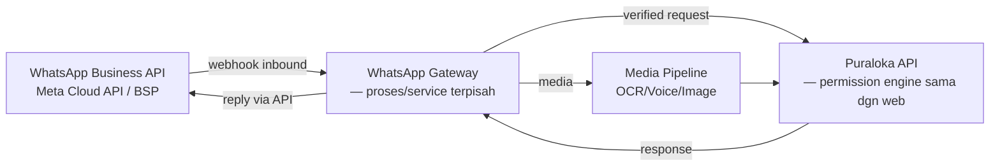
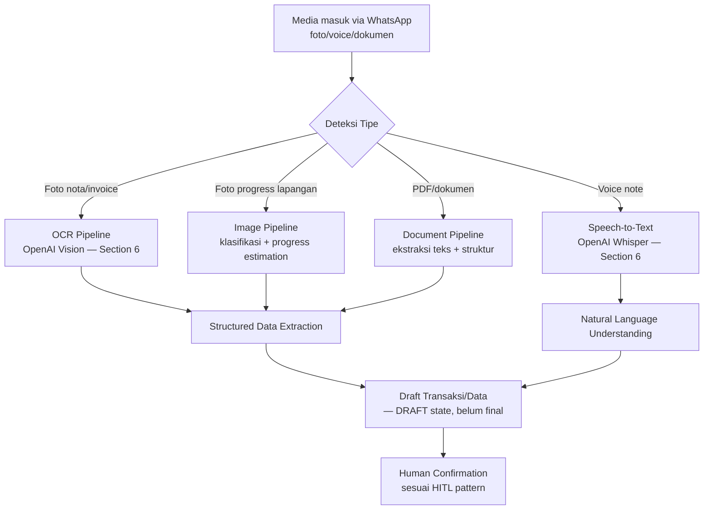
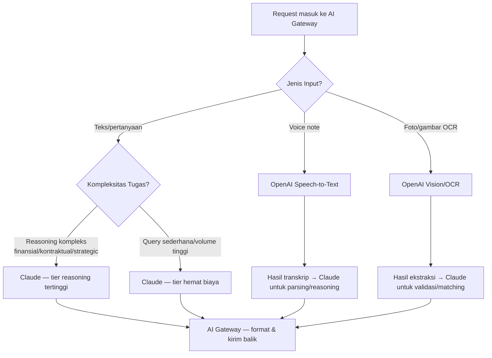

# 06 — Agentic AI & Automation Architecture

**Repository:** Puraloka Suite Architecture Repository
**Dokumen:** 7 dari 7 (lihat [00](00-vision-and-business-architecture.md), [01](01-application-and-data-architecture.md), [02](02-security-and-compliance-architecture.md), [03](03-platform-and-intelligence-architecture.md), [04](04-roadmap-governance-and-delivery.md), [05](05-design-system-and-ui-ux-architecture.md))
**Status:** Living document — katalog kapabilitas jangka panjang (5-10 tahun), bukan backlog implementasi langsung
**Kedudukan:** Setara pentingnya dengan Application Architecture ([01](01-application-and-data-architecture.md)), Security Architecture ([02](02-security-and-compliance-architecture.md)), Platform Architecture ([03](03-platform-and-intelligence-architecture.md)), dan Design System Architecture ([05](05-design-system-and-ui-ux-architecture.md)) — bukan lampiran sekunder.

---

## Cara Membaca Dokumen Ini — Prinsip Governing yang Tidak Bisa Ditawar

**Dokumen ini adalah katalog kapabilitas jangka panjang, BUKAN roadmap implementasi.** Keberadaan sebuah automation atau AI agent di katalog ini **tidak menyiratkan prioritas implementasi**. Prioritas implementasi tetap sepenuhnya diatur oleh [Phase 0-9 Transformation Program](04-roadmap-governance-and-delivery.md#phase-0-9-transformation-program) yang sudah disetujui — dokumen ini **tidak mengubah satu urutan fase pun** di roadmap yang ada.

Setiap automation dan setiap kapabilitas AI di dokumen ini didefinisikan dengan:
- **Current feasibility** — bisakah ini dibangun hari ini dengan fondasi yang ada?
- **Technical dependencies** — engine/sistem apa yang harus ada dulu?
- **Security dependencies** — kontrol keamanan apa yang harus matang dulu?
- **Required maturity level** — L1/L2/L3/L4 mana yang menjadi prasyarat?
- **Required implementation phase** — Phase berapa di [04](04-roadmap-governance-and-delivery.md#phase-0-9-transformation-program) yang menjadi gate?
- **Risk classification** — seberapa besar blast radius jika automation ini salah?
- **Klasifikasi Now/Next/Later/Optional** — sama seperti seluruh dokumen lain di repository ini.

**Realita jujur yang harus dinyatakan di depan:** Karena fondasi hari ini belum punya test suite, Permission Engine belum konsisten ([00](00-vision-and-business-architecture.md#arsitektur-auth--otorisasi-bercampur-bukan-murni-satu-pola)), dan **tidak ada WhatsApp Business API sama sekali** (hanya `wa.me` deep-link manual di beberapa halaman — diverifikasi langsung dari kode), **mayoritas mutlak dari katalog ini akan jatuh ke `Later`/`Optional`** dengan gate eksplisit ke Phase 6 (AI Native Platform) atau lebih jauh. Ini bukan pesimisme — ini kejujuran yang membuat dokumen ini *berguna* sebagai backlog jangka panjang, bukan daftar keinginan yang mengaburkan urutan kerja nyata.

## Assumptions & Non-Goals

- Dokumen ini **tidak mengubah** [Phase 0-9](04-roadmap-governance-and-delivery.md#phase-0-9-transformation-program) — automation apa pun di sini yang "kelihatan Now" (mis. financial recording) tetap tunduk ke gate keamanan/fondasi yang sudah ditetapkan.
- Non-goal eksplisit: memilih vendor WhatsApp Business API final (Meta Cloud API langsung vs. BSP pihak ketiga seperti Twilio/360dialog) — itu keputusan implementasi teknis saat Fase WhatsApp Gateway benar dimulai, bukan diputuskan di sini.
- Non-goal: mendesain prompt engineering detail per agent — itu domain implementasi, dokumen ini mendefinisikan *arsitektur* (tools, permission, escalation), bukan isi prompt.
- Asumsi jangka panjang ([00 — Assumptions](00-vision-and-business-architecture.md#assumptions)) berlaku penuh — tim kecil, tidak ada tenggat eksternal yang memaksa akselerasi.
- **Rekonsiliasi wajib dengan doc 03:** 8 AI agent yang sudah didefinisikan di [03 — AI Architecture](03-platform-and-intelligence-architecture.md#ai-architecture) **tidak diduplikasi** — mereka digabung ke dalam satu [Unified AI Agent Catalog](#section-4--unified-ai-agent-catalog) di dokumen ini. Doc 03 diperbarui untuk merujuk balik ke sini sebagai sumber kebenaran tunggal katalog agent (lihat penutup dokumen).

---

# SECTION 1 — Vision & Principles

## Visi: AI Native Construction Operating System dengan WhatsApp First Executive Copilot

> **Pemilik bisnis konstruksi harus bisa menjalankan perusahaannya lewat WhatsApp — bahasa natural, voice note, screenshot, foto, dan dokumen — tanpa perlu membuka dashboard ERP untuk keputusan operasional harian, kecuali dia memilih untuk itu.**

Yang terlihat pemilik hanyalah: **WhatsApp → Puraloka Assistant.** Di baliknya, sistem AI bertindak sebagai CFO, COO, Project Director, Procurement Manager, Contract Analyst, Executive Assistant, dan Business Intelligence Analyst — tapi pemilik tidak pernah perlu tahu (atau peduli) agent mana yang menjawab, model AI mana yang dipakai, atau engine automation apa yang berjalan di baliknya.

**Kenapa visi ini masuk akal untuk Puraloka Persada spesifik (bukan visi generik "AI akan mengubah segalanya"):** Pemilik kontraktor menengah Indonesia — termasuk profil yang sudah diverifikasi di [00 — Product Positioning](00-vision-and-business-architecture.md#product-positioning) — secara realistis **sudah** hidup di WhatsApp untuk komunikasi bisnis sehari-hari (koordinasi mandor, negosiasi supplier, approval informal). Memaksa mereka pindah ke dashboard web untuk setiap keputusan adalah gesekan (friction) yang tidak perlu. WhatsApp-first bukan gimmick — ini mengikuti perilaku yang sudah ada, bukan menciptakan perilaku baru.

### Prinsip 1 — AI Native ERP

**Definisi operasional (bukan slogan):** Setiap modul baru yang dibangun mulai [Phase 6](04-roadmap-governance-and-delivery.md#phase-6--ai-native-platform) ke atas didesain dengan pertanyaan *"bagaimana AI mengakses dan bertindak atas data ini?"* sebagai pertimbangan arsitektur setara dengan *"bagaimana manusia mengakses lewat UI?"* — bukan AI ditempelkan belakangan ke modul yang sudah selesai. Ini **tidak berarti** setiap modul harus punya fitur AI hari ini — ini berarti skema data dan API dirancang agar *bisa* diakses agent tanpa perombakan besar nanti (prinsip yang sudah organik diikuti sejak [01 — Application Architecture](01-application-and-data-architecture.md): API-first, bukan tightly-coupled ke UI).

### Prinsip 2 — WhatsApp First

**Definisi operasional:** WhatsApp adalah **permukaan interaksi setara** dengan dashboard web — bukan kanal sekunder/notifikasi-saja. Ini konsekuensi arsitektur nyata: setiap aksi yang bisa dilakukan lewat WhatsApp harus melalui **API dan permission engine yang sama** dengan dashboard web ([Dynamic Permission Engine](01-application-and-data-architecture.md#dynamic-permission-engine)) — WhatsApp Gateway adalah *client baru*, bukan jalur pintas yang membypass otorisasi.

**Batas tegas:** WhatsApp-first tidak berarti dashboard web ditinggalkan. [Module Catalog](00-vision-and-business-architecture.md#module-catalog--tiering) tetap dibangun sesuai tiering yang sudah ada — WhatsApp adalah **permukaan tambahan** ke kapabilitas yang sama, terutama untuk keputusan cepat/harian, sementara pekerjaan mendalam (RAB detail, Gantt chart, procurement 8-tab) tetap paling masuk akal di layar besar ([05 — Mobile Strategy](05-design-system-and-ui-ux-architecture.md#mobile-strategy) prinsip yang sama: setiap permukaan punya tujuan berbeda, bukan replikasi paksa).

### Prinsip 3 — Human Approval Boundaries

**Aturan tidak bisa ditawar, mewarisi penuh dari [03 — Prinsip Guardrail Lintas-Agent](03-platform-and-intelligence-architecture.md#prinsip-guardrail-lintas-agent) poin 2 ("No silent write"):**

Setiap automation yang **mengubah data finansial, kontraktual, atau status resmi** berhenti di titik approval manusia — **tanpa kecuali**, terlepas seberapa kecil nilainya atau seberapa "jelas" AI merasa yakin. Perbedaan level automation (lihat [Automation Type](#execution-trigger--automation-type-taksonomi) di bawah) bukan soal *apakah* approval dibutuhkan, tapi *seberapa cepat dan seberapa banyak konteks* approval itu diminta.

### Prinsip 4 — Automation Safety Rules

1. **Spending limit per agent, per automation, per approval tier** — tidak ada agent yang punya wewenang finansial tak terbatas, bahkan dengan approval manusia (mencegah manusia meng-approve secara reflexive tanpa membaca).
2. **Rate limiting pada aksi otonom** — agent tidak boleh mengeksekusi N aksi berturut-turut tanpa checkpoint manusia, mencegah automation "lari" karena bug/prompt injection ([Section 8](#section-8--security--governance)).
3. **Reversibilitas sebagai syarat desain** — automation yang tidak bisa di-rollback (lihat [Rollback Strategy](#rollback-strategy)) mendapat approval requirement lebih ketat daripada yang reversibel, terlepas dari nilai finansialnya.
4. **Degradasi anggun (graceful degradation)** — jika AI Gateway/model provider down, sistem **tidak** diam-diam gagal; WhatsApp Assistant memberi tahu pemilik secara eksplisit "sedang gangguan, hubungi admin" — never silent failure ([05 — UX Principle #5](05-design-system-and-ui-ux-architecture.md#2-ux-principles): status sistem selalu terlihat).

### Prinsip 5 — Human In The Loop (HITL) Design

Tiga pola HITL, dipakai sesuai risk classification automation ([lihat taksonomi](#execution-trigger--automation-type-taksonomi)):

| Pola HITL | Kapan Dipakai | Contoh |
|---|---|---|
| **Human-in-command** (AI hanya mengusulkan, manusia inisiasi) | Aksi finansial/kontraktual bernilai tinggi | Purchase Recommendation Engine mengusulkan, manusia yang memutuskan beli |
| **Human-on-the-loop** (AI eksekusi otomatis, manusia bisa intervensi/override) | Aksi reversibel, nilai rendah, volume tinggi | Auto Bank Reconciliation — jalan otomatis, manusia review exception saja |
| **Human-after-the-loop** (AI eksekusi, manusia review post-hoc via audit) | Aksi read-only/analitik murni, tidak ada risiko data | Daily Executive Briefing — AI menyusun ringkasan, tidak ada aksi yang perlu di-approve |

**Prinsip pemilihan pola:** Ditentukan oleh **risk classification** automation (finansial/kontraktual/reputasional), bukan oleh preferensi kecepatan. Automation yang "terasa aman" tapi berdampak finansial tetap human-in-command sampai ada rekam jejak kepercayaan panjang — konsisten dengan [03](03-platform-and-intelligence-architecture.md#prinsip-guardrail-lintas-agent) yang menyatakan ini "keputusan desain permanen," bukan sementara.

### Prinsip 6 — Explainability Requirements

Mewarisi penuh [03 — AI Interaction Patterns](05-design-system-and-ui-ux-architecture.md#ai-interaction-patterns) prinsip #2 ("AI selalu menunjukkan sumber sarannya"), diperluas untuk konteks WhatsApp:

1. **Setiap jawaban finansial/analitik mencantumkan sumber data** — "Berdasarkan 12 invoice bulan ini..." bukan angka tanpa konteks.
2. **Setiap automation otonom (human-on-the-loop) punya jejak audit yang bisa dijelaskan dalam bahasa natural** — bukan hanya JSON diff teknis di `audit_logs`, tapi ringkasan yang bisa dibaca pemilik lewat WhatsApp: "Sistem mencocokkan transfer masuk Rp15.000.000 dengan invoice INV-045 karena nominal dan tanggal cocok persis."
3. **AI tidak pernah mengarang jawaban saat tidak yakin** — eksplisit menyatakan keterbatasan ("Saya tidak punya cukup data untuk menjawab ini dengan yakin") alih-alih memberi jawaban percaya diri yang salah — prinsip yang sama dengan [05 — AI Assistant UX](05-design-system-and-ui-ux-architecture.md#ai-assistant-ux).

---

# SECTION 2 — Automation Platform Architecture

## Hubungan dengan Doc 03 Automation Platform

[03 — Automation Platform & Event Platform](03-platform-and-intelligence-architecture.md#automation-platform--event-platform) sudah mendefinisikan **prinsip** (Trigger Engine, Event Engine in-process dulu, `pg-boss` sebelum RabbitMQ/Kafka, posisi n8n/Temporal). Section ini **memperdalam** arsitektur itu khusus untuk kebutuhan agentic AI + WhatsApp, mengikuti prinsip yang sama (mulai dari primitif paling sederhana yang cukup, naik tier hanya dengan bukti kebutuhan nyata) — **tidak membalik** keputusan doc 03.

## n8n Architecture

**Posisi n8n** (sesuai [03](03-platform-and-intelligence-architecture.md#automation-platform--event-platform)): kandidat *Optional, kapan pun* untuk automasi ad-hoc non-kritis — ini **tetap berlaku**, TAPI untuk automation catalog di dokumen ini, n8n mendapat peran lebih spesifik:

**Target arsitektur — n8n sebagai orchestration layer untuk automation Level 5-8 (Document, HR, Sales, Executive Copilot) yang sifatnya lower-stakes dan butuh iterasi cepat**, sementara automation Level 1-4 (Finance, Project, Procurement — data finansial/operasional kritis) **tetap diimplementasikan sebagai kode aplikasi first-class** (route handler + service layer, [01 — Modular Monolith Strategy](01-application-and-data-architecture.md#modular-monolith-strategy)), bukan workflow n8n.

**Rationale pembagian ini:** n8n sangat baik untuk *glue logic* (hubungkan API A ke API B, transformasi data sederhana) tapi buruk untuk *business logic kompleks dengan banyak edge case* (kalkulasi EVM, validasi approval multi-tingkat) — yang terakhir butuh test suite, type safety, dan code review yang n8n workflow (visual, JSON-based) tidak secara natural mendukung sebaik kode TypeScript. Menaruh logic finansial-kritis di n8n adalah anti-pattern yang harus dihindari — konsisten dengan [02 — Engineering Standards](04-roadmap-governance-and-delivery.md#engineering-standards) yang mensyaratkan test coverage untuk business logic kritis.

**Now/Next/Later:** **Later/Optional** — n8n **tidak dibutuhkan** sampai automation Level 5+ benar mulai diimplementasikan (Phase 3+ di [Section 7](#section-7--implementation-roadmap)). Memasang n8n hari ini tanpa automation yang jalan di atasnya adalah infrastruktur tanpa pemakai.

## Workflow Engine

**Tidak ada engine baru** — ini **adalah** [Dynamic Workflow & Approval Engine](01-application-and-data-architecture.md#dynamic-workflow--approval-engine) yang sudah didesain di doc 01 (`workflow_definitions`/`states`/`transitions`), diperluas untuk menangani **transisi yang dipicu AI**, bukan hanya manusia. Perbedaan teknis satu-satunya: kolom `triggered_by` pada `workflow_transitions` history menyimpan `user_id` ATAU `agent_id` — audit trail yang sama, sumber pemicu yang eksplisit dibedakan.

**Dependency langsung:** Setiap automation di [Section 5](#section-5--automation-catalog) yang melibatkan status transition (approval, procurement, dsb.) **secara struktural bergantung** pada Workflow Engine ini matang dulu — inilah kenapa mayoritas automation Level 2-4 punya **Phase Dependency: Phase 2** minimum.

## Event Bus & Event Store

**Current State:** Tidak ada — mengikuti [03](03-platform-and-intelligence-architecture.md#automation-platform--event-platform), event emitter in-process direncanakan untuk Phase 5.

**Perluasan untuk kebutuhan AI/WhatsApp:** Event yang dipancarkan (`kasbon.approved`, `progress.updated`, dst.) menjadi **trigger alami** untuk automation reaktif ([Automation Type: Reactive](#execution-trigger--automation-type-taksonomi)) — mis. `invoice.overdue` men-trigger Vendor Payment Reminder tanpa polling manual.

**Event Store (baru, belum dibahas doc 03):** Untuk automation **Predictive** (Delay Prediction, Cashflow Prediction, Margin Leakage Detection), event history perlu **disimpan terstruktur untuk training/analisis pola** — bukan hanya dipancarkan dan hilang seperti pub/sub murni. `audit_logs` yang sudah matang ([02](02-security-and-compliance-architecture.md#audit-logging--tamper-proof-logging)) **sebagian** memenuhi ini (diff historis tersimpan), tapi Event Store untuk AI butuh struktur tambahan (event type, timestamp, entity reference, outcome — format yang lebih mudah di-query untuk feature engineering ML/pattern-matching dibanding diff JSON audit).

**Now/Next/Later:** Event Bus in-process = **Later**, mengikuti [03](03-platform-and-intelligence-architecture.md#automation-platform--event-platform) Phase 5. Event Store terstruktur untuk AI = **Optional**, hanya dibutuhkan saat automation Predictive (Level 2-3) benar mulai dibangun (Phase 3 di [Section 7](#section-7--implementation-roadmap)) — jangan dibangun mendahului kebutuhannya.

## Queue Strategy, Retry Strategy, Dead Letter Queue, Idempotency Strategy

Keempatnya dibahas bersama karena membentuk satu unit keandalan (reliability) yang saling bergantung — relevan **khusus** untuk automation yang melibatkan panggilan AI model (latency tidak terduga) dan WhatsApp API (rate limit eksternal).

**Queue Strategy:** Mewarisi [03 — Queue Architecture](03-platform-and-intelligence-architecture.md#queue-architecture) — `pg-boss` (berbasis Postgres) sebagai starting point, bukan RabbitMQ/Kafka langsung. Untuk beban AI Gateway (panggilan LLM eksternal dengan latency tidak terduga), ini **justru kandidat utama** yang sudah diidentifikasi doc 03 sebagai alasan queue dibutuhkan.

**Retry Strategy:** Exponential backoff untuk panggilan AI model/WhatsApp API yang gagal (network blip, rate limit sementara) — **maksimum 3 percobaan**, setelah itu masuk Dead Letter Queue. Retry **tidak pernah** diterapkan untuk aksi yang mengubah data finansial tanpa idempotency key (lihat di bawah) — retry pada operasi non-idempotent bisa menyebabkan duplikasi (mis. mencatat transfer masuk dua kali).

**Dead Letter Queue (DLQ):** Automation yang gagal setelah retry maksimum **tidak hilang diam-diam** — masuk DLQ yang memicu notifikasi ke admin ("Automation X gagal diproses untuk item Y, butuh review manual") — konsisten dengan [Prinsip 4 — Automation Safety Rules](#prinsip-4--automation-safety-rules) poin 4 (tidak ada silent failure).

**Idempotency Strategy — kritis untuk automation finansial:** Setiap automation yang mengubah data finansial (Financial Recording via WhatsApp, Auto Bank Reconciliation) **wajib** memakai idempotency key (mis. hash dari pesan WhatsApp + timestamp) — mencegah pesan yang di-retry (karena network gagal di tengah, atau pengguna mengirim ulang voice note yang sama) tercatat dua kali. Ini **prasyarat keras**, bukan nice-to-have — tanpa ini, "WhatsApp Financial Input" (automation paling awal di roadmap) punya risiko duplikasi transaksi yang nyata.

**Now/Next/Later:** Seluruhnya **Later**, terikat ke Phase 1-2 (fondasi) selesai dulu — tapi **idempotency strategy untuk financial automation** dicatat sebagai **prasyarat keras Phase gate**, bukan detail implementasi yang bisa ditunda sampai menit terakhir.

## Webhook Architecture & Integration Layer

**Webhook masuk (inbound):** WhatsApp Business API mengirim webhook ke Puraloka Suite untuk setiap pesan masuk — ini **satu-satunya** cara WhatsApp Gateway bekerja (bukan polling). Endpoint webhook ini **harus** diverifikasi signature (mencegah spoofing pesan WhatsApp palsu — lihat [Section 8 — Prompt Injection Defense](#section-8--security--governance)).

**Webhook keluar (outbound):** Mengikuti [03 — Webhook Architecture](03-platform-and-intelligence-architecture.md#automation-platform--event-platform) — **tidak dibangun sebelum ada kebutuhan integrasi nyata**, kecuali WhatsApp sendiri (yang menjadi pengecualian karena WhatsApp-first adalah visi inti dokumen ini, bukan integrasi generik).

**Integration Layer:** Titik integrasi eksternal bertambah signifikan dengan visi ini — WhatsApp Business API, AI model provider (OpenAI, Anthropic — [Section 6](#section-6--ai-model-strategy)), OCR service. Setiap integrasi eksternal mengikuti prinsip yang sama dari [02 — Secrets Management](02-security-and-compliance-architecture.md#secrets-management): kredensial di environment variable terkelola, tidak pernah hardcoded.

## AI Gateway

**Definisi:** Lapisan abstraksi tunggal di antara seluruh agent/automation dan AI model provider eksternal (OpenAI, Anthropic) — **tidak ada kode aplikasi yang memanggil OpenAI/Anthropic API langsung**, semua lewat AI Gateway.

**Tanggung jawab AI Gateway:**
1. **Model Router** (lihat di bawah) — memilih model yang tepat per jenis tugas.
2. **Rate limiting & cost tracking per agent** — mencegah satu agent (atau bug) menghabiskan budget API tak terkendali.
3. **Prompt Management** (lihat di bawah) — versioning prompt terpusat, bukan hardcoded string tersebar di banyak file.
4. **Response validation** — memastikan output model sesuai skema yang diharapkan sebelum diteruskan ke Tool Calling Framework (mencegah AI "berhalusinasi" format yang merusak downstream logic).
5. **Fallback provider** — jika provider utama down, AI Gateway bisa failover ke provider sekunder untuk kapabilitas yang tumpang tindih (lihat [Section 6](#section-6--ai-model-strategy) hybrid routing) — ini yang membuat *"user tidak pernah tahu model mana yang dipakai"* menjadi mungkin secara teknis.

**Rationale arsitektur ini (kenapa satu gateway, bukan panggilan tersebar):** Tanpa AI Gateway terpusat, setiap automation baru yang butuh AI akan reimplementasi rate limiting/cost tracking/error handling sendiri-sendiri — duplikasi yang mahal dipelihara, persis pola yang sudah dihindari di [01 — Dynamic Workflow Engine](01-application-and-data-architecture.md#dynamic-workflow--approval-engine) (satu engine generik, bukan reimplementasi per modul).

**Now/Next/Later:** **Later**, prasyarat keras sebelum **agent pertama apa pun** (termasuk AI Assistant yang sudah `Next` di doc 03) benar dibangun — AI Gateway adalah fondasi infrastruktur di bawah [03 — AI Agent Registry](03-platform-and-intelligence-architecture.md#ai-agent-registry--desain-setiap-agent), bukan agent tambahan.

## Model Router

**Fungsi:** Bagian dari AI Gateway yang secara otomatis memilih model (OpenAI vs Claude, atau model spesifik dalam satu provider) berdasarkan **jenis tugas**, bukan hardcoded per agent. Detail strategi routing lengkap ada di [Section 6 — AI Model Strategy](#section-6--ai-model-strategy) — bagian ini mendefinisikan *bahwa* router ada sebagai komponen arsitektur, Section 6 mendefinisikan *aturan* routingnya.

**Prinsip kunci:** Model Router membuat penambahan/penggantian model provider di masa depan menjadi **perubahan konfigurasi, bukan perubahan kode** — selaras filosofi config-driven yang mengikat seluruh repository ini ([00 — Non-Negotiable Principles](00-vision-and-business-architecture.md), mewarisi prinsip yang sama dari brief awal seluruh proyek transformasi ini).

## Prompt Management

**Target:** Prompt per agent/automation disimpan sebagai **data versioned** (tabel `ai_prompts` dengan `agent_id`, `version`, `template`, `is_active`), bukan string hardcoded di kode aplikasi — memungkinkan iterasi prompt tanpa deploy, dan **rollback prompt** jika versi baru menghasilkan output buruk (terhubung ke [Rollback Strategy](#rollback-strategy) di Section 8).

**Now/Next/Later:** **Later**, dibangun bersamaan dengan AI Gateway — prompt management terpisah dari kode adalah prasyarat untuk iterasi cepat begitu agent pertama live, bukan sesuatu yang ditambahkan belakangan setelah prompt sudah tersebar hardcoded (debt yang mahal diperbaiki retroaktif, pola sama seperti [05 — i18n technical debt](05-design-system-and-ui-ux-architecture.md#52-internationalization-strategy--53-localization-strategy)).

## Tool Calling Framework

**Definisi:** Lapisan yang menghubungkan `ai_agent_tools` ([03 — AI Agent Registry](03-platform-and-intelligence-architecture.md#ai-agent-registry--desain-setiap-agent)) ke **implementasi nyata** — setiap "tool" yang bisa dipanggil agent (`query_kurva_s`, `draft_purchase_request`) adalah fungsi TypeScript terdaftar dengan skema input/output eksplisit (JSON Schema), dipanggil lewat mekanisme tool-calling native model (function calling OpenAI/Claude).

**Prinsip keamanan kritis:** Tool yang terdaftar untuk satu agent **tidak otomatis tersedia** untuk agent lain — daftar tool per agent eksplisit di `ai_agent_tools`, dan **setiap tool call divalidasi ulang terhadap permission engine** ([Dynamic Permission Engine](01-application-and-data-architecture.md#dynamic-permission-engine)) saat dieksekusi, bukan hanya saat didaftarkan — mencegah tool call yang seharusnya diblokir lolos karena prompt injection membujuk agent memanggil tool di luar konteks yang dimaksud ([Section 8](#section-8--security--governance)).

**Now/Next/Later:** **Later**, komponen inti AI Gateway — tidak berdiri sendiri.

---

# SECTION 3 — WhatsApp Platform Architecture

## Current State

**Terverifikasi langsung dari kode:** Tidak ada WhatsApp Business API, webhook, atau bot conversational apa pun hari ini. Satu-satunya integrasi WhatsApp adalah **`wa.me` deep-link** (buka chat manual di 6+ halaman: klien, mandor, procurement PO, portal). Ini adalah **starting point nol** untuk seluruh Section 3 — tidak ada yang bisa "diperluas," semuanya dibangun baru.

## WhatsApp Gateway

**Arsitektur target:**

**Keputusan arsitektur kunci:** WhatsApp Gateway adalah **client**, bukan sistem terpisah dengan akses data sendiri — setiap request yang masuk lewat WhatsApp diterjemahkan menjadi panggilan ke **API yang sama** yang dipakai dashboard web ([01](01-application-and-data-architecture.md), 159 endpoint existing + endpoint baru untuk kebutuhan agent). Ini menghindari duplikasi logic otorisasi/bisnis antara "jalur web" dan "jalur WhatsApp" — satu sumber kebenaran.

**Kandidat teknis (bukan keputusan final, dicatat untuk konteks):** Meta WhatsApp Cloud API (langsung) vs. Business Solution Provider seperti Twilio/360dialog (lebih mudah setup, biaya per-pesan lebih tinggi). Keputusan ini ditunda ke saat implementasi ([Non-Goals](#assumptions--non-goals)).

**Now/Next/Later:** **Later**, gate ke Phase 6 minimum — prasyarat: AI Gateway, Permission Engine konsisten (Phase 1), Workflow Engine (Phase 2).

## Session Management

**Kebutuhan:** Percakapan WhatsApp bersifat *stateful* dalam jangka pendek (pemilik bertanya "berapa kasbon Budi?" lalu follow-up "approve saja") — Session Management menyimpan **konteks percakapan** (agent mana yang aktif, entity yang sedang dibahas) dengan **retensi pendek** (mis. 30 menit tidak aktif = sesi reset), mengikuti pola [03 — AI Assistant memory](03-platform-and-intelligence-architecture.md#ai-agent-registry--desain-setiap-agent) ("konteks percakapan per sesi, tidak persisten lintas sesi kecuali diminta").

**Now/Next/Later:** **Later**, komponen inti WhatsApp Gateway.

## Identity Verification & Device Trust

**Ini adalah titik keamanan paling kritis di seluruh Section 3** — WhatsApp secara native hanya mengenali nomor telepon, bukan identitas pengguna Puraloka Suite. Tanpa verifikasi identitas yang kuat, **siapa pun yang menguasai SIM card pemilik bisa memerintahkan sistem finansial** — risiko yang jauh melebihi kompromise password web biasa (SIM swap adalah vektor serangan nyata dan terdokumentasi luas di industri).

**Target arsitektur:**
1. **Registrasi nomor WhatsApp ke akun eksplisit** — satu nomor WhatsApp terhubung ke satu `user_id`, didaftarkan lewat dashboard web (bukan self-service lewat WhatsApp itu sendiri — mencegah social engineering pendaftaran nomor palsu).
2. **Device Trust tambahan untuk aksi bernilai tinggi** — automation dengan spending limit di atas ambang tertentu ([Section 8 — Approval Limits](#section-8--security--governance)) meminta **konfirmasi kedua** (kode OTP terpisah, atau konfirmasi via dashboard web) — bukan cukup "ya" di WhatsApp untuk aksi finansial besar.
3. **Role Mapping** — permission WhatsApp Assistant untuk satu nomor **identik** dengan permission user tsb di dashboard web (mengikuti [Dynamic Permission Engine](01-application-and-data-architecture.md#dynamic-permission-engine) yang sama) — pemilik (`admin`) punya wewenang penuh, PM yang juga pakai WhatsApp Assistant hanya melihat scope proyeknya.

**Now/Next/Later:** **Later**, prasyarat keamanan keras — **tidak boleh** diimplementasikan sebagai "MVP sederhana tanpa verifikasi kuat" bahkan untuk pilot internal, karena precedent keamanan yang lemah di awal sulit diperbaiki setelah pengguna terbiasa.

## Approval Flows (via WhatsApp)

**Pola:** Notifikasi approval (kasbon, invoice, PO) dikirim ke WhatsApp dengan **quick-reply button** (Ya/Tidak/Lihat Detail) — mengikuti pola [Notification UX](05-design-system-and-ui-ux-architecture.md#notification-ux) yang sudah didesain untuk in-app, diperluas ke WhatsApp sebagai kanal tambahan, bukan pengganti.

**Batas approval limit tetap berlaku identik** — approval via WhatsApp untuk nilai di atas ambang tertentu tetap membutuhkan [Device Trust](#identity-verification--device-trust) tambahan, tidak ada jalur pintas "karena WhatsApp lebih santai."

**Now/Next/Later:** **Later**, dibangun setelah [Unified Approval Inbox](05-design-system-and-ui-ux-architecture.md#approval-ux) versi web sudah matang — approval WhatsApp adalah *permukaan tambahan* ke sistem approval yang sama, bukan sistem approval kedua.

## Media Handling, Voice Note Handling, OCR Pipeline, Image Pipeline, Document Pipeline

Kelima ini dibahas bersama sebagai satu **Media Processing Pipeline** — perbedaannya adalah *jenis input*, arsitekturnya seragam:

**Prinsip arsitektur yang sama untuk kelima pipeline:** Output pipeline **selalu berupa draft**, tidak pernah langsung commit ke data final — konsisten dengan [Prinsip 3 — Human Approval Boundaries](#prinsip-3--human-approval-boundaries). OCR yang salah membaca angka nominal transfer, atau voice-to-text yang salah transkripsi jumlah, adalah risiko nyata (bukan hipotetis) — draft state adalah safety net wajib, bukan pilihan UX.

**OCR Pipeline (nota, invoice, bukti transfer):** Ekstraksi nominal, tanggal, nama pengirim/penerima → dicocokkan dengan kandidat transaksi yang sudah ada (proyek aktif, invoice outstanding) → **diusulkan** ke pengguna untuk konfirmasi, bukan otomatis tercatat.

**Image Pipeline (foto progress lapangan):** Berbeda dari OCR — ini **klasifikasi visual** (jenis pekerjaan terlihat, estimasi kondisi) yang menjadi *input* untuk automation "Progress From Photo" ([Section 5 Level 3](#level-3--project-automation)) — bukan ekstraksi teks.

**Document Pipeline (kontrak, dokumen panjang):** Ekstraksi struktur (klausul, tanggal, nilai kontrak) untuk AI Contract Analyst — detail responsibility ada di [Section 4](#section-4--unified-ai-agent-catalog).

**Now/Next/Later:** OCR + Voice = **Later**, gate Phase 1 di [Section 7](#section-7--implementation-roadmap) sebagai automation paling awal dalam visi WhatsApp-first (meski tetap gated fondasi keamanan). Image Pipeline & Document Pipeline = **Later**, gate Phase 2-3 (butuh volume data lebih matang untuk akurasi klasifikasi yang bisa diandalkan).

---

# SECTION 4 — Unified AI Agent Catalog

## Rekonsiliasi dengan Doc 03

[03 — AI Architecture](03-platform-and-intelligence-architecture.md#delapan-agent--spesifikasi-toolsmemorypermissionguardrail) mendefinisikan 8 agent. Brief dokumen ini meminta 12 agent tambahan/revisi. Setelah dicocokkan, ada **overlap nyata** yang tidak boleh diduplikasi jadi dua entri terpisah:

| Agent Diminta (Doc 06) | Overlap dengan Doc 03? | Resolusi |
|---|---|---|
| AI CFO | Ya — identik nama | **Digabung** — 1 entri, diperluas cakupan |
| AI COO | Tidak ada di Doc 03 | **Baru** |
| AI Project Director | Overlap konsep dengan "AI Project Manager" | **Digabung & di-rename** ke AI Project Director (cakupan lebih luas dari sekadar 1 proyek) |
| AI Procurement Manager | Overlap dengan "AI Procurement Officer" | **Digabung & di-rename** |
| AI Scheduler | Ya — identik nama | **Digabung** — 1 entri, tidak berubah signifikan |
| AI Contract Analyst | Ya — identik nama | **Digabung** — 1 entri, diperluas cakupan |
| AI Finance Controller | Tidak ada — **beda dari AI CFO** (CFO = strategis, Controller = operasional/kepatuhan) | **Baru** |
| AI Risk Officer | Tidak ada di Doc 03 | **Baru** |
| AI Executive Assistant | Overlap dengan "AI Assistant" (general) | **Digabung & di-rename** — cakupan diperluas ke WhatsApp-first |
| AI Document Analyst | Sebagian overlap dengan AI Contract Analyst tapi lebih luas (bukan cuma kontrak) | **Baru**, dibedakan eksplisit dari Contract Analyst |
| AI CRM Assistant | Tidak ada — terkait [CRM module](00-vision-and-business-architecture.md#domain-sales--pre-construction-supporting--belum-ada-sama-sekali) yang sendiri `Later` | **Baru** |
| AI Tender Analyst | Tidak ada — terkait [Tender Management](00-vision-and-business-architecture.md#domain-sales--pre-construction-supporting--belum-ada-sama-sekali) yang sendiri `Later` | **Baru** |
| *(AI Estimator — dari Doc 03, tidak diminta ulang di brief 06)* | — | **Dipertahankan** dari Doc 03, masuk katalog terpadu ini |
| *(AI Auditor — dari Doc 03, tidak diminta ulang di brief 06)* | — | **Dipertahankan** dari Doc 03, masuk katalog terpadu ini |

**Hasil: 14 agent dalam satu katalog terpadu** (bukan 8 + 12 = 20 yang saling tumpang tindih membingungkan). Ini **menggantikan** tabel 8-agent di [03](03-platform-and-intelligence-architecture.md#delapan-agent--spesifikasi-toolsmemorypermissionguardrail) sebagai sumber kebenaran — doc 03 diperbarui untuk merujuk ke sini (lihat penutup dokumen ini).

## Prinsip yang Diwarisi Penuh (Tidak Berubah)

Seluruh 14 agent di bawah tunduk pada [03 — Prinsip Desain](03-platform-and-intelligence-architecture.md#prinsip-desain) dan [Prinsip Guardrail Lintas-Agent](03-platform-and-intelligence-architecture.md#prinsip-guardrail-lintas-agent) tanpa pengecualian: agent adalah *pengguna sistem dengan kredensial terbatas*, tunduk RBAC/PBAC yang sama dengan manusia, least privilege default, no silent write, audit setiap panggilan, tenant/company isolation identik manusia. Kolom **Escalation Rules** dan **Approval Limits** di bawah adalah **perluasan konkret** dari prinsip "no silent write" — mendefinisikan *persisnya* kapan dan ke siapa eskalasi terjadi.

## Katalog 14 Agent

### AI CFO (diperluas dari Doc 03)

| Atribut | Detail |
|---|---|
| **Objectives** | Analisis kesehatan finansial perusahaan (bukan per-proyek) — cashflow, margin, profitabilitas lintas proyek; menjawab pertanyaan strategis pemilik ("apakah kita untung bulan ini?") |
| **Tools** | Query Kurva-S/EVM lintas proyek, cash summary, invoice aging, kalkulasi margin (butuh [Budget vs Actual Cost Control](00-vision-and-business-architecture.md#domain-finance--compliance-supporting) — modul baru dari gap analysis Module Catalog) |
| **Permissions** | `finance:view`, `kurva-s:view`, `reports:view` lintas proyek dalam company — **tidak pernah** `finance:approve`/`cash:transfer` |
| **Escalation Rules** | Analisis anomali margin >15% dari baseline → eskalasi ke pemilik dengan flag "perlu perhatian," tidak mengambil tindakan |
| **Approval Limits** | N/A — read-only/analitik murni, tidak ada aksi yang butuh limit finansial |
| **Memory Scope** | Ringkasan tren historis teragregasi (bulanan/kuartalan), tidak menyimpan transaksi mentah |
| **Context Scope** | Seluruh company (bukan per-proyek) — level tertinggi di antara semua agent finansial |

### AI COO (baru)

| Atribut | Detail |
|---|---|
| **Objectives** | Kesehatan operasional lintas proyek — utilisasi mandor, status procurement, bottleneck operasional; melengkapi CFO (finansial) dengan lensa operasional |
| **Tools** | Query status seluruh proyek aktif, utilisasi mandor/alat, status procurement pending, ringkasan HSE/QC jika modul tsb ada ([Module Catalog Tier 2](00-vision-and-business-architecture.md#module-catalog--tiering)) |
| **Permissions** | `projects:view`, `mandor:view`, `procurement:view` lintas proyek dalam company |
| **Escalation Rules** | Proyek dengan status "berisiko" (kombinasi delay + budget overrun) → eskalasi prioritas tinggi ke pemilik |
| **Approval Limits** | N/A — read-only/analitik |
| **Memory Scope** | Snapshot operasional harian/mingguan, retensi menengah (untuk tren) |
| **Context Scope** | Seluruh company, lintas-domain (project + procurement + labor) |

### AI Project Director (gabungan AI Project Manager + cakupan diperluas)

| Atribut | Detail |
|---|---|
| **Objectives** | Sama seperti AI Project Manager (Doc 03) — analisis progress/milestone/RAB per proyek — **diperluas** ke perbandingan lintas-proyek (portfolio-level, terkait [Capital Planning](00-vision-and-business-architecture.md#domain-capital-planning--program-management-core-untuk-unifier-class--domain-baru-hilang-sepenuhnya)) |
| **Tools** | Query progress, milestone, RAB status (Doc 03, dipertahankan) + portfolio rollup |
| **Permissions** | `projects:view`, `milestones:view` per `company_id` user (Doc 03, tidak berubah) |
| **Escalation Rules** | Milestone terlewat >7 hari tanpa update progress → eskalasi ke PM + admin |
| **Approval Limits** | N/A — rekomendasi jadwal/risiko, tidak mengubah `progress_logs` langsung (mewarisi guardrail Doc 03 persis) |
| **Memory Scope** | Konteks per-proyek, retensi selama proyek aktif (Doc 03, tidak berubah) |
| **Context Scope** | Per-proyek (default) + lintas-proyek untuk pertanyaan portfolio (perluasan) |

### AI Procurement Manager (gabungan AI Procurement Officer + cakupan diperluas)

| Atribut | Detail |
|---|---|
| **Objectives** | Sama seperti AI Procurement Officer (Doc 03) — stock level, reorder, draft MR — **diperluas** ke rekomendasi pembelian lintas-supplier (terkait [Purchase Recommendation Engine](#level-4--procurement-automation)) |
| **Tools** | Query stock, reorder alert, supplier lead time (Doc 03) + perbandingan harga historis antar supplier |
| **Permissions** | `procurement:view` (Doc 03, tidak berubah) |
| **Escalation Rules** | Stok kritis (<20% `min_stock`) tanpa MR aktif → eskalasi prioritas tinggi ke PM/admin |
| **Approval Limits** | Bisa draft MR otomatis (Doc 03), **tidak pernah** submit/approve — draft menunggu manusia (guardrail identik Doc 03) |
| **Memory Scope** | Riwayat pola pembelian agregat (Doc 03, tidak berubah) |
| **Context Scope** | Per-proyek + lintas-proyek untuk perbandingan supplier |

### AI Scheduler (dipertahankan dari Doc 03, tidak berubah)

| Atribut | Detail |
|---|---|
| **Objectives** | Analisis Gantt, dependency, resource conflict — identik Doc 03 |
| **Tools** | Query Gantt, dependency, resource conflict |
| **Permissions** | `projects:view`, akses baca `rab_items.gantt_*` |
| **Escalation Rules** | Dependency conflict severity "KRITIS" (>14 hari overlap, sesuai [threshold existing di Gantt](../../../../CLAUDE.md)) → eskalasi ke PM |
| **Approval Limits** | Bisa usulkan perubahan `planned_start/end`, tidak bisa commit tanpa approval PM (guardrail identik Doc 03, selaras prinsip soft-dependency Gantt yang sudah ada) |
| **Memory Scope** | Konteks per-proyek |
| **Context Scope** | Per-proyek |

### AI Contract Analyst (diperluas dari Doc 03)

| Atribut | Detail |
|---|---|
| **Objectives** | Sama seperti Doc 03 — ekstraksi klausul, analisis kontrak — **diperluas** ke perbandingan kontrak dengan template standar/kontrak historis untuk deteksi klausul tidak wajar |
| **Tools** | Baca dokumen kontrak, ekstraksi klausul (Doc 03) + [Document Pipeline](#media-handling-voice-note-handling-ocr-pipeline-image-pipeline-document-pipeline) untuk kontrak discan |
| **Permissions** | `documents:view` kategori kontrak (Doc 03, tidak berubah) |
| **Escalation Rules** | Klausul yang menyimpang signifikan dari pola kontrak historis perusahaan → flag untuk review legal/pemilik |
| **Approval Limits** | Tidak pernah generate kontrak final tanpa review manusia (guardrail identik Doc 03) |
| **Memory Scope** | Tidak menyimpan isi kontrak di luar sesi analisis (Doc 03, tidak berubah — sensitivitas tinggi) |
| **Context Scope** | Per-dokumen/per-proyek |

### AI Finance Controller (baru — beda dari AI CFO)

| Atribut | Detail |
|---|---|
| **Objectives** | **Kepatuhan dan akurasi pencatatan** (bukan strategi seperti CFO) — validasi transaksi masuk sesuai kategori benar, deteksi entry ganda, kepatuhan pajak dasar (PPh final/PPN) |
| **Tools** | Query transaksi harian, validasi kategori expense, cross-check duplikasi (terkait [Auto Bank Reconciliation](#level-2--finance-automation)) |
| **Permissions** | `finance:view`, `cash:view` — **tidak pernah** `finance:approve` |
| **Escalation Rules** | Transaksi dengan kategori tidak jelas atau duplikasi terdeteksi → eskalasi ke admin untuk verifikasi manual |
| **Approval Limits** | N/A — validasi/flagging murni, tidak mengeksekusi koreksi otomatis |
| **Memory Scope** | Pola transaksi normal per company (baseline untuk deteksi anomali), retensi menengah-panjang |
| **Context Scope** | Seluruh company, level transaksi (lebih granular dari CFO yang level agregat) |

### AI Risk Officer (baru)

| Atribut | Detail |
|---|---|
| **Objectives** | Identifikasi risiko lintas-domain — finansial (margin leakage), operasional (delay), kontraktual (klausul berisiko), kepatuhan — sintesis dari agent lain, bukan duplikasi kerja mereka |
| **Tools** | Agregasi output AI CFO + AI Project Director + AI Contract Analyst + [Risk Register](00-vision-and-business-architecture.md#domain-finance--compliance-supporting) (modul baru `Next` di Module Catalog) |
| **Permissions** | `audit:view`, `risk:view` — permission agregat lintas-domain, mirip cakupan AI Auditor tapi fokus **prediktif**, bukan forensik historis |
| **Escalation Rules** | Kombinasi 2+ sinyal risiko dari agent berbeda (mis. delay proyek + margin turun) → eskalasi prioritas tertinggi, satu-satunya agent yang bisa memicu "urgent" flag di [Notification UX](05-design-system-and-ui-ux-architecture.md#notification-ux) |
| **Approval Limits** | N/A — read-only/analitik, tidak pernah mengambil tindakan korektif (mewarisi guardrail AI Auditor Doc 03) |
| **Memory Scope** | Baseline risiko historis per company, retensi panjang (mirip AI Auditor) |
| **Context Scope** | Seluruh company, lintas-domain — agent dengan cakupan sintesis terluas |

### AI Executive Assistant (gabungan AI Assistant + WhatsApp-first)

| Atribut | Detail |
|---|---|
| **Objectives** | **Agent utama untuk visi WhatsApp-first** — titik kontak tunggal pemilik ("WhatsApp → Puraloka Assistant"), me-routing pertanyaan ke agent spesialis di baliknya secara transparan |
| **Tools** | Search global (Doc 03, dipertahankan) + kemampuan **memanggil agent lain** sebagai sub-tool (CFO untuk pertanyaan finansial, Project Director untuk pertanyaan proyek) — agent orkestrator |
| **Permissions** | **Inherited dari user aktif** (Doc 03, prinsip tidak berubah — guardrail terpenting: tidak pernah privilege lebih tinggi dari user) |
| **Escalation Rules** | Pertanyaan di luar cakupan seluruh agent spesialis → eskalasi eksplisit "saya tidak bisa membantu ini, hubungi admin" (tidak pernah mengarang jawaban, [Prinsip 6 — Explainability](#prinsip-6--explainability-requirements)) |
| **Approval Limits** | N/A untuk dirinya sendiri — approval limit mengikuti agent spesialis yang dipanggil sebagai sub-tool |
| **Memory Scope** | Konteks percakapan per sesi WhatsApp ([Session Management](#session-management)), tidak persisten lintas sesi kecuali diminta |
| **Context Scope** | Seluas permission user yang memakainya — bisa sempit (mandor) atau luas (pemilik) |

### AI Document Analyst (baru — dibedakan dari Contract Analyst)

| Atribut | Detail |
|---|---|
| **Objectives** | Analisis dokumen **non-kontrak** — gambar kerja, laporan, BAST, dokumen teknis; ekstraksi informasi terstruktur dari dokumen tak terstruktur secara umum (Contract Analyst spesifik kontrak dengan sensitivitas hukum lebih tinggi) |
| **Tools** | [Document Pipeline](#media-handling-voice-note-handling-ocr-pipeline-image-pipeline-document-pipeline), klasifikasi jenis dokumen, ekstraksi metadata |
| **Permissions** | `documents:view` (seluruh kategori kecuali kontrak, yang tetap eksklusif AI Contract Analyst) |
| **Escalation Rules** | Dokumen tidak bisa diklasifikasi dengan confidence tinggi → flag untuk kategorisasi manual, tidak ditebak |
| **Approval Limits** | Bisa usulkan kategori/metadata dokumen, tidak mengubah `is_visible_to_client` atau data akses tanpa approval (mengikuti guardrail permission-aware yang sudah ada di [Document Management](00-vision-and-business-architecture.md#module-catalog--tiering)) |
| **Memory Scope** | Pola klasifikasi dokumen per company (untuk akurasi klasifikasi masa depan) |
| **Context Scope** | Per-proyek/per-dokumen |

### AI CRM Assistant (baru)

| Atribut | Detail |
|---|---|
| **Objectives** | Mendukung [CRM module](00-vision-and-business-architecture.md#domain-sales--pre-construction-supporting--belum-ada-sama-sekali) (Tier 2, `Later`) — kualifikasi lead, tracking follow-up, ringkasan status prospek |
| **Tools** | Query CRM lead/prospek (begitu modul CRM ada), riwayat komunikasi |
| **Permissions** | `crm:view` — scoped ke lead yang di-assign ke user (jika ada sales rep) atau seluruh company (pemilik) |
| **Escalation Rules** | Lead "hot" (win probability tinggi) tanpa follow-up >3 hari → eskalasi ke sales/pemilik |
| **Approval Limits** | Bisa draft pesan follow-up, tidak mengirim otomatis tanpa approval (mencegah automasi komunikasi eksternal tanpa kendali manusia) |
| **Memory Scope** | Riwayat interaksi per lead |
| **Context Scope** | Per-lead/per-company |
| **Prasyarat struktural** | **Tidak bisa dibangun sebelum modul CRM sendiri ada** — agent ini secara harfiah tidak punya data untuk diakses sampai [CRM](00-vision-and-business-architecture.md#domain-sales--pre-construction-supporting--belum-ada-sama-sekali) dibangun terlebih dulu |

### AI Tender Analyst (baru)

| Atribut | Detail |
|---|---|
| **Objectives** | Mendukung [Tender Management](00-vision-and-business-architecture.md#domain-sales--pre-construction-supporting--belum-ada-sama-sekali) (Tier 2, `Later`) — analisis dokumen tender, bid comparison, estimasi win probability |
| **Tools** | [Document Pipeline](#media-handling-voice-note-handling-ocr-pipeline-image-pipeline-document-pipeline) untuk dokumen tender, query RAB historis untuk estimasi kompetitif (overlap dengan AI Estimator) |
| **Permissions** | `tender:view` (begitu modul ada) |
| **Escalation Rules** | Deadline tender mendekat tanpa draft bid → eskalasi ke pemilik/estimator |
| **Approval Limits** | Analisis dan rekomendasi saja, tidak submit bid tanpa approval eksplisit (nilai tender biasanya besar — human-in-command wajib) |
| **Memory Scope** | Riwayat tender historis (win/loss) untuk kalibrasi win probability |
| **Context Scope** | Per-tender |
| **Prasyarat struktural** | **Tidak bisa dibangun sebelum Tender Management ada** — sama seperti AI CRM Assistant |

### AI Estimator (dipertahankan dari Doc 03, tidak berubah)

| Atribut | Detail |
|---|---|
| **Objectives** | Query RAB historis lintas proyek serupa — identik Doc 03 |
| **Tools, Permissions, Escalation, Approval, Memory, Context** | Identik [03](03-platform-and-intelligence-architecture.md#delapan-agent--spesifikasi-toolsmemorypermissionguardrail) — tidak ada perubahan, dipertahankan apa adanya di katalog terpadu ini |

### AI Auditor (dipertahankan dari Doc 03, tidak berubah)

| Atribut | Detail |
|---|---|
| **Objectives** | Query `audit_logs`, deteksi anomali — identik Doc 03. **Dibedakan dari AI Risk Officer**: Auditor forensik/historis (apa yang SUDAH terjadi yang mencurigakan), Risk Officer prediktif/sintesis (apa yang MUNGKIN terjadi berdasar sinyal gabungan) |
| **Tools, Permissions, Escalation, Approval, Memory, Context** | Identik [03](03-platform-and-intelligence-architecture.md#delapan-agent--spesifikasi-toolsmemorypermissionguardrail) — tidak ada perubahan |

## Now/Next/Later/Optional — Katalog Agent Terpadu

| Agent | Klasifikasi | Alasan |
|---|---|---|
| AI Executive Assistant | **Next** (setelah Phase 1-2) | Risiko terendah (inherited permission, no write) — pilot pertama, identik posisi "AI Assistant" di Doc 03 |
| AI CFO, AI Finance Controller | **Later** | Butuh data historis matang + Permission Engine solid; Finance Controller khususnya bergantung pada idempotency strategy ([Section 2](#queue-strategy-retry-strategy-dead-letter-queue-idempotency-strategy)) untuk validasi transaksi WhatsApp |
| AI Project Director, AI Scheduler | **Later** | Sama seperti Doc 03 |
| AI Procurement Manager | **Later** | Sama seperti Doc 03 |
| AI Auditor, AI Risk Officer | **Later** | Butuh baseline data panjang; Risk Officer secara struktural bergantung pada agent lain sudah berjalan (sintesis) |
| AI Contract Analyst, AI Document Analyst | **Optional** | Bergantung volume dokumen historis besar, lebih realistis di L3 |
| AI Estimator | **Optional** | Identik Doc 03 |
| AI COO | **Optional** | Nilai tinggi tapi tidak ada urgensi khusus dibanding CFO/Project Director yang lebih dulu dibutuhkan |
| AI CRM Assistant, AI Tender Analyst | **Optional, gated modul dulu** | Tidak bisa dibangun sebelum CRM/Tender Management ([Module Catalog](00-vision-and-business-architecture.md#module-catalog--tiering) Tier 2) sendiri ada — gate ganda (AI Platform Phase 6 DAN modul dasarnya) |

---

# SECTION 5 — Automation Catalog

## Cara Membaca Katalog Ini

**~150 automation**, diorganisir per Level (1-10 — 8 level diminta di brief + 2 level tambahan yang ditemukan dari domain expertise konstruksi/finance/compliance untuk kelengkapan katalog jangka panjang). Setiap Level punya: **Automation Table** (13 atribut per automation), **Architecture Notes** (bagaimana automation ini secara teknis saling terkait), **Dependencies** (prasyarat lintas-level), **Risk Notes** (pola risiko yang berulang di level ini).

### Legenda 13 Atribut (dipakai di seluruh tabel Section 5)

| Kolom | Arti |
|---|---|
| **Value** | Business value ringkas — masalah nyata apa yang diselesaikan |
| **Modules** | Modul Puraloka Suite yang dibutuhkan (rujuk [Module Catalog](00-vision-and-business-architecture.md#module-catalog--tiering)) |
| **Data** | Data spesifik yang harus tersedia/matang |
| **Risk** | 🟢 Rendah / 🟡 Sedang / 🔴 Tinggi — blast radius jika automation salah |
| **HITL** | Pola human-in-the-loop ([Prinsip 5](#prinsip-5--human-in-the-loop-hitl-design)): **Command** (manusia inisiasi) / **On-loop** (AI eksekusi, manusia bisa intervensi) / **After-loop** (AI eksekusi, review post-hoc) |
| **Complexity** | 🔵 Rendah / 🔵🔵 Sedang / 🔵🔵🔵 Tinggi — estimasi effort rekayasa |
| **ROI** | Estimasi kualitatif: Tinggi/Sedang/Rendah, berbasis frekuensi pemakaian × waktu dihemat |
| **Type** | [Automation Type](#execution-trigger--automation-type-taksonomi): Reactive/Predictive/Autonomous/Agentic |
| **Trigger** | [Execution Trigger](#execution-trigger--automation-type-taksonomi): Event/Schedule/User/AI/Hybrid |
| **Phase Gate** | Phase di [04](04-roadmap-governance-and-delivery.md#phase-0-9-transformation-program) yang menjadi prasyarat minimum |
| **AI Model** | Model yang relevan ([Section 6](#section-6--ai-model-strategy)): OpenAI (O)/Claude (C)/Hybrid (H)/Tidak ada (–) |
| **Workflow Dep** | Bergantung [Dynamic Workflow Engine](01-application-and-data-architecture.md#dynamic-workflow--approval-engine)? Ya/Tidak |
| **Now/Next/Later/Optional** | Klasifikasi final |

### Execution Trigger & Automation Type — Taksonomi

**Automation Type:**
- **Reactive** — merespons event yang sudah terjadi (transfer masuk terdeteksi → cocokkan invoice)
- **Predictive** — memproyeksikan kondisi masa depan dari pola historis (prediksi delay, prediksi cashflow)
- **Autonomous** — mengeksekusi aksi tanpa menunggu instruksi eksplisit per-kejadian (dalam batas HITL yang ditetapkan)
- **Agentic** — melibatkan reasoning multi-langkah/pemanggilan tool oleh AI agent, bukan aturan if-else statis

**Execution Trigger:**
- **Event Driven** — dipicu event sistem ([Event Bus](#event-bus--event-store))
- **Schedule** — dipicu waktu (cron, mis. briefing harian jam 7 pagi)
- **User Initiated** — pengguna eksplisit meminta (tanya lewat WhatsApp)
- **AI Initiated** — agent lain yang memicu (mis. AI Risk Officer memicu AI CFO untuk analisis lanjutan)
- **Hybrid** — kombinasi (mis. event-driven tapi dengan schedule fallback jika event tidak terjadi dalam window tertentu)

---

## Level 1 — Owner AI Assistant

**Cakupan:** Interaksi harian pemilik dengan Puraloka Assistant via WhatsApp — level dengan risiko **paling bervariasi** (dari read-only murni sampai pencatatan finansial) karena ini adalah **permukaan utama** visi WhatsApp-first.

### Automation Table

| # | Automation | Value | Modules | Data | Risk | HITL | Complexity | ROI | Type | Trigger | Phase Gate | AI Model | Workflow Dep | N/N/L/O |
|---|---|---|---|---|---|---|---|---|---|---|---|---|---|---|
| 1.1 | Financial Recording via WhatsApp | Catat transaksi (kasbon, expense) lewat teks/voice tanpa buka app | Cash, Kasbon | Kategori expense existing | 🔴 Tinggi | Command | 🔵🔵🔵 | Tinggi | Agentic | User | Phase 6 | H | Ya | Later |
| 1.2 | Incoming Transfer Detection | Deteksi otomatis transfer masuk dari notifikasi/SMS bank, cocokkan ke invoice | Cash, Finance | Bank integration (belum ada) | 🔴 Tinggi | On-loop | 🔵🔵🔵 | Tinggi | Reactive | Event | Phase 6 | – | Ya | Later |
| 1.3 | Voice Note Accounting | Voice note "bayar tukang 500rb hari ini" → draft transaksi terstruktur | Cash, Kasbon | STT akurat Bahasa Indonesia + dialek | 🔴 Tinggi | Command | 🔵🔵🔵 | Tinggi | Agentic | User | Phase 6 | O (STT) + H (parsing) | Ya | Later |
| 1.4 | Ask Anything About Company | Q&A bebas lintas seluruh data perusahaan yang permission-nya diizinkan | Semua modul (read) | Search index lintas-entity ([05](05-design-system-and-ui-ux-architecture.md#search-experience--global-search-architecture)) | 🟡 Sedang | After-loop | 🔵🔵 | Tinggi | Agentic | User | Phase 6 | C | Tidak | Next* |
| 1.5 | Daily Executive Briefing | Ringkasan pagi otomatis (proyek aktif, kasbon pending, cashflow) | Dashboard, Finance, Project | Data dashboard existing | 🟢 Rendah | After-loop | 🔵🔵 | Tinggi | Predictive | Schedule | Phase 6 | C | Tidak | Next* |
| 1.6 | End of Day Summary | Ringkasan sore (apa yang terjadi hari ini, perlu approval apa) | Notifications, Audit | Activity Feed ([05](05-design-system-and-ui-ux-architecture.md#activity-feed-design)) | 🟢 Rendah | After-loop | 🔵🔵 | Tinggi | Predictive | Schedule | Phase 6 | C | Tidak | Next* |
| 1.7 | Quick Balance Check | "Berapa saldo kas sekarang?" — jawaban instan | Cash | Cash summary existing | 🟢 Rendah | After-loop | 🔵 | Tinggi | Reactive | User | Phase 6 | H | Tidak | Later |
| 1.8 | Kasbon Status Check | "Kasbon Budi sudah berapa?" — query cepat | Kasbon | Kasbon existing | 🟢 Rendah | After-loop | 🔵 | Sedang | Reactive | User | Phase 6 | H | Tidak | Later |
| 1.9 | Project Status Check | "Progress proyek Villa X berapa persen?" | Project, Progress Log | Progress data existing | 🟢 Rendah | After-loop | 🔵 | Sedang | Reactive | User | Phase 6 | H | Tidak | Later |
| 1.10 | Photo-to-Record | Kirim foto nota → langsung jadi draft expense | Cash, OCR Pipeline | [OCR Pipeline](#media-handling-voice-note-handling-ocr-pipeline-image-pipeline-document-pipeline) | 🔴 Tinggi | Command | 🔵🔵🔵 | Tinggi | Agentic | User | Phase 6 | O (OCR) | Ya | Later |
| 1.11 | Reminder Setting via Chat | "Ingatkan saya bayar pajak tanggal 10" | Notifications | Reminder engine (baru) | 🟢 Rendah | After-loop | 🔵 | Sedang | Reactive | User | Phase 6 | H | Tidak | Optional |
| 1.12 | Multi-turn Clarification | AI bertanya balik jika instruksi ambigu ("proyek mana maksudnya?") | — (cross-cutting) | Session context ([Section 3](#session-management)) | 🟢 Rendah | Command | 🔵🔵 | Tinggi | Agentic | User | Phase 6 | H | Tidak | Later |
| 1.13 | Handoff to Human | AI mendeteksi kasus di luar cakupannya, eksplisit arahkan ke admin | — (cross-cutting) | — | 🟢 Rendah | After-loop | 🔵 | Sedang | Reactive | AI | Phase 6 | H | Tidak | Later |
| 1.14 | Weekly Digest (bukan harian) | Ringkasan mingguan untuk pemilik yang jarang cek harian | Dashboard | Sama seperti 1.5, agregasi lebih panjang | 🟢 Rendah | After-loop | 🔵 | Sedang | Predictive | Schedule | Phase 6 | C | Tidak | Optional |
| 1.15 | Cross-Company Query (L2+) | "Bagaimana performa semua company saya?" — hanya relevan grup usaha | Portfolio (L2) | `company_id` migration ([01](01-application-and-data-architecture.md#entity-strategy)) | 🟡 Sedang | After-loop | 🔵🔵 | Sedang | Agentic | User | Phase 7 | C | Tidak | Optional |

*Catatan `Next*` untuk 1.4-1.6: ini bertanda "Next" relatif terhadap fase AI (masih memerlukan AI Gateway/AI Executive Assistant selesai — tetap `Phase 6` gate), bukan "Next" dalam arti bisa dikerjakan sebelum Phase 1-5. Ditandai demikian karena ini adalah **automation dengan risiko terendah** dalam Level 1 — begitu Phase 6 dimulai, ini realistis jadi yang pertama diimplementasikan dalam fase itu sendiri, dibanding 1.1-1.3 (finansial, risiko tinggi) yang butuh idempotency + device trust matang lebih dulu bahkan dalam Phase 6.

### Architecture Notes

Level 1 adalah **satu-satunya level yang murni berjalan lewat WhatsApp Gateway** ([Section 3](#section-3--whatsapp-platform-architecture)) — seluruh automation lain (Level 2-10) bisa dipicu dari WhatsApp **atau** dari sistem lain (event, schedule), tapi Level 1 secara definisi adalah interaksi WhatsApp langsung. Automation 1.1-1.3, 1.10 (yang menyentuh data finansial) **wajib** melalui [Idempotency Strategy](#queue-strategy-retry-strategy-dead-letter-queue-idempotency-strategy) dan [Device Trust](#identity-verification--device-trust) — automation 1.4-1.9, 1.11-1.15 (read-only/query) tidak.

### Dependencies

Seluruh Level 1 bergantung pada **AI Executive Assistant** ([Section 4](#section-4--unified-ai-agent-catalog)) sebagai satu-satunya entry point — tidak ada automation Level 1 yang bicara langsung ke agent spesialis tanpa lewat orkestrator ini, konsisten dengan prinsip "user tidak pernah tahu agent mana yang menjawab" ([Vision](#visi-ai-native-construction-operating-system-dengan-whatsapp-first-executive-copilot)).

### Risk Notes

Level ini punya **rentang risiko terlebar** di seluruh katalog (dari 🟢 automation 1.7 sampai 🔴 automation 1.1-1.3) — kesalahan klasifikasi risiko di sini paling berbahaya karena mudah tergoda memperlakukan semua "chat WhatsApp" sebagai risiko seragam. **1.1, 1.2, 1.3, 1.10 secara eksplisit TIDAK BOLEH** diklasifikasi ulang ke HITL yang lebih longgar (On-loop/After-loop) sampai ada rekam jejak akurasi OCR/STT yang terverifikasi panjang — prinsip [03](03-platform-and-intelligence-architecture.md#prinsip-guardrail-lintas-agent) "keputusan desain permanen sampai ada rekam jejak kepercayaan yang terbukti panjang" berlaku eksplisit di sini.

---

## Level 2 — Finance Automation

**Cakupan:** Automation finansial yang **tidak** butuh interaksi WhatsApp langsung (berjalan event-driven/scheduled di backend), melengkapi Level 1 yang murni conversational.

### Automation Table

| # | Automation | Value | Modules | Data | Risk | HITL | Complexity | ROI | Type | Trigger | Phase Gate | AI Model | Workflow Dep | N/N/L/O |
|---|---|---|---|---|---|---|---|---|---|---|---|---|---|---|
| 2.1 | Auto Bank Reconciliation | Cocokkan mutasi bank dengan transaksi tercatat otomatis | Cash, Finance | Bank statement integration | 🔴 Tinggi | On-loop | 🔵🔵🔵 | Tinggi | Reactive | Event | Phase 6 | H | Ya | Later |
| 2.2 | Vendor Payment Reminder | Ingatkan pembayaran hutang supplier jatuh tempo | Procurement, Cash | Supplier payment data existing | 🟢 Rendah | After-loop | 🔵 | Tinggi | Reactive | Schedule | Phase 5 | – | Tidak | Later |
| 2.3 | Retention Tracking | Lacak retensi kontrak yang belum dicairkan/jatuh tempo | Finance | [Retention/Retainage](00-vision-and-business-architecture.md#domain-finance--compliance-supporting) (modul baru) | 🟡 Sedang | After-loop | 🔵🔵 | Sedang | Reactive | Schedule | Phase 3 | – | Tidak | Later |
| 2.4 | Cashflow Prediction | Proyeksi cashflow 30/60/90 hari dari pola historis | Cash, Finance, Kurva-S | Data cashflow historis 6+ bulan | 🟡 Sedang | After-loop | 🔵🔵🔵 | Tinggi | Predictive | Schedule | Phase 6 | C | Tidak | Later |
| 2.5 | Margin Leakage Detection | Deteksi proyek yang margin-nya tergerus dari rencana | RAB, Kurva-S, Finance | EVM data existing (sudah matang) | 🟡 Sedang | After-loop | 🔵🔵 | Tinggi | Predictive | Schedule | Phase 6 | C | Tidak | Later |
| 2.6 | Invoice Overdue Escalation | Eskalasi otomatis invoice yang overdue >X hari | Finance | Invoice aging existing | 🟢 Rendah | On-loop | 🔵 | Tinggi | Reactive | Event | Phase 5 | – | Tidak | Later |
| 2.7 | Duplicate Transaction Detection | Deteksi kemungkinan pencatatan ganda | Cash, Kasbon | Transaction pattern matching | 🟡 Sedang | On-loop | 🔵🔵 | Sedang | Reactive | Event | Phase 6 | H | Tidak | Later |
| 2.8 | Tax Calculation Assistant | Bantu hitung PPh final/PPN per invoice otomatis | Tax, Finance | Skema pajak existing (sudah ada) | 🟡 Sedang | On-loop | 🔵🔵 | Sedang | Reactive | Event | Phase 3 | – | Tidak | Later |
| 2.9 | Budget vs Actual Alert | Alert real-time saat pengeluaran proyek mendekati/lewat budget RAB | RAB, Cash | [Budget vs Actual Cost Control](00-vision-and-business-architecture.md#domain-finance--compliance-supporting) (modul baru) | 🟡 Sedang | After-loop | 🔵🔵 | Tinggi | Reactive | Event | Phase 3 | – | Tidak | Later |
| 2.10 | Kasbon Outstanding Aging | Lacak kasbon yang belum di-settle terlalu lama | Kasbon | Kasbon data existing | 🟢 Rendah | After-loop | 🔵 | Sedang | Reactive | Schedule | Phase 2 | – | Tidak | Next |
| 2.11 | Cash Position Alert | Alert saat saldo kas di bawah ambang aman | Cash | Cash summary existing | 🟢 Rendah | On-loop | 🔵 | Tinggi | Reactive | Event | Phase 5 | – | Tidak | Later |
| 2.12 | Payment Method Optimization | Rekomendasi metode/waktu bayar optimal (cash flow timing) | Cash, Procurement | Payment history | 🟡 Sedang | Command | 🔵🔵 | Sedang | Predictive | AI | Phase 6 | C | Tidak | Optional |
| 2.13 | Financial Anomaly Alert (real-time) | Alert instan transaksi tidak wajar (nominal/waktu/pola) | Cash, Audit | AI Auditor baseline | 🔴 Tinggi | On-loop | 🔵🔵🔵 | Tinggi | Reactive | Event | Phase 6 | H | Tidak | Later |
| 2.14 | Recurring Expense Detection | Identifikasi pengeluaran berulang untuk automasi kategori | Cash | Expense pattern | 🟢 Rendah | After-loop | 🔵🔵 | Sedang | Predictive | Schedule | Phase 6 | H | Tidak | Optional |
| 2.15 | Multi-Project Cash Allocation Advisor | Saran alokasi kas terbatas ke proyek prioritas | Cash, Project | Portfolio data (L2) | 🟡 Sedang | Command | 🔵🔵🔵 | Sedang | Agentic | User | Phase 7 | C | Tidak | Optional |
| 2.16 | Petty Cash Auto-Categorization | Kategorikan otomatis pengeluaran kas kecil dari deskripsi teks | Cash | Kategori existing | 🟢 Rendah | On-loop | 🔵🔵 | Sedang | Reactive | Event | Phase 6 | H | Tidak | Later |
| 2.17 | Financial Report Auto-Generation | Generate laporan keuangan periodik otomatis (bukan manual export) | Finance, Reports | Reports engine existing (Excel/PDF) | 🟢 Rendah | After-loop | 🔵🔵 | Tinggi | Reactive | Schedule | Phase 5 | – | Tidak | Later |
| 2.18 | Loan/Credit Facility Advisor | Analisis kapan perlu fasilitas kredit berdasar proyeksi cashflow | Cash, Finance | Cashflow Prediction (2.4) sebagai dependency | 🟡 Sedang | Command | 🔵🔵🔵 | Sedang | Predictive | AI | Phase 6 | C | Tidak | Optional |

### Architecture Notes

Mayoritas Level 2 adalah **Reactive/Predictive**, bukan **Agentic** — beda penting dari Level 1: automation ini tidak butuh percakapan WhatsApp untuk berjalan, hasilnya *disampaikan lewat* WhatsApp (via [Notification UX](05-design-system-and-ui-ux-architecture.md#notification-ux) yang diperluas) tapi trigger-nya event/schedule. Ini berarti Level 2 bisa **dibangun independen dari WhatsApp Gateway** — beberapa (2.10, mis.) bahkan bisa jadi fitur dashboard web murni ([05](05-design-system-and-ui-ux-architecture.md#58-executive-dashboard-ux-59-project-dashboard-ux-60-finance-dashboard-ux-61-procurement-dashboard-ux-62-ai-native-dashboard-strategy)) sebelum AI/WhatsApp API matang — inilah kenapa 2.10 mendapat `Next` (satu-satunya di level ini), karena ia bisa diimplementasikan sebagai automation database murni (query terjadwal + notifikasi existing) tanpa AI sama sekali.

### Dependencies

Automation yang menyentuh transaksi finansial (2.1, 2.7, 2.13) **wajib** [Idempotency Strategy](#queue-strategy-retry-strategy-dead-letter-queue-idempotency-strategy) yang sama dengan Level 1. Automation 2.4, 2.5 (Predictive) bergantung pada volume data historis — **tidak bisa akurat** dengan data <6 bulan, gate implisit di luar Phase Gate formal.

### Risk Notes

**2.1 (Auto Bank Reconciliation)** adalah automation paling berisiko di level ini — pencocokan otomatis yang salah bisa menutup invoice yang belum benar-benar dibayar (kebocoran finansial serius jika tidak ada verifikasi manusia yang cukup). HITL "On-loop" untuk ini **berarti** setiap match dengan confidence <95% wajib turun ke "Command" (verifikasi manusia eksplisit), bukan On-loop murni — nuance ini penting dicatat sebagai prinsip implementasi, bukan sekadar label HITL tunggal per automation.

---

## Level 3 — Project Automation

**Cakupan:** Automation di sekitar field operations, progress, dan jadwal — beririsan langsung dengan Core Domain paling matang ([00 — Core Domains](00-vision-and-business-architecture.md#core-domains): RAB/EVM/Gantt/Progress Log).

### Automation Table

| # | Automation | Value | Modules | Data | Risk | HITL | Complexity | ROI | Type | Trigger | Phase Gate | AI Model | Workflow Dep | N/N/L/O |
|---|---|---|---|---|---|---|---|---|---|---|---|---|---|---|
| 3.1 | Daily Progress Collection (via WhatsApp) | Mandor lapor progress lewat chat, bukan buka app | Progress Log, Field Ops | Progress log dual-mode existing | 🟡 Sedang | Command | 🔵🔵🔵 | Tinggi | Agentic | User | Phase 6 | H | Tidak | Later |
| 3.2 | Progress From Photo | Estimasi % progress dari foto lapangan (Image Pipeline) | Progress Log, Photos | [Image Pipeline](#media-handling-voice-note-handling-ocr-pipeline-image-pipeline-document-pipeline) | 🟡 Sedang | Command | 🔵🔵🔵 | Tinggi | Agentic | User | Phase 6 | O (vision) | Tidak | Later |
| 3.3 | Delay Prediction | Prediksi kemungkinan proyek terlambat dari pola progress vs rencana | Kurva-S, Gantt | SPI/CPI data (EVM sudah matang) | 🟡 Sedang | After-loop | 🔵🔵🔵 | Tinggi | Predictive | Schedule | Phase 6 | C | Tidak | Later |
| 3.4 | Material Consumption Prediction | Prediksi kebutuhan material berdasar progress + RAB | RAB, Procurement, Stock | Historical consumption pattern | 🟡 Sedang | After-loop | 🔵🔵🔵 | Tinggi | Predictive | Schedule | Phase 6 | C | Tidak | Later |
| 3.5 | Auto Purchase Request | Draft MR otomatis saat stok/prediksi kebutuhan menyentuh ambang | Procurement | Reorder alert existing + 3.4 | 🟡 Sedang | Command | 🔵🔵 | Tinggi | Autonomous | Event | Phase 2 | H | Ya | Next |
| 3.6 | Subcontractor Scoring | Skor performa mandor/subkontraktor dari riwayat (delay, kualitas, kasbon) | Mandor, Vendor Mgmt | [Vendor Scoring](00-vision-and-business-architecture.md#domain-supply-chain-supporting) (modul baru) | 🟡 Sedang | After-loop | 🔵🔵 | Sedang | Predictive | Schedule | Phase 3 | – | Tidak | Later |
| 3.7 | Milestone Risk Flagging | Flag milestone berisiko terlewat sebelum jatuh tempo | Milestones | Milestone data existing | 🟢 Rendah | After-loop | 🔵🔵 | Tinggi | Predictive | Schedule | Phase 5 | – | Tidak | Later |
| 3.8 | Weather Impact Advisory | Peringatan cuaca yang berpotensi mengganggu jadwal lapangan | Gantt, Progress Log | Integrasi API cuaca eksternal | 🟢 Rendah | After-loop | 🔵🔵 | Sedang | Predictive | Schedule | Phase 5 | – | Tidak | Optional |
| 3.9 | Resource Conflict Detection | Deteksi mandor/alat dobel-alokasi lintas proyek | Gantt, Mandor | Resource allocation data | 🟡 Sedang | After-loop | 🔵🔵 | Sedang | Reactive | Event | Phase 4 | – | Tidak | Later |
| 3.10 | Dependency Threshold Breach Alert | Alert saat threshold dependency Gantt terlampaui (perluasan fitur existing) | Gantt | Gantt dep_rules existing (sudah matang) | 🟢 Rendah | On-loop | 🔵 | Sedang | Reactive | Event | Phase 2 | – | Tidak | Next |
| 3.11 | Auto Progress Reminder | Ingatkan mandor yang belum lapor progress hari ini | Progress Log, Notifications | Progress log pattern | 🟢 Rendah | On-loop | 🔵 | Sedang | Reactive | Schedule | Phase 2 | – | Tidak | Next |
| 3.12 | RAB Component Anomaly Detection | Deteksi komponen biaya RAB yang menyimpang dari pola historis proyek serupa | RAB | RAB historis lintas proyek | 🟡 Sedang | After-loop | 🔵🔵🔵 | Sedang | Predictive | Schedule | Phase 6 | C | Tidak | Optional |
| 3.13 | Change Order Impact Simulation | Simulasi dampak CO terhadap jadwal & budget sebelum approve | Change Order, RAB, Gantt | CO data existing | 🟡 Sedang | Command | 🔵🔵🔵 | Tinggi | Agentic | User | Phase 6 | C | Ya | Later |
| 3.14 | Quality Checklist Auto-Reminder | Ingatkan QC checklist yang belum diisi di titik milestone tertentu | QC (modul baru) | [Quality Control](00-vision-and-business-architecture.md#domain-project-delivery-core) | 🟢 Rendah | On-loop | 🔵 | Sedang | Reactive | Event | Phase 3 | – | Tidak | Later |
| 3.15 | Site Safety Incident Triage | Klasifikasi awal & eskalasi laporan insiden HSE dari WhatsApp | HSE (modul baru) | [HSE module](00-vision-and-business-architecture.md#domain-project-delivery-core) | 🔴 Tinggi | On-loop | 🔵🔵🔵 | Tinggi | Reactive | User | Phase 6 | H | Tidak | Later |
| 3.16 | RFI Auto-Routing | Route RFI ke penanggung jawab yang tepat otomatis | RFI (modul baru) | [RFI submodule](00-vision-and-business-architecture.md#domain-project-delivery-core) | 🟢 Rendah | On-loop | 🔵🔵 | Sedang | Reactive | Event | Phase 3 | – | Ya | Later |
| 3.17 | Punch List Auto-Compilation | Kompilasi otomatis punch list dari foto/catatan lapangan | Punch List (modul baru) | [Punch List submodule](00-vision-and-business-architecture.md#domain-project-delivery-core) | 🟡 Sedang | Command | 🔵🔵🔵 | Sedang | Agentic | User | Phase 6 | O (vision) | Tidak | Optional |
| 3.18 | Earned Value Trend Alert | Alert saat SPI/CPI trend memburuk 2 periode berturut | Kurva-S | EVM existing (sudah matang) | 🟢 Rendah | After-loop | 🔵🔵 | Tinggi | Predictive | Schedule | Phase 5 | – | Tidak | Later |
| 3.19 | Site Photo Auto-Categorization | Kategorikan foto lapangan otomatis (progress/defect/serah-terima) | Photo Gallery | Kategori existing (sudah ada — [Phase 5 ERP Upgrade](00-vision-and-business-architecture.md)) | 🟢 Rendah | On-loop | 🔵🔵 | Sedang | Reactive | Event | Phase 6 | O (vision) | Tidak | Later |
| 3.20 | Cross-Project Resource Optimization | Rekomendasi realokasi mandor/alat lintas proyek untuk efisiensi | Gantt, Mandor, Portfolio | Portfolio data (L2) | 🟡 Sedang | Command | 🔵🔵🔵 | Sedang | Agentic | AI | Phase 7 | C | Tidak | Optional |

### Architecture Notes

Level 3 punya **konsentrasi tertinggi automation Agentic/Predictive** di seluruh katalog — konsisten dengan fakta bahwa Core Domain (RAB/EVM/Gantt) sudah paling matang secara data ([00](00-vision-and-business-architecture.md#core-domains)), memberi fondasi data terbaik untuk AI. **3.5 dan 3.10-3.11 mendapat `Next`** (bukan `Later`) karena secara struktural adalah automation **rule-based sederhana** (bukan AI generatif) yang bisa dibangun begitu [Dynamic Workflow Engine](01-application-and-data-architecture.md#dynamic-workflow--approval-engine) (Phase 2) matang — ini contoh penting bahwa **"automation" tidak selalu berarti "butuh AI model"**, sebagian besar nilai bisa diraih lebih awal dengan automation berbasis aturan murni.

### Dependencies

3.4, 3.6, 3.12 (Predictive) bergantung volume data historis lintas proyek yang cukup besar — realistis lebih matang di L2/L3 (lebih banyak proyek untuk pola). 3.16, 3.17 bergantung modul baru ([RFI, Punch List](00-vision-and-business-architecture.md#domain-project-delivery-core)) yang sendiri `Next` di Module Catalog — gate ganda (modul dasar + automation).

### Risk Notes

**3.15 (Site Safety Incident Triage)** diklasifikasi 🔴 Tinggi meski "hanya" triase (bukan aksi finansial) — karena kesalahan klasifikasi insiden keselamatan kerja punya konsekuensi manusia nyata, bukan hanya finansial. Ini kandidat kuat untuk **selalu** tetap human-reviewed meski otomasi lain di sekitarnya sudah matang — insiden HSE adalah salah satu dari sedikit kategori risiko yang [Prinsip 5 — HITL](#prinsip-5--human-in-the-loop-hitl-design) menyarankan **tidak pernah** naik ke Autonomous, terlepas rekam jejak akurasi model.

---

## Level 4 — Procurement Automation

**Cakupan:** Automation di sekitar E-Procurement (modul yang sudah matang — [00](00-vision-and-business-architecture.md), 8 tab UI, FIFO stock) — melengkapi automasi manual yang ada hari ini.

### Automation Table

| # | Automation | Value | Modules | Data | Risk | HITL | Complexity | ROI | Type | Trigger | Phase Gate | AI Model | Workflow Dep | N/N/L/O |
|---|---|---|---|---|---|---|---|---|---|---|---|---|---|---|
| 4.1 | Quotation Comparison AI | Bandingkan penawaran harga beberapa supplier otomatis (dari dokumen/foto) | Procurement, Document Pipeline | [Document Pipeline](#media-handling-voice-note-handling-ocr-pipeline-image-pipeline-document-pipeline) | 🟡 Sedang | Command | 🔵🔵🔵 | Tinggi | Agentic | User | Phase 6 | O (OCR) + C (analisis) | Tidak | Later |
| 4.2 | Purchase Recommendation Engine | Rekomendasi supplier/waktu beli optimal dari riwayat harga | Procurement | Riwayat PO + harga historis | 🟡 Sedang | Command | 🔵🔵🔵 | Tinggi | Predictive | Schedule | Phase 6 | C | Tidak | Later |
| 4.3 | Fraud Detection (Procurement) | Deteksi pola PO/GR mencurigakan (harga tidak wajar, split PO menghindari approval) | Procurement, Audit | AI Auditor baseline + procurement history | 🔴 Tinggi | After-loop | 🔵🔵🔵 | Tinggi | Predictive | Schedule | Phase 6 | C | Tidak | Later |
| 4.4 | Supplier Lead Time Prediction | Prediksi keterlambatan pengiriman supplier dari riwayat | Procurement, Vendor Mgmt | GR vs PO timeline historis | 🟡 Sedang | After-loop | 🔵🔵 | Sedang | Predictive | Schedule | Phase 6 | C | Tidak | Later |
| 4.5 | Auto Reorder Point Adjustment | Sesuaikan `min_stock` otomatis berdasar pola konsumsi aktual | Inventory | Stock usage pattern (sudah ada) | 🟡 Sedang | On-loop | 🔵🔵 | Sedang | Predictive | Schedule | Phase 6 | H | Tidak | Later |
| 4.6 | PO Approval Fast-Track | Fast-track approval PO kecil/rutin di bawah ambang tertentu | Procurement, Workflow | Workflow Engine (Phase 2) | 🟡 Sedang | On-loop | 🔵🔵 | Tinggi | Autonomous | Event | Phase 2 | H | Ya | Next |
| 4.7 | Supplier Payment Term Optimizer | Saran negosiasi termin bayar berdasar cashflow proyek | Procurement, Cash | Cashflow Prediction (2.4) | 🟡 Sedang | Command | 🔵🔵🔵 | Sedang | Agentic | AI | Phase 6 | C | Tidak | Optional |
| 4.8 | Stock Opname Discrepancy Analysis | Analisis pola selisih stok opname untuk deteksi kebocoran/kesalahan pencatatan | Inventory | Stock opname history (sudah ada) | 🟡 Sedang | After-loop | 🔵🔵 | Sedang | Predictive | Schedule | Phase 6 | C | Tidak | Later |
| 4.9 | Material Price Trend Alert | Alert kenaikan harga material signifikan (untuk timing pembelian) | Procurement | Harga historis lintas PO | 🟢 Rendah | After-loop | 🔵🔵 | Sedang | Predictive | Schedule | Phase 5 | – | Tidak | Later |
| 4.10 | Auto GR Matching | Cocokkan Goods Receipt dengan PO otomatis (kuantitas/item) | Procurement | GR/PO data existing | 🟢 Rendah | On-loop | 🔵🔵 | Tinggi | Reactive | Event | Phase 2 | – | Ya | Next |
| 4.11 | Vendor Consolidation Advisor | Saran konsolidasi pembelian ke supplier lebih sedikit untuk leverage harga | Procurement, Vendor Mgmt | Purchase pattern lintas supplier | 🟢 Rendah | Command | 🔵🔵🔵 | Sedang | Agentic | AI | Phase 6 | C | Tidak | Optional |
| 4.12 | WA-based PO Confirmation | Supplier konfirmasi PO langsung lewat WhatsApp (bukan cuma WA deep-link kirim PO) | Procurement, WhatsApp Gateway | WA Gateway (Section 3) | 🟡 Sedang | On-loop | 🔵🔵🔵 | Tinggi | Reactive | Event | Phase 6 | H | Ya | Later |
| 4.13 | Contract Compliance Check (Supplier) | Cek kepatuhan PO terhadap kontrak/kesepakatan harga supplier | Procurement, Contract | AI Contract Analyst | 🟡 Sedang | After-loop | 🔵🔵🔵 | Sedang | Agentic | Event | Phase 6 | C | Tidak | Optional |
| 4.14 | Bulk Purchase Timing Advisor | Saran waktu pembelian bulk untuk proyek yang direncanakan (dari Gantt) | Procurement, Gantt | Gantt planned dates + material prediction (3.4) | 🟡 Sedang | Command | 🔵🔵🔵 | Sedang | Predictive | Schedule | Phase 6 | C | Tidak | Optional |
| 4.15 | Supplier Onboarding Assistant | Bantu validasi dokumen supplier baru (NPWP, dsb) via WhatsApp | Vendor Mgmt, Document Pipeline | OCR Pipeline | 🟢 Rendah | Command | 🔵🔵 | Rendah | Agentic | User | Phase 6 | O (OCR) | Tidak | Optional |

### Architecture Notes

Procurement adalah modul dengan **automation rule-based paling matang untuk diimplementasi lebih awal** (4.6, 4.10 mendapat `Next`) — karena datanya sudah paling terstruktur (8 tab, FIFO stock, MR/PO/GR flow lengkap) di antara seluruh Level 2-4. Ini pola berulang: **kematangan data existing** adalah prediktor lebih kuat untuk kesiapan automation daripada "seberapa keren" automation itu terdengar.

### Dependencies

4.1, 4.13 bergantung [AI Contract Analyst](#section-4--unified-ai-agent-catalog) dan Document Pipeline matang. 4.3 (Fraud Detection) bergantung AI Auditor baseline — tidak bisa akurat tanpa riwayat pola normal yang cukup panjang.

### Risk Notes

**4.3 (Fraud Detection)** berisiko tinggi dalam dua arah: false negative (fraud lolos) DAN false positive (menuduh transaksi sah sebagai fraud, merusak hubungan dengan mandor/PM yang tidak bersalah) — HITL "After-loop" di sini secara spesifik berarti *flag untuk investigasi*, bukan tindakan otomatis apa pun (tidak memblokir PO, tidak menahan pembayaran) sampai manusia mengonfirmasi.

---

## Level 5 — Document Automation

**Cakupan:** Generasi dan analisis dokumen otomatis — melengkapi [Document Management](00-vision-and-business-architecture.md#module-catalog--tiering) yang sudah matang (Phase 5 ERP Upgrade selesai).

### Automation Table

| # | Automation | Value | Modules | Data | Risk | HITL | Complexity | ROI | Type | Trigger | Phase Gate | AI Model | Workflow Dep | N/N/L/O |
|---|---|---|---|---|---|---|---|---|---|---|---|---|---|---|
| 5.1 | Invoice Generator (AI-assisted) | Generate invoice otomatis dari termin/milestone tercapai | Finance, Termin | Invoice generation existing (sudah ada, PDF) | 🟡 Sedang | Command | 🔵🔵 | Tinggi | Autonomous | Event | Phase 2 | – | Ya | Next |
| 5.2 | BAST Generator | Generate Berita Acara Serah Terima otomatis dari data progress/milestone | Document, Progress Log | Template dokumen existing | 🟡 Sedang | Command | 🔵🔵 | Tinggi | Autonomous | Event | Phase 3 | – | Ya | Later |
| 5.3 | Contract Analyzer | Ekstraksi & ringkasan klausul kontrak otomatis | Contract, Document Pipeline | AI Contract Analyst | 🟡 Sedang | After-loop | 🔵🔵🔵 | Tinggi | Agentic | User | Phase 6 | C | Tidak | Optional |
| 5.4 | Meeting Minutes Generator | Generate notulen dari voice note/rekaman rapat | Meeting Minutes (modul baru) | STT + [Meeting Minutes submodule](00-vision-and-business-architecture.md#domain-project-delivery-core) | 🟢 Rendah | Command | 🔵🔵🔵 | Sedang | Agentic | User | Phase 6 | O (STT) + C (ringkas) | Tidak | Optional |
| 5.5 | Contract Generation Assistant | Bantu draft kontrak dari template + parameter proyek (perluasan fitur existing) | Contract | Contract generator existing (sudah ada) | 🟡 Sedang | Command | 🔵🔵 | Sedang | Autonomous | User | Phase 3 | – | Tidak | Later |
| 5.6 | Document Auto-Classification | Klasifikasi otomatis dokumen upload ke kategori yang benar | Document Mgmt | AI Document Analyst | 🟢 Rendah | On-loop | 🔵🔵 | Sedang | Reactive | Event | Phase 6 | H | Tidak | Later |
| 5.7 | Expired Document Alert | Alert dokumen yang perlu diperbarui (izin, sertifikat, asuransi) | Document, Insurance & Surety | [Insurance & Surety](00-vision-and-business-architecture.md#domain-finance--compliance-supporting) (modul baru) | 🟢 Rendah | After-loop | 🔵 | Sedang | Reactive | Schedule | Phase 3 | – | Tidak | Later |
| 5.8 | Report Auto-Compilation | Kompilasi laporan periodik dari berbagai sumber data otomatis | Reports | Reports engine existing | 🟢 Rendah | After-loop | 🔵🔵 | Tinggi | Reactive | Schedule | Phase 3 | – | Tidak | Later |
| 5.9 | Document Version Comparison | Bandingkan versi dokumen/gambar kerja otomatis, highlight perubahan | Document, Drawing Versioning | [Drawing/Model Versioning](00-vision-and-business-architecture.md#domain-project-delivery-core) (modul baru) | 🟡 Sedang | After-loop | 🔵🔵🔵 | Sedang | Reactive | Event | Phase 6 | C | Tidak | Optional |
| 5.10 | Signature/Approval Extraction | Verifikasi kelengkapan tanda tangan/approval di dokumen scan | Document Pipeline | OCR Pipeline | 🟡 Sedang | On-loop | 🔵🔵🔵 | Sedang | Reactive | Event | Phase 6 | O (OCR) | Tidak | Optional |
| 5.11 | Transmittal Auto-Log | Catat otomatis pengiriman dokumen resmi (siapa, kapan, apa) | Transmittal (modul baru) | [Meeting Minutes & Transmittals submodule](00-vision-and-business-architecture.md#domain-project-delivery-core) | 🟢 Rendah | After-loop | 🔵🔵 | Rendah | Reactive | Event | Phase 3 | – | Tidak | Optional |
| 5.12 | Document Access Audit Summary | Ringkasan siapa mengakses dokumen sensitif kapan (bahasa natural) | Document, Audit | `document_access_logs` (sudah ada — migration 055) | 🟢 Rendah | After-loop | 🔵 | Sedang | Reactive | Schedule | Phase 5 | – | Tidak | Later |
| 5.13 | Photo-to-Report Compilation | Kompilasi laporan progress bergambar otomatis dari foto lapangan | Photo Gallery, Reports | Photo categorization (3.19) | 🟡 Sedang | Command | 🔵🔵🔵 | Sedang | Agentic | User | Phase 6 | O (vision) | Tidak | Optional |
| 5.14 | Legal Clause Risk Flagging | Flag klausul kontrak berisiko tinggi (penalti, liability tidak seimbang) | Contract, Legal | AI Contract Analyst + Risk Officer | 🔴 Tinggi | After-loop | 🔵🔵🔵 | Tinggi | Agentic | User | Phase 6 | C | Tidak | Optional |
| 5.15 | Multi-language Document Translation | Terjemahan dokumen untuk klien/mitra asing (jika ekspansi regional) | Document | i18n (L4, `Optional`) | 🟢 Rendah | After-loop | 🔵🔵 | Rendah | Reactive | User | Phase 9 | O | Tidak | Optional |

### Architecture Notes

**5.1 (Invoice Generator)** adalah kandidat automation dengan ROI tertinggi di seluruh Level 5, dan **satu-satunya yang mendapat `Next`** — karena generate PDF invoice dari data termin yang sudah ada ([termin-payment.ts](../../../../CLAUDE.md)) adalah pekerjaan **deterministic** (bukan AI generatif), murni template + data binding yang sudah punya fondasi kuat (invoice PDF sudah ada, "hanya" perlu dipicu otomatis saat termin tercapai alih-alih manual). Ini contoh lain (seperti 4.6, 4.10, 3.5) bahwa automation bernilai tinggi tidak selalu butuh AI model — banyak yang murni Workflow Engine + trigger.

### Dependencies

5.3, 5.9, 5.14 bergantung [AI Contract Analyst](#section-4--unified-ai-agent-catalog)/[AI Document Analyst](#section-4--unified-ai-agent-catalog) matang. 5.2, 5.11 bergantung modul baru (BAST bukan modul terpisah tapi terkait Document; Transmittal bagian dari [Meeting Minutes & Transmittals](00-vision-and-business-architecture.md#domain-project-delivery-core) submodule `Later`).

### Risk Notes

**5.14 (Legal Clause Risk Flagging)** diklasifikasi 🔴 Tinggi karena kesalahan (melewatkan klausul berbahaya, atau false-positive yang membuat pemilik ragu pada kontrak sah) punya konsekuensi hukum nyata — ini kandidat kuat untuk selalu memerlukan review advokat/legal manusia sungguhan, AI hanya *first-pass screening*, tidak pernah pengganti legal review profesional.

---

## Level 6 — Human Resource Automation

**Cakupan:** HR ringan — Puraloka Suite **tidak** membangun HRIS/Payroll penuh ([Never Build List](04-roadmap-governance-and-delivery.md#never-build-list): "Full HRIS/Payroll kompleks... integrasi pihak ketiga lebih masuk akal"). Level ini fokus pada automation approval/validasi ringan yang **melengkapi** worker/mandor management yang sudah ada, bukan menggantikan sistem payroll penuh.

### Automation Table

| # | Automation | Value | Modules | Data | Risk | HITL | Complexity | ROI | Type | Trigger | Phase Gate | AI Model | Workflow Dep | N/N/L/O |
|---|---|---|---|---|---|---|---|---|---|---|---|---|---|---|
| 6.1 | Approval via WhatsApp (general) | Approve kasbon/CO/PO langsung dari WhatsApp (perluasan [Approval Flows](#approval-flows-via-whatsapp)) | Semua modul approval | Workflow Engine + WA Gateway | 🔴 Tinggi | Command | 🔵🔵🔵 | Tinggi | Reactive | Event | Phase 6 | H | Ya | Later |
| 6.2 | Leave Approval | Approve cuti mandor/staff via WhatsApp | HR (ringan) | Leave request data (baru) | 🟡 Sedang | Command | 🔵🔵 | Sedang | Reactive | User | Phase 6 | H | Ya | Optional |
| 6.3 | Attendance Validation | Validasi kehadiran mandor/tukang dari check-in (lokasi/foto) | Field Ops, Time & Attendance | [Time & Attendance submodule](00-vision-and-business-architecture.md#domain-people--knowledge-supportinggeneric) (modul baru) | 🟡 Sedang | On-loop | 🔵🔵🔵 | Sedang | Reactive | Event | Phase 3 | – | Tidak | Later |
| 6.4 | Wage Report Anomaly Check | Deteksi laporan upah mingguan yang menyimpang dari pola normal | Mandor, Wage Report | Wage report history (sudah ada) | 🟡 Sedang | After-loop | 🔵🔵 | Sedang | Predictive | Schedule | Phase 6 | C | Tidak | Later |
| 6.5 | Worker Skill Matching | Rekomendasi tukang yang cocok untuk jenis pekerjaan tertentu | Workers | `skills TEXT[]` (sudah ada, migration 028) | 🟢 Rendah | Command | 🔵🔵 | Rendah | Agentic | User | Phase 6 | H | Tidak | Optional |
| 6.6 | Kasbon Tukang Auto-Reminder | Ingatkan cicilan kasbon tukang otomatis | Worker Kasbon | `worker_kasbons` existing | 🟢 Rendah | On-loop | 🔵 | Sedang | Reactive | Schedule | Phase 2 | – | Tidak | Next |
| 6.7 | Mandor Active Worker Tracking | Ringkasan "tukang aktif" per mandor otomatis via chat | Mandor | KPI existing (rolling 30-day) | 🟢 Rendah | After-loop | 🔵 | Rendah | Reactive | User | Phase 6 | H | Tidak | Optional |
| 6.8 | Onboarding Checklist Assistant | Bantu proses onboarding user baru (checklist, dokumen) | Users | User management existing | 🟢 Rendah | Command | 🔵🔵 | Rendah | Reactive | User | Phase 6 | H | Tidak | Optional |
| 6.9 | HR Document Reminder | Ingatkan kelengkapan dokumen HR (KTP, kontrak kerja) yang expired/kurang | HR (ringan), Document | Document expiry (5.7 terkait) | 🟢 Rendah | After-loop | 🔵 | Rendah | Reactive | Schedule | Phase 3 | – | Tidak | Optional |
| 6.10 | Payroll Export Assistant | Siapkan data ekspor untuk software payroll pihak ketiga (bukan payroll sendiri) | Wage Report, Cash | Wage data existing | 🟢 Rendah | Command | 🔵🔵 | Sedang | Reactive | Schedule | Phase 3 | – | Tidak | Later |
| 6.11 | Team Capacity Query | "Berapa mandor available minggu depan?" via chat | Mandor Assignment | Assignment data existing | 🟢 Rendah | After-loop | 🔵 | Sedang | Reactive | User | Phase 6 | H | Tidak | Optional |
| 6.12 | Performance Summary Generator | Ringkasan performa mandor per periode (bahasa natural, dari data existing) | Mandor Rekapitulasi | Rekapitulasi existing (sudah ada) | 🟢 Rendah | After-loop | 🔵🔵 | Sedang | Reactive | Schedule | Phase 6 | C | Tidak | Optional |

### Architecture Notes

Level ini **sengaja dangkal dibanding Level 1-5** — mengikuti keputusan [Never Build List](04-roadmap-governance-and-delivery.md#never-build-list) yang eksplisit menolak HRIS/Payroll native. **6.6 mendapat `Next`** karena murni memanfaatkan tabel `worker_kasbons` yang sudah ada dengan reminder rule sederhana, tidak butuh AI.

### Dependencies

6.1 adalah **superset** dari [Approval Flows](#approval-flows-via-whatsapp) Section 3 — bukan automation terpisah, ini adalah aplikasi konkret dari arsitektur yang sama ke seluruh jenis approval (kasbon, CO, PO, leave). 6.3 bergantung [Time & Attendance submodule](00-vision-and-business-architecture.md#domain-people--knowledge-supportinggeneric) yang sendiri `Next` di Module Catalog.

### Risk Notes

Tidak ada automation 🔴 Tinggi di Level ini kecuali 6.1 (yang risikonya berasal dari **cakupannya** — mewakili seluruh approval finansial via WhatsApp, bukan spesifik HR) — level ini secara keseluruhan risiko rendah-sedang karena sengaja dibatasi tidak menyentuh payroll/kompensasi penuh.

---

## Level 7 — Sales Automation

**Cakupan:** Automation di seputar [CRM](00-vision-and-business-architecture.md#domain-sales--pre-construction-supporting--belum-ada-sama-sekali) dan [Tender Management](00-vision-and-business-architecture.md#domain-sales--pre-construction-supporting--belum-ada-sama-sekali) — **seluruh level ini gated ganda**: modul dasar (CRM/Tender, `Tier 2`/`Later` di Module Catalog) harus ada dulu SEBELUM automation apa pun di sini punya data untuk diproses.

### Automation Table

| # | Automation | Value | Modules | Data | Risk | HITL | Complexity | ROI | Type | Trigger | Phase Gate | AI Model | Workflow Dep | N/N/L/O |
|---|---|---|---|---|---|---|---|---|---|---|---|---|---|---|
| 7.1 | Lead Qualification | Skoring otomatis lead masuk (potensi closing) | CRM | CRM module (belum ada) | 🟢 Rendah | After-loop | 🔵🔵🔵 | Sedang | Predictive | Event | Phase 6+CRM | C | Tidak | Optional |
| 7.2 | Follow Up Automation | Ingatkan follow-up lead yang belum dihubungi | CRM | CRM module | 🟢 Rendah | On-loop | 🔵🔵 | Sedang | Reactive | Schedule | Phase 6+CRM | – | Tidak | Optional |
| 7.3 | Win Probability Prediction | Prediksi kemungkinan menang tender/deal dari pola historis | CRM, Tender | Win/loss history | 🟡 Sedang | After-loop | 🔵🔵🔵 | Sedang | Predictive | Schedule | Phase 6+CRM | C | Tidak | Optional |
| 7.4 | Proposal Draft Assistant | Bantu draft proposal awal dari template + parameter proyek | CRM, Document | Template + RAB historis (Estimator) | 🟡 Sedang | Command | 🔵🔵🔵 | Sedang | Agentic | User | Phase 6+CRM | C | Tidak | Optional |
| 7.5 | Client Communication Summary | Ringkasan komunikasi dengan calon klien (dari WhatsApp/email) | CRM | Communication log (baru) | 🟢 Rendah | After-loop | 🔵🔵 | Rendah | Reactive | Schedule | Phase 6+CRM | C | Tidak | Optional |
| 7.6 | Tender Deadline Tracker | Lacak deadline tender aktif, alert mendekati batas | Tender | Tender module (belum ada) | 🟢 Rendah | After-loop | 🔵 | Sedang | Reactive | Schedule | Phase 6+Tender | – | Tidak | Optional |
| 7.7 | Bid Comparison Assistant | Bandingkan bid kompetitor (jika data publik tersedia) vs estimasi sendiri | Tender, Estimator | Bid data + AI Estimator | 🟡 Sedang | Command | 🔵🔵🔵 | Sedang | Agentic | User | Phase 6+Tender | C | Tidak | Optional |
| 7.8 | Client Portal Engagement Insight | Insight seberapa aktif klien memakai portal (indikasi kepuasan/masalah) | Client Portal | Portal usage log (baru) | 🟢 Rendah | After-loop | 🔵🔵 | Rendah | Predictive | Schedule | Phase 6 | H | Tidak | Optional |
| 7.9 | Referral Tracking | Lacak sumber lead (referral vs organik) untuk evaluasi channel | CRM | CRM module | 🟢 Rendah | After-loop | 🔵 | Rendah | Reactive | Event | Phase 6+CRM | – | Tidak | Optional |
| 7.10 | Contract Renewal Reminder | Ingatkan peluang repeat business dari klien existing menjelang akhir proyek | Client, Project | Project end date existing | 🟢 Rendah | On-loop | 🔵 | Sedang | Reactive | Schedule | Phase 5 | – | Tidak | Later |
| 7.11 | Client Satisfaction Pulse | Survei kepuasan singkat otomatis via WhatsApp pasca-milestone | Client Portal, WA Gateway | Milestone completion event | 🟢 Rendah | On-loop | 🔵🔵 | Sedang | Reactive | Event | Phase 6 | H | Tidak | Optional |
| 7.12 | Competitive Pricing Intelligence | Analisis posisi harga kita vs rata-rata pasar (jika data tersedia) | Tender, RAB | Data pasar eksternal (sulit didapat) | 🟢 Rendah | After-loop | 🔵🔵🔵 | Rendah | Predictive | Schedule | Phase 9 | C | Tidak | Optional |

### Architecture Notes

**Level 7 adalah satu-satunya level di mana SEMUA automation berstatus `Optional`, tanpa satu pun `Now`/`Next`** — bukan karena automation-nya tidak bernilai, tapi karena **prasyarat modul dasarnya sendiri** (CRM, Tender Management) berstatus `Later` di [Module Catalog](00-vision-and-business-architecture.md#module-catalog--tiering) Tier 2. Ini adalah contoh paling jelas di seluruh katalog tentang prinsip *"keberadaan di katalog tidak menyiratkan prioritas"* — level ini nyata dan lengkap sebagai visi, tapi urutan implementasinya menunggu keputusan bisnis yang jauh di luar cakupan dokumen ini (apakah Puraloka Persada mau berinvestasi di CRM formal sama sekali).

### Dependencies

**Seluruh Level 7 bergantung [CRM](00-vision-and-business-architecture.md#domain-sales--pre-construction-supporting--belum-ada-sama-sekali) dan/atau [Tender Management](00-vision-and-business-architecture.md#domain-sales--pre-construction-supporting--belum-ada-sama-sekali) module ada terlebih dulu** — gate ganda yang sama seperti AI CRM Assistant/AI Tender Analyst di [Section 4](#section-4--unified-ai-agent-catalog). 7.10-7.11 adalah **pengecualian** — keduanya bisa dibangun dengan data yang **sudah ada** (client, project, milestone), tidak menunggu CRM formal, karena itu diklasifikasi `Later` (bukan `Optional`) dan Phase Gate lebih rendah.

### Risk Notes

Risiko keseluruhan Level 7 rendah-sedang (tidak ada aksi finansial langsung) — risiko utamanya adalah **reputasional**, bukan finansial: follow-up otomatis atau survei yang terasa robotic bisa merusak hubungan klien jika tidak di-tuning dengan baik — nada bahasa harus terasa manusiawi, bukan template generik, konsisten dengan prinsip penulisan UI yang sama yang mengikat seluruh produk ([05 — UX Principles](05-design-system-and-ui-ux-architecture.md#2-ux-principles)).

---

## Level 8 — Executive Copilot

**Cakupan:** Level puncak dari visi WhatsApp-first — sintesis lintas-domain untuk pengambilan keputusan strategis pemilik. Ini adalah level yang **paling bergantung** pada seluruh level di bawahnya matang (Level 1-7 sebagai sumber data), dan **paling bergantung** pada [AI CFO](#section-4--unified-ai-agent-catalog), [AI COO](#section-4--unified-ai-agent-catalog), [AI Risk Officer](#section-4--unified-ai-agent-catalog) sudah berjalan sebagai fondasi sintesis.

### Automation Table

| # | Automation | Value | Modules | Data | Risk | HITL | Complexity | ROI | Type | Trigger | Phase Gate | AI Model | Workflow Dep | N/N/L/O |
|---|---|---|---|---|---|---|---|---|---|---|---|---|---|---|
| 8.1 | Cashflow Simulation | "Apa yang terjadi jika saya bayar supplier X minggu ini?" — simulasi dampak | Cash, Finance | Cashflow Prediction (2.4) sebagai basis | 🟡 Sedang | Command | 🔵🔵🔵 | Tinggi | Agentic | User | Phase 6 | C | Tidak | Optional |
| 8.2 | What-If Analysis | Simulasi skenario bisnis ("bagaimana jika ambil proyek baru senilai X?") | Cash, Project, RAB | Portfolio data + Cashflow Simulation | 🟡 Sedang | Command | 🔵🔵🔵 | Tinggi | Agentic | User | Phase 7 | C | Tidak | Optional |
| 8.3 | Payment Recommendation | Rekomendasi prioritas pembayaran saat kas terbatas | Cash, Procurement | Vendor Payment Reminder (2.2) + Cashflow | 🟡 Sedang | Command | 🔵🔵🔵 | Tinggi | Agentic | User | Phase 6 | C | Tidak | Optional |
| 8.4 | Profitability Simulation | Simulasi profitabilitas proyek dengan parameter berbeda (skenario RAB) | RAB, Kurva-S | RAB komponen biaya (sudah matang) | 🟡 Sedang | Command | 🔵🔵🔵 | Tinggi | Agentic | User | Phase 6 | C | Tidak | Optional |
| 8.5 | Investment Analysis | Analisis kelayakan investasi (alat berat, ekspansi) dari data historis | Finance, Equipment | ROI historis + Cashflow Prediction | 🟡 Sedang | Command | 🔵🔵🔵 | Sedang | Agentic | User | Phase 6 | C | Tidak | Optional |
| 8.6 | Business Risk Radar | Dashboard/ringkasan risiko lintas-domain real-time (sintesis AI Risk Officer) | Semua modul | AI Risk Officer output | 🟡 Sedang | After-loop | 🔵🔵🔵 | Tinggi | Predictive | Schedule | Phase 6 | C | Tidak | Later |
| 8.7 | Strategic Q&A (deep reasoning) | Pertanyaan strategis kompleks multi-langkah ("proyek mana yang harus diprioritaskan bulan ini dan kenapa?") | Semua modul | Sintesis lintas-agent | 🟡 Sedang | Command | 🔵🔵🔵 | Tinggi | Agentic | User | Phase 6 | C | Tidak | Optional |
| 8.8 | Competitive Benchmark (internal) | Bandingkan performa proyek/mandor/company secara internal (bukan vs kompetitor eksternal) | Portfolio, Subcontractor Scoring | Data internal historis | 🟡 Sedang | After-loop | 🔵🔵 | Sedang | Predictive | Schedule | Phase 7 | C | Tidak | Optional |
| 8.9 | Board/Investor Report Generator | Generate ringkasan performa untuk pihak eksternal (investor, bank) | Reports, Finance | Financial Report Auto-Generation (2.17) diperluas | 🟢 Rendah | Command | 🔵🔵🔵 | Sedang | Agentic | User | Phase 6 | C | Tidak | Optional |
| 8.10 | Succession/Delegation Advisor | Saran delegasi keputusan ke PM/admin berdasar pola beban kerja pemilik | Workflow, Notifications | Approval pattern historis | 🟢 Rendah | Command | 🔵🔵🔵 | Rendah | Predictive | Schedule | Phase 6 | C | Tidak | Optional |
| 8.11 | Morning Briefing + Evening Wrap (gabungan 1.5+1.6, level eksekutif) | Briefing terintegrasi lintas-domain (bukan hanya dashboard KPI, tapi narasi strategis) | Semua modul | Daily Executive Briefing (1.5) diperluas | 🟢 Rendah | After-loop | 🔵🔵 | Tinggi | Predictive | Schedule | Phase 6 | C | Tidak | Later |
| 8.12 | Anomaly Digest (weekly) | Ringkasan mingguan seluruh anomali terdeteksi lintas-agent (Finance Controller, Auditor, Risk Officer) | Semua modul | Sintesis anomaly detection Level 2-4 | 🟡 Sedang | After-loop | 🔵🔵🔵 | Tinggi | Predictive | Schedule | Phase 6 | C | Tidak | Later |
| 8.13 | Decision Journal (audit-friendly) | Catat setiap keputusan besar + rasional otomatis (untuk pembelajaran/audit masa depan) | Audit | AI reasoning log | 🟢 Rendah | After-loop | 🔵🔵 | Sedang | Reactive | Event | Phase 6 | C | Tidak | Optional |
| 8.14 | Goal Tracking Assistant | Lacak target bisnis tahunan (revenue, jumlah proyek) vs realisasi | Dashboard, Portfolio | Target data (baru, manual input) | 🟢 Rendah | After-loop | 🔵🔵 | Sedang | Reactive | Schedule | Phase 6 | H | Tidak | Optional |
| 8.15 | Executive Voice Briefing | Briefing harian dalam bentuk voice note (bukan teks) untuk pemilik yang sedang mengemudi/di lapangan | WA Gateway | TTS (Text-to-Speech, belum dibahas — lihat Section 6) | 🟢 Rendah | After-loop | 🔵🔵🔵 | Sedang | Predictive | Schedule | Phase 6 | O (TTS) | Tidak | Optional |

### Architecture Notes

Level 8 adalah **satu-satunya level yang secara arsitektur adalah lapisan sintesis murni** — tidak satu pun automation di sini memproses data mentah secara langsung; semuanya mengonsumsi *output* dari Level 1-7 dan agent-agent yang sudah matang. Ini berarti Level 8 secara struktural **tidak bisa dimulai lebih awal dari Level 1-7 yang jadi sumber datanya** — bukan preferensi desain, tapi konsekuensi logis dari apa yang bisa disintesis.

**8.1-8.5, 8.7 (Command HITL, Agentic)** adalah kandidat automation paling dekat dengan visi harfiah *"pemilik bertanya, sistem menjawab dengan reasoning mendalam"* — inilah bentuk paling matang dari Executive Copilot yang dibayangkan visi dokumen ini. Semuanya **realistis Phase 6+ dengan kompleksitas tinggi**, tidak ada jalan pintas.

### Dependencies

**Seluruh Level 8 bergantung minimal 2-3 automation/agent dari Level 1-7 sudah matang** — ini level dengan dependency graph terdalam di seluruh katalog. 8.6 (Business Risk Radar) khususnya adalah **UI/dashboard** untuk output AI Risk Officer ([Section 4](#section-4--unified-ai-agent-catalog)) — bukan automation backend baru, melainkan permukaan presentasi ([05 — AI-Native Dashboard Strategy](05-design-system-and-ui-ux-architecture.md#58-executive-dashboard-ux-59-project-dashboard-ux-60-finance-dashboard-ux-61-procurement-dashboard-ux-62-ai-native-dashboard-strategy)).

### Risk Notes

Tidak ada automation 🔴 Tinggi di Level 8 — **bukan karena levelnya rendah-risiko**, tapi karena **seluruhnya Command HITL by design** (pemilik selalu inisiasi dan memutuskan, AI tidak pernah eksekusi otonom di level strategis ini). Klasifikasi risiko "Sedang" di sebagian besar automation mencerminkan potensi *kesalahan analisis yang menyesatkan keputusan* (risiko informasional), bukan risiko eksekusi langsung — perbedaan penting: 8.4 (Profitability Simulation) yang salah tidak langsung mengubah data apa pun, tapi bisa membuat pemilik mengambil keputusan bisnis buruk berdasarkan angka yang salah. Ini justru alasan kenapa [Prinsip 6 — Explainability](#prinsip-6--explainability-requirements) paling kritis diterapkan ketat di level ini.

---

## Level 9 — Compliance, Legal & Risk Automation (tambahan, dari domain expertise)

**Kenapa level ini ditambahkan (di luar 8 level yang diminta brief):** Brief eksplisit meminta katalog diperluas "aggressively using all available expertise" untuk mencapai target 100-200. Dari sudut pandang **Corporate Governance dan Risk Management** ([00 — domain expertise yang diminta](00-vision-and-business-architecture.md)), ada kategori nyata yang tidak sepenuhnya tercakup Level 1-8: kepatuhan regulasi konstruksi Indonesia (K3, izin, sertifikasi) dan manajemen risiko formal yang lebih luas dari sekadar risiko finansial.

### Automation Table

| # | Automation | Value | Modules | Data | Risk | HITL | Complexity | ROI | Type | Trigger | Phase Gate | AI Model | Workflow Dep | N/N/L/O |
|---|---|---|---|---|---|---|---|---|---|---|---|---|---|---|
| 9.1 | Regulatory Compliance Checklist | Lacak kepatuhan izin/sertifikasi proyek (IMB, K3, dsb) otomatis | Compliance (modul baru) | Data izin per proyek (baru) | 🟡 Sedang | After-loop | 🔵🔵 | Sedang | Reactive | Schedule | Phase 3 | – | Tidak | Later |
| 9.2 | Insurance Coverage Gap Detection | Deteksi proyek/aset yang belum ter-cover asuransi memadai | Insurance & Surety | [Insurance & Surety module](00-vision-and-business-architecture.md#domain-finance--compliance-supporting) (baru) | 🟡 Sedang | After-loop | 🔵🔵 | Sedang | Reactive | Schedule | Phase 3 | – | Tidak | Later |
| 9.3 | Contract Liability Exposure Summary | Ringkasan total eksposur liability dari seluruh kontrak aktif | Contract, Risk | AI Contract Analyst + AI Risk Officer | 🟡 Sedang | After-loop | 🔵🔵🔵 | Sedang | Predictive | Schedule | Phase 6 | C | Tidak | Optional |
| 9.4 | Risk Register Auto-Population | Isi risk register otomatis dari sinyal terdeteksi lintas-agent | Risk Management | [Risk Register module](00-vision-and-business-architecture.md#domain-finance--compliance-supporting) (baru, `Next`) | 🟡 Sedang | On-loop | 🔵🔵🔵 | Sedang | Reactive | Event | Phase 6 | C | Tidak | Later |
| 9.5 | Dispute/Claim Early Warning | Deteksi dini potensi sengketa dari pola komunikasi/dokumen (nada tegang, klaim berulang) | Contract, Client | Communication pattern (sulit, butuh NLP sentimen) | 🟡 Sedang | After-loop | 🔵🔵🔵 | Sedang | Predictive | Schedule | Phase 9 | C | Tidak | Optional |
| 9.6 | Regulatory Change Alert | Alert perubahan regulasi konstruksi/pajak yang relevan (dari sumber eksternal) | Compliance | Integrasi sumber regulasi eksternal | 🟢 Rendah | After-loop | 🔵🔵🔵 | Rendah | Reactive | Schedule | Phase 9 | C | Tidak | Optional |
| 9.7 | Data Privacy Compliance Check | Verifikasi penanganan data klien sesuai kebijakan privasi (relevan makin penting menuju SaaS L3) | Security, Compliance | [02 — Security Architecture](02-security-and-compliance-architecture.md) | 🟡 Sedang | After-loop | 🔵🔵 | Sedang | Reactive | Schedule | Phase 8 | H | Tidak | Optional |
| 9.8 | HSE Compliance Score | Skor kepatuhan HSE per proyek dari checklist + incident history | HSE | [HSE module](00-vision-and-business-architecture.md#domain-project-delivery-core) (baru) | 🟡 Sedang | After-loop | 🔵🔵 | Sedang | Predictive | Schedule | Phase 3 | – | Tidak | Later |
| 9.9 | Audit Readiness Checker | Cek kesiapan dokumentasi sebelum audit eksternal (pajak, sertifikasi) | Audit, Document | Audit trail + document completeness | 🟢 Rendah | After-loop | 🔵🔵 | Sedang | Reactive | User | Phase 6 | H | Tidak | Optional |
| 9.10 | Conflict of Interest Flagging | Deteksi potensi konflik kepentingan (supplier terkait keluarga mandor, dsb) | Vendor Mgmt, Audit | Relationship data (sulit, butuh input manual) | 🟢 Rendah | After-loop | 🔵🔵🔵 | Rendah | Reactive | Event | Phase 9 | H | Tidak | Optional |

### Architecture Notes

Level ini punya **ketergantungan terberat pada modul yang belum ada** di seluruh katalog — [Compliance](00-vision-and-business-architecture.md#module-catalog--tiering), [Insurance & Surety](00-vision-and-business-architecture.md#domain-finance--compliance-supporting), dan [Risk Register](00-vision-and-business-architecture.md#domain-finance--compliance-supporting) formal semuanya `Tier 2-3`/`Later` di Module Catalog. Level 9 realistis adalah **level automation terakhir yang matang**, bukan karena tidak penting, tapi karena fondasi datanya paling belum terbentuk.

### Dependencies

Hampir seluruh Level 9 bergantung modul compliance/risk yang sendiri belum dibangun — konsisten dengan pola Level 7 (gate ganda modul dasar + automation).

### Risk Notes

Ironisnya, Level 9 (yang temanya "risk & compliance") punya **risiko eksekusi automation itu sendiri relatif rendah** (mayoritas 🟡 Sedang, tidak ada 🔴 Tinggi) — karena hampir semua bersifat After-loop/analitik murni (flagging, bukan aksi). Risiko sesungguhnya di sini adalah **false negative** (gagal mendeteksi masalah kepatuhan nyata) — kegagalan diam yang tidak terlihat sampai terlambat, bukan kegagalan aktif yang mudah terdeteksi.

---

## Level 10 — Equipment, Asset & Maintenance Automation (tambahan, dari domain expertise konstruksi)

**Kenapa level ini ditambahkan:** [Module Catalog](00-vision-and-business-architecture.md#module-catalog--tiering) sudah mengidentifikasi Equipment Management, Fleet Management, Asset Management, Maintenance Management sebagai `Tier 2` — domain nyata dalam operasional kontraktor yang belum tercakup automation apa pun di Level 1-9. Alat berat adalah aset bernilai tinggi dengan biaya operasional/perawatan signifikan — otomasi di sini punya ROI finansial langsung.

### Automation Table

| # | Automation | Value | Modules | Data | Risk | HITL | Complexity | ROI | Type | Trigger | Phase Gate | AI Model | Workflow Dep | N/N/L/O |
|---|---|---|---|---|---|---|---|---|---|---|---|---|---|---|
| 10.1 | Equipment Utilization Tracking | Lacak utilisasi alat berat lintas proyek (idle vs aktif) | Equipment (modul baru) | [Equipment Management](00-vision-and-business-architecture.md#module-catalog--tiering) (baru) | 🟢 Rendah | After-loop | 🔵🔵 | Tinggi | Reactive | Event | Phase 4 | – | Tidak | Later |
| 10.2 | Predictive Maintenance Alert | Prediksi kebutuhan maintenance dari jam operasional/pola pemakaian | Equipment, Maintenance | Usage log + maintenance history | 🟡 Sedang | After-loop | 🔵🔵🔵 | Tinggi | Predictive | Schedule | Phase 6 | C | Tidak | Optional |
| 10.3 | Equipment Rental vs Buy Advisor | Analisis kapan lebih ekonomis sewa vs beli alat berat | Equipment, Finance | Rental cost history + utilization (10.1) | 🟡 Sedang | Command | 🔵🔵🔵 | Sedang | Predictive | AI | Phase 6 | C | Tidak | Optional |
| 10.4 | Fleet Fuel Consumption Anomaly | Deteksi konsumsi BBM tidak wajar (indikasi kebocoran/penyalahgunaan) | Fleet | GPS + fuel log (baru) | 🟡 Sedang | After-loop | 🔵🔵🔵 | Sedang | Predictive | Schedule | Phase 9 | C | Tidak | Optional |
| 10.5 | Equipment Cross-Project Allocation | Rekomendasi realokasi alat idle ke proyek yang butuh | Equipment, Portfolio | Utilization data (10.1) + Gantt | 🟡 Sedang | Command | 🔵🔵🔵 | Tinggi | Agentic | AI | Phase 7 | C | Tidak | Optional |
| 10.6 | Maintenance Cost Trend Analysis | Analisis tren biaya maintenance per alat (kandidat retire/replace) | Maintenance, Finance | Maintenance cost history | 🟢 Rendah | After-loop | 🔵🔵 | Sedang | Predictive | Schedule | Phase 6 | C | Tidak | Optional |
| 10.7 | Equipment Certification Expiry Alert | Alert sertifikasi/inspeksi alat berat yang akan expired | Equipment, Compliance | Certification data (baru) | 🟡 Sedang | On-loop | 🔵 | Sedang | Reactive | Schedule | Phase 4 | – | Tidak | Later |
| 10.8 | Asset Depreciation Tracker | Lacak nilai buku aset otomatis (terkait GL/COA jika ada) | Asset Mgmt, Accounting | [GL/COA](00-vision-and-business-architecture.md#domain-finance--compliance-supporting) (modul baru) | 🟢 Rendah | After-loop | 🔵🔵 | Sedang | Reactive | Schedule | Phase 4 | – | Tidak | Later |

### Architecture Notes

Level 10, seperti Level 9, **sepenuhnya bergantung modul dasar** (Equipment/Fleet/Asset/Maintenance Management, semua `Tier 2` belum ada) — tidak ada automation di sini yang bisa `Now`/`Next`. Dicantumkan lengkap untuk kelengkapan katalog jangka panjang sesuai instruksi eksplisit brief, bukan karena mendesak.

### Dependencies

Seluruh Level 10 bergantung modul Equipment/Fleet/Asset/Maintenance Management ([Module Catalog](00-vision-and-business-architecture.md#module-catalog--tiering) Tier 2) ada terlebih dulu.

### Risk Notes

Risiko keseluruhan rendah-sedang — domain ini tidak menyentuh data finansial-kritis secara langsung (kecuali 10.3, 10.8 yang bersinggungan dengan keputusan investasi/pembukuan). Value utamanya adalah **efisiensi operasional**, bukan mitigasi risiko akut.

---

## Ringkasan Jumlah Automation per Level

| Level | Jumlah | Now | Next | Later | Optional |
|---|---|---|---|---|---|
| 1 — Owner AI Assistant | 15 | 0 | 6 | 8 | 1 |
| 2 — Finance Automation | 18 | 0 | 1 | 12 | 5 |
| 3 — Project Automation | 20 | 0 | 2 | 14 | 4 |
| 4 — Procurement Automation | 15 | 0 | 2 | 8 | 5 |
| 5 — Document Automation | 15 | 0 | 1 | 6 | 8 |
| 6 — HR Automation | 12 | 0 | 1 | 3 | 8 |
| 7 — Sales Automation | 12 | 0 | 0 | 2 | 10 |
| 8 — Executive Copilot | 15 | 0 | 0 | 3 | 12 |
| 9 — Compliance & Risk | 10 | 0 | 0 | 5 | 5 |
| 10 — Equipment & Asset | 8 | 0 | 0 | 4 | 4 |
| **Total** | **140** | **0** | **13** | **65** | **62** |

> ### ⚠ KOREKSI 2026-08-12 — dua angka di paragraf berikut tidak akurat
>
> **"13 automation `Next`" tak bisa direproduksi dari tabelnya sendiri.**
> Menghitung baris yang berakhir tepat `Next`: **delapan** — 2.10, 3.5, 3.10,
> 3.11, 4.6, 4.10, 5.1, 6.6. Tiga sisanya (1.4, 1.5, 1.6) ber-asterisk
> `Next*`, yang menurut catatan dokumen ini sendiri berarti *"Next relatif
> terhadap fase AI, tetap gerbang Phase 6"* — jadi mereka **tidak** termasuk
> yang bisa dikerjakan tanpa AI Platform. 8 + 3 = 11, bukan 13.
>
> **Prasyarat yang disebut sudah sebagian usang.** "Tidak ada test suite"
> tidak lagi benar (integration test terhadap Postgres nyata + 17 penjaga CI,
> diukur 2026-08-12). "Permission Engine belum konsisten" sebagian besar
> selesai lewat ADR-004. Yang masih benar: WhatsApp Business API resmi belum
> dipakai — dan adaptornya kini **sudah ada** (`lib/wa-kirim.ts`,
> `meta-cloud`), tinggal dipilih dari UI saat founder siap.
>
> **Status per 2026-08-12 — 4 dari 8 sudah dibangun:** 2.10, 3.10, 3.11, 6.6
> hidup sebagai tugas terjadwal di `KATALOG_TUGAS` (`routes/v1/jadwal.ts`),
> dipicu cron GitHub Actions tiap 15 menit. Sisa: 5.1, 4.10, 3.5, 4.6.
>
> Angka di dokumen membusuk — itu sebabnya CLAUDE.md menuntut cara mengukur,
> bukan angkanya. Cara mengukur yang ini:
> `grep -cE '^\| [0-9]+\.[0-9]+ \|.*\| Next \|$' <berkas ini>`

**Observasi jujur dari distribusi ini:** **Nol automation berstatus `Now`** — konsisten dengan realita fondasi hari ini ([00 — Current State Assessment](00-vision-and-business-architecture.md#current-state-assessment): tidak ada test suite, Permission Engine belum konsisten, tidak ada WhatsApp Business API sama sekali). **13 automation `Next`** hampir seluruhnya adalah automation **rule-based tanpa AI** (3.5, 3.10, 3.11, 4.6, 4.10, 5.1, 6.6, dst.) — pola yang berulang di seluruh Section 5: nilai bisnis nyata bisa diraih lebih awal lewat [Dynamic Workflow Engine](01-application-and-data-architecture.md#dynamic-workflow--approval-engine) (Phase 2) **tanpa** menunggu AI Platform (Phase 6) sama sekali. Mayoritas mutlak (127 dari 140, ~91%) adalah `Later`/`Optional` — katalog ini secara jujur adalah **visi 5-10 tahun**, bukan backlog kuartal depan.

---

# SECTION 6 — AI Model Strategy

## Prinsip: User Tidak Pernah Tahu Model Mana yang Dipakai

Seluruh strategi routing di bawah ini diimplementasikan **di dalam AI Gateway** ([Section 2](#ai-gateway)) — pemilik yang bertanya lewat WhatsApp tidak pernah melihat nama model, tidak pernah memilih provider, tidak pernah tahu bahwa satu jawaban datang dari model berbeda dengan jawaban sebelumnya. Ini murni keputusan arsitektur backend, konsisten dengan [Prinsip 2 — WhatsApp First](#prinsip-2--whatsapp-first): permukaan yang dilihat pengguna adalah "Puraloka Assistant," bukan susunan model di baliknya.

## Pembagian Kapabilitas — OpenAI vs Claude

Pembagian ini mengikuti kekuatan relatif masing-masing provider **untuk kategori tugas spesifik**, bukan preferensi vendor:

| Kapabilitas | Provider | Alasan |
|---|---|---|
| **Speech-to-Text** (Voice Note Accounting, Voice Note Handling) | OpenAI (Whisper) | Model dedicated speech-to-text OpenAI matang untuk Bahasa Indonesia termasuk dialek/aksen daerah — kebutuhan nyata untuk [Voice Note Accounting](#level-1--owner-ai-assistant) dan briefing suara |
| **OCR** (nota, invoice, dokumen scan) | OpenAI (GPT vision-class model) | Ekstraksi teks terstruktur dari gambar kualitas bervariasi (foto HP di lapangan, pencahayaan buruk) — kekuatan vision model OpenAI untuk kasus ini |
| **Realtime interaction** (voice call/latency rendah) | OpenAI (Realtime API-class) | Kebutuhan masa depan jika WhatsApp Voice Call (bukan voice note terekam) pernah didukung — latency rendah adalah kekuatan infrastruktur realtime OpenAI |
| **Tool calling murni/orkestrasi cepat** | OpenAI | Untuk tugas orkestrasi ringan (routing pertanyaan ke agent yang tepat) yang butuh respons cepat, bukan reasoning mendalam |
| **Reasoning kompleks** (analisis multi-langkah, "kenapa margin proyek ini turun?") | **Claude** | Reasoning mendalam lintas-domain adalah kekuatan inti Claude — dipakai untuk AI CFO, AI Risk Officer, AI Executive Assistant Mode Strategic Q&A |
| **Forecasting** (Cashflow Prediction, Delay Prediction) | **Claude** | Analisis pola historis + proyeksi butuh reasoning yang bisa menjelaskan *kenapa* prediksi itu muncul (explainability, [Prinsip 6](#prinsip-6--explainability-requirements)) — bukan cuma angka output |
| **Analisis kontrak** (AI Contract Analyst) | **Claude** | Analisis teks panjang dengan nuansa hukum/kontraktual — konteks besar dan reasoning presisi adalah kekuatan Claude |
| **Analisis finansial** (AI CFO, AI Finance Controller, Margin Leakage Detection) | **Claude** | Sama alasannya dengan forecasting — akurasi dan explainability lebih penting dari kecepatan mentah untuk keputusan finansial |
| **Report generation** (Board/Investor Report, Performance Summary) | **Claude** | Kualitas tulisan naratif panjang dan terstruktur adalah kekuatan Claude — laporan yang dibaca manusia (bukan JSON) |
| **Reasoning umum lintas-agent** (AI COO, AI Project Director, AI Risk Officer) | **Claude** | Default untuk seluruh 14 agent di [Section 4](#section-4--unified-ai-agent-catalog) kecuali kebutuhan spesifik OCR/STT di atas |

**Catatan pemilihan model Claude (keputusan implementasi, bukan diputuskan di sini):** Saat AI Gateway benar dibangun, pemilihan versi model Claude spesifik (tier reasoning tertinggi untuk agent finansial/risk-kritis vs tier lebih ringan untuk query volume-tinggi bervolume-rendah-kompleksitas) mengikuti model terkini yang tersedia saat itu — didokumentasikan sebagai konfigurasi `model_config` per agent ([03 — AI Agent Registry](03-platform-and-intelligence-architecture.md#ai-agent-registry--desain-setiap-agent)), bukan hardcoded dalam arsitektur ini. Prinsip pemilihannya: agent dengan tanggung jawab finansial/kontraktual/strategis (AI CFO, AI Finance Controller, AI Risk Officer, AI Contract Analyst) mendapat tier reasoning tertinggi yang tersedia; agent volume-tinggi-kompleksitas-rendah (query saldo, status kasbon sederhana) bisa memakai tier lebih hemat biaya — trade-off kecepatan/biaya vs kedalaman reasoning, bukan downgrade kualitas untuk keputusan penting.

## Hybrid AI Routing Strategy

**Arsitektur Model Router** ([Section 2](#model-router)) — keputusan routing berbasis **jenis tugas**, dievaluasi dalam urutan berikut setiap kali AI Gateway menerima request:

**Prinsip routing kunci:**

1. **Pipeline hybrid untuk input non-teks adalah aturan, bukan pengecualian** — Voice Note Accounting ([automation 1.3](#level-1--owner-ai-assistant)) **selalu** melalui 2 model: OpenAI STT mengubah suara jadi teks, **lalu** Claude yang melakukan reasoning ("apakah ini transaksi valid, kategori apa, jumlah berapa"). Ini bukan pilihan arsitektur sederhana — ini kebutuhan struktural karena kedua provider unggul di tahap berbeda.
2. **Fallback provider untuk resiliensi** — jika Claude API down, AI Gateway **tidak otomatis failover ke OpenAI** untuk tugas reasoning (kualitas/behavior berbeda terlalu signifikan untuk agent finansial) — sebagai gantinya, sistem memberi tahu pengguna eksplisit "sedang gangguan" ([Prinsip 4 — Automation Safety Rules](#prinsip-4--automation-safety-rules) poin 4), bukan diam-diam menurunkan kualitas jawaban dengan model lain.
3. **Model pinning per-agent, bukan global** — setiap agent di [Unified AI Agent Catalog](#section-4--unified-ai-agent-catalog) punya `model_config` sendiri di `ai_agents` table ([03 — AI Agent Registry](03-platform-and-intelligence-architecture.md#ai-agent-registry--desain-setiap-agent)) — AI CFO dan AI Risk Officer di-pin ke tier reasoning tertinggi (butuh reasoning terdalam), AI Executive Assistant untuk query sederhana bisa di-pin ke tier lebih ringan. Ini konfigurasi data, bukan hardcoded di kode ([00 — Non-Negotiable Principles](00-vision-and-business-architecture.md)).

**Kenapa TIDAK memakai OpenAI untuk reasoning finansial/kontraktual (keputusan eksplisit, bukan default):** [Prinsip 6 — Explainability](#prinsip-6--explainability-requirements) mensyaratkan setiap saran finansial/analitik menunjukkan dasar keputusannya dalam bahasa yang bisa diverifikasi manusia — ini butuh kualitas reasoning naratif panjang yang konsisten, bukan sekadar akurasi angka. Keputusan ini murni berbasis kebutuhan kualitas output untuk domain finansial-kritis, sejalan dengan asesmen kapabilitas di atas.

## Cost & Latency Considerations

**Tidak dibahas mendalam di sini** (di luar cakupan arsitektur, domain keputusan implementasi) — tapi satu prinsip dicatat: [AI Gateway](#ai-gateway) melakukan **cost tracking per agent** sebagai syarat wajib sebelum agent apa pun live — mencegah automation yang "murah per panggilan" tapi mahal secara agregat karena volume tinggi (mis. Quick Balance Check [automation 1.7](#level-1--owner-ai-assistant) dipanggil ratusan kali sehari) menghabiskan budget tanpa terpantau.

**Now/Next/Later:** Seluruh Section 6 adalah desain yang menunggu [AI Gateway](#ai-gateway) dibangun (`Later`, prasyarat Phase 6) — tidak ada keputusan model yang bisa diimplementasikan sebelum infrastruktur routing-nya ada. Dicatat di sini sebagai keputusan arsitektur yang sudah pasti, supaya saat waktunya tiba, tim tidak perlu meneliti ulang provider mana untuk tugas apa.

---

# SECTION 7 — Implementation Roadmap

## Rekonsiliasi dengan Phase 0-9 Doc 04 — Prinsip Wajib

Brief meminta roadmap Phase 1-4 khusus untuk WhatsApp/AI. **Ini bukan roadmap independen** — mengikuti instruksi eksplisit yang mengawali dokumen ini, keempat fase di bawah **dipetakan ke dalam** [Phase 0-9 Transformation Program](04-roadmap-governance-and-delivery.md#phase-0-9-transformation-program) yang sudah disetujui, bukan menggantikannya atau berjalan paralel dengan urutannya sendiri.

| Fase di Brief Ini | Dipetakan ke Phase Doc 04 | Kenapa |
|---|---|---|
| **Phase 1** (WhatsApp Financial Input, OCR, Voice, Q&A, Approval WA, Daily Briefing) | **Bagian dari Phase 6 — AI Native Platform** | Seluruhnya butuh AI Gateway + Permission Engine matang (Phase 1 doc 04) — tidak bisa dimulai sebagai "Phase 1" independen |
| **Phase 2** (Reconciliation, Invoice Automation, Purchase Automation, Material/Delay Prediction) | **Bagian dari Phase 6, sebagian bisa dimulai Phase 2-3** | Invoice/Purchase automation rule-based ([5.1](#level-5--document-automation), [3.5](#level-3--project-automation), [4.6](#level-4--procurement-automation)) realistis lebih awal (Phase 2-3); Reconciliation/Prediction (butuh AI) tetap Phase 6 |
| **Phase 3** (Fraud Detection, Forecasting, Tender AI, Executive Copilot) | **Phase 6 lanjutan, Tender AI juga gated Phase 2 (CRM/Tender module)** | Kapabilitas paling matang secara AI, butuh data historis matang + agent lain sudah berjalan |
| **Phase 4** (Multi Agent Collaboration) | **Bagian akhir Phase 6, beririsan Phase 7** | Kolaborasi lintas-agent (AI Risk Officer mensintesis output agent lain) butuh seluruh agent individual sudah stabil dulu |

**Prinsip governing:** Tidak ada fase di atas yang boleh dimulai sebelum [Phase 0-9](04-roadmap-governance-and-delivery.md#phase-0-9-transformation-program) doc 04 sampai ke Phase 6 secara berurutan (Phase 1 Permission Engine → Phase 2 Workflow Engine → Phase 3 Construction Modules → Phase 4 Enterprise Modules → Phase 5 Automation Platform → **Phase 6 AI Native Platform**). Visi WhatsApp-first **tidak** mempercepat urutan ini — ini murni menambah **isi** Phase 6 dan seterusnya dengan detail yang lebih kaya dari yang sudah ada di doc 04.

## Detail Isi per Sub-Fase (dalam Phase 6 doc 04)

### Sub-fase 6A — Fondasi WhatsApp + Financial Input Dasar
Mengikuti "Phase 1" brief, tapi eksekusinya di dalam Phase 6:
- WhatsApp Gateway ([Section 3](#whatsapp-gateway)) + Identity Verification + Device Trust
- AI Gateway ([Section 2](#ai-gateway)) + Model Router + Prompt Management
- AI Executive Assistant (agent pertama, risiko terendah)
- OCR Pipeline + Voice Note Handling (dengan idempotency strategy wajib)
- Financial Recording via WhatsApp ([1.1](#level-1--owner-ai-assistant)), Daily Executive Briefing ([1.5](#level-1--owner-ai-assistant))
- Approval via WhatsApp ([6.1](#level-6--human-resource-automation)) — perluasan dari Unified Approval Inbox yang sudah didesain di [05](05-design-system-and-ui-ux-architecture.md#approval-ux)

### Sub-fase 6B — Finance & Project Automation Inti
Mengikuti "Phase 2" brief:
- Auto Bank Reconciliation ([2.1](#level-2--finance-automation)), Invoice Generator ([5.1](#level-5--document-automation) — sebagian bisa lebih awal)
- Auto Purchase Request ([3.5](#level-3--project-automation)), Material Consumption Prediction ([3.4](#level-3--project-automation))
- Delay Prediction ([3.3](#level-3--project-automation))
- AI CFO, AI Finance Controller, AI Project Director mulai live

### Sub-fase 6C — Analitik Lanjutan & Tender
Mengikuti "Phase 3" brief:
- Fraud Detection ([4.3](#level-4--procurement-automation)), Cashflow Prediction ([2.4](#level-2--finance-automation))
- AI Tender Analyst, AI CRM Assistant — **gated ganda**: butuh CRM/Tender Management module ([Module Catalog](00-vision-and-business-architecture.md#domain-sales--pre-construction-supporting--belum-ada-sama-sekali)) sudah ada
- Executive Copilot Level 8 dimulai (Cashflow Simulation, What-If Analysis)

### Sub-fase 6D — Multi-Agent Collaboration
Mengikuti "Phase 4" brief:
- AI Risk Officer mulai mensintesis output AI CFO + AI Project Director + AI Contract Analyst
- Business Risk Radar ([8.6](#level-8--executive-copilot)), Anomaly Digest ([8.12](#level-8--executive-copilot))
- Ini adalah kapabilitas **paling matang** dalam seluruh katalog — realistis di ujung Phase 6, mungkin beririsan Phase 7 (multi-company) jika sintesis lintas-company dibutuhkan

## Setiap Fase Menghasilkan Working Software

Mengikuti prinsip yang sama dengan [04](04-roadmap-governance-and-delivery.md#phase-0-9-transformation-program) ("setiap fase wajib menghasilkan working software") — setiap sub-fase 6A-6D di atas punya deliverable yang bisa diverifikasi berjalan, bukan riset murni. Sub-fase 6A secara khusus **tidak** dimulai sebagai "big bang WhatsApp launch" — pilot internal terbatas (mis. hanya pemilik + 1 admin) sebelum diperluas, konsisten dengan [04 — Migration Strategy](04-roadmap-governance-and-delivery.md#migration-strategy-prinsip-lintas-fase) prinsip strangler-fig yang sudah ditetapkan untuk seluruh repository.

---

# SECTION 8 — Security & Governance

Section ini **memperdalam** [02 — Security & Compliance Architecture](02-security-and-compliance-architecture.md) khusus untuk permukaan baru yang diperkenalkan dokumen ini (WhatsApp Gateway, AI Gateway, agent otonom) — **tidak menggantikan** kontrol yang sudah ditetapkan doc 02, murni ekstensi.

## Approval Limits & Spending Limits

**Prinsip:** Setiap automation dengan `HITL: Command` atau `On-loop` di [Section 5](#section-5--automation-catalog) yang menyentuh nilai finansial punya **batas nominal eksplisit**, terpisah per (agent × automation × tier approval):

| Tier | Contoh Nominal (indikatif, dikonfigurasi per company) | Approval Requirement |
|---|---|---|
| **Tier 1 — Micro** | < Rp500.000 | Auto-approve dengan notifikasi (bukan approval aktif) — cocok untuk automation seperti Kasbon Tukang Auto-Reminder yang murni informasional |
| **Tier 2 — Standar** | Rp500.000 – Rp10.000.000 | Approval WhatsApp satu-klik (quick-reply), tanpa Device Trust tambahan |
| **Tier 3 — Signifikan** | Rp10.000.000 – Rp100.000.000 | Approval WhatsApp + [Device Trust](#identity-verification--device-trust) tambahan (konfirmasi kedua) |
| **Tier 4 — Kritis** | > Rp100.000.000 | **Tidak bisa** di-approve murni via WhatsApp — wajib login dashboard web untuk approval final (mengembalikan ke permukaan yang lebih verifiable untuk keputusan besar) |

**Rationale tiering nominal:** Ini bukan pembatasan sewenang-wenang — semakin besar nilai, semakin besar konsekuensi kesalahan (baik dari sisi AI yang salah membaca konteks, maupun dari sisi keamanan seperti SIM swap [Section 3](#identity-verification--device-trust)). Tier 4 secara sengaja **menolak** kenyamanan penuh WhatsApp-first untuk keputusan kritis — konsisten dengan [Prinsip 1 — Trust before speed](#1-design-philosophy) dari [05](05-design-system-and-ui-ux-architecture.md).

**Konfigurasi, bukan hardcode:** Ambang nominal per tier adalah data di tabel konfigurasi (mis. `approval_limits` per company), bukan konstanta di kode — memungkinkan setiap company (di L2) menyesuaikan skala nilai sesuai ukuran bisnisnya, konsisten dengan prinsip config-driven yang mengikat seluruh repository ini.

## Role Limits

Mewarisi penuh [Dynamic Permission Engine](01-application-and-data-architecture.md#dynamic-permission-engine) — **tidak ada sistem permission kedua untuk AI/WhatsApp**. Role limits untuk agent AI (`ai_agent_permissions`, [03](03-platform-and-intelligence-architecture.md#ai-agent-registry--desain-setiap-agent)) dan untuk pengguna manusia yang berinteraksi lewat WhatsApp (permission user biasa, [Identity Verification](#identity-verification--device-trust) memetakan nomor WA ke `user_id`) memakai **satu tabel `roles`/`permissions`/`role_permissions` yang sama**.

## Audit Trails

**Setiap interaksi WhatsApp dan setiap panggilan agent AI dicatat ke `audit_logs` yang sudah matang** ([02](02-security-and-compliance-architecture.md#audit-logging--tamper-proof-logging)), **plus** tabel `ai_agent_audit_logs` khusus ([03](03-platform-and-intelligence-architecture.md#ai-agent-registry--desain-setiap-agent)) yang mencatat input/output/user context setiap panggilan agent — dua lapis audit yang saling melengkapi, bukan duplikasi: `audit_logs` mencatat *perubahan data*, `ai_agent_audit_logs` mencatat *proses reasoning* yang menghasilkan perubahan itu.

**Tambahan khusus WhatsApp:** Log percakapan mentah (pesan masuk/keluar WhatsApp) disimpan terpisah dengan **retensi terbatas** (mis. 90 hari) — berbeda dari `audit_logs` yang retensi panjang untuk data transaksional. Rationale: transkrip percakapan mentah punya nilai forensik jangka pendek (debug masalah "AI salah paham apa maksud saya") tapi menyimpan selamanya adalah beban privasi tanpa manfaat proporsional.

## AI Explainability

Sudah dibahas mendalam di [Prinsip 6 — Explainability Requirements](#prinsip-6--explainability-requirements) — bagian ini menegaskan **penerapan teknisnya**: setiap output agent yang disampaikan ke pengguna via WhatsApp **wajib** menyertakan metadata sumber (disimpan di `ai_agent_audit_logs.output` sebagai bagian struktur, bukan hanya teks bebas) — memungkinkan audit "kenapa AI bilang begini" bisa dijawab presisi, bukan tebak-tebak dari log teks.

## Rollback Strategy

**Prinsip umum, mewarisi [04 — Rollback Strategy](04-roadmap-governance-and-delivery.md#rollback-strategy-prinsip-lintas-fase):** setiap automation yang mengubah data finansial (Level 1-4 katalog) harus punya jalur rollback yang **teruji**, bukan hanya diasumsikan bisa di-undo.

**Rollback spesifik untuk kategori automation:**

| Kategori | Mekanisme Rollback |
|---|---|
| **Financial Recording via WhatsApp** ([1.1](#level-1--owner-ai-assistant)) | Transaksi yang salah cukup di-void/reverse via UI dashboard biasa (pola yang sudah ada untuk koreksi kasbon/expense manual) — tidak butuh mekanisme baru, transaksi via WhatsApp identik data-nya dengan transaksi manual |
| **Auto Bank Reconciliation** ([2.1](#level-2--finance-automation)) | Match yang salah bisa di-unmatch — status "matched" bukan status final yang mengunci data, tetap `pending_review` sampai dikonfirmasi manusia untuk nilai signifikan |
| **Prompt versi baru menghasilkan output buruk** | [Prompt Management](#prompt-management) versioned — rollback ke versi prompt sebelumnya adalah operasi konfigurasi (ganti `is_active` flag), bukan deploy kode |
| **Aksi AI yang genuinely tidak reversibel** (mis. pesan sudah terkirim ke pihak eksternal via WA) | **Tidak ada rollback teknis** — inilah kenapa [Prinsip 3 — Human Approval Boundaries](#prinsip-3--human-approval-boundaries) mewajibkan approval manusia SEBELUM aksi ireversibel apa pun dieksekusi, bukan menyediakan cara membatalkan setelahnya |

## Fraud Prevention

**Berlapis, tidak bertumpu pada satu kontrol:**

1. **AI Auditor + AI Risk Officer** ([Section 4](#section-4--unified-ai-agent-catalog)) sebagai lapisan deteksi pola — tapi **tidak pernah** satu-satunya pertahanan (mereka hanya flag, tidak block).
2. **Approval limits bertingkat** ([di atas](#approval-limits--spending-limits) di section ini) sebagai pertahanan struktural — fraud besar butuh melewati Tier 3/4 yang tidak bisa murni WhatsApp.
3. **Idempotency + Device Trust** ([Section 2](#queue-strategy-retry-strategy-dead-letter-queue-idempotency-strategy), [Section 3](#identity-verification--device-trust)) mencegah vektor serangan spesifik (replay transaksi, SIM swap).
4. **Split-transaction detection** (pola dari Fraud Detection [4.3](#level-4--procurement-automation)) — mendeteksi upaya menghindari approval limit dengan memecah satu transaksi besar jadi beberapa kecil.

## Prompt Injection Defense

**Ini adalah risiko keamanan paling spesifik-AI di seluruh dokumen ini, dan paling mudah diremehkan.** WhatsApp adalah kanal input bebas-teks dari pengguna — termasuk kemungkinan konten yang dirancang memanipulasi agent AI (baik dari pengguna sah yang mencoba "menjailbreak" batasan sistem, maupun dari pihak ketiga jika pesan diteruskan/dikutip).

**Pertahanan berlapis:**

1. **Tool Calling Framework validasi ulang setiap tool call** ([Section 2](#tool-calling-framework)) terhadap permission engine **saat eksekusi**, bukan hanya saat didaftarkan — prompt injection yang membujuk agent memanggil tool "approve_kasbon" tetap diblokir jika user yang berinteraksi tidak punya permission `mandor:kasbon:approve`, terlepas apa yang tertulis di pesan.
2. **Tidak ada tool yang mengeksekusi aksi finansial langsung tanpa HITL** ([Prinsip 3](#prinsip-3--human-approval-boundaries)) — bahkan jika prompt injection berhasil membujuk agent "ingin" melakukan sesuatu, jalur eksekusi tetap berhenti di titik approval manusia untuk kategori Command/On-loop.
3. **Instruksi sistem (system prompt) tidak pernah terekspos atau bisa di-override lewat pesan WhatsApp** — arsitektur prompt terpisah tegas antara *instruksi sistem* (dari `ai_prompts` table, [Section 2](#prompt-management)) dan *input pengguna* (isi pesan WhatsApp), mengikuti praktik standar isolasi prompt.
4. **Rate limiting per nomor WhatsApp** — mencegah automated prompt injection attack yang mencoba banyak variasi pesan secara cepat untuk menemukan celah.
5. **Anomaly detection pada pola permintaan** — permintaan yang tidak wajar (mis. mencoba memicu tool di luar konteks percakapan normal berkali-kali) di-flag ke AI Auditor sebagai sinyal, bukan diam-diam ditolak tanpa jejak.

**Prinsip mengikat:** Prompt injection defense **bukan** satu kontrol tunggal ("filter kata kunci berbahaya") — itu pendekatan yang mudah dilewati. Pertahanan sesungguhnya adalah **arsitektur permission yang tidak bisa dipengaruhi oleh isi prompt sama sekali** — poin 1 dan 2 di atas adalah yang benar-benar menutup celah, poin 3-5 adalah lapisan tambahan.

---

# SECTION 9 — Future Vision

## End-State: Satu Hari dalam Kehidupan Pemilik

Pemilik bangun pagi. Membuka WhatsApp — bukan dashboard, bukan laporan PDF yang menumpuk semalam. Satu chat: **Puraloka Assistant.**

> **Pemilik:** "Gimana kondisi perusahaan pagi ini?"
>
> **Assistant:** "Selamat pagi. Ringkas: 4 proyek aktif, semua on-track kecuali Proyek Villa Cimahi (SPI 0.87, agak lambat 2 minggu dari rencana — material keramik belum datang, PO sudah jalan). Kas Rp340 juta, cukup untuk 6 minggu operasional di laju sekarang. Ada 2 hal yang perlu keputusan Anda hari ini."

Pertanyaan kedua — bukan tentang laporan, tapi keputusan nyata:

> **Pemilik:** "Kasbon Budi yang Rp3 juta itu, approve aja. Sama, kalau kas cukup, bayar dulu supplier semen yang jatuh tempo minggu ini."
>
> **Assistant:** "Kasbon Budi Rp3.000.000 sudah disetujui — proyek Ruko Antapani, untuk gaji tukang minggu ini. Untuk pembayaran supplier semen (PT Sumber Jaya, Rp18.500.000, jatuh tempo Kamis): kas cukup, tapi ini akan menyisakan buffer di bawah target 4 minggu Anda. Mau saya proses sekarang, atau tunggu invoice termin Proyek Cluster Setiabudi cair (estimasi 3 hari lagi)?"

Pertanyaan ketiga — bukan operasional, tapi strategis:

> **Pemilik:** "Kalau saya ambil proyek baru senilai 2 miliar bulan depan, kira-kira aman gak cashflow-nya?"
>
> **Assistant:** "Berdasarkan pola 4 proyek yang berjalan plus 1 proyek baru: cashflow tetap positif, tapi buffer kas turun ke titik terendah di bulan ke-3 (sekitar Rp85 juta) — masih aman, tapi mepet kalau ada keterlambatan pembayaran termin. Saya bisa buatkan simulasi lengkap kalau Anda mau lihat skenario per bulan."

Tiga pertanyaan. Dua keputusan disetujui — satu langsung, satu dengan konteks yang membuat pemilik memilih menunggu. Total waktu: kurang dari lima menit, sambil sarapan.

## Yang Terjadi di Balik Layar (yang Tidak Pernah Terlihat)

- **AI Executive Assistant** menerima ketiga pertanyaan, secara transparan mendelegasikan ke **AI COO** (ringkasan operasional), **AI Project Director** (status Villa Cimahi), **AI Finance Controller** (approval kasbon — dalam limit Tier 2, auto-diproses dengan notifikasi), **AI CFO** (analisis buffer kas dan rekomendasi timing pembayaran), dan **AI CFO** lagi untuk simulasi what-if proyek baru.
- Setiap jawaban finansial menyertakan angka yang bisa ditelusuri balik ke `audit_logs` dan `ai_agent_audit_logs` — kalau pemilik bertanya "dari mana angka Rp85 juta itu," ada jawaban presisi, bukan tebakan.
- Approval kasbon Budi melewati [Tier 2](#approval-limits--spending-limits) — sekali klik "Ya" di WhatsApp, tanpa perlu buka dashboard.
- Rekomendasi tunda-bayar-supplier adalah **AI CFO** yang mengusulkan (Command HITL) — bukan mengeksekusi sendiri, karena ini keputusan yang menyentuh hubungan dengan pihak eksternal (Prinsip 3).
- Simulasi cashflow proyek baru adalah **Executive Copilot** ([8.2 — What-If Analysis](#level-8--executive-copilot)) yang mensintesis data dari Kurva-S/EVM empat proyek berjalan — kapabilitas yang butuh seluruh fondasi (Permission Engine, Workflow Engine, AI Gateway, agent individual) sudah matang bertahun-tahun sebelum momen pagi ini bisa terjadi semudah itu.

## Yang TIDAK Berubah dari Visi Ini

Penting ditegaskan di penutup dokumen ini: end-state di atas **tidak berarti** perusahaan "berjalan sendiri" dalam arti tanpa manusia. PM tetap turun ke lapangan. Mandor tetap mengelola tukang. Admin tetap memvalidasi dokumen. Yang berubah adalah **di mana pemilik menghabiskan atensinya** — bukan lagi mencari-cari informasi (buka dashboard, scroll laporan, tanya PM satu-satu), tapi langsung ke titik keputusan, dengan konteks yang sudah disiapkan.

**AI Native Construction Operating System bukan tentang menghilangkan manusia dari loop — ini tentang menghilangkan gesekan antara pemilik dan informasi yang dia butuhkan untuk memimpin.** Prinsip inilah, bukan kecanggihan teknis semata, yang menjadi ukuran keberhasilan visi ini kelak diimplementasikan: apakah pemilik benar-benar menghabiskan lebih sedikit waktu mencari jawaban, dan lebih banyak waktu membuat keputusan.

---

## Penutup Dokumen

Dokumen ini melengkapi [00-05](00-vision-and-business-architecture.md) sebagai lapisan visi AI-native dan automation dari Construction Operating System yang sama — mewarisi seluruh prinsip governing repository ini (Now/Next/Later/Optional, current/transitional/target state, phase gate [04](04-roadmap-governance-and-delivery.md#architecture-governance--phase-gates)). **Katalog 140 automation dan 14 agent di sini adalah kapabilitas jangka panjang 5-10 tahun** — realita hari ini (nol automation `Now`, mayoritas `Later`/`Optional`) bukan kegagalan visi, melainkan kejujuran tentang urutan pembangunan fondasi yang harus terjadi lebih dulu: Permission Engine yang konsisten, Workflow Engine yang solid, dan disiplin keamanan yang matang — sebelum "pemilik bertanya lewat WhatsApp dan perusahaan menjawab" bisa dipercaya dengan uang sungguhan.

**Rekonsiliasi final dengan Doc 03:** 8 agent yang sebelumnya didefinisikan di [03 — AI Architecture](03-platform-and-intelligence-architecture.md#ai-architecture) kini menjadi bagian dari [Unified AI Agent Catalog](#section-4--unified-ai-agent-catalog) 14-agent di dokumen ini — dokumen 03 diperbarui untuk merujuk ke sini sebagai sumber kebenaran tunggal (lihat catatan di bagian AI Architecture doc 03).