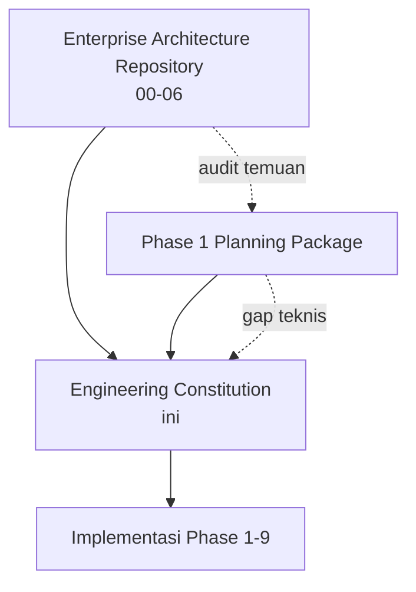

# Puraloka Suite — Engineering Constitution

**Status:** Living document — lihat [00-principles/00-engineering-principles.md § Amendment Process](00-principles/00-engineering-principles.md#9-amendment-process) untuk cara mengusulkan perubahan.
**Kedudukan:** Ini adalah standar kerja mengikat untuk seluruh implementasi Puraloka Suite, Phase 1 hingga Phase 9. Bersama [Enterprise Architecture Repository](../00-vision-and-business-architecture.md) dan [Phase 1 Planning Package](../Phase1/00-current-state-audit.md), ketiganya adalah **satu-satunya source of truth** — tidak ada roadmap atau standar kedua yang boleh bertentangan dengan ketiganya tanpa ADR eksplisit.
**Struktur & rasional:** [ADR-001 — Structure and Governance Model](adr/ADR-001-structure-and-governance-model.md). Format 12-bagian & kosakata RFC 2119: [ADR-002 — Enforcement Levels and Template](adr/ADR-002-enforcement-levels-and-template.md).

---

## Cara Membaca Dokumen Ini — 3 Jalur Baca

Constitution ini **bukan** dokumen yang dibaca dari awal sampai akhir sekali lalu selesai — ia dirujuk berulang selama bertahun-tahun. Pilih jalur sesuai kebutuhan Anda:

### Jalur 1 — Engineer Baru (Onboarding, Baca Berurutan Sekali)

Baca folder secara berurutan (00 → 08) pada hari pertama bergabung — urutan folder **secara harfiah adalah urutan dependency**, jadi membaca berurutan berarti tidak akan menemukan rujukan ke sesuatu yang belum dijelaskan.

1. [00-principles/](00-principles/00-engineering-principles.md) — filosofi dasar, kenapa constitution ini ada
2. [01-foundations/](01-foundations/01-coding-standards.md) — konvensi penamaan, struktur folder, project conventions
3. [02-architecture/](02-architecture/03-clean-architecture-rules.md) — Clean Architecture + DDD
4. [03-core-implementation/](03-core-implementation/05-database-engineering-standard.md) — Database, API, Security, Schema Migration
5. [04-quality-and-observability/](04-quality-and-observability/08-testing-standard.md) — Testing, Performance, Observability, Error Handling, Logging
6. [05-team-process/](05-team-process/14-git-workflow-standard.md) — Git, Code Review, DoR/DoD, Checklist Merge/Release, DevSecOps
7. [06-governance/](06-governance/19-architecture-decision-record-guide.md) — ADR, Tech Debt, Refactoring, Dependency/Library/Package, Versioning, Documentation
8. [07-domain-specific/](07-domain-specific/12-ui-engineering-standard.md) — UI, Feature Flag, Configuration, Event-Driven, AI Coding, AI Governance & Agent Engineering
9. [08-metrics-and-closing/](08-metrics-and-closing/39-final-engineering-manifesto.md) — Metrics, Security Checklist, Manifesto

**Sebelum mulai:** baca [GLOSSARY.md](GLOSSARY.md) sekilas — istilah teknis yang dipakai berulang (Aggregate Root, RLS, idempotency, fail-closed, dst.) didefinisikan sekali di sana, bukan diulang per file.

### Jalur 2 — Engineer Berpengalaman (Referensi, Cari Aturan Spesifik)

Jangan baca berurutan — langsung ke file yang relevan dengan pekerjaan yang sedang dikerjakan. Gunakan tabel [Peta Lengkap 40 File](#peta-lengkap-40-file) di bawah untuk mencari berdasarkan topik.

**Aturan cepat:** Setiap aturan **MUST** di file mana pun adalah blocking merge — jika kode yang Anda tulis melanggar satu, PR tidak akan lolos [Checklist Before Merge](05-team-process/20-checklist-before-merge.md). Setiap aturan **SHOULD** boleh dideviasi dengan justifikasi tertulis di deskripsi PR.

### Jalur 3 — Reviewer (Verifikasi PR terhadap Checklist)

Mulai dari [05-team-process/15-code-review-checklist.md](05-team-process/15-code-review-checklist.md) dan [05-team-process/20-checklist-before-merge.md](05-team-process/20-checklist-before-merge.md) — keduanya mengagregasi item Checklist dari seluruh file lain yang relevan (lihat [ADR-002 § Bagian 10](adr/ADR-002-enforcement-levels-and-template.md)), jadi tidak perlu membuka 40 file satu-satu untuk review rutin.

---

## Maturity Badge — Cara Membaca Status Setiap File

Setiap file punya header maturity badge di baris kedua (setelah judul), sesuai [ADR-002](adr/ADR-002-enforcement-levels-and-template.md):

| Badge | Arti |
|---|---|
| 🟢 **Enforced** | Kode existing sudah patuh, gate CI aktif memverifikasi otomatis |
| 🟡 **Partial** | Sebagian kode patuh, migrasi sedang berjalan — lihat bagian Migration Strategy file terkait |
| 🔵 **Designed** | Kontrak masa depan — belum ada kode untuk diverifikasi, berlaku penuh begitu domain ini mulai diimplementasikan |

**Jangan mengasumsikan 🔵 Designed berarti "boleh diabaikan"** — artinya justru sebaliknya: begitu Anda menyentuh kode di domain itu untuk pertama kali, aturan di file itu **langsung** berlaku penuh sejak baris kode pertama, tanpa masa transisi (lihat Migration Strategy tiap file: "N/A — berlaku penuh sejak commit pertama").

---

## Peta Lengkap 40 File

| # | File | Folder | Batch | Status Cakupan Hari Ini |
|---|---|---|---|---|
| 00 | Engineering Principles | `00-principles/` | 0 | 🟢 |
| 01 | Coding Standards | `01-foundations/` | 1 | 🟡 |
| 02 | Folder Architecture | `01-foundations/` | 1 | 🟡 |
| 22 | Project Conventions | `01-foundations/` | 1 | 🟢 |
| 03 | Clean Architecture Rules | `02-architecture/` | 2 | 🔵 |
| 04 | Domain-Driven Design Rules | `02-architecture/` | 2 | 🟡 |
| 05 | Database Engineering Standard | `03-core-implementation/` | 3 | 🟡 |
| 06 | API Engineering Standard | `03-core-implementation/` | 3 | 🟡 |
| 07 | Security Engineering Standard | `03-core-implementation/` | 3 | 🟡 |
| 34 | Schema Migration Policy | `03-core-implementation/` | 3 | 🟡 |
| 08 | Testing Standard | `04-quality-and-observability/` | 4 | 🔵 |
| 09 | Performance Budget | `04-quality-and-observability/` | 4 | 🔵 |
| 10 | Observability Standard | `04-quality-and-observability/` | 4 | 🔵 |
| 28 | Error Handling Standard | `04-quality-and-observability/` | 4 | 🟡 |
| 29 | Logging Standard | `04-quality-and-observability/` | 4 | 🟡 |
| 11 | DevSecOps Standard | `05-team-process/` | 5 | 🔵 |
| 14 | Git Workflow Standard | `05-team-process/` | 5 | 🟡 |
| 15 | Code Review Checklist | `05-team-process/` | 5 | 🔵 |
| 16 | Definition of Ready | `05-team-process/` | 5 | 🔵 |
| 17 | Definition of Done | `05-team-process/` | 5 | 🔵 |
| 20 | Checklist Before Merge | `05-team-process/` | 5 | 🔵 |
| 21 | Checklist Before Release | `05-team-process/` | 5 | 🔵 |
| 18 | Never Build List | `06-governance/` | 6 | 🟢 |
| 19 | ADR Guide | `06-governance/` | 6 | 🟢 |
| 23 | Dependency Management | `06-governance/` | 6 | 🟡 |
| 24 | Documentation Standard | `06-governance/` | 6 | 🟢 |
| 25 | Versioning Standard | `06-governance/` | 6 | 🔵 |
| 30 | Technical Debt Policy | `06-governance/` | 6 | 🟡 |
| 31 | Refactoring Policy | `06-governance/` | 6 | 🔵 |
| 32 | Library Selection Policy | `06-governance/` | 6 | 🟡 |
| 33 | Package Approval Policy | `06-governance/` | 6 | 🔵 |
| 12 | UI Engineering Standard | `07-domain-specific/` | 7 | 🟡 |
| 26 | Feature Flag Standard | `07-domain-specific/` | 7 | 🔵 |
| 27 | Configuration Standard | `07-domain-specific/` | 7 | 🔵 |
| 35 | Event-Driven Guideline | `07-domain-specific/` | 7 | 🔵 |
| 36 | AI Coding Guideline | `07-domain-specific/` | 7 | 🔵 |
| 40 | AI Governance & Agent Engineering Standard | `07-domain-specific/` | K (v1.1) | 🔵 |
| 37 | Engineering Metrics | `08-metrics-and-closing/` | 8 | 🔵 |
| 38 | Security Checklist | `08-metrics-and-closing/` | 8 | 🟡 |
| 39 | Final Engineering Manifesto | `08-metrics-and-closing/` | 8 | 🟢 |

**Kolom "Status Cakupan Hari Ini" bukan maturity badge file itu sendiri** — ini indikasi ringkas mayoritas isi file (banyak file akan berisi campuran 🟢/🟡/🔵 per bagian, lihat isi file untuk presisi).

---

## Hubungan dengan Dokumen Lain

**Prinsip:** Architecture Repository menjawab "arsitektur seperti apa yang kita bangun." Phase 1 Planning menjawab "bagaimana urutan mengerjakan fondasi Phase 1 secara spesifik." Engineering Constitution menjawab "bagaimana **setiap baris kode**, di fase mana pun, harus ditulis, direview, dan dirilis." Ketiganya saling melengkapi, tidak ada yang menggantikan yang lain.

---

*Mulai membaca dari [00-principles/00-engineering-principles.md](00-principles/00-engineering-principles.md).*
