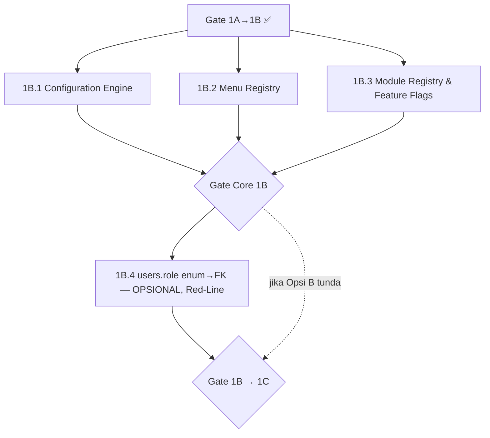

# 02 — Sub-Fase 1B Sequence

Pemecahan Sub-Fase 1B jadi unit eksekusi dengan Objective/Dependency/Input/Output/Deliverable/Rollback/DoD per unit. Sumber lingkup: [Phase1/02-target-architecture.md § SUB-FASE 1B](../Phase1/02-target-architecture.md).

## Peta Dependency

1B.1/1B.2/1B.3 **paralel-able** (additive, tak saling bergantung). 1B.4 **setelah** gate core.

---

## 1B.1 — Configuration Engine

**Objective:** Migrasi tax rate hardcode ke `company_settings` yang bisa diubah admin, tanpa menghilangkan test/kalkulasi existing.

**Dependency:** Tidak ada (Epic pertama).

**Input:** `apps/api/src/lib/tax-calculation.ts:4-5` (`ppn:0.11, pph_final:0.02`), `tax-calculation.test.ts` (8 test), `settings.ts` existing.

**Output:**
1. Migration `075_company_settings.sql` — tabel `company_settings` (key/value JSONB/value_type/category), seed `tax.ppn_rate=0.11`, `tax.pph_final_rate=0.02`.
2. API `GET/PUT /api/v1/settings/config` (baca/tulis, admin write via `settings:manage`).
3. `tax-calculation.ts` baca rate dari config (dengan fallback ke default hardcoded jika config kosong — **safety**, tidak pernah 0).
4. UI: tab "Konfigurasi Pajak" di `/pengaturan`.

**⚠️ Red-Line #2 (finansial):** langkah 3 menyentuh `lib/tax-calculation.ts`. Perubahan **MUST** mempertahankan hasil identik untuk config default (8 test tetap hijau) + fallback aman. Karena AUTOPILOT §5 menandai calc pajak sebagai Red-Line, langkah 3 butuh **DANGER GATE** — tapi pola-nya reversible (fallback ke default), jadi verdict risiko rendah. Founder ack sebelum langkah 3.

**Deliverable:** migration 075 (kembar 2 folder), `settings.ts` extended, `tax-calculation.ts` config-aware, test config-read, UI tab.

**Rollback:** DROP TABLE company_settings (additive); revert kode calc ke hardcode (test jadi jaring).

**DoD:** 8 test tax tetap hijau + test config-read baru; admin bisa ubah rate via UI; fallback aman terverifikasi; nol fitur existing hilang.

---

## 1B.2 — Menu Registry

**Objective:** `sidebar.tsx` jadi renderer DB-driven (`menu_items`), visibility `perms.has(...)` dipertahankan.

**Dependency:** Tidak ada (paralel 1B.1).

**Input:** `apps/web/components/sidebar.tsx` (530 baris, ~24 menu, `perms.has()` baris 244-313).

**Output:** lihat [execution/1b2-menu-registry.md](execution/1b2-menu-registry.md) (kompleks — execution plan sendiri). Ringkas: migration `menu_items` + seed dari struktur sidebar existing; API `GET /menu`; sidebar render dari data + caching + invalidation; **visibility tetap `perms.has()`**.

**Additive-first (AUTOPILOT §1):** **NOL menu existing boleh hilang** saat refactor. Seed `menu_items` harus 1:1 dengan menu hardcoded sekarang, diverifikasi item-per-item.

**Rollback:** feature flag / revert sidebar ke JSX (git); DROP menu_items.

**DoD:** semua ~24 menu existing muncul identik (verifikasi visual + count); visibility per-role sama; caching+invalidation bekerja; execution plan checklist lengkap.

---

## 1B.3 — Module Registry & Feature Flags

**Objective:** Tabel module registry + feature flags untuk toggle modul/fitur per company (siapkan struktur L2).

**Dependency:** Tidak ada (paralel).

**Input:** [Phase1/02-target-architecture.md § 1B.3](../Phase1/02-target-architecture.md).

**Output:** migration tabel `modules` + `feature_flags`; API CRUD (admin); integrasi flag-check di API/UI (additive — modul existing default ON).

**Additive-first:** semua modul existing seed sebagai `enabled=true` — nol modul mati saat migrasi.

**Rollback:** DROP tabel (additive).

**DoD:** CRUD flag bekerja; modul existing tetap ON; test flag-toggle.

---

## Gate Core 1B

Lulus jika: 1B.1+1B.2+1B.3 DoD tercentang, full suite hijau, CI hijau, **nol fitur/menu existing hilang** (additive-first terverifikasi). Setelah ini, 1B.4 boleh dipertimbangkan (atau langsung Gate 1B→1C jika Opsi B).

---

## 1B.4 — users.role enum → FK (OPSIONAL, TERAKHIR, RED-LINE)

**Objective:** Migrasi `users.role` dari enum `user_role` 4-nilai → TEXT/FK ke `roles`, sehingga role custom (`direktur`) bisa di-assign ke user — menuntaskan RBAC config-driven.

**Dependency:** **Keras** — gate core 1B selesai. Dan **KEPUTUSAN FOUNDER** (Opsi A/B, di bawah).

**⚠️ RED-LINE #1 (migration destruktif):** ini operasi paling berisiko di proyek. `users.role` dibaca setiap request (`plugins/auth.ts`), semua RLS via `auth_role()`, `get_role_permissions` RPC, 55+ inline. Butuh **DANGER GATE** penuh + ack founder sebelum eksekusi. Detail: [execution/1b4-role-enum-migration.md](execution/1b4-role-enum-migration.md).

**KEPUTUSAN FOUNDER (satu-satunya di 1B):**
- **Opsi A (rekomendasi):** migrasi enum→FK sekarang. Menuntaskan config-driven; role custom berfungsi end-to-end. Risiko tinggi tapi expand-contract + smoke test 4 role mengelolanya.
- **Opsi B:** tunda sampai ada kebutuhan bisnis role ke-5 yang di-assign. Gate core 1B tetap lulus tanpa 1B.4.

**Dicatat di sini (bukan decision log terpisah)** karena ini satu-satunya keputusan founder menggantung di 1B — proporsional (AUTOPILOT playbook §Siklus Penuh).

**DoD (jika Opsi A):** expand-contract selesai; smoke test 4 role + role custom ulang; RLS `auth_role()` tetap benar; nol lockout; rollback plan teruji.

---

## Ringkas urutan eksekusi

1. 1B.1 Config Engine (Green, +DANGER GATE ringan di calc)
2. 1B.2 Menu Registry (Green, execution plan)
3. 1B.3 Module/Feature (Green)
4. **Gate Core 1B**
5. 1B.4 enum→FK **hanya jika founder pilih Opsi A** (DANGER GATE penuh)
