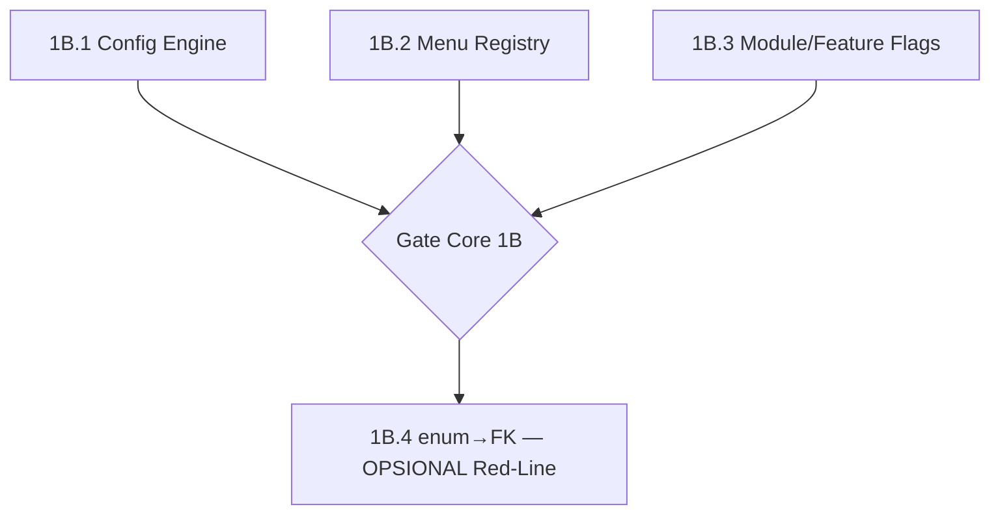

# 05 — Feature Implementation Order (Sub-Fase 1B)

Dependency graph Epic-level + task breakdown.

## Dependency Graph

**1B.1/1B.2/1B.3 tidak saling bergantung** (semua additive, tabel terpisah) → boleh paralel atau berurutan. Urutan rekomendasi: 1B.1 → 1B.2 → 1B.3 (risiko naik: config lugas → sidebar refactor → pola baru). 1B.4 setelah gate core.

## Task Breakdown

### 1B.1 Configuration Engine
| Feature | Task |
|---|---|
| F1.1 Schema | migration 075 company_settings + seed tax rate |
| F1.2 API | GET/PUT /settings/config (write `settings:manage`) + RLS |
| F1.3 Calc integration | tax-calculation.ts baca config + fallback (**Red-Line #2, DANGER GATE ringan**) |
| F1.4 Test | config-read test + 8 test tax existing tetap hijau |
| F1.5 UI | tab Konfigurasi Pajak (`frontend-design`) |

### 1B.2 Menu Registry (execution plan sendiri)
| Feature | Task |
|---|---|
| F2.1 Schema | migration 076 menu_items + seed 1:1 dari sidebar (verifikasi count) |
| F2.2 API | GET /menu role-aware |
| F2.3 Refactor | sidebar.tsx → renderer DB-driven + cache + invalidation |
| F2.4 Test | render count = existing; visibility per-role sama |

### 1B.3 Module Registry & Feature Flags
| Feature | Task |
|---|---|
| F3.1 Schema | migration 077 modules+feature_flags, seed existing=ON |
| F3.2 API | CRUD flag (admin) |
| F3.3 Integration | flag-check additive (modul existing default ON) |
| F3.4 Test | toggle flag |

### 1B.4 enum→FK (jika Opsi A — Red-Line)
Lihat [execution/1b4-role-enum-migration.md](execution/1b4-role-enum-migration.md).

## Gate Core 1B (sebelum 1B.4)

- [ ] 1B.1-1B.3 DoD tercentang
- [ ] Full suite hijau, CI hijau
- [ ] **Additive-first: nol fitur/menu existing hilang** (verifikasi count menu, modul ON)
- [ ] Smoke test: admin ubah tax rate/menu/flag via UI berfungsi
