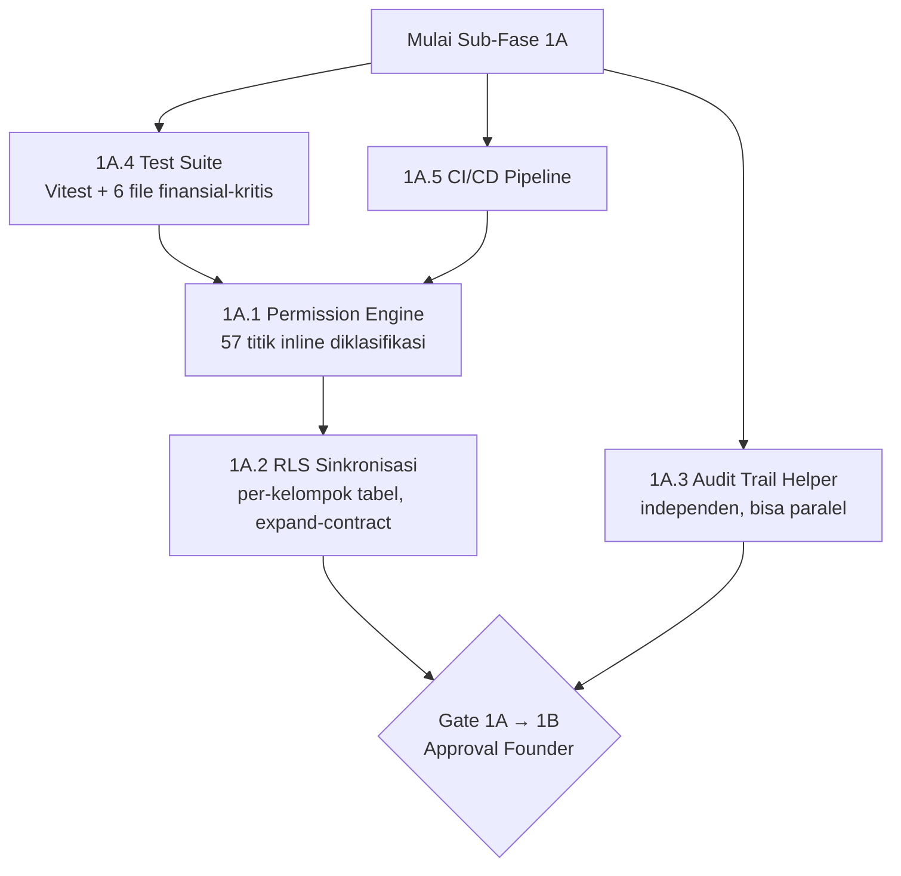

# Implementation Kickoff — 02. Phase 1A Sequence

**Sumber tunggal:** [Phase1/05-rollout-plan.md](../Phase1/05-rollout-plan.md) (urutan), [Phase1/03-migration-strategy.md](../Phase1/03-migration-strategy.md) (prosedur per migrasi), [Phase1/02-target-architecture.md](../Phase1/02-target-architecture.md) (desain). Dokumen ini **tidak mendesain ulang** — ia memecah Sub-Fase 1A menjadi lima unit eksekusi (1A.1–1A.5) dengan Objective/Dependency/Input/Output/Deliverable/Rollback/Definition of Done yang eksplisit, sesuatu yang belum ada dalam bentuk ini di korpus manapun.

---

## Peta Ketergantungan 1A (Verbatim dari Rollout Plan)

**Catatan penting — 1A.4 dan 1A.5 diberi nomor lebih tinggi tapi dikerjakan lebih dulu:** Penomoran 1A.1–1A.5 di [Phase1/02-target-architecture.md](../Phase1/02-target-architecture.md) mengikuti urutan *presentasi desain* (Permission Engine dulu karena itu gap paling kritis), bukan urutan *eksekusi*. Urutan eksekusi nyata adalah **1A.4 dan 1A.5 dulu** (jaring pengaman), baru **1A.1 → 1A.2**, dengan **1A.3 paralel kapan saja**. Ini bukan kontradiksi — [Phase1/05-rollout-plan.md:52](../Phase1/05-rollout-plan.md) eksplisit menjelaskan alasannya: mengerjakan Permission Engine/RLS dulu baru test suite belakangan membalik urutan jaring pengaman (R5 di [Risk Register](../Phase1/04-risk-register.md#r5--refactor-kasbonco-procurement-tanpa-test-coverage-menghasilkan-regresi-silent)).

---

## 1A.4 — Financial Test Suite (Dikerjakan Pertama)

**Objective:** Membangun jaring pengaman otomatis untuk 6 file finansial-kritis sebelum satu baris pun Permission Engine/RLS disentuh.

**Dependency:** Tidak ada — ini titik mulai murni.

**Input:** [Phase1/06-test-strategy.md](../Phase1/06-test-strategy.md) (desain lengkap), 6 file target: `kasbons.ts`, `termin-payment.ts`, `kurva-s.ts`, `rab.ts`, `progress.ts`, `finance.ts`.

**Output:**
- Dependency `vitest` terpasang di `apps/api/package.json`.
- 4 pure function diekstrak ke `apps/api/src/lib/`: `evm-calculation.ts`, `tax-calculation.ts`, `retention-calculation.ts`, `rab-aggregation.ts`.
- Test file di `apps/api/src/lib/__tests__/` untuk keempatnya, target coverage ≥90% **khusus untuk pure function ini** (bukan blanket coverage — lihat [Phase1/06-test-strategy.md § Realisme Target Coverage](../Phase1/06-test-strategy.md#realisme-target-coverage-90--pembahasan-jujur)).
- Test database terisolasi dikonfigurasi dan diverifikasi (Supabase local via `supabase start`, atau schema Postgres terpisah) — **sebelum** test integration pertama ditulis.
- Integration test golden-path untuk kasbon, change order, procurement + 3 test kegagalan finansial spesifik (approve ganda kasbon, approve CO ter-reject, over-receipt GR).

**Deliverable:** `apps/api/src/lib/{evm,tax,retention,rab-aggregation}-calculation.ts` + test-nya, `apps/api/src/routes/v1/__tests__/{kasbons,change-orders,procurement}.test.ts`.

**Rollback:** Nol risiko — murni penambahan file baru, tidak menyentuh runtime aplikasi sampai CI (1A.5) benar-benar memakainya sebagai gate. Revert Git murni jika perlu.

**Definition of Done:** Checklist "Financial Test Suite" di [Phase1/09-definition-of-done.md § Sub-Fase 1A](../Phase1/09-definition-of-done.md#financial-test-suite) tercentang seluruhnya.

---

## 1A.5 — CI/CD Foundation (Paralel dengan 1A.4)

**Objective:** Pipeline otomatis yang menjalankan lint + typecheck + test + build di setiap PR, sebelum ada kode berisiko tinggi yang bisa merge tanpa gate.

**Dependency:** Tidak ada dependency keras ke 1A.4, tapi nilai penuhnya baru terasa begitu 1A.4 menghasilkan test yang bisa dijalankan CI — keduanya sengaja diposisikan paralel di rollout plan.

**Input:** Desain `.github/workflows/ci.yml` di [Phase1/02-target-architecture.md § 1A.5](../Phase1/02-target-architecture.md#1a5-cicd-foundation).

**Output:** `.github/workflows/ci.yml` berjalan pada setiap `pull_request`, 4 step: lint (eslint) → typecheck (`tsc --noEmit`) → test (`vitest run`) → build (`next build` + tsx compile check untuk API).

**Deliverable:** `.github/workflows/ci.yml`. **Catatan gap tersembunyi (dilaporkan, lihat F2 di bagian Findings):** `apps/api/package.json` hari ini **tidak punya script `lint` sama sekali** — desain CI mengasumsikan "lint (eslint, existing)" tapi ini hanya benar untuk `apps/web` (yang punya script `lint`), bukan `apps/api`. Langkah CI untuk API harus menambahkan ESLint config + script terlebih dahulu, atau step lint di CI untuk API akan gagal sejak commit pertama.

**Rollback:** Nol risiko terhadap runtime produksi — file YAML murni, tidak mempengaruhi kode aplikasi. Revert Git murni.

**Definition of Done:** Checklist "CI/CD" di [Phase1/09-definition-of-done.md § Sub-Fase 1A](../Phase1/09-definition-of-done.md#cicd) tercentang. Branch protection rule eksplisit **opsional**, butuh keputusan founder terpisah (bukan bagian DoD wajib).

---

## 1A.1 — Permission Engine Konsolidasi

**Objective:** Menghapus 4 sisa `requireRole` dan memigrasikan ~21 baris authorization-gate inline ke `requirePermission`, tanpa mengubah kontrak API.

**Dependency:** **Keras** — 1A.4 (test suite) dan 1A.5 (CI) harus sudah berjalan (lihat diagram di atas; ini bukan preferensi, ini konsekuensi langsung R5 di [Risk Register](../Phase1/04-risk-register.md#r5)).

**Input:** [Phase1/03-migration-strategy.md § Migrasi 1A.1](../Phase1/03-migration-strategy.md#migrasi-1a1--permission-engine-konsolidasi) (urutan langkah presisi), [Phase1/00-current-state-audit.md § 1.5](../Phase1/00-current-state-audit.md#15-call-site-inventory--inline-role--x-57-kejadian-11-file) (inventaris 57 baris).

**Output** (urutan wajib, satu file per commit, risiko-terendah-dulu):
1. Migration additive: tabel `permission_scopes` baru.
2. **Isi `permission_scopes` untuk PM existing + verifikasi manual terhadap `projects.pm_id`** — item eksplisit di [Phase1/09-definition-of-done.md:19](../Phase1/09-definition-of-done.md#permission-engine) ("Tabel `permission_scopes` dibuat **dan diisi** untuk PM existing, **diverifikasi manual**") yang sempat tidak tercantum di draft awal dokumen ini — ditambahkan di sini setelah ditemukan saat adversarial review. Tanpa langkah ini, tabel additive di langkah 1 kosong dan PBAC sederhana (PM hanya approve kasbon proyek sendiri) tidak benar-benar berfungsi lewat skema baru.
3. Migrasi 21 baris authorization-gate: `users.ts` → `clients.ts` → ... → `cash.ts` → `finance.ts` (risiko finansial rendah ke tinggi).
4. Hapus 4 pemanggilan `requireRole` (`audit.ts:10`, `audit.ts:59`, `reports.ts:967`, `reports.ts:1038`) — **hanya setelah** langkah 3 selesai semua.
5. Hapus fungsi `requireRole` dari `apps/api/src/plugins/auth.ts` — **hanya setelah** grep codebase mengonfirmasi nol pemanggilan tersisa.

**Deliverable:** `db/migrations/059_permission_scopes.sql` (nomor berikutnya setelah 058, lihat [04-database-migration-plan.md](04-database-migration-plan.md)), commit per file yang dimigrasi, `apps/api/src/plugins/auth.ts` tanpa fungsi `requireRole`.

**Rollback:** Per langkah 2 — revert Git murni per commit, instan, nol downtime. Langkah 1 — `DROP TABLE permission_scopes` (aman, tabel baru, nol FK masuk).

**Definition of Done:** Checklist "Permission Engine" di [Phase1/09-definition-of-done.md](../Phase1/09-definition-of-done.md#permission-engine) tercentang seluruhnya, termasuk reverifikasi jumlah 21/36 baris sebelum eksekusi (bukan diasumsikan dari dokumen ini).

---

## 1A.2 — RLS Sinkronisasi (Migrasi Paling Berisiko di Seluruh Phase 1)

**Objective:** Menyinkronkan 50 statement RLS ke sumber kebenaran `role_permissions` yang sama dipakai API layer, per kelompok tabel, expand-contract.

**Dependency:** **Keras** — 1A.1 harus selesai (Permission Engine harus stabil sebelum RLS dibangun di atasnya).

**Input:** [Phase1/03-migration-strategy.md § Migrasi 1A.2](../Phase1/03-migration-strategy.md#migrasi-1a2--rls-sinkronisasi-migrasi-paling-berisiko-di-seluruh-phase-1).

**Output** (urutan wajib per kelompok, lihat [04-database-migration-plan.md](04-database-migration-plan.md) untuk detail migration file):
1. `has_permission()` SQL function (sekali, migration terpisah paling awal).
2. Kelompok "Referensi read-mostly" (`material_categories`, `materials`) — expand+contract.
3. Kelompok "Operasional non-finansial" (`milestones`, `documents`, `project_photos`).
4. Kelompok "Field ops" (`progress_logs`, `work_scopes`, `workers`).
5. Kelompok **"Finansial"** (`kasbons`, `invoices`, `payments`, `cash_accounts`, `expense_reports`) — **minimal expand selesai** untuk lulus Gate 1A→1B, contract boleh menyusul. **MUST** dijadwalkan jam operasional rendah + independent review policy + interim detection query harian (safeguard B6/B7/B8, lihat [Phase1/03-migration-strategy.md:44,51,52](../Phase1/03-migration-strategy.md)).
6. Enumerasi eksplisit ~17 tabel tanpa RLS — **task terpisah sebelum kelompok manapun dimulai**, setiap tabel diputuskan sadar.

**Deliverable:** Satu migration file per tabel/kelompok tabel (bukan satu file monolitik), lihat urutan penomoran di [04-database-migration-plan.md](04-database-migration-plan.md).

**Rollback:** Sebelum contract — `DROP POLICY` pada policy baru saja, nol risiko. Setelah contract — re-create policy lama dari `049_rls_policies.sql` (disimpan sebagai referensi) sebagai migration baru.

**Definition of Done:** Checklist "RLS" di [Phase1/09-definition-of-done.md](../Phase1/09-definition-of-done.md#rls) tercentang. Untuk kelompok Finansial: independent review **MUST** terjadi sebelum step "hapus policy lama."

---

## 1A.3 — Audit Trail Helper (Paralel, Kapan Saja)

**Objective:** Bangun `logAuditEvent` helper terpusat, instrumentasi 6 event wajib yang belum tercatat.

**Dependency:** Tidak ada — independen dari 1A.1/1A.2, aman dikerjakan berselang-seling.

**Input:** [Phase1/03-migration-strategy.md § Migrasi 1A.3](../Phase1/03-migration-strategy.md#migrasi-1a3--audit-trail-helper), desain interface di [Phase1/02-target-architecture.md § 1A.3](../Phase1/02-target-architecture.md#1a3-audit-trail-v2--helper-terpusat).

**Output:**
1. Migration: 3 kolom nullable baru ke `audit_logs` (`correlation_id`, `workflow_id`, `reason`).
2. `apps/api/src/utils/audit.ts` dibangun (`logAuditEvent`, fire-and-forget, tidak pernah throw ke main request — pola yang sama dengan notifikasi existing).
3. `change-orders.ts:576` dimigrasikan ke helper baru, `severity: 'critical'` terisi.
4. Instrumentasi 6 event, satu per commit, prioritas `kasbon.status` dan `payment.deleted` dulu: `invoice.amount`, `payment.deleted`, `kasbon.status`, `user.role`, `project.status`, `rab_materials.override`.
5. **Rekomendasi tambahan dari Security Review** ([Phase1/07-security-review.md:57](../Phase1/07-security-review.md)): trigger append-only untuk `audit_logs` — berbagi migration yang sama, overhead nyaris nol, **direkomendasikan masuk 1A.3** (keputusan founder tetap diperlukan, lihat [09-definition-of-ready.md](09-definition-of-ready.md)).

**Deliverable:** `db/migrations/06X_audit_trail_columns.sql`, `apps/api/src/utils/audit.ts`, 6 commit instrumentasi.

**Rollback:** Kode aplikasi murni (insert tambahan) — revert Git, nol risiko ke data existing.

**Definition of Done:** Checklist "Audit Trail" di [Phase1/09-definition-of-done.md](../Phase1/09-definition-of-done.md#audit-trail) tercentang.

---

## Gate 1A → 1B

**Kriteria lulus — ringkasan tingkat-tinggi** (verbatim dari [Phase1/05-rollout-plan.md § Gate 1A → 1B](../Phase1/05-rollout-plan.md#gate-1a--1b)):
- [ ] Seluruh 21 authorization-gate inline termigrasi, terverifikasi via test.
- [ ] `requireRole` dihapus total dari codebase.
- [ ] Minimal kelompok "Finansial" di RLS sudah tahap expand selesai.
- [ ] Test suite mencakup 6 file finansial-kritis dengan coverage target realistis.
- [ ] CI hijau di setiap PR.

**⚠️ Lima poin di atas adalah ringkasan, BUKAN pengganti checklist lengkap.** Kelima poin ini berasal dari [Phase1/05-rollout-plan.md](../Phase1/05-rollout-plan.md), yang sendiri adalah ringkasan tingkat-tinggi dari checklist penuh di [Phase1/09-definition-of-done.md § Sub-Fase 1A](../Phase1/09-definition-of-done.md#sub-fase-1a--security-foundation). Checklist penuh mencakup item yang **tidak** muncul di lima poin ringkasan ini — termasuk (tidak lengkap): Architecture Review Gate entry, `permission_scopes` diisi+diverifikasi (lihat koreksi di 1A.1 di atas), komentar eksplisit 36 baris data-scoping, RLS untuk kelompok Referensi/Operasional/Field-ops (bukan hanya Finansial), enumerasi ~17 tabel tanpa RLS, `has_permission()` terverifikasi, 6 event audit terinstrumentasi, dan checklist Kompatibilitas Mobile (3 skenario test terpisah, bukan satu test gabungan). **Gate 1A→1B MUST diajukan berdasarkan checklist penuh di Phase1/09, bukan lima poin ringkasan di atas** — ringkasan ini hanya untuk orientasi cepat.

**Founder secara eksplisit menyetujui lanjut ke 1B** — bukan otomatis begitu checklist tercentang.

---

## Findings Baru yang Ditemukan Saat Menyusun Dokumen Ini (Dilaporkan, Bukan Diperbaiki Diam-Diam)

### F1 — Angka `requirePermission` Tidak Konsisten di Dalam Korpus Phase1 Sendiri

**Evidence:** `Phase1/00-current-state-audit.md:52` dan `Phase1/01-gap-analysis.md:23` menyebut **"103"** call site `requirePermission`. `Phase1/02-target-architecture.md:47-48,59` dan `Phase1/09-definition-of-done.md:15` (hasil koreksi B1 remediation) menyebut **"102"**. Grep langsung hari ini (`grep -c "requirePermission("`) = **102**, dikonfirmasi dua kali secara independen.

**Dampak:** Rendah — kedua dokumen yang salah (`00` dan `01`) adalah dokumen *audit findings*, bukan dokumen yang dipakai sebagai checklist eksekusi (`02`/`09` sudah benar dan itu yang dipakai di seluruh dokumen Implementation-Kickoff ini). Tidak ada risiko fungsional, murni staleness setelah B1 correction tidak dipropagasi mundur ke dokumen sumbernya.

**Rekomendasi:** Update `00-current-state-audit.md:52` dan `01-gap-analysis.md:23` dari "103" ke "102" via PR kecil terpisah, bukan bagian dari paket ini (di luar scope Implementation Kickoff Review yang eksplisit dilarang mengedit Phase1/*).

**Status:** **Dilaporkan, menunggu approval.** Tidak diperbaiki.

### F2 — Desain CI Mengasumsikan Script `lint` yang Tidak Ada di `apps/api`

**Evidence:** `apps/api/package.json` scripts hanya `{dev, build, start}` — tidak ada `lint`. `apps/web/package.json` punya `lint` (via `eslint`). Desain `.github/workflows/ci.yml` di [Phase1/02-target-architecture.md:169](../Phase1/02-target-architecture.md) menulis "lint (eslint, existing)" — kata "existing" hanya benar untuk separuh monorepo.

**Dampak:** Sedang — jika 1A.5 dikerjakan mengikuti desain literal tanpa menyadari ini, step lint CI untuk `apps/api` akan gagal di commit pertama (bukan karena kode salah, tapi karena tooling belum ada).

**Rekomendasi:** Sebelum menulis `ci.yml`, tambahkan ESLint config + script `lint` ke `apps/api/package.json` sebagai bagian dari 1A.5 (bukan diasumsikan sudah ada). Ini adalah pekerjaan tambahan kecil yang **belum** tercatat eksplisit di manapun.

**Status:** **Dilaporkan, menunggu approval.** Dicatat juga sebagai item Day-1 checklist ([08-day-one-checklist.md](08-day-one-checklist.md)).

---

*Dokumen selanjutnya: [03 — Folder and Module Order](03-folder-and-module-order.md) — urutan presisi implementasi folder/modul.*
