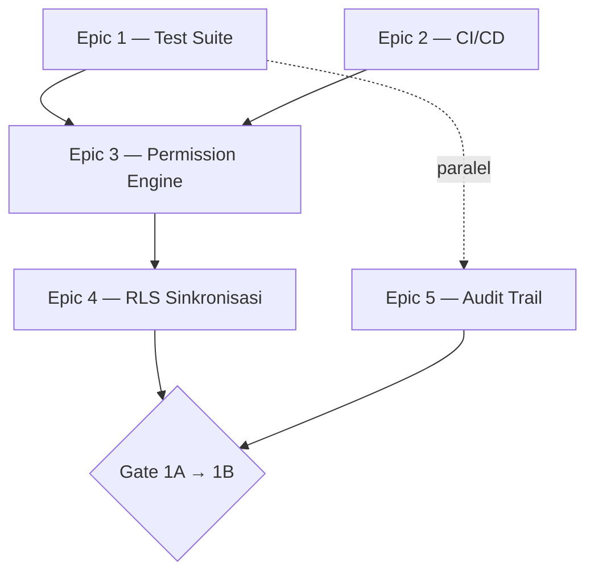

# Implementation Kickoff — 05. Feature Implementation Order

**Tujuan:** Breakdown Epic → Feature → Task → Subtask untuk Sub-Fase 1A, dengan dependency graph eksplisit — level detail yang belum ada di dokumen manapun (Phase1 set berhenti di level "gap"/"target architecture", belum dipecah ke satuan kerja harian).

---

## Epic 1 — Financial Test Suite (1A.4)

| Feature | Task | Subtask | Depends On |
|---|---|---|---|
| **F1.1 — Test Infrastructure** | T1.1.1 Setup Vitest | Install `vitest` + `@vitest/coverage-v8`, buat `vitest.config.ts` | — |
| | T1.1.2 Setup test database | Konfigurasi `supabase start` atau schema Postgres terpisah, verifikasi isolasi dari dev/prod | T1.1.1 |
| **F1.2 — Pure Function Extraction** | T1.2.1 Tax calculation | Ekstrak dari `termin-payment.ts:175`, unit test PPN/PPh-final/edge-case nol-negatif | T1.1.1 |
| | T1.2.2 EVM calculation | Ekstrak dari `kurva-s.ts`, unit test proyek-baru/proyek-selesai/distribusi-tidak-simetris/status-campuran | T1.1.1 |
| | T1.2.3 RAB aggregation | Ekstrak dari `rab.ts`+`progress.ts`, unit test 1-item/banyak-item/weight-di-luar-99.9-100.1 | T1.1.1 |
| | T1.2.4 Retention calculation | Integration test untuk trigger `calc_retention_amount` (migration 010) — level DB, bukan unit | T1.1.1 |
| **F1.3 — Integration Test Golden Path** | T1.3.1 Kasbon | Golden path (ajukan→approve→notif) + kegagalan (approve ganda/race condition) | T1.1.2 |
| | T1.3.2 Change Order | Golden path (draft→submit→approve→contract update) + kegagalan (approve CO ter-reject) | T1.1.2 |
| | T1.3.3 Procurement | Golden path (MR→PO→GR→stock FIFO) + kegagalan (over-receipt GR) | T1.1.2 |

## Epic 2 — CI/CD Foundation (1A.5)

| Feature | Task | Subtask | Depends On |
|---|---|---|---|
| **F2.1 — Lint Infrastructure** | T2.1.1 ESLint untuk `apps/api` | Config baru + script `lint` — **gap tersembunyi F2**, belum ada sama sekali hari ini | — |
| **F2.2 — Pipeline** | T2.2.1 `ci.yml` | 4 step: lint → typecheck → test → build | T2.1.1, Epic 1 F1.1 (butuh `vitest run` untuk step test) |
| | T2.2.2 Branch protection (opsional) | Keputusan founder terpisah, tidak wajib untuk Gate 1A→1B | T2.2.1 |

## Epic 3 — Permission Engine Konsolidasi (1A.1)

| Feature | Task | Subtask | Depends On |
|---|---|---|---|
| **F3.1 — Schema** | T3.1.1 `permission_scopes` table | Migration 059, additive | Epic 1, Epic 2 (test+CI harus hijau dulu) |
| **F3.2 — Migrasi Authorization-Gate Inline (21 baris, risiko rendah→tinggi)** | T3.2.1 `users.ts` | 1 baris (line 12) | T3.1.1 |
| | T3.2.2 `clients.ts` | 1 baris (line 25) | T3.2.1 |
| | T3.2.3 `progress.ts` | 2 baris (288, 292) | T3.2.2 |
| | T3.2.4 `projects.ts` | 1 baris (123) | T3.2.3 |
| | T3.2.5 `reports.ts` | 1 baris (82) | T3.2.4 |
| | T3.2.6 `search.ts` | 2 baris (21, 154) | T3.2.5 |
| | T3.2.7 `mandor.ts` | 8 baris (179, 699, 702, 747, 750, 775, 778, 1277) | T3.2.6 |
| | T3.2.8 `cash.ts` | 2 baris (94, 473) | T3.2.7 |
| | T3.2.9 `finance.ts` | 3 baris (273, 1186, 1238) | T3.2.8 |
| **F3.3 — Hapus requireRole** | T3.3.1 Ganti call site | `audit.ts:10,59`, `reports.ts:967,1038` | T3.2.9 (**seluruh** F3.2 selesai) |
| | T3.3.2 Hapus fungsi | `auth.ts` fungsi `requireRole` dihapus | T3.3.1 + grep nol hasil |
| **F3.4 — Dokumentasi Data-Scoping** | T3.4.1 Komentar eksplisit 36 baris | Ditandai saat file yang sama disentuh di F3.2 | Bersamaan dengan F3.2 per file |

## Epic 4 — RLS Sinkronisasi (1A.2)

| Feature | Task | Subtask | Depends On |
|---|---|---|---|
| **F4.1 — Fondasi** | T4.1.1 `has_permission()` function | Migration 060 | Epic 3 selesai penuh |
| **F4.2 — Kelompok Referensi** | T4.2.1 Expand | Migration 061 — `material_categories`, `materials` | T4.1.1 |
| | T4.2.2 Test RLS + verifikasi | Role kustom mendapat akses benar | T4.2.1 |
| | T4.2.3 Contract (setelah stabil beberapa hari) | Hapus policy lama | T4.2.2 |
| **F4.3 — Kelompok Operasional** | T4.3.1-3 (sama pola F4.2) | `milestones`, `documents`, `project_photos` | F4.2 selesai (pola tervalidasi) |
| **F4.4 — Kelompok Field Ops** | T4.4.1-3 (sama pola) | `progress_logs`, `work_scopes`, `workers` | F4.3 selesai |
| **F4.5 — Enumerasi Tabel Tanpa RLS** | T4.5.1 | ~17 tabel, keputusan sadar per tabel | Independen, bisa paralel F4.2-4.4 |
| **F4.6 — Kelompok Finansial (Risiko Tertinggi)** | T4.6.1 Expand (maintenance window) | Migration 064 — `kasbons`, `invoices`, `payments`, `cash_accounts`, `expense_reports`, policy lama tetap hidup | F4.4 selesai (pola tervalidasi di 3 kelompok sebelumnya) |
| | T4.6.2 Interim detection query harian | Selama masa observasi | T4.6.1 |
| | T4.6.3 Independent review policy | Sesi terpisah/manual founder — gate wajib sebelum Contract, **satu kali**, bukan sebelum expand | T4.6.2, observasi stabil beberapa hari |
| | T4.6.4 Contract | Hapus policy lama — hanya setelah T4.6.3 lulus | T4.6.3 |

## Epic 5 — Audit Trail Helper (1A.3, Paralel)

| Feature | Task | Subtask | Depends On |
|---|---|---|---|
| **F5.1 — Schema** | T5.1.1 3 kolom nullable | Migration **072** (aktual — 067-071 terpakai Epic 4) | Independen (bisa mulai kapan saja setelah Epic 1 dimulai) |
| **F5.2 — Helper** | T5.2.1 `audit.ts` | `logAuditEvent`, fire-and-forget | T5.1.1 |
| **F5.3 — Migrasi Existing** | T5.3.1 `change-orders.ts:576` | Pakai helper baru, isi `severity: 'critical'` | T5.2.1 |
| **F5.4 — Instrumentasi 6 Event** | T5.4.1 `kasbon.status` | Prioritas tertinggi | T5.2.1 |
| | T5.4.2 `payment.deleted` | Prioritas tertinggi | T5.4.1 |
| | T5.4.3 `user.role` | | T5.4.2 |
| | T5.4.4 `project.status` | | T5.4.3 |
| | T5.4.5 `invoice.amount` | | T5.4.4 |
| | T5.4.6 `rab_materials.override` | | T5.4.5 |
| **F5.5 — Append-Only Trigger (Kondisional)** | T5.5.1 | Migration **073** ✅ **APPLIED** (PR #13, `d9ea114`) — founder menyetujui, audit_logs immutable | Keputusan founder ✅ diberikan (lihat [epic-5-decisions.md](epic-5-decisions.md)) |

---

## Dependency Graph — Level Epic

**Tidak ada Epic yang boleh mulai sebelum dependency-nya di atas terpenuhi**, kecuali Epic 5 yang eksplisit paralel per desain (lihat [Phase1/05-rollout-plan.md:54](../Phase1/05-rollout-plan.md)).

---

*Dokumen selanjutnya: [06 — Testing Execution Plan](06-testing-execution-plan.md) — kapan setiap jenis test dijalankan.*
