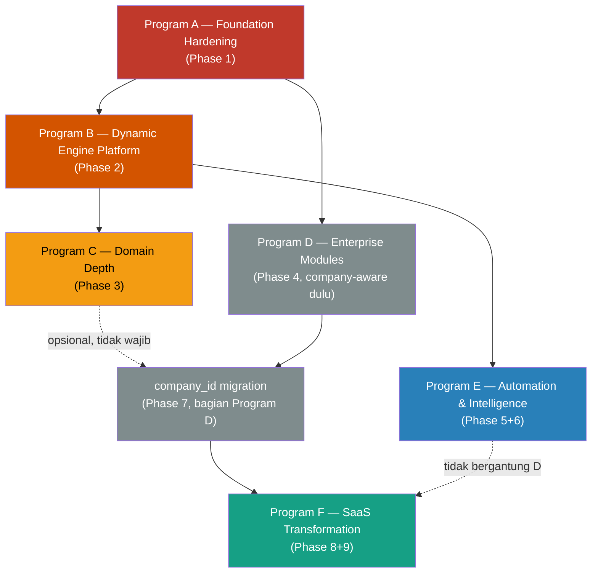

# 02 — Master Dependency Graph, Critical Path Analysis, Parallel Development Strategy

**Kedudukan dokumen ini:** Orkestrasi Baru sepenuhnya — tidak ada dokumen manapun yang memvisualisasikan dependency lintas-Program secara eksplisit sebagai satu graph. **Sumber data dependency individual:** [04-roadmap-governance-and-delivery.md § Foundational Engines Prioritization](../04-roadmap-governance-and-delivery.md#foundational-engines-prioritization) (12 item berurutan dengan kolom "Kenapa Urutan Ini") dan [01-capability-to-task-mapping.md](01-capability-to-task-mapping.md) (dependency per Epic). Dokumen ini **menyintesis** dependency yang sudah tersebar di berbagai tempat menjadi satu graph yang bisa dibaca sekali lihat.

---

## 1. Master Dependency Graph (Level Program)



**Cara membaca:** Panah A → B berarti **A wajib mencapai Definition of Done sebelum B dimulai** (hard dependency). Garis putus-putus C -.-> D2 berarti **dependency lunak** — Program C tidak wajib selesai sebelum Phase 7 dimulai, tapi keduanya sama-sama membutuhkan fondasi yang sudah solid dari A.

## 2. Kenapa Setiap Panah Ada (Justifikasi Teknis Eksplisit)

### A → B (Foundation Hardening → Dynamic Engine Platform) — **HARD DEPENDENCY, PALING KETAT**

**Alasan teknis:** Program B memindahkan logic approval-chain finansial-kritis (kasbon, change order, procurement) dari implementasi hardcode ke Workflow Engine generik. Ini adalah *refactoring* pada domain yang menangani uang sungguhan. Tanpa test suite (Program A item #2) sebagai jaring pengaman, migrasi ini tidak punya cara memverifikasi bahwa perilaku sebelum-dan-sesudah identik — persis anti-pattern yang [Engineering-Constitution/06-governance/31-refactoring-policy.md § Mandatory Rule #2](../Engineering-Constitution/06-governance/31-refactoring-policy.md#4-mandatory-rules) larang eksplisit ("Refactoring pada enam file finansial-kritis MUST disertai test... MUST NOT dilakukan tanpa jaring pengaman ini"). Tanpa Permission Engine konsisten (Program A item #1), Workflow Engine yang baru akan mewarisi celah otorisasi yang sama, hanya dipindah lokasinya.

**Bukti dari sumber:** [04-roadmap-governance-and-delivery.md](../04-roadmap-governance-and-delivery.md#foundational-engines-prioritization) item #5 secara eksplisit: *"harus dikerjakan setelah #2 (test coverage) ada sebagai jaring pengaman."*

### B → C (Dynamic Engine Platform → Domain Depth) — **HARD DEPENDENCY untuk sub-item spesifik**

**Alasan teknis:** Tiga Epic di Program C butuh approval chain generik: RFI dan Submittals ([01-capability-to-task-mapping.md § Capability 1](01-capability-to-task-mapping.md#capability-1--mengelola-anggaran--progres-proyek-domain-project-delivery-program-a--program-c)), dan **CECEP's Approval Workflow** (Estimate Version/Price Book/Lessons Learned, 3 titik pemakaian — [01-capability-to-task-mapping.md § Capability 6](01-capability-to-task-mapping.md#capability-6--cecep-cost-intelligence-core-domain-sales--pre-construction--project-delivery-program-c), evidence: [CECEP/47 §3](../CECEP/47-phase9-automation-architecture.md)). Membangun salah satu dari ketiganya sebelum Workflow Engine tersedia berarti implementasi hardcode approval tambahan (CECEP akan jadi yang **keempat**, setelah kasbon, change order lama, dan RFI/Submittals) yang harus dimigrasikan lagi nanti — investasi kerja yang dibuang dua kali.

**Catatan penting:** Ini **bukan** dependency untuk *seluruh* Program C — Epic lain (QC Checklist, HSE Incident Report, Punch List, dan bagian CECEP yang murni struktur data tanpa approval — Cost Code/Resource Identity/Assembly/Price Book Milestone 1-2, [CECEP/49](../CECEP/49-phase11-implementation-roadmap.md)) **tidak** butuh Workflow Engine dan bisa dimulai segera setelah Program A selesai, paralel dengan Program B. Lihat Bagian 4 (Parallel Strategy) untuk pemisahan ini.

### A → D1 (Foundation Hardening → Enterprise Modules Phase 4) — **HARD DEPENDENCY, minimal**

**Alasan teknis:** Modul Enterprise (Payroll/HR/GL dasar) dibangun *company-aware* sejak awal (tidak hardcode asumsi satu company) — ini butuh disiplin desain dasar yang sama dengan Permission Engine yang benar (tidak hardcode role, tidak hardcode company). Program A adalah prasyarat minimal, bukan prasyarat berat seperti B → C.

### D1 → D2 (Enterprise Modules → company_id Migration Phase 7) — **HARD DEPENDENCY by design, bukan berurutan waktu**

**Alasan teknis — ini dependency paling sering disalahpahami di seluruh roadmap:** [04-roadmap-governance-and-delivery.md § Phase 4](../04-roadmap-governance-and-delivery.md#phase-4--enterprise-modules) secara eksplisit menjelaskan modul Phase 4 dibangun **sebelum** `company_id` migration (Phase 7) secara *nomor fase*, tapi **bergantung secara konseptual** padanya untuk bernilai penuh. Resolusi doc 04: modul Phase 4 dirancang *single-company-aware* dulu, lalu "mendapat kesadaran multi-company saat Phase 7 menambahkan `company_id`." Panah D1 → D2 di graph ini berarti: kode Phase 4 **MUST NOT** hardcode asumsi satu company (larangan desain), bukan "Phase 4 harus menunggu Phase 7 selesai" (urutan waktu). Detail lengkap: [00-executive-delivery-vision.md § 3](00-executive-delivery-vision.md#3-program-structure--kontribusi-baru).

### B → E (Dynamic Engine Platform → Automation & Intelligence) — **HARD DEPENDENCY, paling eksplisit di doc 04**

**Alasan teknis:** AI Agent Registry (Phase 6, bagian Program E) memerlukan guardrail otorisasi yang solid — [03-platform-and-intelligence-architecture.md § AI Architecture](../03-platform-and-intelligence-architecture.md#ai-architecture) mendesain *least privilege* dan *no silent write* untuk setiap agent, keduanya bergantung penuh pada RBAC/PBAC yang sudah benar (Program A) **dan** approval chain generik yang bisa diintervensi manusia (Program B/Workflow Engine untuk HITL — [GLOSSARY.md — HITL](../Engineering-Constitution/GLOSSARY.md)).

**Bukti dari sumber:** [04-roadmap-governance-and-delivery.md § Risk Register item #7](../04-roadmap-governance-and-delivery.md#risk-register): *"AI Platform (Phase 6) dibangun sebelum Permission Engine benar-benar solid, mewariskan gap otorisasi ke agent yang punya jangkauan lebih luas dari manusia biasa"* — diklasifikasi risiko Security dengan mitigasi "Gate masuk Phase 6 eksplisit: Phase 1 & 2 harus selesai dan diverifikasi."

**Sub-dependency di dalam Program E:** Trigger/Event Engine (Phase 5) **MUST** selesai sebelum AI Agent Registry (Phase 6) — agent butuh event-driven trigger untuk beroperasi otomatis, bukan hanya dipicu manual.

### D2 → F (company_id Migration → SaaS Transformation) — **HARD DEPENDENCY struktural**

**Alasan teknis:** [01-application-and-data-architecture.md § Entity Strategy](../01-application-and-data-architecture.md#entity-strategy) menjelaskan L2 (multi-company) dan L3 (multi-tenant SaaS) **berbagi mekanisme data yang sama** — `company_id`/isolasi logis yang dibangun Phase 7 adalah fondasi teknis literal yang dipakai ulang Phase 8 (tenant = company dengan lapisan billing/provisioning di atasnya). Membangun Phase 8 tanpa Phase 7 berarti membangun mekanisme isolasi data dari nol dua kali.

### E -.-> F (Automation & Intelligence → SaaS Transformation) — **TIDAK ADA DEPENDENCY**

**Alasan teknis:** AI Agent Registry dan SaaS billing/tenant infrastructure adalah dua kapabilitas independen — AI bisa matang di L1/L2 sebelum SaaS transformation dimulai, dan sebaliknya SaaS bisa dimulai (jika pelanggan committed) tanpa menunggu seluruh 14 agent AI selesai. Digambar terpisah untuk menegaskan **tidak ada** dependency tersembunyi di sini yang perlu diwaspadai.

## 3. Critical Path Analysis

**Definisi Critical Path di konteks Blueprint ini:** rangkaian Program yang, jika salah satu tertunda, menunda **seluruh** kemampuan sistem mencapai L2 (multi-company) — bukan jalur yang menunda satu modul kosmetik.

```
Program A ──(hard)──> Program B ──(hard, sub-item)──> [RFI/Submittals di Program C]
    │
    └──(hard, minimal)──> Program D1 ──(hard, by design)──> Program D2 (company_id) ──(hard)──> Program F
```

**Critical Path Puraloka Suite mencapai L2 (multi-company):** Program A → Program D1 → Program D2. **Program B dan Program C TIDAK berada di critical path L2** — keduanya bernilai tinggi secara operasional (mengganti hardcode approval, memperdalam domain konstruksi) tapi tidak menghalangi pencapaian L2 jika sengaja ditunda.

**Implikasi strategis:** Jika tekanan bisnis mendesak pencapaian L2 lebih cepat (mis. anak perusahaan Puraloka Persada baru berdiri dan butuh dionboard), jalur tercepat secara teknis adalah **Program A → Program D1 → Program D2**, melewati Program B/C untuk sementara. Ini valid selama Program D1 tetap disiplin *company-aware by design* (tidak hardcode) — kualitas desain yang sama dituntut terlepas urutan eksekusi.

**Critical Path Puraloka Suite mencapai AI Native (Phase 6):** Program A → Program B → Program E. Tidak ada jalan pintas di sini — [04 § Risk Register item #7](../04-roadmap-governance-and-delivery.md#risk-register) eksplisit melarang shortcut ini karena konsekuensi keamanannya.

## 4. Parallel Development Strategy

Pekerjaan yang **valid dikerjakan bersamaan** tanpa saling menunggu — penting untuk tim kecil yang ingin memaksimalkan momentum tanpa melanggar dependency di atas:

| Bisa Paralel Dengan | Kondisi | Kenapa Aman |
|---|---|---|
| Program A item #1 (Permission Engine) ‖ item #2 (Test Suite) | Selalu | Area kode berbeda (auth logic vs test infrastructure); [04 § Foundational Engines](../04-roadmap-governance-and-delivery.md#foundational-engines-prioritization) eksplisit menyebut kedua item ini sebagai "Now" tanpa urutan wajib di antara keduanya |
| Program A item #3 (Dashboard persistence) ‖ item #1, #2 | Selalu | Item #3 "Rendah effort, Menengah impact" — quick win yang eksplisit didesain untuk momentum sambil item #1-2 yang lebih berat berjalan ([04](../04-roadmap-governance-and-delivery.md#foundational-engines-prioritization): "Baik untuk momentum sambil mengerjakan #1-2") |
| Program B item #5 (Workflow Engine) ‖ item #6 (Notification Routing Engine) | Setelah Program A selesai | Area kode berbeda; [04](../04-roadmap-governance-and-delivery.md#foundational-engines-prioritization) item #6 eksplisit: "Bisa dikerjakan paralel dengan #5 (berbeda area kode)" |
| Program C — Epic non-Workflow (QC Checklist, HSE, Punch List, **CECEP Milestone 1-2** — Cost Code/Resource Identity/Assembly/AHSP/Price Book) ‖ Program B | Setelah Program A selesai | Epic ini tidak bergantung Workflow Engine (lihat Bagian 2, B → C) — bisa mulai begitu Program A selesai, tidak perlu menunggu Program B. **CECEP Milestone 3-4** (Estimate Version Approval, Lessons Learned Propagation) TETAP butuh Program B — hanya Milestone 1-2 yang paralel-aman. |
| Program D1 (Enterprise Modules, disiplin company-aware) ‖ Program B/C | Setelah Program A selesai | Area kode berbeda (Payroll/HR/GL vs Workflow/domain konstruksi); dependency D1 hanya ke Program A, bukan B/C |

**Batasan realistis untuk tim solo/kecil:** paralelisme di atas adalah **paralelisme yang valid secara dependency**, bukan jaminan kapasitas eksekusi. Solo developer tidak benar-benar mengerjakan dua Program bersamaan — nilai praktisnya adalah **fleksibilitas urutan**: jika Program B ternyata lebih sulit dari estimasi, mengalihkan fokus sementara ke Epic Program C yang non-Workflow adalah pindah valid tanpa melanggar dependency, bukan kebuntuan menunggu. Lihat [03-team-topology-and-resourcing.md](03-team-topology-and-resourcing.md) untuk kapan paralelisme ini benar-benar bisa dieksekusi bersamaan (butuh kontributor kedua).

## 5. Dependency yang Sengaja TIDAK Ada (Mencegah Asumsi Salah)

Untuk mencegah pembaca menyimpulkan dependency yang tidak sengaja dimaksud:

- **Program C TIDAK bergantung pada Program D** — memperdalam domain konstruksi (RFI, QC, HSE) tidak butuh Enterprise Modules apa pun.
- **Program E (Automation/AI) TIDAK bergantung pada Program C atau D** — hanya bergantung A dan B, sesuai Bagian 2.
- **Observability rollout ([08-platform-rollout-orchestration.md](08-platform-rollout-orchestration.md)) TIDAK menghalangi Program manapun** — ia berjalan sebagai lapisan lintas-Program, idealnya paralel dengan deployment cloud pertama ([04 § Risk Register item #8](../04-roadmap-governance-and-delivery.md#risk-register)), bukan prasyarat sekuensial untuk Program tertentu.

## 6. References

- [04-roadmap-governance-and-delivery.md § Foundational Engines Prioritization](../04-roadmap-governance-and-delivery.md#foundational-engines-prioritization)
- [04-roadmap-governance-and-delivery.md § Phase 0-9 Transformation Program](../04-roadmap-governance-and-delivery.md#phase-0-9-transformation-program)
- [01-capability-to-task-mapping.md](01-capability-to-task-mapping.md)
- [01-application-and-data-architecture.md § Entity Strategy](../01-application-and-data-architecture.md#entity-strategy)
- [03-platform-and-intelligence-architecture.md § AI Architecture](../03-platform-and-intelligence-architecture.md#ai-architecture)
- [03-team-topology-and-resourcing.md](03-team-topology-and-resourcing.md)

---

*File selanjutnya: [03-team-topology-and-resourcing.md](03-team-topology-and-resourcing.md)*
