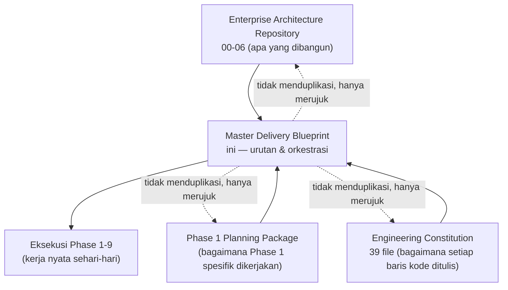

# Puraloka Suite — Master Delivery Blueprint

**Status:** Living document — mission control eksekusi.
**Kedudukan:** Lapisan orkestrasi di atas [Enterprise Architecture Repository (00-06)](../00-vision-and-business-architecture.md), [Phase 1 Planning Package](../Phase1/00-current-state-audit.md), dan [Engineering Constitution](../Engineering-Constitution/README.md). Blueprint **tidak menggantikan atau menduplikasi** ketiganya — ia menjawab pertanyaan yang belum dijawab satu pun dari ketiganya: *urutan eksekusi presisi, siapa mengerjakan apa, bagaimana 200+ file existing saling terhubung sebagai satu sistem.*
**Struktur & rasional:** [ADR-003 — Master Delivery Blueprint as Orchestration Layer](../adr/ADR-003-master-delivery-blueprint-as-orchestration-layer.md) — WAJIB dibaca sebelum menyunting dokumen ini, menjelaskan kenapa 15 dari 35 topik brief asli hanya direferensikan (bukan ditulis ulang) dan 20 lainnya adalah kontribusi baru sepenuhnya.

---

## Prinsip Tunggal yang Mengikat Seluruh Dokumen Ini

**Single Source of Truth, tanpa pengecualian.** Untuk topik apa pun yang sudah punya jawaban lengkap di Architecture Repository, Phase 1 Planning, atau Engineering Constitution, file Blueprint manapun **MUST** merujuk balik (link presisi ke section), **MUST NOT** memparafrase ulang isinya. Setiap file di bawah menyatakan eksplisit di headernya: **Referensi Penuh** (isi sudah lengkap di sumber lain, file ini hanya link + ringkasan orientasi), **Orkestrasi Baru** (konten yang benar-benar belum ada di dokumen manapun), atau **Campuran** (sebagian referensi, sebagian lapisan baru — ditandai per-section).

---

## Peta 14 File + Pemetaan ke 35 Item Brief Asli

| # File | Kedudukan | Item Brief Asli yang Dicakup |
|---|---|---|
| [00-executive-delivery-vision.md](00-executive-delivery-vision.md) | Campuran | 1. Executive Delivery Vision, 2. Delivery Principles, 3. Program Structure |
| [01-capability-to-task-mapping.md](01-capability-to-task-mapping.md) | **Orkestrasi Baru** | 4. Capability → Domain → Program → Initiative → Epic → Feature → Task mapping |
| [02-master-dependency-graph.md](02-master-dependency-graph.md) | **Orkestrasi Baru** | 5. Master Dependency Graph, 6. Critical Path Analysis, 7. Parallel Development Strategy |
| [03-team-topology-and-resourcing.md](03-team-topology-and-resourcing.md) | **Orkestrasi Baru** | 8. Team Topology (kondisi sekarang & saat tim bertambah) |
| [04-delivery-orchestration.md](04-delivery-orchestration.md) | Campuran | 9. Phase-by-Phase Delivery Plan, 10. Milestone Definition, 11. Exit Criteria, 12. Entry Criteria |
| [05-risk-and-debt-orchestration.md](05-risk-and-debt-orchestration.md) | Campuran | 13. Risk Register per phase, 14. Technical Debt Strategy, 15. Refactoring Strategy |
| [06-engineering-delivery-mechanics.md](06-engineering-delivery-mechanics.md) | Referensi Penuh | 16. Migration Strategy, 17. Release Strategy, 18. Branching Strategy, 19. Versioning Strategy, 20. Rollback Strategy |
| [07-quality-and-validation-gates.md](07-quality-and-validation-gates.md) | Campuran | 21. Testing Strategy Mapping, 22. Security Validation Gates, 23. Performance Validation Gates |
| [08-platform-rollout-orchestration.md](08-platform-rollout-orchestration.md) | Campuran | 24. Observability Rollout, 25. AI & Automation Rollout, 26. UI/UX Rollout |
| [09-saas-and-tenancy-readiness.md](09-saas-and-tenancy-readiness.md) | Campuran | 27. SaaS Readiness Strategy, 28. Multi-company & Multi-tenant Readiness |
| [10-kpi-and-fitness-functions.md](10-kpi-and-fitness-functions.md) | **Orkestrasi Baru** | 29. KPI Engineering, 30. KPI Product, 31. KPI Business, 32. Architecture Fitness Functions |
| [11-decision-gates-and-change-management.md](11-decision-gates-and-change-management.md) | Campuran | 33. Decision Gates, 34. Change Management Process, 35. Continuous Improvement Process |
| [12-traceability-matrix.md](12-traceability-matrix.md) | **Orkestrasi Baru** | *(Tidak diminta eksplisit di 35-list asli, diminta user di pesan susulan)* — Cross-Document Traceability Matrix + Master Capability Matrix index |
| [13-implementation-kickoff-playbook.md](13-implementation-kickoff-playbook.md) | **Orkestrasi Baru** | *(Ditambahkan pasca-[Implementation-Kickoff/](../Implementation-Kickoff/00-executive-summary.md) selesai)* — template 11-bagian reusable untuk kickoff package Program 2-9, TIDAK diisi sekarang (YAGNI — ditulis saat gilirannya tiba, lihat § Prinsip Governing di file itu) |

---

## Cara Membaca Dokumen Ini — 4 Jalur Baca

### Jalur 1 — CTO / Investor Due Diligence (Orientasi Cepat, 30 Menit)
Baca berurutan: [00](00-executive-delivery-vision.md) → [01](01-capability-to-task-mapping.md) → [02](02-master-dependency-graph.md) → [10](10-kpi-and-fitness-functions.md). Empat file ini menjawab "apa yang dibangun, dalam urutan apa, diukur bagaimana" tanpa perlu membuka dokumen sumber.

### Jalur 2 — Engineering Manager / Tech Lead (Perencanaan Eksekusi)
Baca [02](02-master-dependency-graph.md), [03](03-team-topology-and-resourcing.md), [04](04-delivery-orchestration.md), [05](05-risk-and-debt-orchestration.md) — menjawab "siapa mengerjakan apa, kapan, dependency apa yang harus selesai dulu."

### Jalur 3 — Tech Lead / DevOps / Security Engineer (Mekanika Eksekusi)
Baca [06](06-engineering-delivery-mechanics.md), [07](07-quality-and-validation-gates.md), [08](08-platform-rollout-orchestration.md) — sebagian besar isi file ini adalah link ke [Engineering Constitution](../Engineering-Constitution/README.md), gunakan file ini sebagai peta navigasi cepat, bukan sumber detail.

### Jalur 4 — Siapa Pun yang Mencari "Di Mana X Dibahas?"
Langsung ke [12-traceability-matrix.md](12-traceability-matrix.md) — index tunggal yang memetakan setiap kapabilitas/modul/engine ke lokasi persisnya di seluruh corpus dokumen (Architecture Repository, Phase1, Engineering Constitution, Blueprint sendiri).

---

## Hubungan dengan Dokumen Lain

**Prinsip:** Architecture Repository menjawab *apa*. Phase 1 Planning menjawab *bagaimana Phase 1 spesifik*. Engineering Constitution menjawab *bagaimana kode ditulis*. Master Delivery Blueprint menjawab ***kapan, dalam urutan apa, oleh siapa, dan bagaimana semuanya terhubung sebagai satu sistem eksekusi*** — pertanyaan yang sebelumnya tidak dijawab dokumen manapun.

---

*Mulai membaca dari [00-executive-delivery-vision.md](00-executive-delivery-vision.md).*
