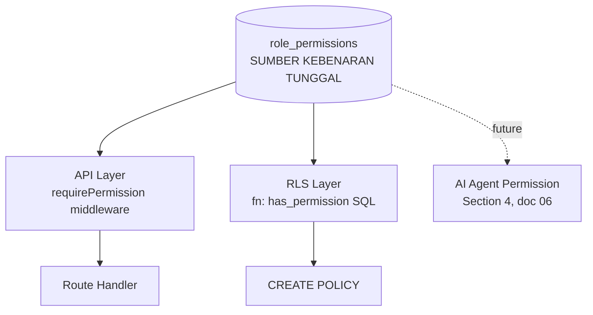

# Phase 1 — 02. Target Architecture

**Upstream:** Menutup gap dari [01 — Gap Analysis](01-gap-analysis.md). Mendalami desain yang sudah digariskan di [01 — Application & Data Architecture](../01-application-and-data-architecture.md) (Dynamic Permission Engine, Dynamic Workflow Engine) dengan skema SQL dan kontrak API konkret.
**Status:** Planning only — skema di bawah adalah desain, bukan migration yang sudah dijalankan.
**Standar rekayasa:** Clean Architecture, dependency inversion, idempotency — lihat penerapan konkret per komponen di bawah, bukan sekadar jargon.

---

## Struktur Dokumen: Sub-Fase 1A – 1D

Sesuai kesepakatan, "Phase 1" di sini adalah payung besar berisi 4 sub-fase. Dokumen ini didesain per sub-fase, dengan setiap sub-fase menghasilkan komponen yang independen bisa diverifikasi (working software), bukan satu big-bang.

### Crosswalk — Sub-Fase Ini vs Roadmap Makro Doc 04

| Sub-Fase di Sini | Isi | Setara dengan Phase 0-9 [Doc 04](../04-roadmap-governance-and-delivery.md) |
|---|---|---|
| **1A — Security Foundation** | Permission Engine v2, RLS sinkron, Audit v2, Financial Test Suite, CI/CD | **= Phase 1** doc 04 persis (cakupan tidak berubah, hanya didetailkan) |
| **1B — Configuration Foundation** | Configuration Engine, Menu Registry, Module Registry, Feature Flag | Perluasan dari **Phase 2** doc 04 (yang sebelumnya fokus Workflow+Notification saja) — lihat catatan di [05-rollout-plan.md](05-rollout-plan.md) soal urutan |
| **1C — Workflow Foundation** | Workflow Registry, Approval/SLA/Escalation/Delegation Engine | **= Phase 2** doc 04 (Dynamic Workflow Engine), diperdalam dengan SLA/Escalation/Delegation yang sebelumnya belum dirinci |
| **1D — Platform Foundation** | Structured Logging, Correlation ID, Metrics, Tracing prep | Elaborasi dari **Observability** yang di doc 03 ditandai `Next` setelah CI/CD (bagian dari Phase 1 doc 04 juga, karena CI/CD dan observability saling terkait erat) |

**Prinsip yang tidak berubah:** 1A adalah prasyarat keras untuk 1B/1C/1D — tidak ada yang boleh dimulai sebelum 1A selesai dan diverifikasi (lihat [05-rollout-plan.md](05-rollout-plan.md) untuk urutan eksekusi presisi).

---

## SUB-FASE 1A — Security Foundation

### 1A.1 Permission Engine v2 — Desain Konsolidasi

**Prinsip arsitektur:** Satu sumber kebenaran (`role_permissions`), dikonsumsi oleh **tiga** konsumen yang saat ini masing-masing punya jalur berbeda — API layer, RLS layer, dan (di masa depan) AI Agent layer ([06 — AI Architecture](../06-agentic-ai-and-automation-architecture.md)) — supaya ketiganya tidak pernah divergen lagi.



**Perubahan konkret di `apps/api/src/plugins/auth.ts`:**

| Sebelum | Sesudah |
|---|---|
| `requireRole(...roles)` — hardcoded array | **Dihapus total** setelah 4 call site bermigrasi |
| `requirePermission(key)` — sudah ada, dipertahankan | Dipertahankan, **cakupan diperluas** ke 21 authorization-gate inline yang teridentifikasi |
| Inline `.role === 'x'` untuk otorisasi | Dihapus untuk 21 kasus authorization-gate; **dipertahankan** untuk 36 kasus data-scoping (dengan komentar eksplisit menandai jenisnya) |

**Kontrak API tidak berubah** — `requirePermission(key: string)` tetap punya tanda tangan yang sama. Ini penting untuk migration strategy (lihat [03-migration-strategy.md](03-migration-strategy.md)): refactor ini adalah *penggantian isi*, bukan *perubahan interface*, sehingga risiko regresi ke pemanggil lebih rendah.

**RBAC → PBAC/ABAC — Interpretasi Realistis untuk Phase 1:**

Brief meminta dukungan RBAC + ABAC + PBAC eksplisit. Berikut posisi jujur masing-masing untuk Phase 1 (bukan seluruh horizon produk):

| Model | Status Phase 1 | Rationale |
|---|---|---|
| **RBAC** | ✅ Dikonsolidasi penuh (ini fokus utama 1A) | Sudah ada fondasinya (migration 050), tinggal disatukan |
| **PBAC** (Policy-Based) | 🟡 Fondasi diletakkan, implementasi minimal | Kasus nyata yang sudah teramati di kode (PM hanya boleh approve kasbon untuk proyek yang dia pimpin — `finance.ts:273` dkk) adalah PBAC sederhana: kombinasi role + resource ownership. Desain skema mengakomodasi ini (lihat 1A.1.1), tapi **generalisasi penuh PBAC (arbitrary policy rules) ditunda ke Phase 1C/2** — Phase 1A hanya menutup pola yang **sudah ada** di kode, bukan membangun policy engine generik dari nol |
| **ABAC** (Attribute-Based) | 🔴 Tidak dalam cakupan Phase 1 | Butuh atribut environment (waktu, lokasi, device) yang belum ada kebutuhan nyata — mendesain ABAC generik sekarang adalah *fantasy architecture* yang eksplisit dilarang prinsip governing [00](../00-vision-and-business-architecture.md#non-goals). Dicatat sebagai kapabilitas masa depan (skema di bawah menyisakan ruang, tidak menutup opsi), bukan dikerjakan sekarang |

#### 1A.1.1 Skema Perluasan — Row/Field/Action Permission

Brief eksplisit meminta *field permissions*, *row permissions*, *action permissions*, *project scoped*, *company scoped*. Desain skema:

```sql
-- Perluasan tabel permissions (migration 050) — TIDAK mengubah struktur existing,
-- menambah kolom opsional untuk granularitas lebih halus
ALTER TABLE permissions ADD COLUMN scope_type TEXT DEFAULT 'global'
  CHECK (scope_type IN ('global', 'project', 'company', 'field', 'row'));
ALTER TABLE permissions ADD COLUMN resource_type TEXT NULL; -- mis. 'kasbon', 'invoice'

-- Tabel baru — row-level permission override per user (bukan role)
-- Contoh kasus nyata: PM hanya boleh approve kasbon di proyek yang dia pimpin
CREATE TABLE permission_scopes (
  id UUID PRIMARY KEY DEFAULT gen_random_uuid(),
  user_id UUID NOT NULL REFERENCES users(id),
  permission_key TEXT NOT NULL REFERENCES permissions(key),
  scope_type TEXT NOT NULL, -- 'project' | 'company' (future)
  scope_id UUID NOT NULL,   -- project_id atau company_id
  created_at TIMESTAMPTZ DEFAULT now()
);
CREATE INDEX idx_permission_scopes_user ON permission_scopes(user_id, permission_key);
```

**Kenapa desain ini, bukan yang lebih rumit:** `permission_scopes` menggeneralisasi pola PM-ownership yang **sudah ada** di 21 baris inline yang ditemukan — bukan spekulasi. Field-level permission (mis. "role X tidak boleh lihat kolom margin") **tidak diimplementasikan di Phase 1A** — tidak ada kasus nyata yang teramati di audit, kolom `scope_type = 'field'` disiapkan di enum tapi implementasinya ditunda sampai ada kebutuhan konkret (konsisten prinsip YAGNI yang mengikat seluruh repository ini).

### 1A.2 RLS Refactor — Desain Sinkronisasi

**Pendekatan: Function-based policy, bukan rewrite semua 110 CREATE POLICY secara manual satu-satu.**

```sql
-- Function baru — satu sumber kebenaran yang dibaca RLS DAN API
CREATE OR REPLACE FUNCTION has_permission(permission_key TEXT)
RETURNS BOOLEAN LANGUAGE sql STABLE SECURITY DEFINER AS $$
  SELECT EXISTS (
    SELECT 1 FROM role_permissions rp
    JOIN roles r ON rp.role_id = r.id
    JOIN permissions p ON rp.permission_id = p.id
    WHERE r.name = auth_role() AND p.key = permission_key
  )
$$;

-- Pola policy BARU (menggantikan literal role check)
CREATE POLICY "kasbons_view"
  ON kasbons FOR SELECT
  USING (has_permission('mandor:kasbon:view') OR has_permission('finance:kasbon:view_all'));
```

**Strategi migrasi 45 tabel (detail lengkap di [03-migration-strategy.md](03-migration-strategy.md)):** Bukan big-bang — per-tabel, dimulai dari yang risiko terendah (tabel referensi read-mostly) menuju yang tertinggi (kasbon, invoice, payment). Setiap tabel yang dimigrasikan **diverifikasi dengan test RLS eksplisit** sebelum lanjut ke tabel berikutnya (lihat [06-test-strategy.md](06-test-strategy.md)).

**Dual-axis untuk L2 (disiapkan strukturnya sekarang, tidak diaktifkan sekarang):** Sesuai [01 — Row Level Security](../02-security-and-compliance-architecture.md#row-level-security--tenant-isolation), begitu `company_id` ditambahkan (Phase 7, bukan Phase 1), policy baru ini tinggal ditambah `AND company_id = auth_company_id()` — desain function-based ini sengaja dipilih supaya ekstensi itu adalah penambahan klausa, bukan rewrite ulang.

### 1A.3 Audit Trail v2 — Helper Terpusat

```ts
// apps/api/src/utils/audit.ts (BARU)
interface AuditEntry {
  tableName: string
  recordId: string
  action: string
  actorId: string
  oldValues?: Record<string, unknown>
  newValues?: Record<string, unknown>
  severity?: 'info' | 'warning' | 'critical'
  reason?: string
  correlationId?: string   // dari request context, lihat 1D
  workflowId?: string      // null sampai Workflow Registry (1C) ada
}

export async function logAuditEvent(
  request: FastifyRequest,
  entry: AuditEntry
): Promise<void> {
  // Ambil ip_address, user_agent OTOMATIS dari request context —
  // menghilangkan kelas bug "lupa isi field" yang jadi akar masalah gap 3
  const diff = entry.oldValues && entry.newValues
    ? computeDiff(entry.oldValues, entry.newValues)
    : null

  await supabase.from('audit_logs').insert({
    ...entry,
    ip_address: request.ip,
    user_agent: request.headers['user-agent'],
    diff,
  }).then(logErrorNonBlocking) // fire-and-forget, TIDAK PERNAH throw ke main request
}
```

**Prinsip kunci yang diwarisi dari pola notifikasi yang sudah matang di codebase** ([CLAUDE.md](../../../../../CLAUDE.md) — "semua insert notifikasi non-blocking"): audit log insert **tidak pernah** memblokir atau menggagalkan request utama — pola yang sama persis diterapkan di sini, bukan pola baru.

**Idempotency:** Setiap panggilan `logAuditEvent` idempotent secara alami (INSERT murni, tidak pernah UPDATE) — tidak butuh idempotency key tambahan untuk sub-sistem ini (berbeda dari [Automation catalog](../06-agentic-ai-and-automation-architecture.md#queue-strategy-retry-strategy-dead-letter-queue-idempotency-strategy) yang butuh idempotency key karena melibatkan retry pada operasi finansial).

### 1A.4 Financial Test Suite — Arsitektur Test

Detail lengkap di [06-test-strategy.md](06-test-strategy.md). Ringkasan keputusan arsitektur: **Vitest** (bukan Jest) — alasan: startup lebih cepat, native ESM support cocok dengan stack Fastify+TypeScript modern, konfigurasi lebih ringan untuk tim kecil. Test dibagi 2 lapis:
- **Unit test** — logic kalkulasi murni (EVM formula, tax calculation, retention calculation) diekstrak jadi pure function yang testable tanpa database.
- **Integration test** — alur kasbon/CO/procurement end-to-end lewat test database terisolasi (Supabase local atau schema terpisah).

### 1A.5 CI/CD Foundation

```yaml
# .github/workflows/ci.yml (desain, belum dibuat)
on: [pull_request]
jobs:
  test:
    steps:
      - lint (eslint, existing)
      - typecheck (tsc --noEmit)
      - test (vitest run, dari 1A.4)
      - build (next build, tsx compile check)
```

**Skala minimal disengaja:** Tidak ada deployment otomatis di 1A — CI hanya *gate*, bukan *deploy pipeline*. Deployment tetap manual sampai keputusan platform hosting dibuat (di luar cakupan Phase 1).

---

## SUB-FASE 1B — Configuration Foundation

### 1B.1 Configuration Engine

```sql
CREATE TABLE company_settings (
  id UUID PRIMARY KEY DEFAULT gen_random_uuid(),
  key TEXT NOT NULL UNIQUE,        -- 'tax.ppn_rate', 'tax.pph_final_rate'
  value JSONB NOT NULL,
  value_type TEXT NOT NULL,        -- 'number' | 'string' | 'boolean' | 'json'
  category TEXT NOT NULL,          -- 'tax' | 'approval' | 'notification'
  description TEXT,
  updated_by UUID REFERENCES users(id),
  updated_at TIMESTAMPTZ DEFAULT now()
);
```

**Cakupan realistis Phase 1B (mengikuti temuan Gap 9):** Hanya migrasi **tax rate** (satu-satunya hardcode nyata). Approval limits, payment terms, quotation validity **bukan** cakupan 1B — itu fitur baru yang lebih tepat menunggu Workflow Registry (1C) sebagai rumahnya, atau modul yang sendiri belum ada (Tender/Sales).

### 1B.2 Menu Registry

```sql
CREATE TABLE menu_items (
  id UUID PRIMARY KEY DEFAULT gen_random_uuid(),
  parent_id UUID REFERENCES menu_items(id),
  label TEXT NOT NULL,
  href TEXT,
  icon TEXT,
  required_permission TEXT REFERENCES permissions(key),
  sort_order INT NOT NULL DEFAULT 0,
  company_id UUID NULL,  -- nullable sekarang, dipakai mulai L2
  is_active BOOLEAN DEFAULT true
);
```

`sidebar.tsx` direfactor jadi **renderer generik** yang query `menu_items` (di-cache client-side, invalidated saat admin ubah struktur menu) alih-alih JSX hardcoded. Visibility logic (`perms.has(...)`) **dipertahankan** — hanya sumber datanya yang pindah dari array literal ke tabel.

### 1B.3 Module Registry & Feature Flags

```sql
CREATE TABLE modules (
  id UUID PRIMARY KEY DEFAULT gen_random_uuid(),
  key TEXT NOT NULL UNIQUE,       -- 'procurement', 'change_orders'
  label TEXT NOT NULL,
  is_enabled BOOLEAN DEFAULT true,
  min_plan_tier TEXT NULL,        -- disiapkan untuk L3 SaaS plan gating, NULL = semua tier
  created_at TIMESTAMPTZ DEFAULT now()
);

CREATE TABLE feature_flags (
  id UUID PRIMARY KEY DEFAULT gen_random_uuid(),
  key TEXT NOT NULL UNIQUE,
  is_enabled BOOLEAN DEFAULT false,
  rollout_pct INT DEFAULT 100 CHECK (rollout_pct BETWEEN 0 AND 100), -- untuk gradual rollout masa depan
  company_id UUID NULL,           -- NULL = global, terisi mulai L2 untuk override per-company
  created_at TIMESTAMPTZ DEFAULT now()
);
```

**Rationale `modules` terpisah dari `feature_flags`:** `modules` adalah unit bisnis besar (Procurement on/off) yang berelasi dengan Menu Registry dan Module Catalog ([00 — Module Catalog](../00-vision-and-business-architecture.md#module-catalog--tiering)); `feature_flags` adalah unit lebih granular untuk eksperimen/rollout bertahap fitur individual di dalam satu modul. Memisahkan keduanya mencegah satu tabel dipakai untuk dua tujuan berbeda yang query pattern-nya beda.

---

## SUB-FASE 1C — Workflow Foundation

Skema dasar (`workflow_definitions`/`states`/`transitions`) **sudah didesain** di [01 — Dynamic Workflow & Approval Engine](../01-application-and-data-architecture.md#dynamic-workflow--approval-engine). Bagian ini **memperdalam** dengan 4 engine tambahan yang diminta brief dan belum dirinci di sana.

```sql
-- Perluasan skema workflow_transitions (bukan tabel baru terpisah)
ALTER TABLE workflow_transitions ADD COLUMN sla_hours INT NULL;
ALTER TABLE workflow_transitions ADD COLUMN escalation_role TEXT NULL REFERENCES roles(name);
ALTER TABLE workflow_transitions ADD COLUMN approval_mode TEXT DEFAULT 'sequential'
  CHECK (approval_mode IN ('sequential', 'parallel', 'any_one'));

-- Tabel baru — delegasi approval sementara (mis. PM cuti, delegasikan ke admin)
CREATE TABLE approval_delegations (
  id UUID PRIMARY KEY DEFAULT gen_random_uuid(),
  delegator_id UUID NOT NULL REFERENCES users(id),
  delegate_id UUID NOT NULL REFERENCES users(id),
  workflow_key TEXT NULL,  -- NULL = semua workflow, atau spesifik ('kasbon_approval')
  starts_at TIMESTAMPTZ NOT NULL,
  ends_at TIMESTAMPTZ NOT NULL,
  created_at TIMESTAMPTZ DEFAULT now()
);

-- Tabel baru — instance tracking untuk SLA/escalation reminder
CREATE TABLE workflow_instances (
  id UUID PRIMARY KEY DEFAULT gen_random_uuid(),
  workflow_key TEXT NOT NULL,
  entity_type TEXT NOT NULL,   -- 'kasbon', 'change_order'
  entity_id UUID NOT NULL,
  current_state TEXT NOT NULL,
  entered_state_at TIMESTAMPTZ DEFAULT now(),
  sla_deadline TIMESTAMPTZ NULL,
  escalated_at TIMESTAMPTZ NULL,
  correlation_id UUID NULL  -- link ke audit_logs.correlation_id, Gap 4
);
```

**Approval Mode — pemetaan ke kebutuhan brief:**
- **Sequential** — approval berurutan (A dulu, baru B) — pola default kasbon/CO hari ini.
- **Parallel** — semua approver harus setuju, urutan tidak masalah.
- **Any-one** — cukup satu dari beberapa approver yang eligible (mis. "PM manapun yang meng-handle proyek ini").

**Reminder/Timeout — bukan engine terpisah, konsumen dari `workflow_instances.sla_deadline`:** Job terjadwal (`pg-boss`, sesuai [03 — Automation Platform](../03-platform-and-intelligence-architecture.md#automation-platform--event-platform)) query `workflow_instances` yang `sla_deadline < now()` dan `escalated_at IS NULL` → trigger notifikasi eskalasi ke `escalation_role`. Ini **bukan** sistem baru — reuse Notification Engine yang sudah direncanakan `Next` di architecture repo utama.

**Migrasi 3 modul existing (kasbon, CO, procurement) ke engine ini** adalah pekerjaan **strangler-fig** (dijelaskan detail di [03-migration-strategy.md](03-migration-strategy.md)) — dimulai dari kasbon (paling sederhana), bukan seluruhnya sekaligus.

---

## SUB-FASE 1D — Platform Foundation (Observability)

### 1D.1 Structured Logging — Environment-Aware

```ts
// apps/api/src/index.ts — DESAIN, bukan sudah diimplementasi
const isProduction = process.env.NODE_ENV === 'production'

const app = Fastify({
  logger: isProduction
    ? { level: 'info' }  // structured JSON ke stdout, TANPA pino-pretty transport
    : { transport: { target: 'pino-pretty', options: { colorize: true } } },
  genReqId: () => crypto.randomUUID(),  // Correlation ID — lihat 1D.2
})
```

**Perubahan minimal, dampak besar:** Ini adalah perbaikan konfigurasi, bukan penggantian logger — Pino sudah dipakai (`pino-pretty` cuma transport-nya), jadi structured JSON di production adalah **matter of removing the pretty transport in prod**, bukan migrasi library.

### 1D.2 Correlation ID — Dibagikan Lintas Sub-Sistem

`genReqId` Fastify (built-in, sudah tersedia tanpa dependency baru) menghasilkan UUID per-request — **ID yang sama ini** dipakai untuk:
1. Structured log correlation (setiap log line request yang sama punya `reqId` sama)
2. `audit_logs.correlation_id` (Gap 4, 1A.3) — audit event yang terjadi dalam satu request bisa dikorelasikan
3. `workflow_instances.correlation_id` (1C) — melacak instance workflow balik ke request yang memicunya

**Prinsip:** satu ID, tiga konsumen — bukan tiga sistem ID terpisah yang harus disinkronkan manual.

### 1D.3 Metrics & Tracing — Persiapan, Bukan Implementasi Penuh

Sesuai instruksi brief ("even if full implementation comes later") dan [03 — Observability Architecture](../03-platform-and-intelligence-architecture.md#observability-architecture) yang sudah menetapkan target OpenTelemetry:

**Cakupan Phase 1D (persiapan saja):**
- [ ] Tambahkan `@fastify/otel` sebagai dependency (belum dikonfigurasi aktif — instalasi + import saja)
- [ ] Definisikan **RED metrics** yang akan diekspos nanti (request rate, error rate, duration) — sebagai dokumentasi kontrak, bukan dashboard yang jalan
- [ ] `/health` endpoint diperluas untuk cek konektivitas database (bukan hanya enumerasi route)

**Eksplisit TIDAK dalam cakupan Phase 1D:** Deploy Prometheus/Grafana/Loki/Tempo sungguhan — itu butuh keputusan hosting/infrastruktur yang di luar cakupan "Core Platform Foundation" (baru relevan begitu ada deployment cloud pertama, konsisten dengan [04 — Foundational Engines Prioritization](../04-roadmap-governance-and-delivery.md#foundational-engines-prioritization) item observability).

---

## Prinsip Rekayasa yang Diterapkan Konkret (Bukan Jargon)

| Prinsip | Penerapan Nyata di Desain Atas |
|---|---|
| **Dependency Inversion** | Route handler bergantung pada abstraksi `requirePermission(key)`, bukan implementasi konkret RBAC — memungkinkan PBAC/ABAC ditambah nanti tanpa mengubah route handler |
| **Idempotency** | `logAuditEvent` adalah INSERT murni; `has_permission()` SQL function adalah `STABLE` (deterministik untuk transaksi yang sama) |
| **Testability** | Kalkulasi finansial (EVM, tax, retention) diekstrak jadi pure function terpisah dari route handler — bisa ditest tanpa HTTP/DB |
| **Secure by Default** | `has_permission()` return `false` untuk permission key yang tidak dikenal (fail-closed), bukan `true` |
| **Modular Monolith** (bukan microservices) | Seluruh desain di atas tetap satu proses Fastify — konsisten dengan [01 — Modular Monolith Strategy](../01-application-and-data-architecture.md#modular-monolith-strategy), tidak ada service baru diperkenalkan di Phase 1 |

---

*Dokumen selanjutnya: [03 — Migration Strategy](03-migration-strategy.md) — urutan eksekusi teknis presisi untuk setiap perubahan skema di atas, termasuk rollback per langkah.*
