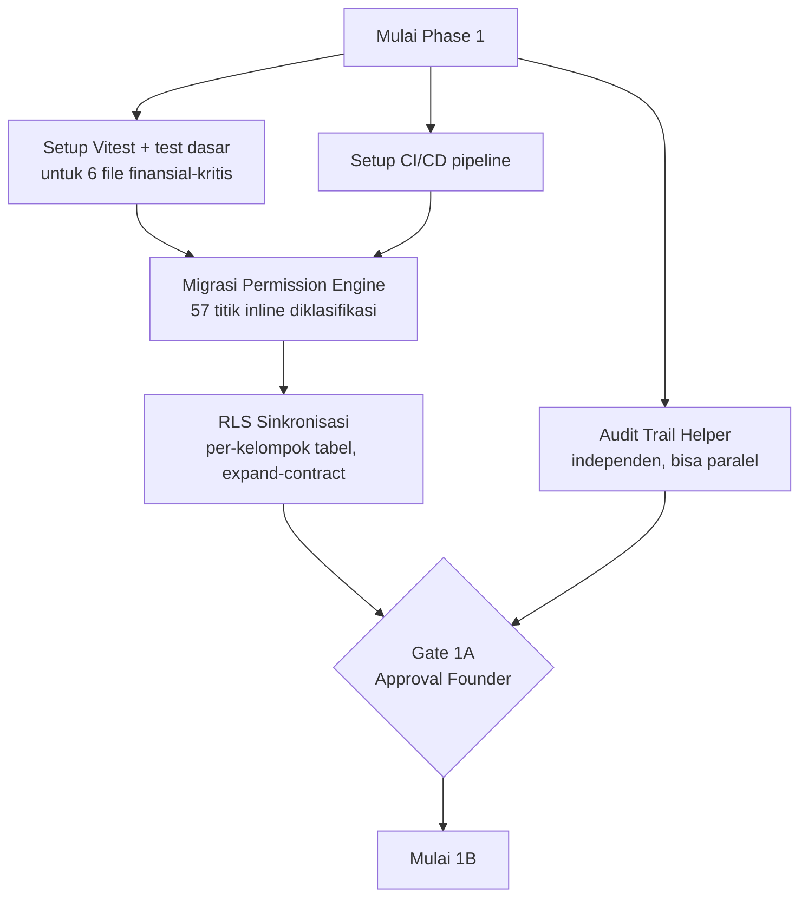

# Phase 1 — 05. Rollout Plan

**Upstream:** Mengeksekusi [02 — Target Architecture](02-target-architecture.md) sesuai [03 — Migration Strategy](03-migration-strategy.md), memitigasi [04 — Risk Register](04-risk-register.md).
**Status:** Planning only — dokumen ini adalah jadwal *urutan dan gate*, bukan tanggal kalender (konsisten [04 — Roadmap utama](../04-roadmap-governance-and-delivery.md#assumptions--non-goals): "tidak menjadwalkan tanggal kalender pasti").

---

## Crosswalk Lengkap — Roadmap 12-Fase Founder ↔ Phase 0-9 Doc 04

Ini adalah pemetaan resmi yang mengonfirmasi bahwa roadmap 12-fase (0-11) yang disusun founder **selaras penuh** dengan Phase 0-9 di [04 — roadmap utama](../04-roadmap-governance-and-delivery.md#phase-0-9-transformation-program) — bukan roadmap kedua yang bersaing. Doc 04 tetap **satu-satunya roadmap makro resmi**; tabel ini adalah alat navigasi.

| Fase Founder (12-fase) | Fokus | Setara Phase Doc 04 | Catatan Selarasan |
|---|---|---|---|
| **0 — Blueprint** | Vision, Architecture, Security, Platform, UI/UX, AI Strategy, Governance, Roadmap | **Phase 0** | Identik — 7 dokumen architecture repo = Phase 0 doc 04. **✅ Selesai.** |
| **1 — Foundation** (1A-1D) | Security, Config, Workflow, Platform Foundation | **Phase 1 + Phase 2** | 1A = Phase 1 doc 04 persis. 1B/1C/1D = perluasan+percepatan sebagian dari Phase 2 doc 04 (Workflow Engine) — lihat catatan urutan di bawah |
| **2 — Construction ERP** | RFI, Submittals, Punch List, GL/COA, Budget Control, RFQ, Payroll | **Phase 3 + Phase 4** | Setara gabungan "Construction Core Modules" (Phase 3) + "Enterprise Modules" (Phase 4) doc 04 — dua fase doc 04 di-zoom-out jadi satu fase di sini, isinya sama |
| **3 — Multi Company** | `company_id`, inter-company, consolidated reporting | **Phase 7** | Identik konsep, penomoran beda — Phase 7 doc 04 eksplisit "Multi Company Support" |
| **4 — Intelligence Platform** | Data Warehouse, BI, Forecasting, Risk Engine | **Bagian dari Phase 6** (elaborasi BI/analytics dari [03 — Platform Architecture](../03-platform-and-intelligence-architecture.md)) | Doc 04 tidak menomori BI/Intelligence sebagai fase terpisah — ini valid sebagai **zoom-in** pada kapabilitas yang di doc 03 sudah disinggung (Business Intelligence lanjutan, `Later`) tapi belum dipecah jadi sub-fase eksplisit |
| **5 — Integration Platform** | API Gateway, Event Bus, Webhook, Marketplace | **Bagian dari Phase 5 + Phase 6** | Event Bus/Webhook sudah ada di [03 — Automation Platform](../03-platform-and-intelligence-architecture.md#automation-platform--event-platform) (Phase 5 doc 04); Integration Marketplace pihak-ketiga adalah `Tier 3`/`Later` di [Module Catalog](../00-vision-and-business-architecture.md#module-catalog--tiering), realistis Phase 6+ |
| **6 — AI Platform** | AI Gateway, Model Router, Prompt Registry | **Phase 6** | Identik — ini persis isi [06 — Section 2](../06-agentic-ai-and-automation-architecture.md#section-2--automation-platform-architecture) |
| **7 — AI Agents** | 14 Agent aktif | **Phase 6 (lanjutan)** | Identik — [06 — Section 4 Unified Agent Catalog](../06-agentic-ai-and-automation-architecture.md#section-4--unified-ai-agent-catalog) |
| **8 — WhatsApp Copilot** | WA Financial Input, Voice Accounting, dst | **Phase 6 (sub-fase 6A-6D)** | Identik — [06 — Section 7 Implementation Roadmap](../06-agentic-ai-and-automation-architecture.md#section-7--implementation-roadmap) sudah memetakan ini persis ke dalam Phase 6 doc 04 |
| **9 — SaaS Foundation** | Tenant Provisioning, Billing, Entitlement | **Phase 8** | Identik — Phase 8 doc 04 "Multi Tenant SaaS Platform", gate ketat butuh pelanggan eksternal nyata |
| **10 — Construction OS Ecosystem** | Marketplace, Partner, Plugin SDK | **Bagian dari Phase 8 (lanjutan) + Phase 9** | Ekosistem pihak ketiga logis setelah SaaS foundation matang — doc 04 Phase 9 "Enterprise Scale Platform" adalah horizon yang sama, sengaja tidak dirinci mendalam ([01 — Target Architecture L3-L4](../01-application-and-data-architecture.md#target-architecture-l3-l4): "sengaja digambar kasar") |
| **11 — Regional Enterprise Scale** | Multi Region, Multi Currency, Data Residency | **Phase 9** | Identik — "Enterprise Scale Platform" doc 04 sudah eksplisit mencakup multi-region jika L4 terjadi |

**Kesimpulan crosswalk:** Tidak ada konflik struktural. Perbedaan yang ada murni **granularitas penomoran** (12 fase vs 10 fase) — bukan perbedaan urutan dependency atau prioritas. Prinsip yang dikutip founder — *"arsitektur harus mendukung opsi masa depan tanpa membayar biaya masa depan hari ini"* — adalah prinsip yang sama yang sudah mengikat setiap keputusan `Later`/`Optional` di seluruh 7 dokumen architecture repo.

---

## Fokus Dokumen Ini: Urutan Eksekusi Detail untuk Phase 1 (1A → 1B → 1C → 1D)

### Prinsip Urutan yang Tidak Bisa Ditawar

**1A tidak boleh dianggap selesai sebelum test suite + permission/RLS refactor keduanya lulus verifikasi.** Ini bukan preferensi — ini konsekuensi langsung dari R5 di [Risk Register](04-risk-register.md#r5--refactor-kasbonco procurement-tanpa-test-coverage-menghasilkan-regresi-silent): merefactor logic finansial-kritis tanpa jaring pengaman adalah risiko yang tidak sepadan.

**Urutan internal 1A (bukan sekuensial murni, ada paralelisme yang aman):**

**Kenapa Test Suite dan CI/CD di paling awal, bukan di tengah:** Keduanya adalah *infrastruktur pendukung* untuk mengerjakan sisanya dengan aman — mengerjakan Permission Engine/RLS refactor dulu baru test suite belakangan membalik urutan jaring pengaman, persis pola yang [04-risk-register.md](04-risk-register.md) tandai sebagai risiko tinggi.

**Kenapa Audit Trail bisa paralel:** Audit Trail Helper ([02-target-architecture.md § 1A.3](02-target-architecture.md#1a3-audit-trail-v2--helper-terpusat)) adalah penambahan murni (kolom nullable + file baru), tidak bergantung pada selesainya Permission Engine/RLS — aman dikerjakan bersamaan oleh siapa pun yang tersedia (relevan kalau tim bertambah, tapi juga valid untuk 1 engineer yang mengerjakan berselang-seling).

### Gate 1A → 1B

**Kriteria lulus** (detail lengkap [09-definition-of-done.md](09-definition-of-done.md)):
- [ ] Seluruh 21 authorization-gate inline termigrasi, terverifikasi via test
- [ ] `requireRole` dihapus total dari codebase
- [ ] Minimal kelompok "Finansial" (kasbon, invoices, payments) di RLS sudah pada tahap **expand** selesai (policy baru hidup, policy lama masih ada sebagai jaring pengaman) — **contract** (hapus policy lama) boleh menyusul setelah observasi stabil beberapa hari
- [ ] Test suite mencakup 6 file finansial-kritis dengan coverage sesuai target realistis ([06-test-strategy.md](06-test-strategy.md) — bukan 90% membabi buta, lihat pembahasan realisme di sana)
- [ ] CI hijau di setiap PR

**Founder secara eksplisit menyetujui lanjut ke 1B** — bukan otomatis begitu checklist tercentang (sesuai R8, mencegah scope creep dengan gate manusia, bukan hanya checklist).

### Urutan 1B (Configuration, Menu, Module Registry)

**Bisa dimulai sebagian sebelum 1A 100% tuntas** untuk item berisiko rendah — tax rate migration ([Gap 9](01-gap-analysis.md#gap-9--configuration-engine-sebagian-besar-adalah-gap-fitur-bukan-hardcode)) tidak bergantung Permission Engine/RLS sama sekali, murni independen. **Menu Registry** sebaiknya menunggu 1A selesai karena menyentuh `sidebar.tsx` yang visibility-nya sudah terikat ke permission system — lebih aman menyentuhnya setelah sumber kebenaran permission stabil.

### Urutan 1C (Workflow Registry)

**Bergantung penuh pada 1A selesai** (Gate 1A→1B terlewati) — approval engine yang dibangun di atas permission system yang belum konsolidasi akan mewarisi ketidakkonsistenan yang sama. Migrasi 3 modul (kasbon → CO → procurement) mengikuti urutan strangler-fig yang sudah didetailkan di [03-migration-strategy.md § Migrasi 1C](03-migration-strategy.md#migrasi-1c--workflow-registry-strangler-fig).

### Urutan 1D (Observability)

**Independen, bisa dikerjakan kapan saja setelah 1A** — tidak ada dependency teknis ke 1B/1C, hanya urutan logis (percuma investasi observability sebelum ada CI/CD yang memverifikasi kode berjalan benar di 1A).

---

## Working Software di Setiap Gate (Prinsip [04 — Phase 0-9](../04-roadmap-governance-and-delivery.md#phase-0-9-transformation-program))

| Sub-Fase | Working Software yang Bisa Diverifikasi |
|---|---|
| 1A | Sistem yang sudah berjalan hari ini, sekarang dengan RBAC konsisten end-to-end (role kustom benar-benar berfungsi di API DAN database), test coverage untuk jalur finansial kritis, CI yang menjalankan test otomatis |
| 1B | Tax rate bisa diubah lewat UI/config tanpa deploy kode; menu sidebar di-generate dari database |
| 1C | Approval kasbon berjalan di atas state machine generik (bukti konsep), dengan SLA/reminder otomatis untuk kasbon yang terlalu lama pending |
| 1D | Log production berformat JSON terstruktur dengan correlation ID; `/health` memverifikasi konektivitas database sungguhan |

---

*Dokumen selanjutnya: [06 — Test Strategy](06-test-strategy.md) — detail teknis Financial Test Suite, termasuk pembahasan realisme target coverage 90%.*
