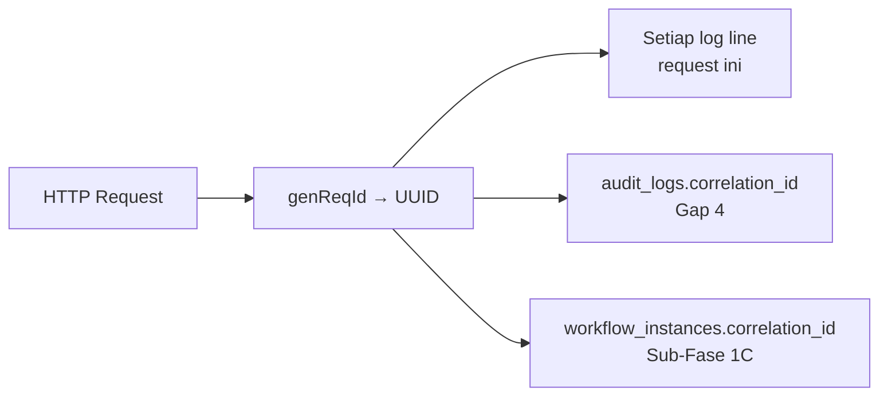

# Phase 1 — 08. Observability Plan

**Upstream:** Mendalami Sub-Fase 1D dari [02 — Target Architecture](02-target-architecture.md#sub-fase-1d--platform-foundation-observability), menerapkan [03 — Observability Architecture](../03-platform-and-intelligence-architecture.md#observability-architecture) yang sudah menetapkan target OpenTelemetry sebagai horizon jangka panjang.
**Status:** Planning only.
**Prinsip pembatas:** Sesuai instruksi brief — *"prepare future support... even if full implementation comes later."* Dokumen ini secara sengaja membedakan **apa yang dibangun sekarang** vs **kontrak yang disiapkan untuk nanti**, supaya tidak ada ekspektasi keliru bahwa Phase 1 menghasilkan dashboard Grafana yang jalan.

---

## Tiga Pilar — Status Target Phase 1D

| Pilar | Status Phase 1D | Status Penuh (Later, di luar Phase 1) |
|---|---|---|
| **Logs** | ✅ Dibangun — structured JSON di production, correlation ID | Shipping ke log aggregator (Loki/CloudWatch/dst) — butuh keputusan hosting |
| **Metrics** | 🟡 Kontrak didefinisikan, endpoint disiapkan, dashboard TIDAK dibangun | Prometheus + Grafana — butuh deployment infrastruktur |
| **Traces** | 🔴 Persiapan dependency saja (`@fastify/otel` terpasang, tidak dikonfigurasi aktif) | OpenTelemetry penuh dengan trace export — realistis mulai [03 — Traces](../03-platform-and-intelligence-architecture.md#traces): "begitu ada lebih dari satu service" (Phase 5+) |

---

## Logs — Detail Implementasi Phase 1D

### Perubahan Konfigurasi (Bukan Migrasi Library)

```ts
// apps/api/src/index.ts — target state
const isProduction = process.env.NODE_ENV === 'production'

const app = Fastify({
  logger: isProduction
    ? {
        level: process.env.LOG_LEVEL ?? 'info',
        // TANPA transport pino-pretty — JSON mentah ke stdout
      }
    : {
        transport: { target: 'pino-pretty', options: { colorize: true, translateTime: 'SYS:standard', ignore: 'pid,hostname' } }
      },
  genReqId: () => crypto.randomUUID(),
})
```

**Kenapa `NODE_ENV` sebagai switch, bukan flag baru:** `NODE_ENV` adalah konvensi standar yang sudah dipakai luas di ekosistem Node.js — memakai flag environment variable baru (`PURALOKA_ENV` atau semacamnya) akan menambah permukaan konfigurasi tanpa manfaat, melanggar prinsip *don't add complexity beyond what's needed*.

**Risiko yang harus diverifikasi sebelum deploy (lihat [04-risk-register.md](04-risk-register.md)):** Nilai `NODE_ENV` di environment production/staging hari ini **harus dicek eksplisit**, bukan diasumsikan sudah `production` — kalau ternyata tidak diset di mana pun, perubahan ini akan diam-diam membuat production tetap memakai `pino-pretty` (bukan bug baru, tapi bug tersembunyi yang jadi jelas begitu kondisi diverifikasi).

### Correlation ID — Kontrak Lintas Sub-Sistem

`genReqId` Fastify (built-in) menghasilkan UUID per-request. ID yang sama dipakai di **3 tempat**, mengikat sub-sistem yang sebelumnya terpisah:



**Nilai konkret untuk debugging:** Ketika ada laporan "kasbon saya kok statusnya aneh," dengan correlation ID, tim bisa menelusuri **satu request spesifik** yang menyebabkannya — log aplikasi, entry audit trail, dan instance workflow semuanya terhubung lewat ID yang sama, bukan tiga sistem yang harus dikorelasikan manual berdasarkan timestamp perkiraan.

---

## Metrics — Kontrak yang Disiapkan (RED Metrics)

**Definisi kontrak (dokumentasi, bukan implementasi aktif):**

| Metric | Definisi | Kapan Diimplementasi Penuh |
|---|---|---|
| **Rate** | Request per detik, per endpoint | Begitu `@fastify/otel` diaktifkan (Later) |
| **Errors** | Persentase response 5xx, per endpoint | Sama |
| **Duration** | Latency p50/p95/p99, per endpoint | Sama |

**Yang dikerjakan di Phase 1D:** Instalasi dependency `@fastify/otel` (import saja, **tidak dikonfigurasi aktif**) — supaya begitu keputusan deployment cloud dibuat (di luar cakupan Phase 1), aktivasi metrics adalah **konfigurasi**, bukan instalasi ulang dependency dari nol.

**`/health` endpoint diperluas** — dari sekadar enumerasi route group (state hari ini) menjadi verifikasi konektivitas dependency nyata:

```ts
// Target /health — desain, bukan implementasi final
app.get('/health', async () => {
  const dbCheck = await checkDatabaseConnection() // query ringan, mis. SELECT 1
  return {
    status: dbCheck.ok ? 'healthy' : 'degraded',
    database: dbCheck.ok,
    timestamp: new Date().toISOString(),
  }
})
```

**Nilai langsung tanpa menunggu Prometheus:** Endpoint ini berguna sendiri sebagai *liveness check* manual (curl dari terminal saat troubleshooting) bahkan sebelum ada dashboard otomatis — bukan investasi yang percuma sampai infrastruktur monitoring penuh ada.

---

## Traces — Kenapa Ditunda, Bukan Diabaikan

Mengikuti keputusan eksplisit [03 — Traces](../03-platform-and-intelligence-architecture.md#traces): tracing paling bernilai begitu ada **lebih dari satu service** saling memanggil. Puraloka Suite hari ini (dan sepanjang Phase 1) tetap modular monolith satu proses — tracing lintas-fungsi dalam satu proses jauh kurang kritis dibanding metrics/logs.

**Yang dikerjakan sekarang:** Nol implementasi aktif. `@fastify/otel` yang di-install untuk metrics (di atas) **kebetulan juga** menyediakan fondasi tracing — jadi begitu tracing dibutuhkan nanti, tidak ada instalasi baru, murni aktivasi konfigurasi tambahan.

---

## Structured Logging — Field Wajib untuk Log Finansial

Melengkapi correlation ID, log untuk operasi finansial-kritis (approve kasbon, catat pembayaran, approve CO) **wajib** menyertakan field terstruktur berikut (bukan free-text log message):

```ts
app.log.info({
  event: 'kasbon.approved',
  correlationId: request.id,
  actorId: user.id,
  entityId: kasbonId,
  amount: kasbon.amount,
}, 'Kasbon approved')
```

**Rationale:** Log semi-terstruktur seperti ini bisa **di-query** (begitu ada log aggregator, Later) tanpa parsing regex terhadap free-text message — investasi kecil sekarang (menulis object, bukan string interpolation) yang langsung mengurangi biaya kerja saat observability penuh diimplementasikan nanti.

---

## Yang EKSPLISIT TIDAK Dikerjakan di Phase 1D

Untuk mencegah scope creep (R8, [Risk Register](04-risk-register.md#r8--scope-creep-phase-1-4-sub-fase-menjadi-terlalu-besar-untuk-tim-kecil)):

- ❌ Deploy Prometheus/Grafana/Loki/Tempo sungguhan — butuh keputusan hosting cloud
- ❌ Alerting otomatis (Slack/email saat error rate tinggi) — butuh metrics penuh dulu
- ❌ Dashboard visual apa pun — tidak ada yang bisa divisualisasikan tanpa backend metrics aktif
- ❌ Distributed tracing lintas WhatsApp Gateway/AI Gateway masa depan — modul-modul itu sendiri belum dibangun (Phase 6)

---

*Dokumen selanjutnya: [09 — Definition of Done](09-definition-of-done.md) — checklist final lintas seluruh 9 objective, gate approval sebelum sub-fase berikutnya dimulai.*
